<!-- * 目录
{:toc} -->


<!-- !!!!!!!!!!!!!!!!!!!!!!!!!!!!!!!!!!!!!!!!!!!!!!!!!!!!!!!!!!!!!!!!!!!!!!!!!!!!!!!!!!!!!!!!!!!!!!!!!!!!!!!!!!!!!!!!!!!!!!!!!!! -->
# 引言
好多年前进行过基于java的Android开发,并且搭建了基于可见光通信的室内定位APP，最近看了一下原来的project，发现有不少可以改进的空间。当然~以前学习的基于Android的开发也基本忘光光了hhh，为此，写下本博客记录本人重新搭建的过程。本博客仅供本人学习记录用~

下面为本project的实测效果，从视频可以看到VLP和PDR locating相互切换显示当然使用的定位方法：

<div align="center">
  <table style="border: none; background-color: transparent;">
    <tr>
      <td style="width: 50%; border: none; padding: 0.01; background-color: transparent; vertical-align: middle;">
        <video playsinline autoplay loop muted src="https://kwanwaipang.github.io/VLC_Demo/Demo_video/单灯VLP+PDR.mp4" poster="https://kwanwaipang.github.io/File/Representative_works/loading-icon.gif" alt="sym" width="100%" style="padding-top:0px;padding-bottom:0px;border-radius:15px;"></video>
      </td>
      <td style="width: 50%; border: none; padding: 0.01; background-color: transparent; vertical-align: middle;">
        <video playsinline autoplay loop muted src="https://kwanwaipang.github.io/VLC_Demo/Demo_video/double-led-vlp.mp4" poster="./File/Representative_works/loading-icon.gif" alt="sym" width="100%" style="padding-top:0px;padding-bottom:0px;border-radius:15px;"></video>
      </td>
    </tr>
  </table>
  <figcaption>
  </figcaption>
</div>


# 打开并配置项目
android有一个很烦人的点就是版本之间差距较大，且不兼容，导致不同版本之间代码兼容很容易出问题，一个常见的例子就是几年前自己开发的app，几年后再用竟然配置不了。。。因此，先对项目进行适配
* 过程可参考之前的[博客](https://blog.csdn.net/gwplovekimi/article/details/132097542?spm=1001.2014.3001.5501)

## debug记录
<strong>出现报错```Could not initialize class org.codehaus.groovy.vmplugin.v7.Java7``` </strong>
应该是使用的jdk版本不一样，换成电脑中安装好的即可了~

* 首先File——>Setting——>Build Tools——>Gradle，看到我们的Gradle JDK路径。
<div align="center">
  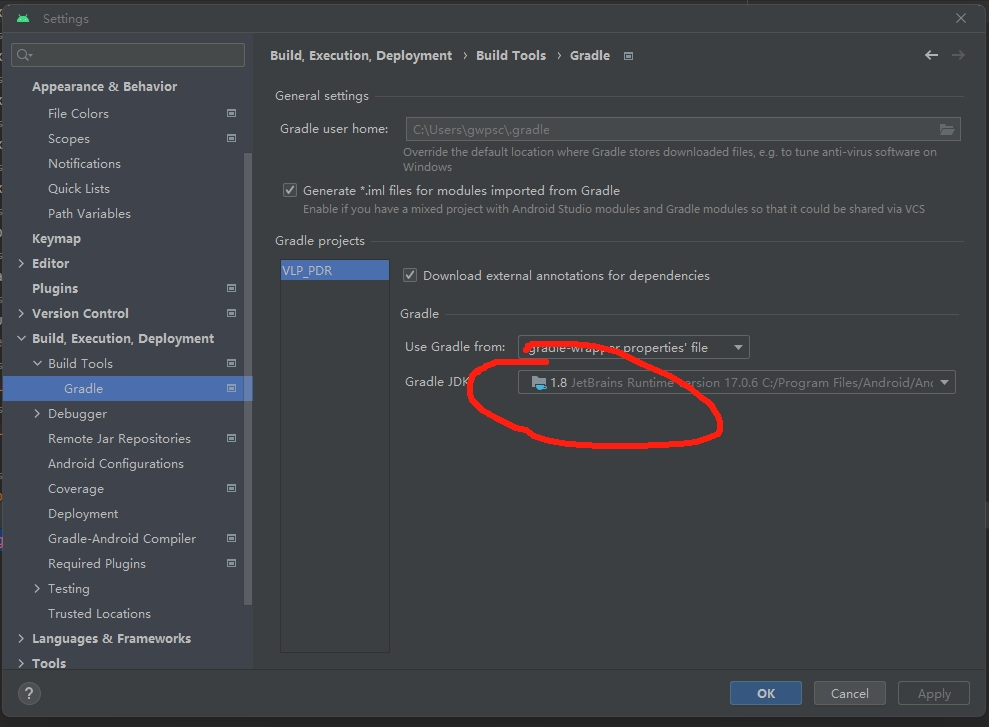
<figcaption>  
</figcaption>
</div>
改成安装好的
<div align="center">
  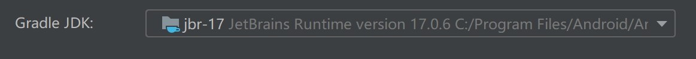
<figcaption>  
</figcaption>
</div>
然后重新同步项目

<strong> 出现报错```Possible solution: - Upgrade Gradle wrapper to 7.2 version and re-import the project``` </strong>

* 尝试直接点击升级看看效果如何~


<strong> 出现报错```Unable to make field private final java.lang.String java.io.File.path accessible: module java.base does not "opens java.io" to unnamed module @370a761d``` </strong>

* 这应该是属于运行报错不是配置报错(因为是在我build app的时候出现的)
* 在\AndroidStudioProjects\VLP_PDR\gradle.properties中添加（注意原本的org.gradle.jvmargs要注释掉），添加后同步一下~
~~~
#JDK为了方便兼容原来没有使用模块化的项目，提高了一些配置
org.gradle.jvmargs=-Xmx1536M \
--add-exports=java.base/sun.nio.ch=ALL-UNNAMED \
--add-opens=java.base/java.lang=ALL-UNNAMED \
--add-opens=java.base/java.lang.reflect=ALL-UNNAMED \
--add-opens=java.base/java.io=ALL-UNNAMED \
--add-exports=jdk.unsupported/sun.misc=ALL-UNNAMED\
--Xmx2048m -Dfile.encoding=UTF-8
~~~

<strong> 出现报错```Execution failed for task ':opencv430:compileDebugJavaWithJavac'.``` </strong>

* 关于这个报错没有认真去查，把```\AndroidStudioProjects\VLP_PDR\gradle.properties```中的设置为``` classpath "com.android.tools.build:gradle:4.2.2"```
* 然后再把```\AndroidStudioProjects\VLP_PDR\app\build.gradle```中的设置改为如下：
~~~
    compileSdkVersion 30
    buildToolsVersion "30.0.2"
    ndkVersion '22.1.7171670'
~~~
* 即可解决这个错误（我个人认为是跟opencv编译过程相关的吧~）


## 针对运行按钮不出来的解决方案
打开一个旧的项目，有时可能出现如下图所示的运行按钮没有显示的情况：
<div align="center">
  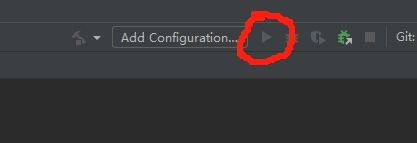
<figcaption>  
</figcaption>
</div>
点击图中的Add Configuration,点+号，并选择Android App选项 
<div align="center">
  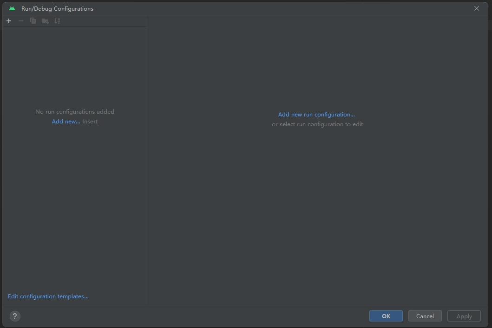
  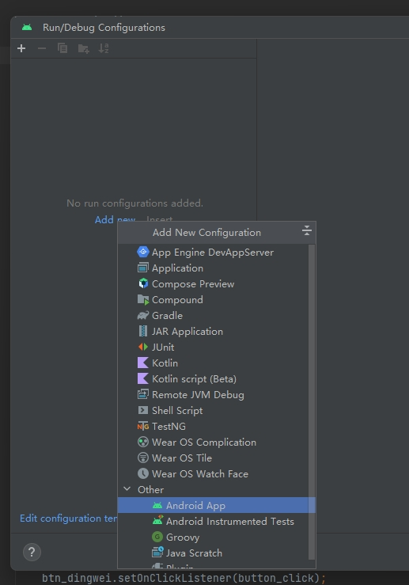
  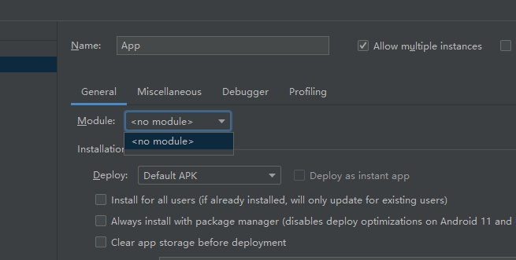
<figcaption>  
在module的下拉菜单中没有发现app
</figcaption>
</div>
更改名字为app然后点击确定和应用，此时还是有个叉号的
<div align="center">
  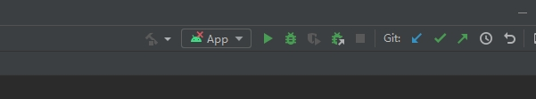
<figcaption>  
</figcaption>
</div>
然后点击搜索框，并找sync（sync project with gradles files）
<div align="center">
  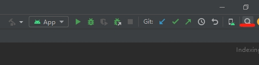
  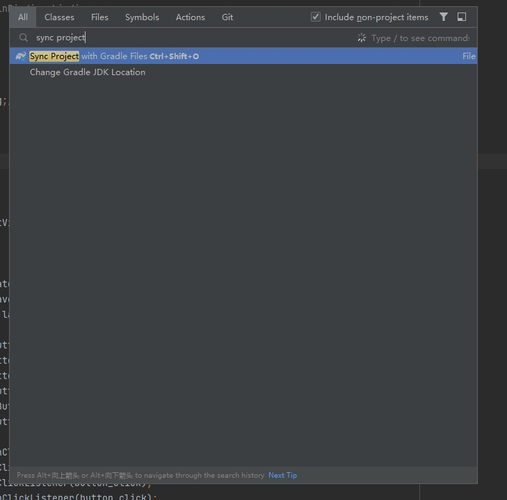
<figcaption>  
</figcaption>
</div>
但是似乎没有效果，并且重新打开也是一样的~~~
接下来尝试打开```\app\guangxun\build.gradle```确保存在：
~~~
apply plugin: 'com.android.application'
~~~
如果不存在，那么大概率就是当前目录并不是构建的安卓app目录，注意切换即可~

# push代码到Github
* 首先在setting中配置github
<div align="center">
  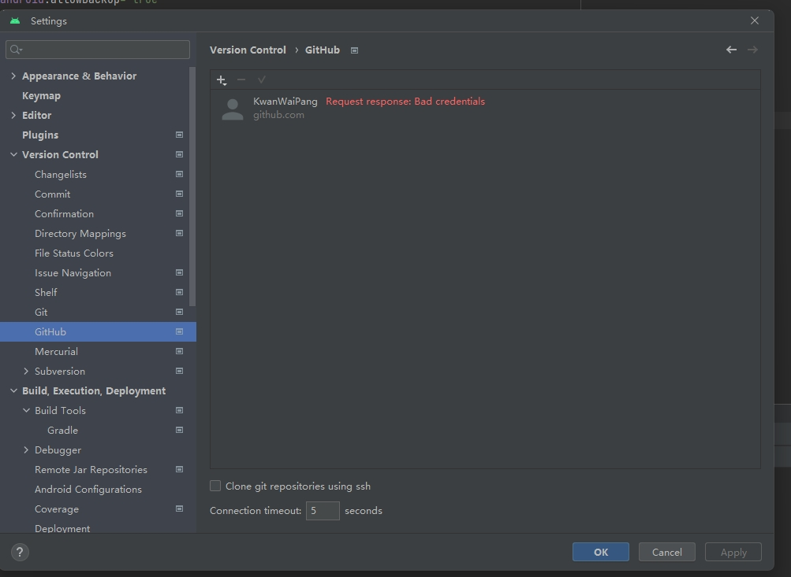
<figcaption>  
</figcaption>
</div>
* 依次点击菜单中的“VCS” -> “Import into Version Control” -> “Share Project on GitHub”
* 若在某些地区，可能会链接不上。那么可以改为用Termainal命令也行~

```bash
# 初始化github仓库（注意windows和ubuntu中命令稍有不一样）
rm -r ./git

git init
git add .
git commit -m "first commit"
git branch -M main
git remote add origin git@github.com:KwanWaiPang/Your_project_name.git
git push -u origin main


```
<div align="center">
  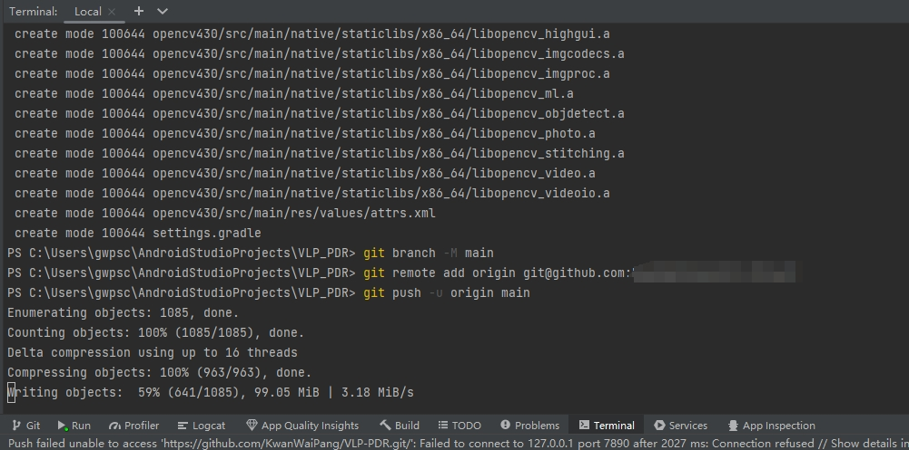
<figcaption>  
</figcaption>
</div>


# 关于代码的一些基本操作
## 主要的代码目录
* ```C:\Users\gwpsc\AndroidStudioProjects\VLP_PDR\app\src\main\java\com\example\pdr_vlp_demo\MainActivity.java```main activity可以理解为代码主函数入口
* 其中onCreate应该就是正式运行这个activity的入口代码那
* 整个页面样式的设计在：```C:\Users\gwpsc\AndroidStudioProjects\VLP_PDR\app\src\main\res\layout\activity_main.xml```
* 曝光度的设置在```C:\Users\gwpsc\AndroidStudioProjects\VLP_PDR\app\src\main\java\com\example\pdr_vlp_demo\Camera2\Camera2.java```


# 参考资料
* [Code for the project](https://github.com/KwanWaiPang/VLP-PDR)
* [My CSDN Blogs for Android](https://blog.csdn.net/gwplovekimi/category_9860500.html?spm=1001.2014.3001.5482)
* [可见光通信调制驱动芯片模组](https://blog.csdn.net/gwplovekimi/article/details/133878460?spm=1001.2014.3001.5501)
* [Windows下的Android环境开发搭建](https://blog.csdn.net/gwplovekimi/article/details/132040540?spm=1001.2014.3001.5501)
