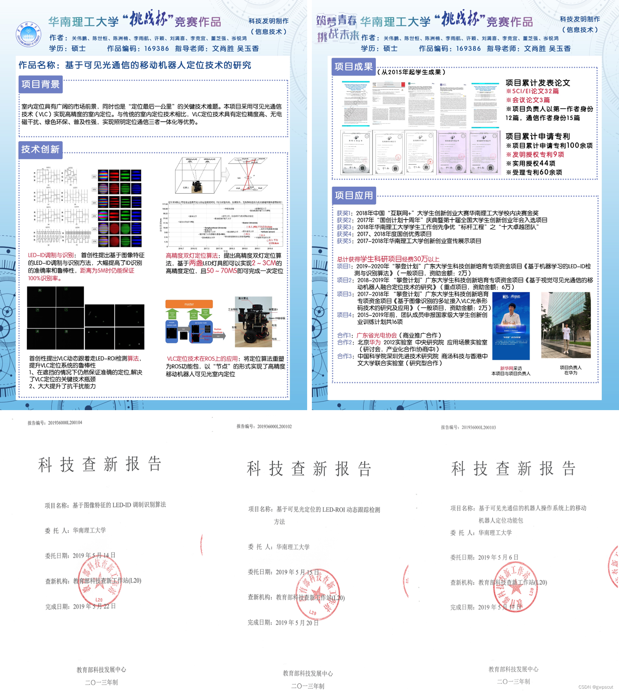

本人从2014年起从事可见光通信（Visible Light Communication, VLC）相关研究，主要包括：基于光电二极管（PD）、图像传感器（camera）的高精度可见光定位算法(Visible Light Positioning, VLP)、基于可见光通信的移动机器人定位与导航、成像可见光通信（Optical Camera Communications, OCC）、基于可见光通信的物联网（Internet of Things, IoT）应用、水下可见光通信等。 

本博文（原本记录于[我的CSDN博客](https://blog.csdn.net/gwplovekimi/article/details/125801118)）为本人在可见光通信领域的工作及系列demo的总结。本人一直希望能促进可见光通信技术的进一步发展及产业化落地，希望能遇到更多从事可见光通信的朋友，多交流、合作。也希望此博客可以给大家一些motivation，共同促进行业的发展💪

```md
***特别鸣谢***：华南理工大学-发光材料与器件国家重点实验室-文尚胜教授、华南理工大学-创新创业孵化基地、及R&C工作室历年学生的共同努力。

科研非一人之科研   As a researcher, I think there are two responsibilities: on one hand, to make a major breakthrough in my own research field; on the other hand, to vigorously cultivate a large number of talents in this professional field.
```


* 目录
{:toc}


<!-- !!!!!!!!!!!!!!!!!!!!!!!!!!!!!!!!!!!!!!!!!!!!!!!!!!!!!!!!!!!!!!!!!!!!!!!!!!!!!!!!!!!!!!!!!!!!!!!!!!!!!!!!!!!!!!!!!!!!!!!!!!! -->
# 项目演示
## 基于可见光通信的移动机器人定位与导航
下面演示为：本人受邀IEEE Photonics Journal Club session做的基于可见光通信的移动机器人定位与导航的讲座。
[IEEE Photonics Journal Club: April 6th 2022 – IEEE Photonics Globalization Committee-China Mainland/Taiwan/Hong Kong](https://cmte.ieee.org/photonics-asia/2022/04/22/ieee-photonics-journal-club-april-6th-2022/)

<div align="center">
<iframe width="80%" height="400" src="https://player.bilibili.com/player.html?aid=983500021&autoplay=0" title="Bilibili video player" frameborder="0" allow="accelerometer; autoplay; clipboard-write; encrypted-media; gyroscope; picture-in-picture; web-share" allowfullscreen></iframe>
<figcaption>  
受邀出席IEEE Photonics Journal Club
</figcaption>
</div>

下面演示为：本团队搭建的基于移动机器人的可见光通信与激光雷达融合定位系统，该系统在光通信顶会2022 Conference on Lasers and Electro-Optics (CLEO) 上做展示。
<div align="center">
<iframe width="80%" height="400" src="https://player.bilibili.com/player.html?aid=555196501&autoplay=0" title="Bilibili video player" frameborder="0" allow="accelerometer; autoplay; clipboard-write; encrypted-media; gyroscope; picture-in-picture; web-share" allowfullscreen></iframe>
<figcaption>  
2022 CLEO Demo
</figcaption>
</div>

下面演示为：本人给香港科技大学搭建的，基于可见光通信的移动机器人定位系统，该系统在光通信顶会2021 Optical Fiber Communication Conference and Exhibition (OFC) 上做展示。

本系统多次参与各类比赛与展示。最初搭建于2018年，参加《华南理工大学第十六届“挑战杯”大学生课外学术科技作品竞赛》并获终审决赛一等奖。其后，代表华南理工大学参加《2019年广东省第十五届“挑战杯”大学生课外学术科技作品竞赛》的作品，并获得广东省决赛的特等奖（请见下一演示）。同年，获《第五届中国“互联网+”大学生创新创业大赛》广东省决赛铜奖。2020年，本人将本系统引进华为创新实验室（iLab），在公司内部进行展示。此后，本人再带到香港科技大学。无偿把技术给公司评各类奖项，同时也把技术奉献给团队去进行各类产业化、商业化及科研。本系统亦曾连续两年（2020与2021）入选OFC Demo Zone。
<div align="center">
<iframe width="80%" height="400" src="https://player.youku.com/embed/XNjM5NTk0NDA5Mg==" title="Bilibili video player" frameborder="0" allow="accelerometer; autoplay; clipboard-write; encrypted-media; gyroscope; picture-in-picture; web-share" allowfullscreen></iframe>
<figcaption>  
2021 OFC Demo
</figcaption>
</div>
[一种具有通信与定位功能的智能LED灯具及其机器人定位系统——2020神灯奖申报技术 - 新品发布 - 阿拉丁-网上光亚展](https://www.alighting.com/news_show.aspx?id=166397)

下面演示为：我们搭建的世界首套基于移动机器人的可见光定位系统。该系统虽然比较简漏🤭（机器人同一时刻需要观察到至少两个LED，且覆盖LED数、高度均有限），但却是我们团队所搭建的移动机器人可见光定位与导航的原型体。此作品算是我们团队承上启后的工作，既涵盖了数年在可见光定位领域的积累（包括：LED-ROI Tracking、LED-ID detection、VLP算法），而后续大量工作基本都是基于此系统进行深层算法的改进。
<div align="center">
<iframe width="80%" height="400" src="https://player.bilibili.com/player.html?aid=925894042&autoplay=0" title="Bilibili video player" frameborder="0" allow="accelerometer; autoplay; clipboard-write; encrypted-media; gyroscope; picture-in-picture; web-share" allowfullscreen></iframe>
<figcaption>  
广东省第十五届“挑战杯”大学生课外学术科技作品竞赛决赛特等奖
</figcaption>
</div>

此作品荣获广东省第十五届“挑战杯”大学生课外学术科技作品竞赛决赛特等奖（全省116所参赛高校，共有1260项作品获奖，其中特等奖126项、一等奖191 项、二等奖245 项、三等奖698 项），此处展示当年的展板及查新报告。
<div align="center">
  
<figcaption>  
</figcaption>
</div>

下面演示为：我们将大挑战杯版本的简陋地图及定位显示改为基于ROS的UI，由激光雷达来预先绘制地图，并且加入路径规划等功能，实现了可见光通信提供准确的位置信息，同时基于避障及路径规划算法实现导航。
<div align="center">
<iframe width="80%" height="400" src="https://player.bilibili.com/player.html?aid=97536024&autoplay=0" title="Bilibili video player" frameborder="0" allow="accelerometer; autoplay; clipboard-write; encrypted-media; gyroscope; picture-in-picture; web-share" allowfullscreen></iframe>
<figcaption>  
基于ROS的移动机器人可见光定位系统实验展示
</figcaption>
</div>

下面演示为：我们实现的基于两盏LED的移动机器人VLP定位系统（属于大挑战杯获奖的升级版本），采用的更高以及可移动的LED灯杆方便移动展示，于此同时，通过开发Android App实现与ROS机器人更好的交互。
<div align="center">
<iframe width="80%" height="400" src="https://player.bilibili.com/player.html?aid=290012454&autoplay=0" title="Bilibili video player" frameborder="0" allow="accelerometer; autoplay; clipboard-write; encrypted-media; gyroscope; picture-in-picture; web-share" allowfullscreen></iframe>
<figcaption>  
基于两盏LED的移动机器人可见光定位
</figcaption>
</div>

下面演示为：我们实现的基于单盏LED灯的移动机器人VLP定位系统。对于平面上运动移动机器人，共有3个自由度，通过退化PnP（Perspective-n-Point）问题的分析，相机只需要观察到两盏LED即可实现定位。然而，这一要求会限制LED的间距不能太远，为此我们设计出基于角度传感器辅助的VLP定位系统，仅仅需要一盏LED即可实现移动机器人的高精度室内定位。除此以外，引入室内布局的地图作为map以达到更好的可视化效果。
<div align="center">
<iframe width="80%" height="400" src="https://player.bilibili.com/player.html?aid=630777342&autoplay=0" title="Bilibili video player" frameborder="0" allow="accelerometer; autoplay; clipboard-write; encrypted-media; gyroscope; picture-in-picture; web-share" allowfullscreen></iframe>
<figcaption>  
基于角度传感器与单个LED的移动机器人可见光定位
</figcaption>
</div>

下面演示为：我们实现的多机器人可见光协同定位。通过多个机器人分别对LED的观测及机器人相互之间的约束，实现多个机器人协调定位。
<div align="center">
<iframe width="80%" height="400" src="https://player.bilibili.com/player.html?aid=845292005&autoplay=0" title="Bilibili video player" frameborder="0" allow="accelerometer; autoplay; clipboard-write; encrypted-media; gyroscope; picture-in-picture; web-share" allowfullscreen></iframe>
<figcaption>  
多机器人可见光协同定位
</figcaption>
</div>