<!-- !!!!!!!!!!!!!!!!!!!!!!!!!!!!!!!!!!!!!!!!!!!!!!!!!!!!!!!!!!!!!!!!!!!!!!!!!!!!!!!!!!!!!!!!!!!!!!!!!!!!!!!!!!!!!!!!!!!!!!!!!!! -->
# 引言

在[Event Camera](https://kwanwaipang.github.io/Poster_files/Event_camera/Introduction_of_event_camera.html)领域基于Contrast Maximization(CMax,或CM)框架衍生了大量的工作，包括光流估计、深度估计、运动估计（2D、3D甚至6D）等等。
其实本质上，CM这个框架是通过对事件进行运动补偿，而在做运动补偿的过程中估算出事件的位移，而这个位移也就是所谓的event point trajectories，而基于像素的位移就可以推广到系列视觉的任务。
```CMax aligns point trajectories on the image plane with event data by maximizing the contrast of an image of warped events (IWE)```

本博文对Event-based Contrast Maximization进行较为全面的survey，并且将对应的经典论文都做简单的介绍，同时也列出了CMax相关或者用到CMax的文献以作mark


<!-- * 目录
{:toc} -->

<!-- !!!!!!!!!!!!!!!!!!!!!!!!!!!!!!!!!!!!!!!!!!!!!!!!!!!!!!!!!!!!!!!!!!!!!!!!!!!!!!!!!!!!!!!!!!!!!!!!!!!!!!!!!!!!!!!!!!!!!!!!!!! -->
# 基本原理
Event-based vision的工作分类有很多种，而其中，按照处理事件的形式可以分为`event-by-event`和`groups of events`。而CMax则是属于第二种。
CMax 首次在文献[《A Unifying Contrast Maximization Framework for Event Cameras, with Applications to Motion, Depth and Optical Flow Estimation (CVPR2018)》](https://www.ifi.uzh.ch/dam/jcr:a22071c9-b284-43c6-8f71-6433627b2db2/CVPR18_Gallego.pdf)中提出：`The main idea of our framework is to find the point trajectories on the image plane that are best aligned with the event data by maximizing an objective function: the contrast of an image of warped events`
而其中的寻找point trajectories可以看成是一种隐式的data association，也是Event-based vision种的关键部分,比如short characteristic time (optical flow)或longer estimation time (monocular depth estimation)；
此外，CM可以生成motion-corrected event images，既可以看成是对`groups of events`的运动补偿，也可以看成是由事件产生的图像的梯度或edge image。

下图较好解析了CM的基本原理，其实就是寻找 point的轨迹，使其较好的与event相align：

<div align="center">
  <table style="border: none; background-color: transparent;">
    <tr>
      <td style="width: 50%; border: none; padding: 0.01; background-color: transparent; vertical-align: middle;">
        
      </td>
      <td style="width: 50%; border: none; padding: 0.01; background-color: transparent; vertical-align: middle;">
        
      </td>
    </tr>
  </table>
  <figcaption>
  </figcaption>
</div>

事件相机是motion-active的，一般是由亮度变化或相对运动（相机与场景）产生事件的，并且大部分的事件都是由相对运动的edge来产生的，因此事件相机中的数据关联应该是`establishing which events were triggered by the same scene edge`。
而移动的edge实际上是描述了在平面上的point trajectory，因此将沿着point trajectory生成的event关联起来也就是数据关联的过程。
如上面右图所示，point trajectory近似于直线。

<div align="center">
  
<figcaption>
数学描述所谓的point trajectory  
</figcaption>
</div>

<div align="center">
  
<figcaption>  
</figcaption>
</div>

CM算法的框架如上图所示，由以下三步组成：
1. Warp the events into an image H, according to the point trajectories defined by the geometric model and candidate parameters θ. 所谓的geometric model就是基于optical flow, depth estimation, motion estimation等问题，来描述how points move on the image plane（也就是怎么对event point进行投影）
2. Compute a score f based on the image of warped events（也就是score function,也就是累积IWE，然后计算对比的score function）
3. Optimize the score or objective function with respect to the parameters θ of the model.这步其实就是优化的过程了，比如采用梯度下降或Newton方法来估算最好的θ值。而这个θ其实就是所求的point trajectory了，因为`x=x+θ*t`

数学描述如下：

<div align="center">
<table style="border: none; background-color: transparent;">
  <tr>
    <td style="width: 30%; border: none; padding: 0.01; background-color: transparent; vertical-align: middle;">
      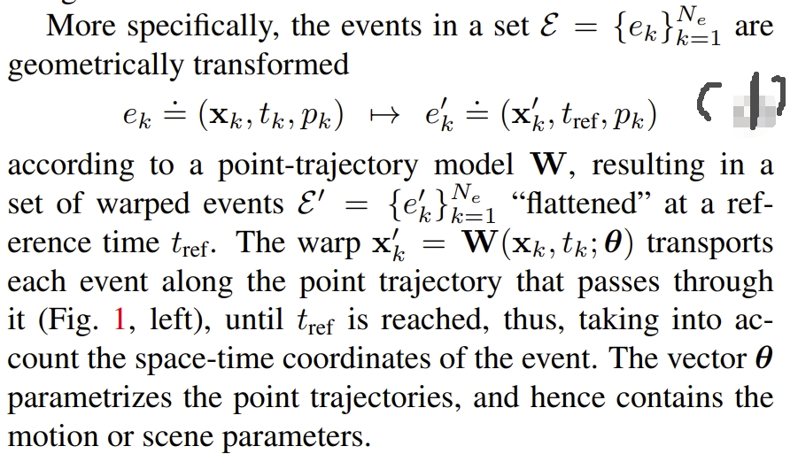
    </td>
    <td style="width: 40%; border: none; padding: 0.01; background-color: transparent; vertical-align: middle;">
      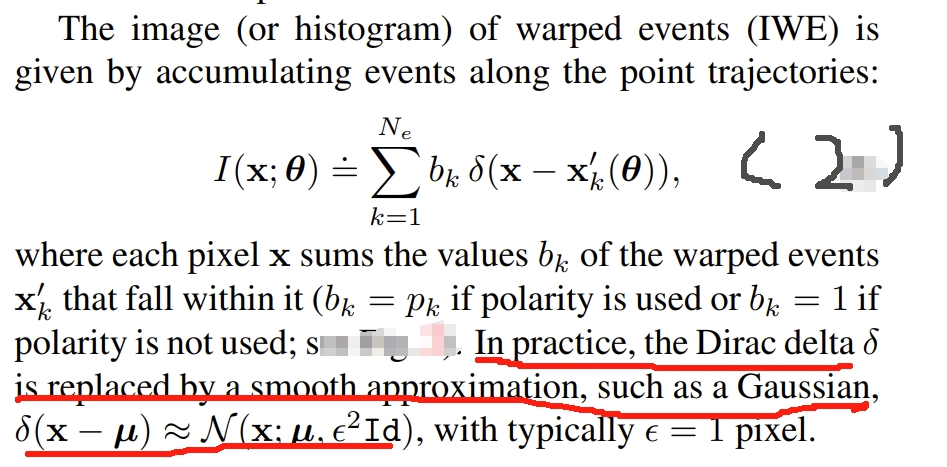
    </td>
    <td style="width: 40%; border: none; padding: 0.01; background-color: transparent; vertical-align: middle;">
      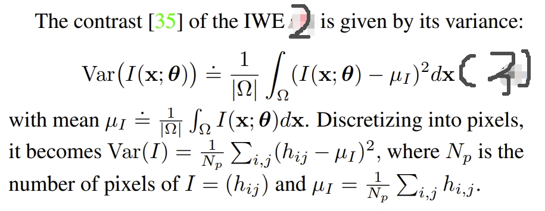
    </td>
  </tr>
</table>
<figcaption>
</figcaption>
</div>


对于CM算法，其有两个副产品：
1. 估算出point trajectory，隐式建立事件之间的数据关联
2. 估算出的point trajectory可以用来对运动的edge做校正（correct）

而此工作作为CM算法的基础工作也给出了CM三大基本应用：[Rotational motion estimation](#rotational-velocity-estimation)（还有[motion estimation in planar scenes](#motion-estimation-in-planar-scenes)）, [Depth estimation](#depth-estimation), 和 [Optical Flow estimation](#optical-flow-estimation)

## 计算复杂度
而CM算法的时间复杂度应该是`O（n）`,也就是跟事件量成线性关系。其中warp event应该是耗时最大的，想求对比度这些操作几乎可以忽略。此外，优化方法也是影响的重要因素。

## loss function
[Focus is all you need: Loss functions for event-based vision (CVPR2019)](https://openaccess.thecvf.com/content_CVPR_2019/papers/Gallego_Focus_Is_All_You_Need_Loss_Functions_for_Event-Based_Vision_CVPR_2019_paper.pdf)中，介绍了基于CM框架的22个目标函数，不过这篇论文中是针对Motion Compensation这个主题的。
所谓的loss function其实就是[Rotational motion estimation](#rotational-velocity-estimation)，[motion estimation in planar scenes](#motion-estimation-in-planar-scenes), [Depth estimation](#depth-estimation), 和 [Optical Flow estimation](#optical-flow-estimation)几个section中提到的公式3，就是上面CM算法框架图中描述的`measure event alignment`.
汇总如下：

<div align="center">
  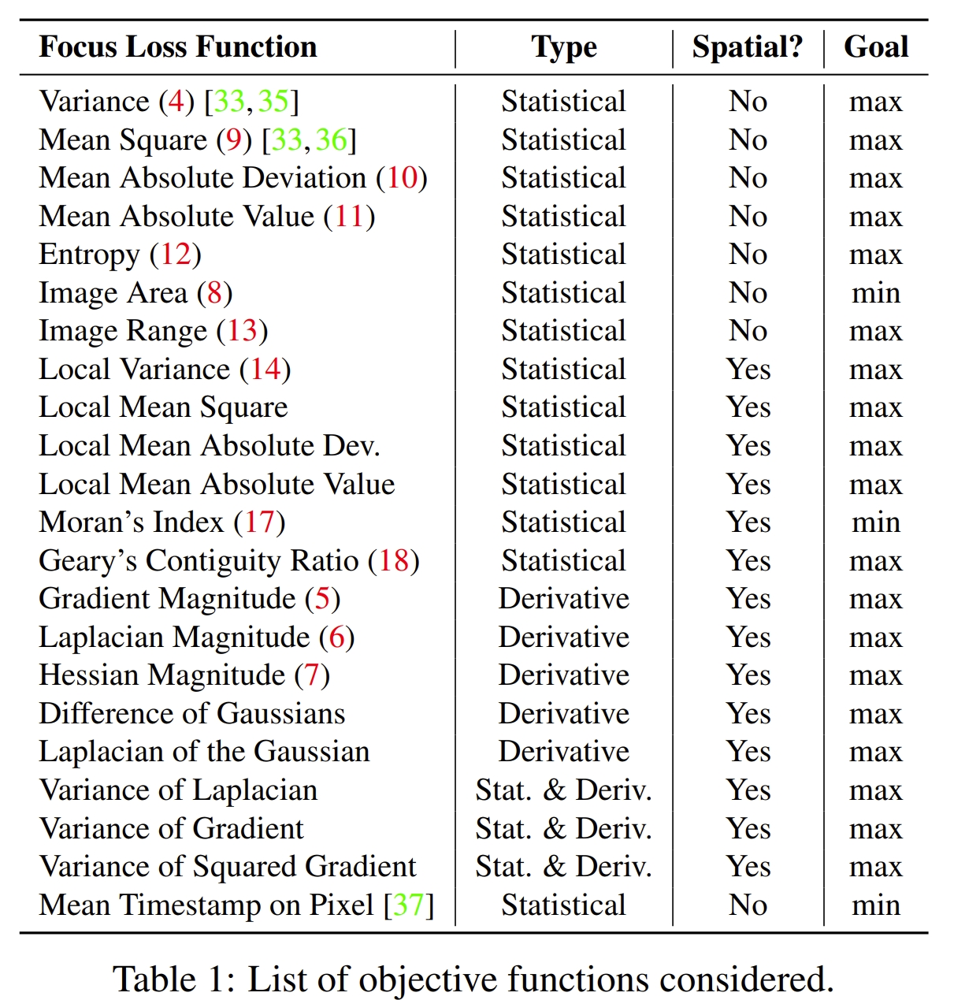
<figcaption>  
</figcaption>
</div>
对应的公式如下（实在太多了，只能是真正开发的时候要用到再细读了hh~）：
<div align="center">
<table style="border: none; background-color: transparent;">
  <tr>
    <td style="width: 30%; border: none; padding: 0.01; background-color: transparent; vertical-align: middle;">
      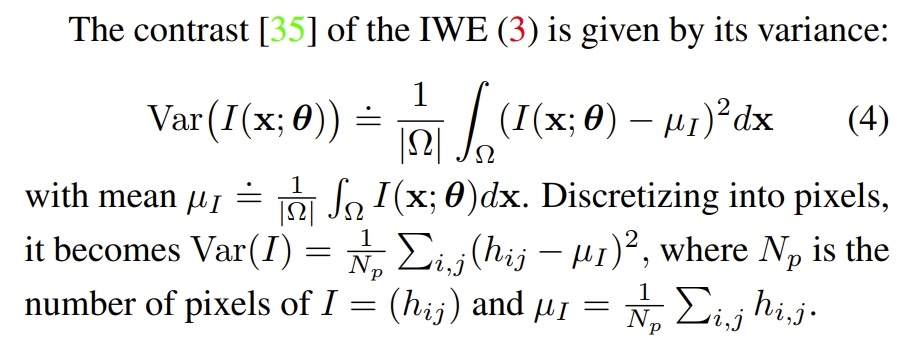
    </td>
    <td style="width: 30%; border: none; padding: 0.01; background-color: transparent; vertical-align: middle;">
      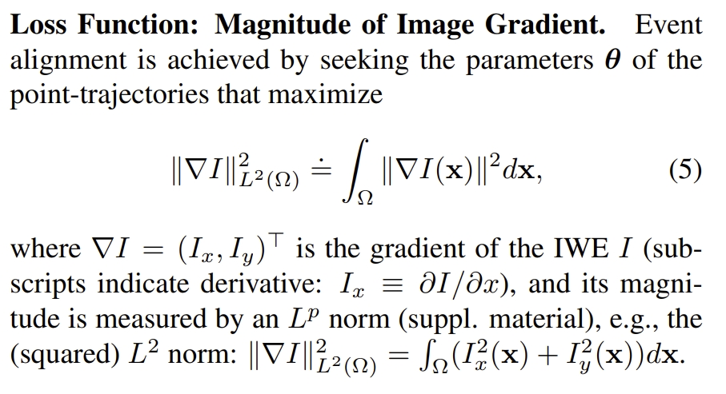
    </td>
    <td style="width: 30%; border: none; padding: 0.01; background-color: transparent; vertical-align: middle;">
      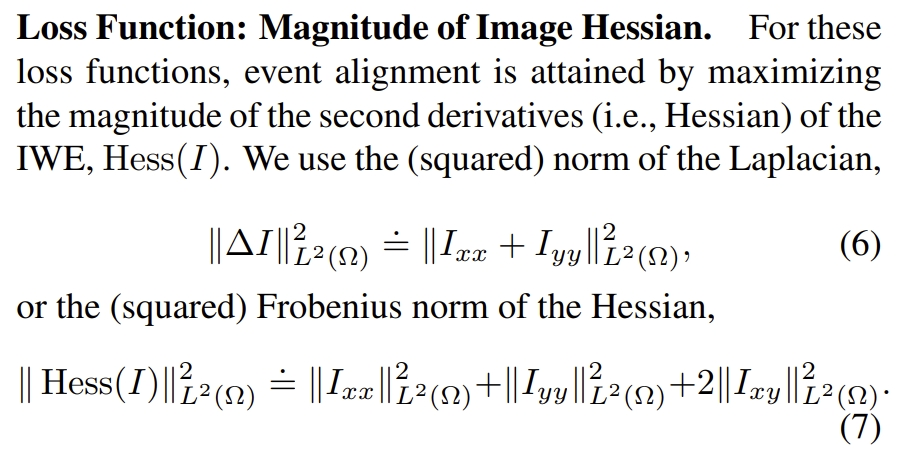
    </td>
  </tr>
</table>

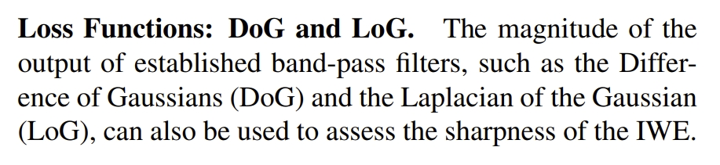

<table style="border: none; background-color: transparent;">
  <tr>
    <td style="width: 30%; border: none; padding: 0.01; background-color: transparent; vertical-align: middle;">
      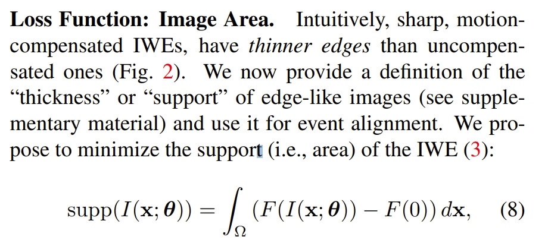
    </td>
    <td style="width: 30%; border: none; padding: 0.01; background-color: transparent; vertical-align: middle;">
      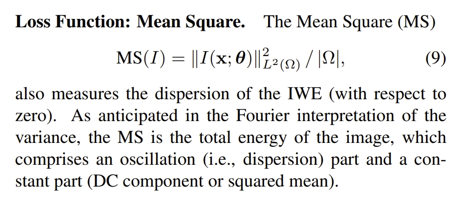
    </td>
    <td style="width: 30%; border: none; padding: 0.01; background-color: transparent; vertical-align: middle;">
      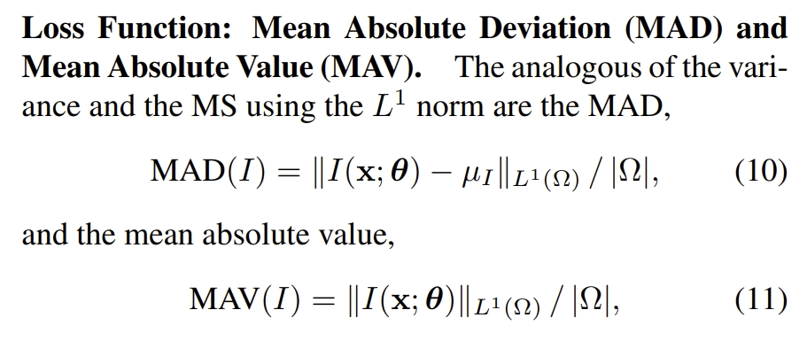
    </td>
  </tr>
</table>

<table style="border: none; background-color: transparent;">
  <tr>
    <td style="width: 30%; border: none; padding: 0.01; background-color: transparent; vertical-align: middle;">
      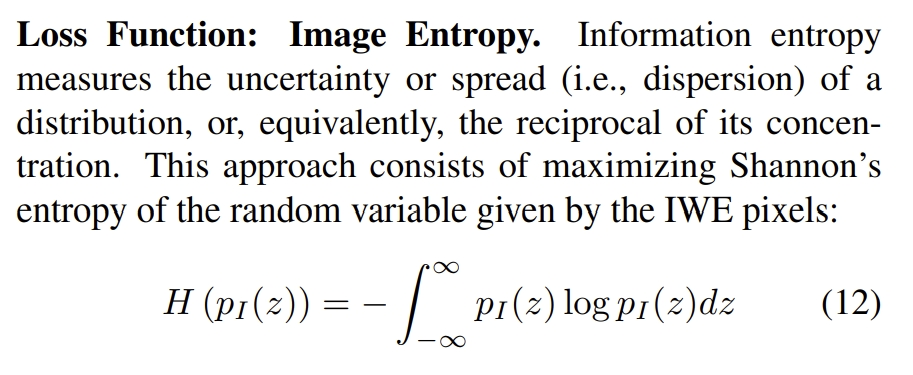
    </td>
    <td style="width: 30%; border: none; padding: 0.01; background-color: transparent; vertical-align: middle;">
      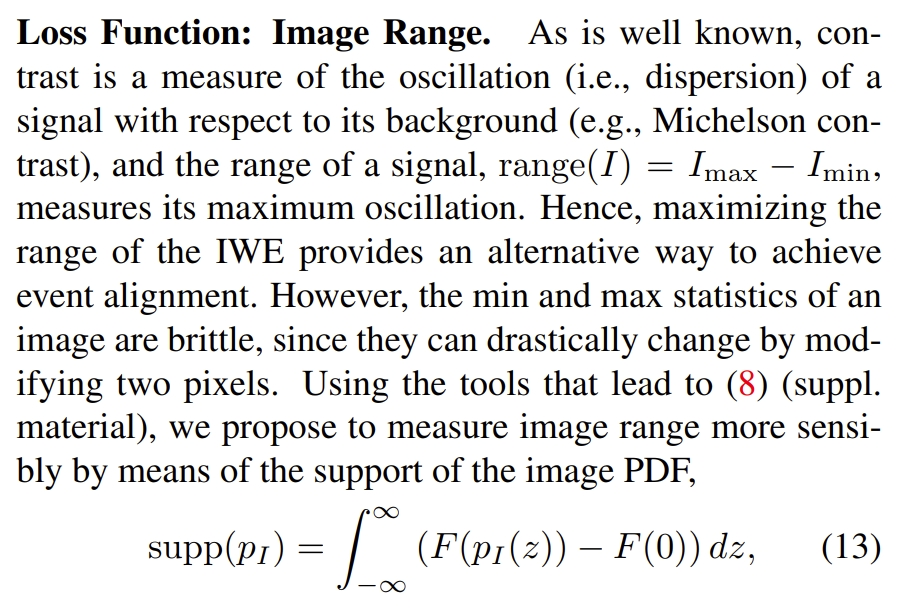
    </td>
    <td style="width: 30%; border: none; padding: 0.01; background-color: transparent; vertical-align: middle;">
      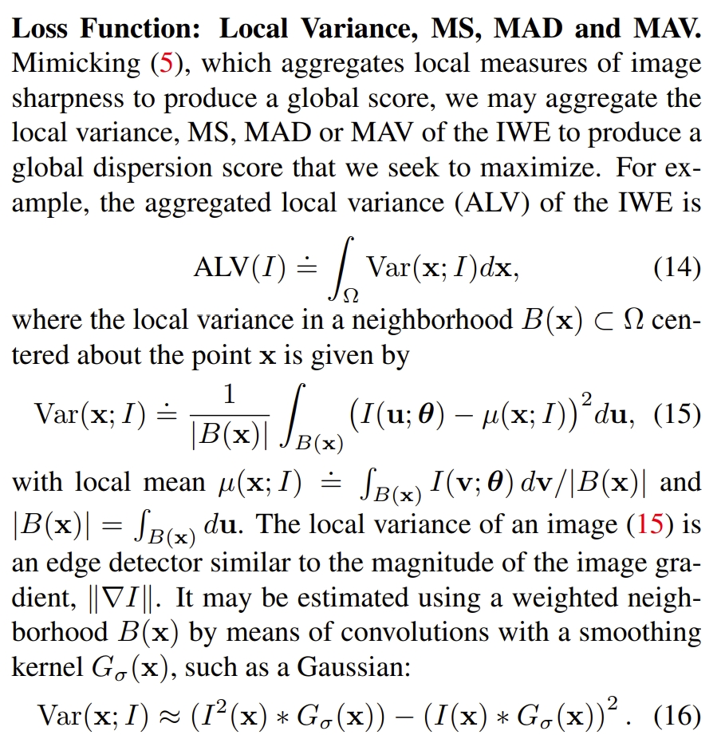
    </td>
  </tr>
</table>

<table style="border: none; background-color: transparent;">
  <tr>
    <td style="width: 30%; border: none; padding: 0.01; background-color: transparent; vertical-align: middle;">
      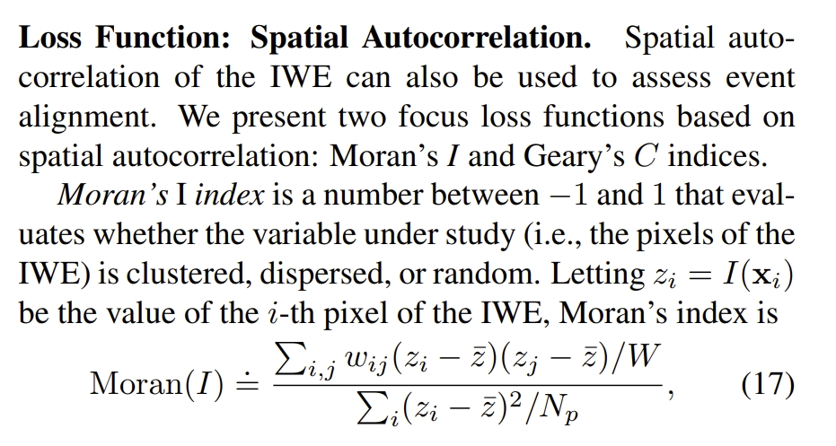
    </td>
    <td style="width: 30%; border: none; padding: 0.01; background-color: transparent; vertical-align: middle;">
      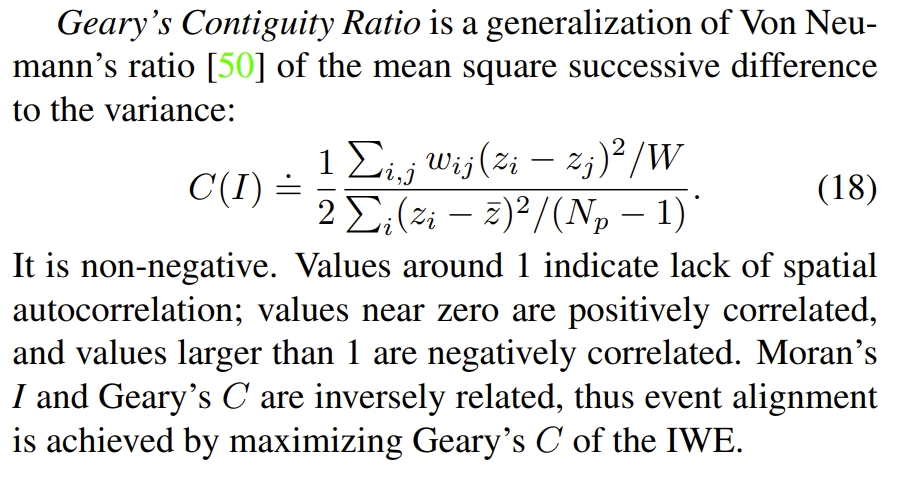
    </td>
  </tr>
</table>

<figcaption>
</figcaption>
</div>


<!-- !!!!!!!!!!!!!!!!!!!!!!!!!!!!!!!!!!!!!!!!!!!!!!!!!!!!!!!!!!!!!!!!!!!!!!!!!!!!!!!!!!!!!!!!!!!!!!!!!!!!!!!!!!!!!!!!!!!!!!!!!!! -->
# CMax的主要应用

## Optical Flow Estimation
所谓的光流实际上就说每个pixel的motion vector（在小的时间段内）。而在理想的情况下（无穷小）在图像平面上的点的轨迹应该是一条直线，那么可以用下面公式来表达：

<div align="center">
  
<figcaption>  
</figcaption>
</div>

而数据关联的过程，就是把在这个轨迹（直线）上的事件给关联起来。
具体的做法则是：
首先将event累积在一起，通过proposed trajectories将他们warp到参考时间t<sub>ref</sub>下:

<div align="center">
  
<figcaption>  
</figcaption>
</div>

公式2其实可以看成event累积的image（an image patch of warped events），求它的方差就可以得到下面公式

<div align="center">
  
<figcaption>  
</figcaption>
</div>

θ，也就是光流速度，可视化为heat map（如下图所示），可以看到它是smooth以及有明显的峰值的。并且在针对不同的θ，对应的IWE（image of warped event）也可视化到右子图中了。可以看到更高的方差对应IWE更高对比度（更sharp）。因此估算光流的问题可以转换为通过上面公式3（最大化方差函数）来寻找θ参数的过程。

PS：因为这个求最优的过程，其实也就是对于IWE要求对比度（contrast）最大，因此这个方法命名为`contrast maximization`

<div align="center">
  
<figcaption>  
</figcaption>
</div>

对于上面公式2中b<sub>k</sub>,作者在附加材料<sup>[link](https://www.ifi.uzh.ch/dam/jcr:a22071c9-b284-43c6-8f71-6433627b2db2/CVPR18_Gallego.pdf)</sup>中做了深入的分析。

所谓的考不考虑极性是指在计算IWE的时候的公式2，对应下面两个公式：
<div align="center">
  
<figcaption>  
</figcaption>
</div>

效果如下图所示.首先从优化函数来说，是否使用极性的优化速度是近似的。但是采用了极性显然中间部分要明显一些，可以理解为更集中（optimal value is slightly narrower and more pronounced）。
而通过IWE的对比分析则发现，如果带有极性，会使得 contrast function（公式3）下降得更加明显（因为存在正负极性相抵消）

<div align="center">
  
<figcaption>  
</figcaption>
</div>

## Depth Estimation

此部分是基于[EMVS](https://www.researchgate.net/profile/Davide-Scaramuzza-3/publication/320914498_EMVS_Event-Based_Multi-View_Stereo-3D_Reconstruction_with_an_Event_Camera_in_Real-Time/links/5a663bff0f7e9b6b8fde4241/EMVS-Event-Based-Multi-View-Stereo-3D-Reconstruction-with-an-Event-Camera-in-Real-Time.pdf)的框架的.
首先相机的pose、intrinsic都是是已知的。

其次，其 geometric model 为：一个图像点的trajectory可以通过将一个3D点（同时有已知的6 DoF相机pose和相对于参考视角下3D点的深度）进行投影获得的。如下图所示。此时参数θ为深度,假设一个小的区域（patch）内所有的点都具有相同的深度。
<div align="center">
  <table style="border: none; background-color: transparent;">
    <tr>
      <td style="width: 50%; border: none; padding: 0.01; background-color: transparent; vertical-align: middle;">
        
      </td>
      <td style="width: 50%; border: none; padding: 0.01; background-color: transparent; vertical-align: middle;">
        
      </td>
    </tr>
  </table>
  <figcaption>
  左图为Event-based space-sweep  
  </figcaption>
</div>

基于CM框架下的深度估计步骤如下：
1. Transfer the events (triggered at the image plane of the moving event camera) onto the reference view using the candidate depth parameter. 
对于一个事件点 e<sub>k</sub> 采用 warp (W) function转换到e<sup>'</sup><sub>k</sub>=(x<sup>'</sup><sub>k</sub>,t<sub>ref</sub>,p<sub>k</sub>)下:

<div align="center">
  
<figcaption>
</figcaption>
</div>

然后，类似于上面公式2（也就是下图公式），通过计算沿着candidate point trajectory事件的数量

<div align="center">
  
<figcaption>
</figcaption>
</div>

2. 通过测量上面获得的图片的对比度（或者说方差）来测试event以及depth value θ的匹配对：

<div align="center">
  
<figcaption>
</figcaption>
</div>

3. 最大化对比度来获取深度值θ

下图通过可视化两个patch的优化过程来看CM算法的深度估计效果：

<div align="center">
  
<figcaption>
</figcaption>
</div>


## Rotational Velocity Estimation 
这其实是角速度的估计,最经典的应该是这篇工作[《Accurate angular velocity estimation with an event camera (RAL2017)》](https://www.zora.uzh.ch/id/eprint/138896/1/RAL16_Gallego.pdf)

首先，此任务是针对在静态环境下相机仅有rotational motion的，同时相机的intrinsic也是已知且去失真~

<div align="center">
  
<figcaption>
</figcaption>
</div>

1. 其 geometric model如下：

<div align="center">
  
<figcaption>
</figcaption>
</div>

2. 通过下面构思构建 image of warped events

<div align="center">
  
<figcaption>
</figcaption>
</div>

3. 更前面两个子任务一样，采用下式来构建优化方程

<div align="center">
  
<figcaption>
</figcaption>
</div>

估算的角速度的精度还是比较高的~

<div align="center">
  
<figcaption>
</figcaption>
</div>


## Motion Estimation in Planar Scenes 
这是在平面下的rotation 和translation运动估计，属于3 DoF吧~

在此场景，图像点的变换如下：

<div align="center">
  
  
<figcaption>
</figcaption>
</div>

同样地，采用上面的公式2和3来构建IWE以及求最优化

<div align="center">
  <table style="border: none; background-color: transparent;">
    <tr>
      <td style="width: 50%; border: none; padding: 0.01; background-color: transparent; vertical-align: middle;">
        
      </td>
      <td style="width: 50%; border: none; padding: 0.01; background-color: transparent; vertical-align: middle;">
        
      </td>
    </tr>
  </table>
  <figcaption>
  </figcaption>
</div>

效果如下图所示：

<div align="center">
  
<figcaption>
</figcaption>
</div>

并且下图也展示了采用或者不采用CM框架下的VIO效果。可以看到采用CM算法恢复的平面点是要平整一些~

<div align="center">
  
<figcaption>
</figcaption>
</div>


<!-- !!!!!!!!!!!!!!!!!!!!!!!!!!!!!!!!!!!!!!!!!!!!!!!!!!!!!!!!!!!!!!!!!!!!!!!!!!!!!!!!!!!!!!!!!!!!!!!!!!!!!!!!!!!!!!!!!!!!!!!!!!! -->
## SLAM or 6DoF Pose Tracking
此处的基于SLAM的应用是指full-SLAM或6DoF Pose Tracking，因为大部分的CMax中所谓的motion estimation都是指 rotational 或者fronto-parallel motion estimation，这其实本质上应用场景非常局限的，比如文献<sup>[ref](https://arxiv.org/pdf/2403.08119)</sup>等等

不过，文献<sup>[ref](https://ieeexplore.ieee.org/abstract/document/10855459)</sup>则是是首次实现了将CM framework用到EVIO问题中；而更早的文献<sup>[ref](https://ieeexplore.ieee.org/abstract/document/10275026)</sup>则是首次将CM框架拓展到EVO（event+image odometry）问题中，论文中也宣称首次拓展到6 DoF motion。

本质上这两个能基于CM实现6DoF Pose Tracking的基本原因都是仅仅用CM来作为运动补偿，并不是直接采用CM的原理来计算pose，受限于局部最优以及容易退化，基于CM原理的motion estimation一般都是限制在rotational 或者fronto-parallel motion estimation.


## Learning-based Framework
其中CMax framework也被广泛应用于deep learning中，特别地，是用来构建Self-Supervised Learning loss(如文献<sup>[ref](https://arxiv.org/pdf/2407.10802), [ref](https://proceedings.neurips.cc/paper_files/paper/2021/file/39d4b545fb02556829aab1db805021c3-Paper.pdf)</sup>)


<!-- !!!!!!!!!!!!!!!!!!!!!!!!!!!!!!!!!!!!!!!!!!!!!!!!!!!!!!!!!!!!!!!!!!!!!!!!!!!!!!!!!!!!!!!!!!!!!!!!!!!!!!!!!!!!!!!!!!!!!!!!!!! -->
# Paper Resource
此处列出CMax相关或者用到CMax的文献

* A Unifying Contrast Maximization Framework for Event Cameras, with Applications to Motion, Depth and Optical Flow Estimation (CVPR2018)
  * [paper](https://openaccess.thecvf.com/content_cvpr_2018/papers/Gallego_A_Unifying_Contrast_CVPR_2018_paper.pdf)
  * [supplementary material](https://www.ifi.uzh.ch/dam/jcr:a22071c9-b284-43c6-8f71-6433627b2db2/CVPR18_Gallego.pdf)

* Accurate angular velocity estimation with an event camera (RAL2017)
  * [paper](https://www.zora.uzh.ch/id/eprint/138896/1/RAL16_Gallego.pdf)

* Focus is all you need: Loss functions for event-based vision (CVPR2019)
  * [paper](https://openaccess.thecvf.com/content_CVPR_2019/papers/Gallego_Focus_Is_All_You_Need_Loss_Functions_for_Event-Based_Vision_CVPR_2019_paper.pdf)

* Event Cameras, Contrast Maximization and Reward Functions: An Analysis (CVPR2019)
  * [paper](https://openaccess.thecvf.com/content_CVPR_2019/papers/Stoffregen_Event_Cameras_Contrast_Maximization_and_Reward_Functions_An_Analysis_CVPR_2019_paper.pdf)
  * [Github](https://github.com/TimoStoff/events_contrast_maximization): A python library for contrast maximization and voxel creation using events.

* Globally optimal contrast maximisation for event-based motion estimation (CVPR2020)
  * [paper](https://openaccess.thecvf.com/content_CVPR_2020/papers/Liu_Globally_Optimal_Contrast_Maximisation_for_Event-Based_Motion_Estimation_CVPR_2020_paper.pdf)

* Real-Time Rotational Motion Estimation With Contrast Maximization Over Globally Aligned Events (RAL2021)
  * [paper](https://ieeexplore.ieee.org/abstract/document/9454404)

* Globally-optimal event camera motion estimation (ECCV2020)
  * [paper](https://arxiv.org/pdf/2203.03914)

* Globally-optimal contrast maximisation for event cameras (TPAMI2021)
  * [paper](https://arxiv.org/pdf/2206.05127)
  * 此篇是上一篇的期刊版本

* Self-supervised learning of event-based optical flow with spiking neural networks (NIPS2021)
  * [paper](https://proceedings.neurips.cc/paper_files/paper/2021/file/39d4b545fb02556829aab1db805021c3-Paper.pdf)

* Visual Odometry with an Event Camera Using Continuous Ray Warping and Volumetric Contrast Maximization (Sensor2022)
  * [paper](https://arxiv.org/pdf/2107.03011)

* Contrast maximization-based feature tracking for visual odometry with an event camera (Processes2022)

* Recursive Contrast Maximization for Event-Based High-Frequency Motion Estimation (IEEE Access2022)

* Event Collapse in Contrast Maximization Frameworks (Sensor 2022)
  * [paper](https://web.archive.org/web/20220813065935id_/https://depositonce.tu-berlin.de/bitstream/11303/17328/1/sensors-22-05190-v3.pdf)

* A Fast Geometric Regularizer to Mitigate Event Collapse in the Contrast Maximization Framework (AIS2023)
  * [paper](https://advanced.onlinelibrary.wiley.com/doi/pdfdirect/10.1002/aisy.202200251)
  * [github](https://github.com/tub-rip/event_collapse)
  * 这篇应该是上一篇的拓展版

* Taming contrast maximization for learning sequential, low-latency, event-based optical flow (CVPR2023)
  * [paper](https://openaccess.thecvf.com/content/ICCV2023/papers/Paredes-Valles_Taming_Contrast_Maximization_for_Learning_Sequential_Low-latency_Event-based_Optical_Flow_ICCV_2023_paper.pdf)
  * [Supplementary Material](https://openaccess.thecvf.com/content/ICCV2023/supplemental/Paredes-Valles_Taming_Contrast_Maximization_ICCV_2023_supplemental.pdf)

* Density Invariant Contrast Maximization for Neuromorphic Earth Observations (CVPR2023)
  * [paper](https://openaccess.thecvf.com/content/CVPR2023W/EventVision/papers/Arja_Density_Invariant_Contrast_Maximization_for_Neuromorphic_Earth_Observations_CVPRW_2023_paper.pdf)

* MC-VEO: A visual-event odometry with accurate 6-DoF motion compensation (TIV2023)
  * [paper](https://ieeexplore.ieee.org/abstract/document/10275026)
  * [github](https://cslinzhang.github.io/MC-VEO/MC-VEO.html)

* CMax-SLAM: Event-based Rotational-Motion Bundle Adjustment and SLAM System using Contrast Maximization (TRO2024)
  * [paper](https://arxiv.org/pdf/2403.08119)

* Secrets of Event-based Optical Flow (ECCV2022)
  * [paper](https://arxiv.org/pdf/2207.10022)

* Secrets of Event-based Optical Flow, Depth and Ego-motion Estimation by Contrast Maximization (TPAMI2024)
  * [paper](https://ieeexplore.ieee.org/stamp/stamp.jsp?arnumber=10517639)
  * [github](https://github.com/tub-rip/event_based_optical_flow)
  * 这篇是上一篇的期刊版本

* Motion-prior Contrast Maximization for Dense Continuous-Time Motion Estimation (ECCV2024)
  * [paper](https://arxiv.org/pdf/2407.10802)
  * [github](https://github.com/tub-rip/MotionPriorCMax)

* Secrets of Edge-Informed Contrast Maximization for Event-Based Vision
  * [paper](https://arxiv.org/pdf/2409.14611)

* EROAM: Event-based Camera Rotational Odometry and Mapping in Real-time
  * [paper](https://arxiv.org/pdf/2411.11004)
  * [github](https://wlxing1901.github.io/eroam/)

* Event-Frame-Inertial Odometry Using Point and Line Features Based on Coarse-to-Fine Motion Compensation (RAL2025)
  * [paper](https://ieeexplore.ieee.org/abstract/document/10855459)
  * [github](https://github.com/choibottle/C2F-EFIO)


<!-- !!!!!!!!!!!!!!!!!!!!!!!!!!!!!!!!!!!!!!!!!!!!!!!!!!!!!!!!!!!!!!!!!!!!!!!!!!!!!!!!!!!!!!!!!!!!!!!!!!!!!!!!!!!!!!!!!!!!!!!!!!! -->
# 复现或测试CM相关工作

* [CMax-SLAM-comment](https://github.com/KwanWaiPang/CMax-SLAM-comment)


<!-- !!!!!!!!!!!!!!!!!!!!!!!!!!!!!!!!!!!!!!!!!!!!!!!!!!!!!!!!!!!!!!!!!!!!!!!!!!!!!!!!!!!!!!!!!!!!!!!!!!!!!!!!!!!!!!!!!!!!!!!!!!! -->
<!-- # 参考资料 -->