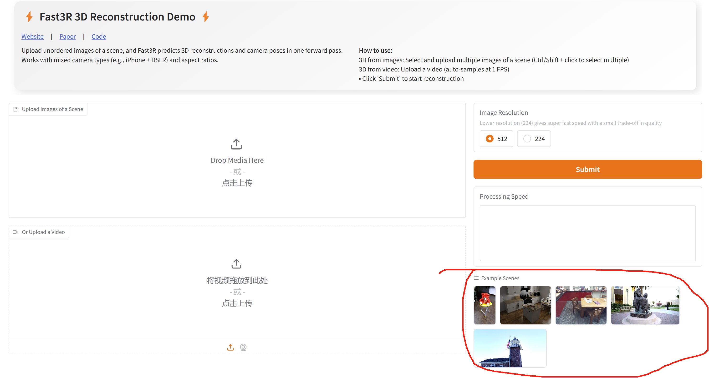

<!-- * 目录
{:toc} -->

<!-- !!!!!!!!!!!!!!!!!!!!!!!!!!!!!!!!!!!!!!!!!!!!!!!!!!!!!!!!!!!!!!!!!!!!!!!!!!!!!!!!!!!!!!!!!!!!!!!!!!!!!!!!!!!!!!!!!!!!!!!!!!! -->
# 引言
CVPR2025工作《Fast3R: Towards 3D Reconstruction of 1000+ Images in One Forward Pass》实现1000多幅图像的3D重建。基于DUSt3R的多视图泛化，通过并行处理多个视图实现高效且可扩展的3D重建，速度高达 250 FPS，并在一次前向传递中处理 1500 张图像，能得到很好的效果。为此本博文对该工作进行学习并且复现，本博文仅供本人学习记录用

* [paper](https://arxiv.org/pdf/2501.13928)
* [github](https://github.com/facebookresearch/fast3r)
* [website](https://fast3r-3d.github.io/)

# 理论学习

# 复现效果

作者做了个网页的[demo](https://fast3r.ngrok.app/)可以实现上传图片后实时可视化三维重建的效果，下面是操作流程：

  <table style="border: none; background-color: transparent;">
    <tr align="center">
      <td style="width: 50%; border: none; padding: 0.01; background-color: transparent; vertical-align: middle;">
        
      </td>
      <td style="width: 50%; border: none; padding: 0.01; background-color: transparent; vertical-align: middle;">
        
      </td>
    </tr>
  </table>
  <figcaption>
  </figcaption>

此外，还提供了比如可视化heatmap，逐帧处理以及渲染成GIF等功能

  
<figcaption>  
</figcaption>

而作者在网页上也提供了一系列的样例，

  
<figcaption>  
</figcaption>

用样例测试的效果如下：

  <table style="border: none; background-color: transparent;">
    <tr align="center">
      <td style="width: 50%; border: none; padding: 0.01; background-color: transparent; vertical-align: middle;">
        
      </td>
      <td style="width: 50%; border: none; padding: 0.01; background-color: transparent; vertical-align: middle;">
        
      </td>
    </tr>
    <tr align="center">
      <td style="width: 50%; border: none; padding: 0.01; background-color: transparent; vertical-align: middle;">
        
      </td>
      <td style="width: 50%; border: none; padding: 0.01; background-color: transparent; vertical-align: middle;">
        
      </td>
    </tr>
  </table>
  
  <figcaption>
  </figcaption>

此外，也尝试了用自采的数据进行测试。
首先采用一张图

  
<figcaption>  
单图片的重建效果
</figcaption>

接下来分别用下面两种双视角的情况测试

  <table style="border: none; background-color: transparent;">
    <tr align="center">
      <td style="width: 50%; border: none; padding: 0.01; background-color: transparent; vertical-align: middle;">
        
      </td>
      <td style="width: 50%; border: none; padding: 0.01; background-color: transparent; vertical-align: middle;">
        
      </td>
    </tr>
  </table>
  <figcaption>
  </figcaption>

重建的效果如下：

  <table style="border: none; background-color: transparent;">
    <tr align="center">
      <td style="width: 50%; border: none; padding: 0.01; background-color: transparent; vertical-align: middle;">
        
      </td>
      <td style="width: 50%; border: none; padding: 0.01; background-color: transparent; vertical-align: middle;">
        
      </td>
    </tr>
  </table>
  <figcaption>
  </figcaption>

接下来采用多张图片看看效果

  
<figcaption>  
7张图片的重建效果
</figcaption>

  
<figcaption>  
16张图片的重建效果
</figcaption>

下面是视频可视化整个操作流程

<!-- 

<iframe width="80%" height="400" src="//player.bilibili.com/player.html?isOutside=true&aid=114112818319035&bvid=BV1gHRFYcEWg&cid=28714797145&p=1&p=1&autoplay=0" title="Bilibili video player" frameborder="0" allow="accelerometer; autoplay; clipboard-write; encrypted-media; gyroscope; picture-in-picture; web-share" allowfullscreen></iframe>

 -->

  <iframe width="80%" height="400"
    src="//player.bilibili.com/player.html?isOutside=true&aid=114112818319035&bvid=BV1gHRFYcEWg&cid=28714797145&p=1&autoplay=0" 
    title="Bilibili video player" frameborder="0" allowfullscreen
    style="opacity: 0; transition: opacity 0.5s; border-radius: 15px;"
    onload="this.style.opacity='1'"
  ></iframe>

不过也尝试了下室外大场景，用的train数据集，但是效果就不如上面的测试序列了~

  
<figcaption>  
</figcaption>

