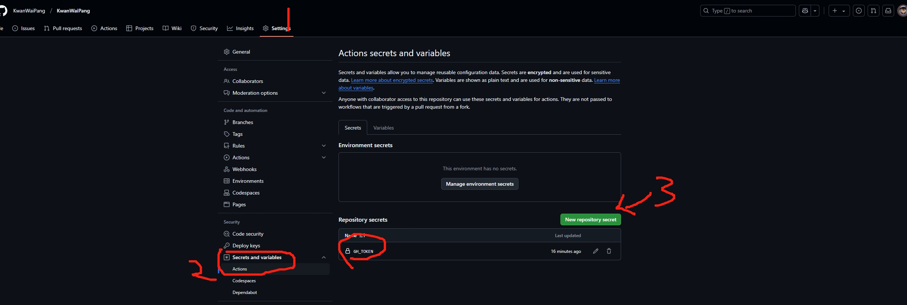
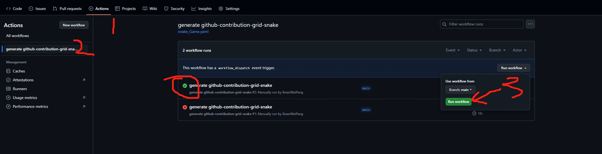
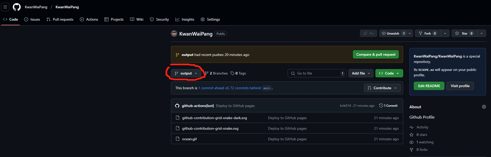
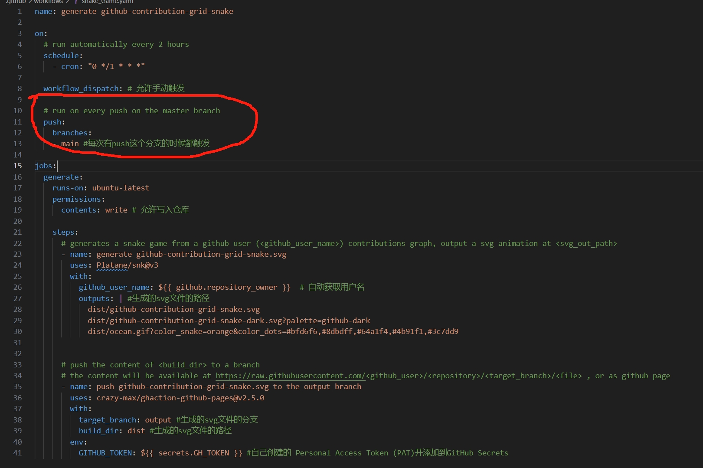
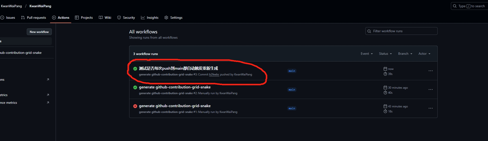
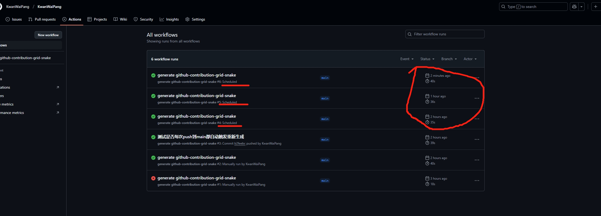
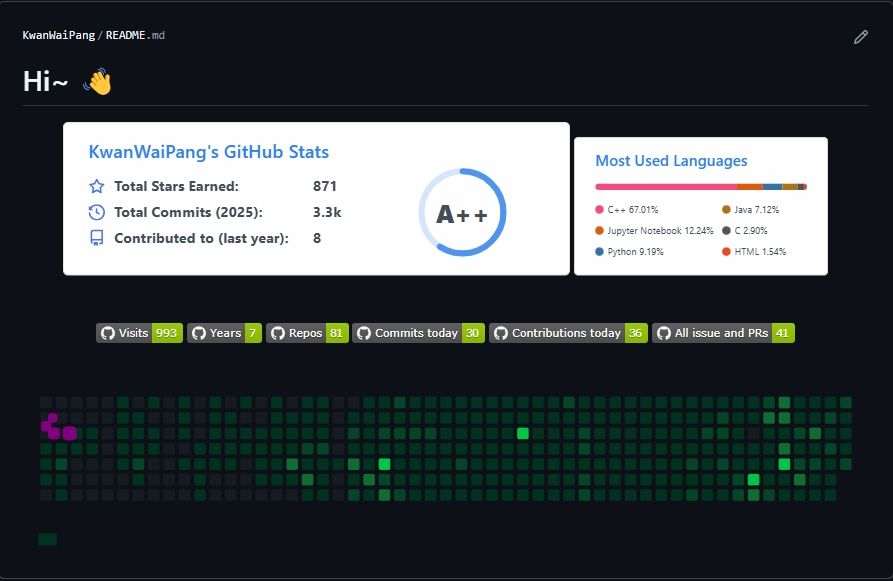

<!-- * 目录
{:toc} -->


<!-- !!!!!!!!!!!!!!!!!!!!!!!!!!!!!!!!!!!!!!!!!!!!!!!!!!!!!!!!!!!!!!!!!!!!!!!!!!!!!!!!!!!!!!!!!!!!!!!!!!!!!!!!!!!!!!!!!!!!!!!!!!! -->
# 引言
对于GitHub Profile，可以根据 GitHub 的 Contributions 图来生成贪吃蛇游戏，最终会以 Gif 或 SVG 的形式展示。
本博文记录配置及搭建的过程~

# 配置过程
* 首先需要有自己的GitHub Profile，也就是以自己github名字命名的一个工程.
* 然后在里面创建文件`.github\workflows\snake_Game.yaml`(关于这个yaml怎么命名都没有关系)
* 对应的yaml代码如下：

```yaml
name: generate github-contribution-grid-snake

on:
  # run automatically every 2 hours
  schedule:
    - cron: "0 */2 * * *" 
  
  workflow_dispatch: # 允许手动触发
  
jobs:
  generate:
    runs-on: ubuntu-latest
    permissions: 
      contents: write # 允许写入仓库
  
    steps:
      # generates a snake game from a github user (<github_user_name>) contributions graph, output a svg animation at <svg_out_path>
      - name: generate github-contribution-grid-snake.svg
        uses: Platane/snk@v3
        with:
          github_user_name: ${{ github.repository_owner }}  # 自动获取用户名
          outputs: | #生成的svg文件的路径
            dist/github-contribution-grid-snake.svg
            dist/github-contribution-grid-snake-dark.svg?palette=github-dark
            dist/ocean.gif?color_snake=orange&color_dots=#bfd6f6,#8dbdff,#64a1f4,#4b91f1,#3c7dd9
  
  
      # push the content of <build_dir> to a branch
      # the content will be available at https://raw.githubusercontent.com/<github_user>/<repository>/<target_branch>/<file> , or as github page
      - name: push github-contribution-grid-snake.svg to the output branch
        uses: crazy-max/ghaction-github-pages@v2.5.0
        with:
          target_branch: output #生成的svg文件的分支
          build_dir: dist #生成的svg文件的路径
        env:
          GITHUB_TOKEN: ${{ secrets.GH_TOKEN }} #自己创建的 Personal Access Token (PAT)并添加到GitHub Secrets
```

理论上这个代码直接用即可了。这里有几点需要注意的：
1. 首先要确保创建好自己的`secrets.GH_TOKEN`,过程如下：
  * 进入 GitHub 设置页面：
    * 访问你的 GitHub 帐号首页，点击右上角的 Profile Picture → Settings。
    * 生成 Personal Access Token：
    * 在左侧菜单中选择 Developer settings → Personal access tokens → Tokens (classic)。
    * 点击 Generate new token。
    * 选择以下权限：
      * repo（包括访问私有仓库和修改代码的权限）。
      * 其他你认为需要的权限。
    * 生成并保存这个 token（只会显示一次，之后无法查看）。
<div align="center">
  
<figcaption>
</figcaption>
</div>

  * 然后，配置如下。注意需要确保名字对应上`GH_TOKEN`
<div align="center">
  
<figcaption>
</figcaption>
</div>
  
2. workflow_dispatch就是允许手动触发。首次可以自动触发一下。如下图所示，注意编程成功后会是绿色，红色则是编译不成功
<div align="center">
  
<figcaption>  
</figcaption>
</div> 
查看output分支就会看到生成的svg图片了~
<div align="center">
  
<figcaption>  
</figcaption>
</div> 

此外通过在代码中添加每次push到固定分支（如这里的main）都能生成也可：
<div align="center">
  
  
<figcaption>  
</figcaption>
</div> 


3. 该代码会自动每隔两个小时运行（按需设置时间即可）

<div align="center">
  
<figcaption>  
</figcaption>
</div> 

最后在read.me文件中添加图片(图片的路径根据实际修改，此处是生成到output分支下的，并且根据主题的颜色选择不同的图片)

```md
<!-- 放置贪吃蛇游戏 -->
<picture>
<!-- 根据主题颜色来决定用亮的还是黑的 -->
  <source media="(prefers-color-scheme: dark)" srcset="https://github.com/KwanWaiPang/KwanWaiPang/blob/output/github-contribution-grid-snake-dark.svg" />
  <source media="(prefers-color-scheme: light)" srcset="https://github.com/KwanWaiPang/KwanWaiPang/blob/output/github-contribution-grid-snake.svg" />
  
</picture>
```

<div align="center">
  <table style="border: none; background-color: transparent;">
    <tr align="center">
      <td style="width: 50%; border: none; padding: 0.01; background-color: transparent; vertical-align: middle;">
        
      </td>
      <td style="width: 50%; border: none; padding: 0.01; background-color: transparent; vertical-align: middle;">
        
      </td>
    </tr>
  </table>
  <figcaption>
根据不同的主题配置svg图片
  </figcaption>
</div>


* 相关代码请见[My GitHub Profile](https://github.com/KwanWaiPang/KwanWaiPang)


# 参考资料
* [给自己的 GitHub Profile 做个贪吃蛇游戏](https://github.com/WJCHumble/Blog/issues/31)
* [snk](https://github.com/Platane/snk)