<!-- * 目录
{:toc} -->

<!-- !!!!!!!!!!!!!!!!!!!!!!!!!!!!!!!!!!!!!!!!!!!!!!!!!!!!!!!!!!!!!!!!!!!!!!!!!!!!!!!!!!!!!!!!!!!!!!!!!!!!!!!!!!!!!!!!!!!!!!!!!!! -->
# 引言
之前在复现DUSt3R,MASt3R和Fast3R的时候都被其惊艳的效果所吸引，而其中最关键的是Transformer这个结构。
为此写下本博文对其进行学习，本博文仅供本人学习记录用~

首先本博文先从RNN(Deep Sequence Modeling)的基本概念开始，然后再介绍Transformer以及Vision Transformer (ViT)

# Deep Sequence Modeling

首先，可以先通过《MIT Introduction to Deep Learning》这个课程，其中第二节对循环神经网络、Transformer 和注意力机制进行了介绍，来了解从RNN到Transformer的一些基本知识。

课程对应的PPT如下

  <iframe width="100%" height="100%"
    src="https://introtodeeplearning.com/slides/6S191_MIT_DeepLearning_L2.pdf#toolbar=0&navpanes=0&scrollbar=0" ></iframe>

Deep Sequence Modeling受到了广泛的关注，特别是最近ChatGPT，Deepseek等大型语言模型的出现。
而其中的关键，应该就是序列数据以及序列建模，个人理解就是时间与空间维度的数据关联。

而所谓的序列建模，它处理的是一系列的输入（如文本），然后产生输出，如下图所示

  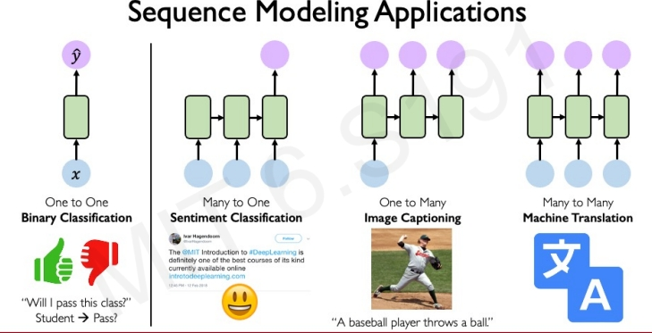
<figcaption>  
</figcaption>

## RNN
而RNN(Recurrent Neural Networks)则是最先用于处理顺序数据的

  <table style="border: none; background-color: transparent;">
    <tr align="center">
      <td style="width: 50%; border: none; padding: 0.01; background-color: transparent; vertical-align: middle;">
        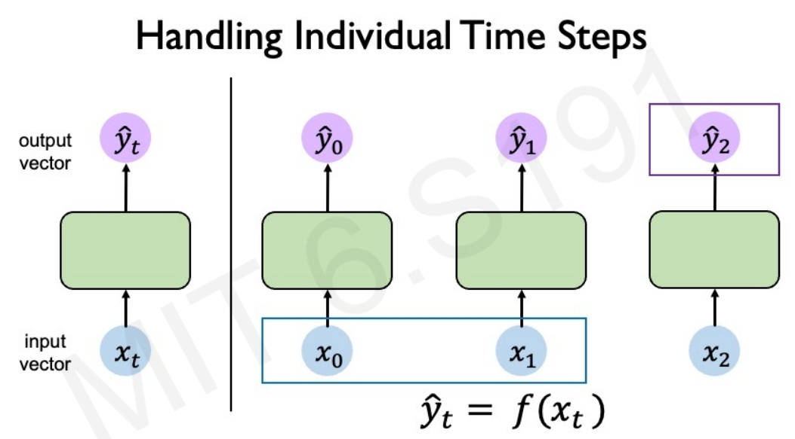
        静态单个操作的神经网络（多个时间序列，独立操作）
      </td>
      <td style="width: 50%; border: none; padding: 0.01; background-color: transparent; vertical-align: middle;">
        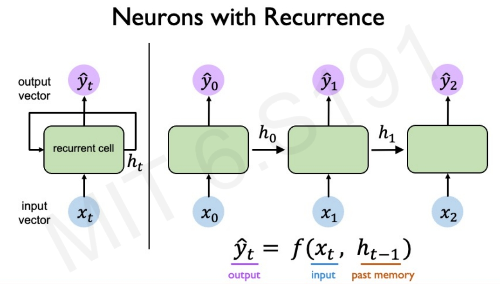
        顺序序列的神经网络（h为hidden state，作为先前的记录）
      </td>
    </tr>
  </table>
  <figcaption>
  左图由于鼓励处理每个输入，并没有将时间上的关联考虑，而右图则是输入考虑了先前时间步长（time step）的内部状态与当前的计算关联起来
  </figcaption>

  <table style="border: none; background-color: transparent;">
    <tr align="center">
      <td style="width: 50%; border: none; padding: 0.01; background-color: transparent; vertical-align: middle;">
        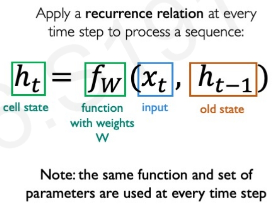
      </td>
      <td style="width: 50%; border: none; padding: 0.01; background-color: transparent; vertical-align: middle;">
        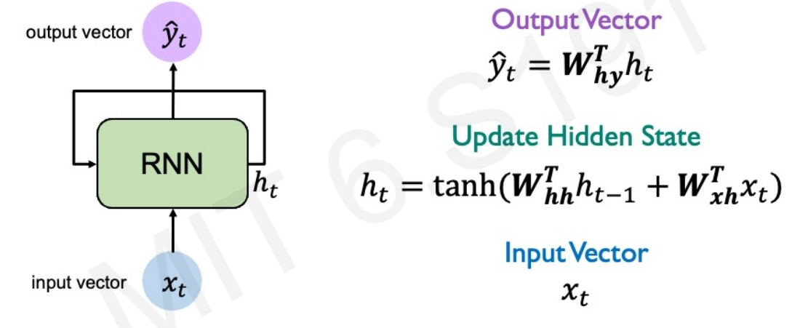
      </td>
    </tr>
  </table>
  <figcaption>
  RNN State Update and Output
  </figcaption>

RNN的计算图如下图所示，这些在每个单独的时间步都是采用相同的权重矩阵。然后在每个片段（即每个单独的时间步长）计算loss，然后将所有的时间下的损失求和获取总的loss

  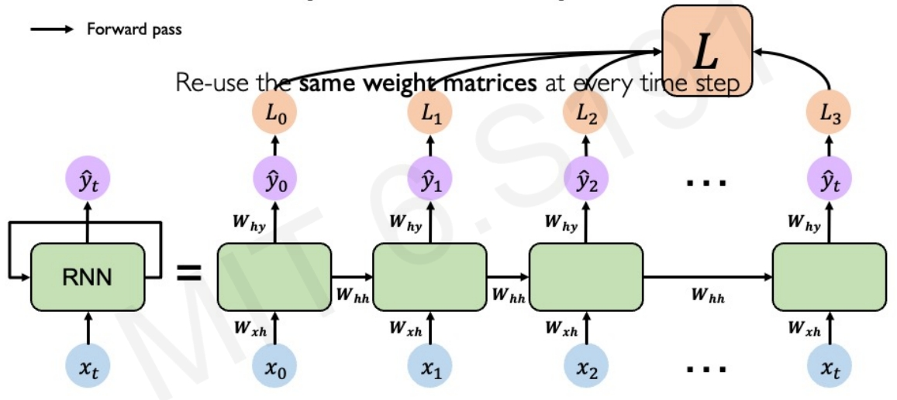
<figcaption>  
</figcaption>

RNN预测`Next word`要做的第一步，则是把语言转换成某种表达输入网络中，而不是直接输入单词。
而要做到这点，首先需要有单词表，具有所有可能遇到的单词的库。

然后，将这个词汇表中的各个单词映射到一个数字（也就是单词对应的数字索引），那么就可以将语句转换为向量。
而下图的第三步embedding就是将数字索引映射到一个大小固定的向量（如下图，以二进制编码，就是2，对应的是cat）。
当然也可以通过learning的方法来学习把单词映射到低维度、长度固定的空间，这样相似的单词就会位于相似的区域~

  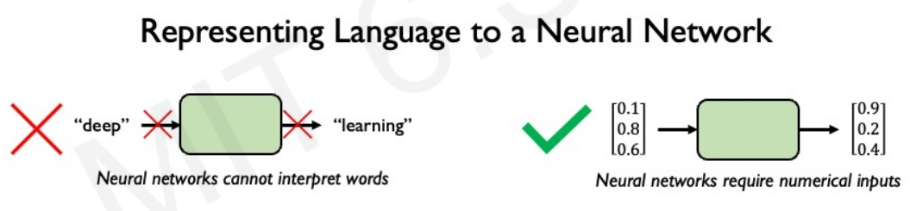
<figcaption>  
</figcaption>

而RNN的训练也是采用BP，只不过是叫`Backpropagation Through Time (BPTT)`

  <table style="border: none; background-color: transparent;">
    <tr align="center">
      <td style="width: 50%; border: none; padding: 0.01; background-color: transparent; vertical-align: middle;">
        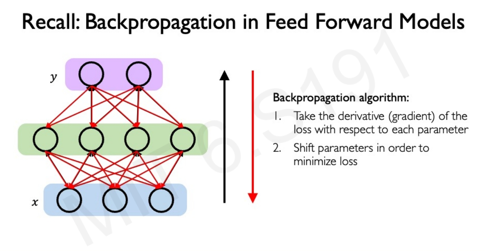
      </td>
      <td style="width: 50%; border: none; padding: 0.01; background-color: transparent; vertical-align: middle;">
        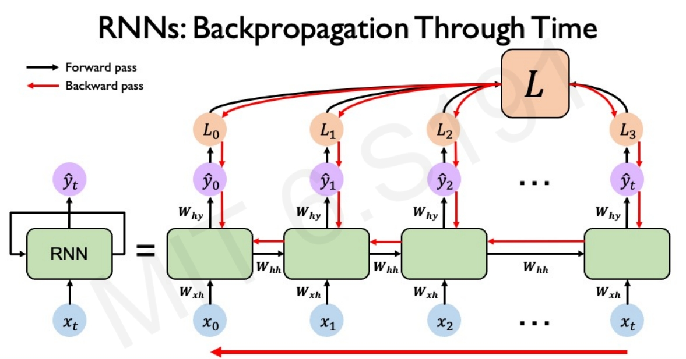
      </td>
    </tr>
  </table>
  <figcaption>
  BP vs BPTT
  </figcaption>

所谓的BP Through Time也就是不再通过单个前馈网络反向传播损失，而是跨越所有的time step来反向传播误差，这样可以把来自后面时间的误差反馈到前面的时间去。

而如果有很多大的值，会导致梯度爆炸，而如果有很多小的值又会导致梯度消失，这样就导致无法将时间较晚的梯度传递到最开始.这也就是RNN比较难训练的因素之一.

  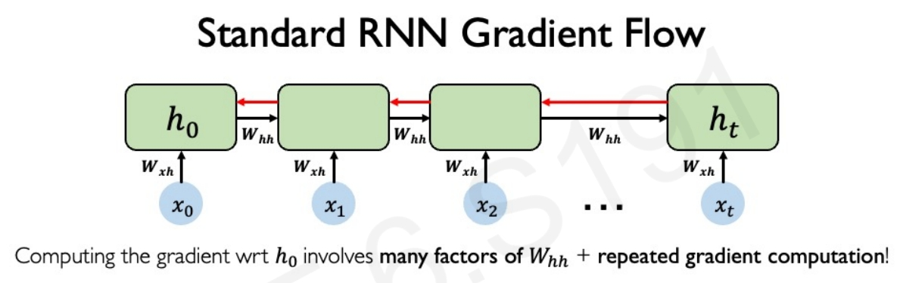
  <table style="border: none; background-color: transparent;">
    <tr align="center">
      <td style="width: 50%; border: none; padding: 0.01; background-color: transparent; vertical-align: middle;">
        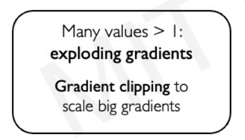
      </td>
      <td style="width: 50%; border: none; padding: 0.01; background-color: transparent; vertical-align: middle;">
        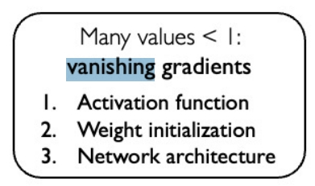
      </td>
    </tr>
  </table>
   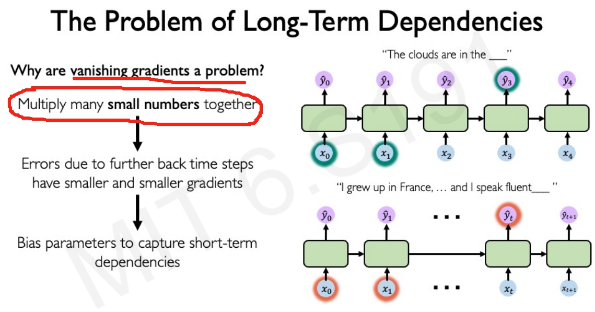
  <figcaption>
  </figcaption>

那么因此，GRU也就是出来了，通过一个gate来控制传递隐藏状态更新的信息量

  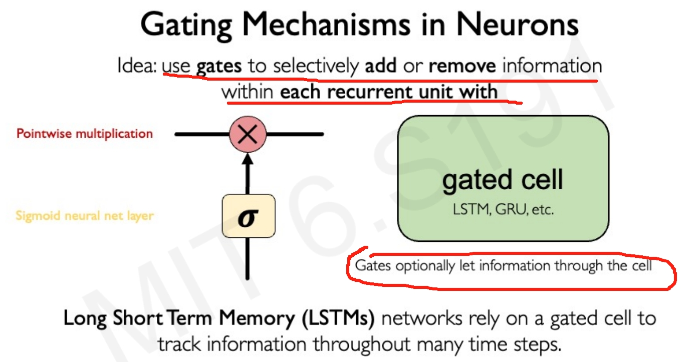
<figcaption>  
</figcaption>

而RNN也有以下的局限：
1. Encoding bottleneck，RNN的状态是一个固定size的向量，因此只能将有限的信息封装到里面
2. Slow, no parallelization，由于RNN是逐个time step来处理信息的（有固定的顺序依赖性），因此没法并行运算，
3. Not long memory，而上面的第一点，有限的状态编码会限制循环架构的长期记忆容量

  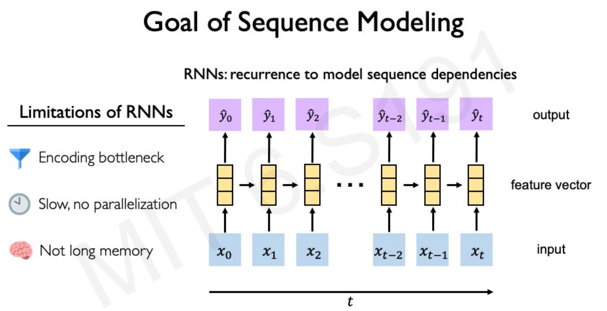
<figcaption>  
</figcaption>

那么针对这些局限，研究人员就开始思考如何去处理全部的数据，而并不是组个time step来处理，也就是消除掉递归的需求，如下所示：

  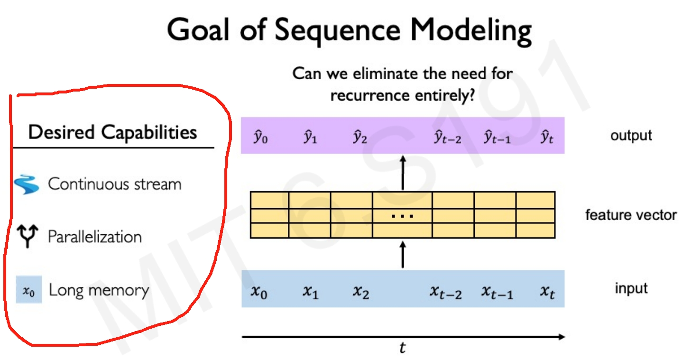
<figcaption>  
</figcaption>

也就是把全部都整合到一起，这个也就是Transformer的motivation

<!-- !!!!!!!!!!!!!!!!!!!!!!!!!!!!!!!!!!!!!!!!!!!!!!!!!!!!!!!!!!!!!!!!!!!!!!!!!!!!!!!!!!!!!!!!!!!!!!!!!!!!!!!!!!!!!!!!!!!!!!!!!!! -->

# Transformer

Transformer最早是由2017年Google的[《Attention is All You Need》](https://proceedings.neurips.cc/paper/2017/file/3f5ee243547dee91fbd053c1c4a845aa-Paper.pdf)这篇论文提出的，当时主要是针对自然语言处理领域提出的。
之前的RNN模型记忆长度有限（后续虽然由LSTM），但无法并行化，只有计算完$t_i$时刻后的数据才能计算$t_{i+1}$时刻的数据，但Transformer都可以做到（理论上其记忆长度是无限长的，并且其可以并行优化）

Transformer的基本解析其实可以用下图来描述

  
<figcaption>  
</figcaption>

下面对其关键部分进行解读

## Self-Attention
先假设输入的序列长度为2，两个输入节点$x_1$和$x_2$通过Input Embedding也就是图中的$f(x)$将输入映射到$a_1$和$a_2$

  
<figcaption>  
</figcaption>

然后将$a_1$和$a_2$通过三个变换矩阵$W_Q,W_K,W_V$(可训练，共享权重的全连接层)得到对应的$q^i,k^i,v^i$。

为什么要QKV这三个信息呢？直观来讲，这三者分别代表：
* $q$代表query，可以理解为查询的需求。后续会去和每一个$k$进行匹配
* $k$代表key，可以理解为被查询时用于匹配的键值。后续会被每个$q$匹配
* $v$则是从$a$中提取的信息，可以理解为$q$查询，$k$应答，那么对应的匹配度是多少

后续$q$和$k$匹配的过程可以理解成计算两者的相关性，相关性越大对应$v$的权重也就越大。
然后把匹配大的通过softmax提取出来，这样我们就可以得到更重要的信息，那么这个信息也就是需要强调（attention）让网络重点学习的~

而之所以说transformer是可以并行运算的，其实就是因为它是可以写成矩阵形式的操作，如下面的样例

  
  
<figcaption>  
</figcaption>

在分别获取了QKV后，通过下面公式以及softmax的处理得到($\widehat{a}_{1,1}$,$\widehat{a}_{1,2}$)和($\widehat{a}_{2,1}$,$\widehat{a}_{2,2}$)

  
  
<figcaption>  
</figcaption>

此处的$\widehat{a}$相当于计算得到针对每个$v$的权重，接着进行加权得到最终结果$b_1$和$b_2$

  
<figcaption>  
</figcaption>

所谓的`Self-Attention`就是论文中的一个公式,也就是通过输入序列$a_1$和$a_2$，得到对应的映射$b_1$和$b_2$

  
  
<figcaption>  
</figcaption>

上面采用的是两个序列为解析样例，下面用一个实际的输入一个句子来解析上面公司的过程。

对于输入的句子$x$,首先先embedding提取向量，然后添加位置编码（位置编码下面介绍）

  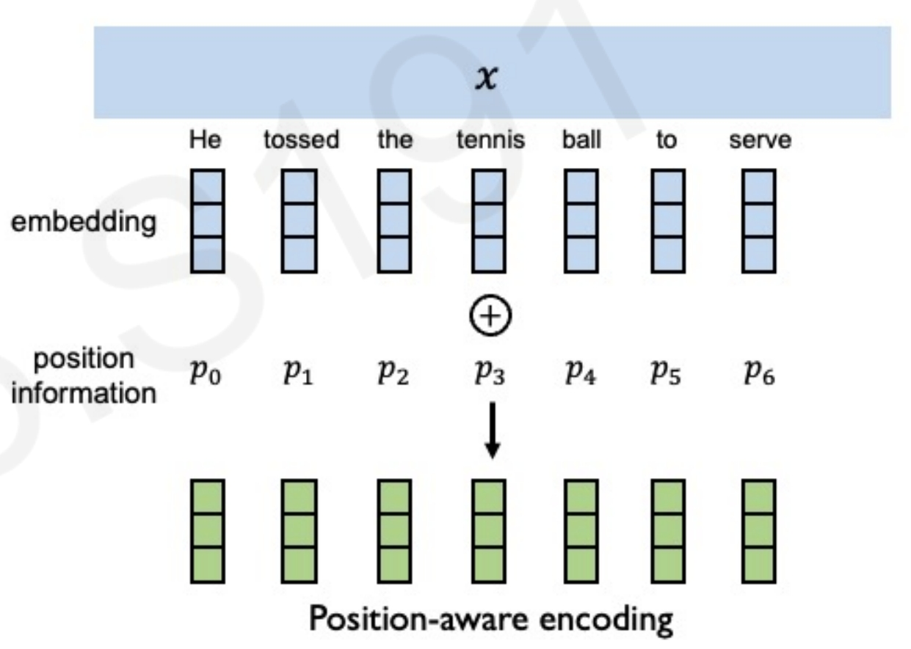
<figcaption>  
</figcaption>

然后分别提取QKV（query, key, value），也就是用于搜索看哪个才是重要的信息

  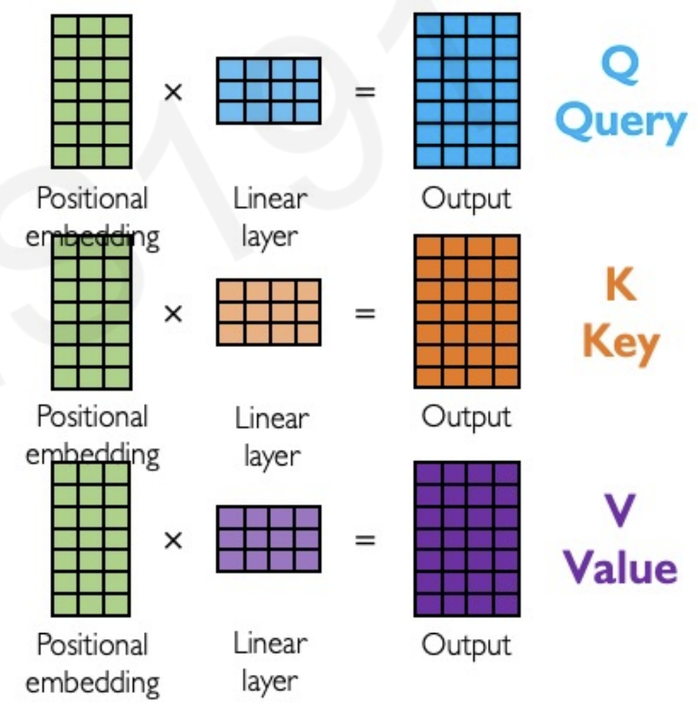
<figcaption>  
</figcaption>

然后通过公式来计算每对特征对应的query与key，获得它们的相似性

  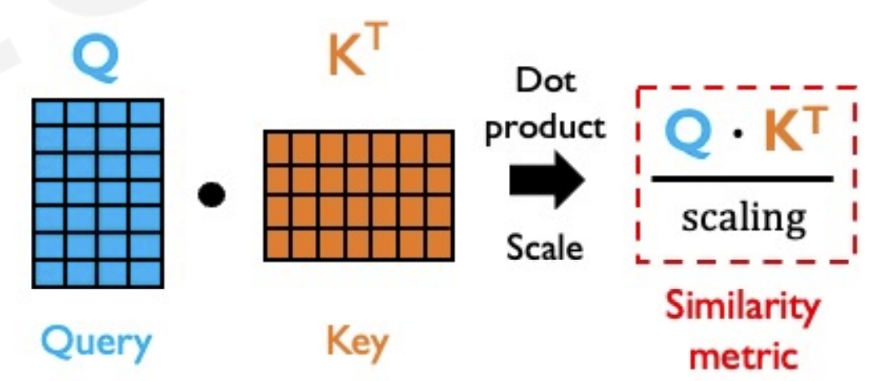
<figcaption>  
</figcaption>

然后用softmax来计算attention的权重，就是哪个地方是需要被attention的（获取各个组成部分之间的相互关联的相对权重）

  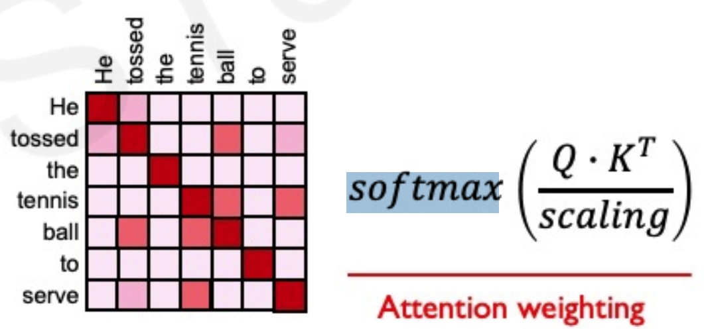
<figcaption>  
</figcaption>

接下来就是self-attention来提取特征，可以理解为与自身的value相乘，来进一步提取attention的特征

  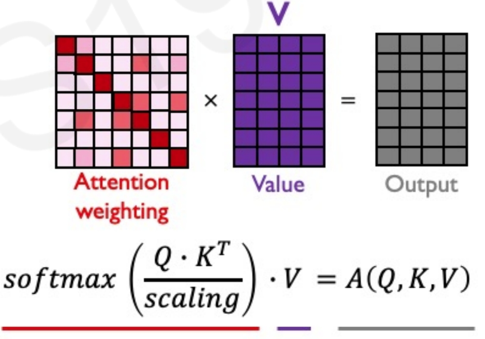
<figcaption>  
</figcaption>

整体对于self-attention的公式理解也就是下图

  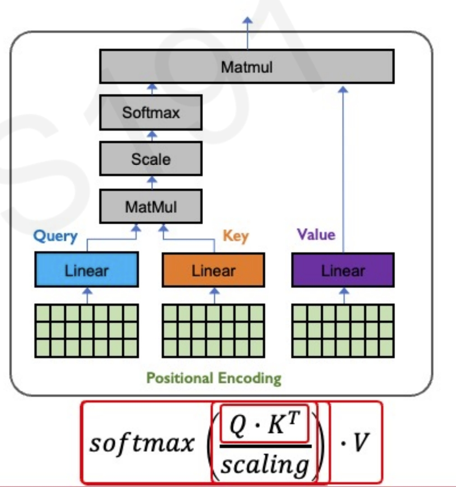
<figcaption>  
</figcaption>

## Multi-Head Attention
`Multi-head attention allows the model to jointly attend to information from different representation subspaces at different positions`
所谓的Multi-Head其实也就是上面的self attention中$W_Q,W_K,W_V$得到对应的$q^i,k^i,v^i$分别拆分多个head（均分操作，将$q^i,k^i,v^i$均分为$h$份），然后分别对应部分汇聚到一个head中。如下图所示。$q^1$拆分为$q^{1,1}$和$q^{1,2}$，然后$q^{1,1}$就是属于head1，而$q^{1,2}$则是属于head2

  
  
  
<figcaption>  
</figcaption>

这样就可以把数据可以分为head1和head2对应的数据，然后再对每个head执行上面self attention的一系列过程，就能得到对应的b(比如$head1$对应了$b_{1,1}$和$b_{2,2}$)

   
   
<figcaption>  
</figcaption>

接下来，再对每个head得到的结果b进行拼接（concat）

  
<figcaption>  
</figcaption>

接着将拼接后的结果通过一个可学习的参数$W^O$进行融合，得到最终的结果$b_1$和$b_2$

  
<figcaption>  
</figcaption>

因此，所谓的Multi-Head就是对应论文下面的公式：

  
  
<figcaption>  
</figcaption>

## Positional Encoding
对于上面的multi-head attention，如果$a_2$和$a_3$位置变了，那么实际上对于$b_1$是没有影响的，因此就引入位置编码

  
<figcaption>  
</figcaption>

而所谓的位置编码其实就是对于每个$a_i$都加入一个可训练的位置编码（或者论文计算公式算出的位置编码）

  
<figcaption>  
</figcaption>

<!-- !!!!!!!!!!!!!!!!!!!!!!!!!!!!!!!!!!!!!!!!!!!!!!!!!!!!!!!!!!!!!!!!!!!!!!!!!!!!!!!!!!!!!!!!!!!!!!!!!!!!!!!!!!!!!!!!!!!!!!!!!!! -->

# Vision Transformer (ViT)
来自于2020的ICLR[《An image is worth 16x16 words: Transformers for image recognition at scale》](https://arxiv.org/pdf/2010.11929/1000)

ViT模型的模型架构如下图所示.对于输入的图片，首先将其分成每个小的patches.
然后将每个patches输入embedding层，然后得到每个patches对应的token，然后再这一系列的token前面加入新的token（用于分类的class token）。
至此应该就是相当于NLP中Transformer的$a_i$，然后再加入位置信息（Position embedding）

  
  
<figcaption>  
</figcaption>

然后根据Transformer中输入多少个patches就能得到多少个输出，输出再通过MLP来实现分类的层结构。

## Embedding Layer
对于标准的Transformer模块，要求输入的是token（向量）序列（一个二维的矩阵，[num_token, token_dim]）。
但是对于图像数据而言，其数据格式为[H, W, C]是三维矩阵明显不是Transformer想要的。所以需要先通过一个Embedding层来对数据做个变换。如下图所示

  
<figcaption>  
</figcaption>

其中token 0-9对应的都是向量序列（二维的矩阵）。以ViT-B/16为例，对于16*16大小的patch，每个token向量长度为16*16*3=768。

而在具体的在代码实现中，通过一个卷积层来实现。 
以ViT-B/16为例，直接使用一个卷积核大小为16x16，步距为16，卷积核个数（channel数）为768的卷积来实现。
通过卷积原图[224, 224, 3] -> [14, 14, 768]，然后把H以及W两个维度展平即可[14, 14, 768] -> [196, 768]（14*14=196），此时正好变成了一个二维矩阵，正是Transformer想要的（num_token=196，token_dim=768，一共196个token，每个token的维度为768）。

在输入Transformer Encoder之前注意需要加上`class token`以及`Position Embedding`。 
* 在上面的tokens[num_token, token_dim]中插入一个专门用于分类的`class token`，这个`class token`是一个可训练的参数，数据格式和其他token一样都是一个向量，
以ViT-B/16为例，就是一个长度为768的向量，与之前从图片中生成的tokens拼接在一起，`Cat([1, 768], [196, 768]) -> [197, 768]`
* 至于`Position Embedding`也就是前面Transformer中提到的Positional Encoding，采用的是一个可训练的参数，由于是直接叠加在tokens上的（执行加的操作），所以shape要一样。以ViT-B/16为例，拼接`class token`后shape是[197, 768]，那么对应的Position Embedding的shape也是[197, 768]。

关于位置编码，论文也通过实验验证了，如果实用了能带来3%的提升，而具体实用什么形式的编码，差异并不大~

下图红色标出的是对于每个patch的最终学习到的位置编码与其他patch的位置编码进行求余弦相似度，可以看到最亮（值为1）是自身所在的位置。而其与对应的一列和一行的相似度都比较高.

  
<figcaption>  
</figcaption>

## Transformer Encoder

Transformer Encoder其实就是重复堆叠Encoder Block L次

  
<figcaption>  
</figcaption>

对于上图重新绘制的Encoder Block，主要由以下几部分组成：
* Layer Normalization，该方法主要是针对NLP领域提出的，这里是对每个token进行Norm处理
* Multi-Head Attention也就是上面提到的Transformer的结构
* Dropout/DropPath，在原论文的代码中是直接使用的Dropout层（论文没画，源码有），也就是正则化（通过一定的概率随机将隐藏神经元的某些激活值设置为零，以实现简化网络，避免过拟合）
* MLP Block，就是全连接+GELU激活函数+Dropout组成的，其中，第一个全连接层会把输入节点个数翻4倍[197, 768] -> [197, 3072]，第二个全连接层会还原回原节点个数[197, 3072] -> [197, 768]

## MLP Head

通过Transformer Encoder后输出的shape和输入的shape是保持不变的，以ViT-B/16为例，输入的token是[197, 768]输出的还是[197, 768]。
由于只是需要分类的信息，所以只需要提取出`class token`生成的对应结果就行，即[197, 768]中抽取出`class token`对应的[1, 768]。
然后通过MLP Head得到最终的分类结果~

  
<figcaption>  
</figcaption>

MLP Head原论文中说：在训练ImageNet21K时是由Linear(全连接层)+tanh激活函数+Linear组成。但是迁移到ImageNet1K上或者自己的数据上时，只用一个Linear即可。
故此，MLP head就理解为一共全连接层即可~

最终的ViT-B/16整个pipeline如下图所示：

  
<figcaption>  
</figcaption>

# 参考资料
* [Course lectures for MIT Introduction to Deep Learning](https://www.youtube.com/playlist?list=PLtBw6njQRU-rwp5__7C0oIVt26ZgjG9NI)
* [Website of MIT Introduction to Deep Learning](https://introtodeeplearning.com/)
* [Code for MIT Introduction to Deep Learning](https://github.com/MITDeepLearning/introtodeeplearning)
* [B站的MIT深度学习: 循环神经网络、Transformer 和注意力机制](https://www.bilibili.com/list/watchlater?oid=114141507425125&bvid=BV1zkREYbE4E&spm_id_from=333.1387.top_right_bar_window_view_later.content.click)
* [Attention is All You Need精读](https://blog.csdn.net/weixin_73654895/article/details/142419678?spm=1001.2014.3001.5501)
* [Transformers: from NLP to CV](https://ibrahimsobh.github.io/Transformers/)
* [详解Transformer中Self-Attention以及Multi-Head Attention](https://blog.csdn.net/qq_37541097/article/details/117691873)
* [Vision Transformer详解](https://blog.csdn.net/qq_37541097/article/details/118242600)
* [CV攻城狮入门VIT(vision transformer)之旅——VIT原理详解篇](https://blog.csdn.net/qq_47233366/article/details/128122756)

