<!-- * 目录
{:toc} -->

<!-- !!!!!!!!!!!!!!!!!!!!!!!!!!!!!!!!!!!!!!!!!!!!!!!!!!!!!!!!!!!!!!!!!!!!!!!!!!!!!!!!!!!!!!!!!!!!!!!!!!!!!!!!!!!!!!!!!!!!!!!!!!! -->
# 引言
之前在复现DUSt3R,MASt3R和Fast3R的时候都被其惊艳的效果所吸引，而其中最关键的是Transformer这个结构。
为此写下本博文对其进行学习，本博文仅供本人学习记录用~

Transformer最早是由2017年Google的《Attention is All You Need》这篇论文提到的，当时主要是针对自然语言处理领域提出的。
之前的RNN模型记忆长度有限（后续虽然由LSTM），但无法并行化，只有计算完$t_i$时刻后的数据才能计算$t_{i+1}$时刻的数据，但Transformer都可以做到（理论上其记忆长度是无限长的，并且其可以并行优化）

# MIT深度学习课程
首先，可以先通过《MIT Introduction to Deep Learning》这个课程，其中第二节对循环神经网络、Transformer 和注意力机制进行了介绍，来了解从RNN到Transformer的一些基本知识。

该课程对应的PPT如下

  <iframe width="100%" height="100%"
    src="https://introtodeeplearning.com/slides/6S191_MIT_DeepLearning_L2.pdf#toolbar=0&navpanes=0&scrollbar=0" ></iframe>

# Attention is All You Need

Transformer的基本解析其实可以用下图来描述

  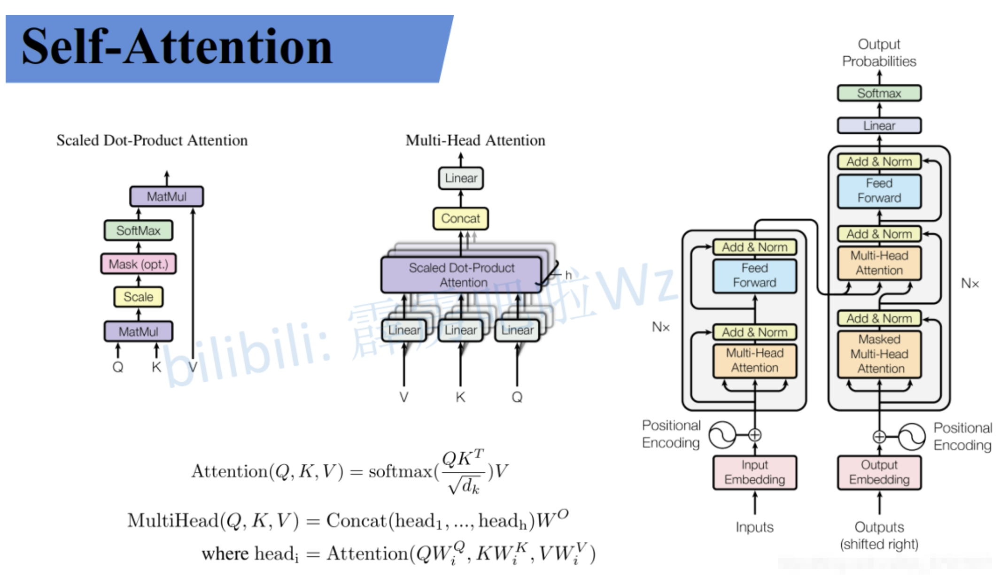
<figcaption>  
</figcaption>

下面对其关键部分进行解读

## Self-Attention
先假设输入的序列长度为2，两个输入节点$x_1$和$x_2$通过Input Embedding也就是图中的$f(x)$将输入映射到$a_1$和$a_2$

  
<figcaption>  
</figcaption>

然后将$a_1$和$a_2$通过三个变换矩阵$W_Q,W_K,W_V$(可训练，共享权重的全连接层)得到对应的$q^i,k^i,v^i$，其中这三者分别代表：
* $q$代表query，后续会去和每一个$k$进行匹配
* $k$代表key，后续会被每个$q$匹配
* $v$则是从$a$中提取的信息

后续$q$和$k$匹配的过程可以理解成计算两者的相关性，相关性越大对应$v$的权重也就越大。

而之所以说transformer是可以并行运算的，其实就是因为它是可以写成矩阵形式的操作，如下面的样例

  
  
<figcaption>  
</figcaption>

在分别获取了QKV后，通过下面公式以及softmax的处理得到($\widehat{a}_{1,1}$,$\widehat{a}_{1,2}$)和($\widehat{a}_{2,1}$,$\widehat{a}_{2,2}$)

  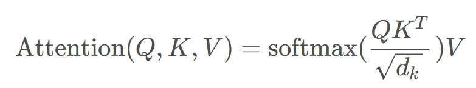
  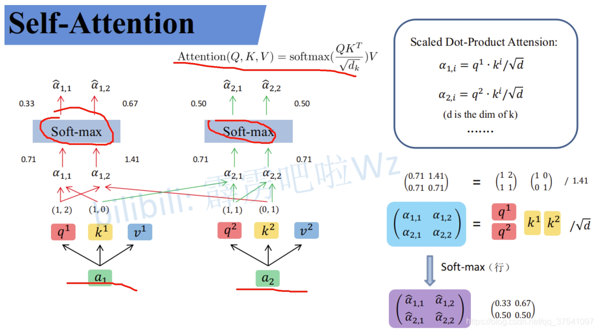
<figcaption>  
</figcaption>

此处的$\widehat{a}$相当于计算得到针对每个$v$的权重，接着进行加权得到最终结果$b_1$和$b_2$

  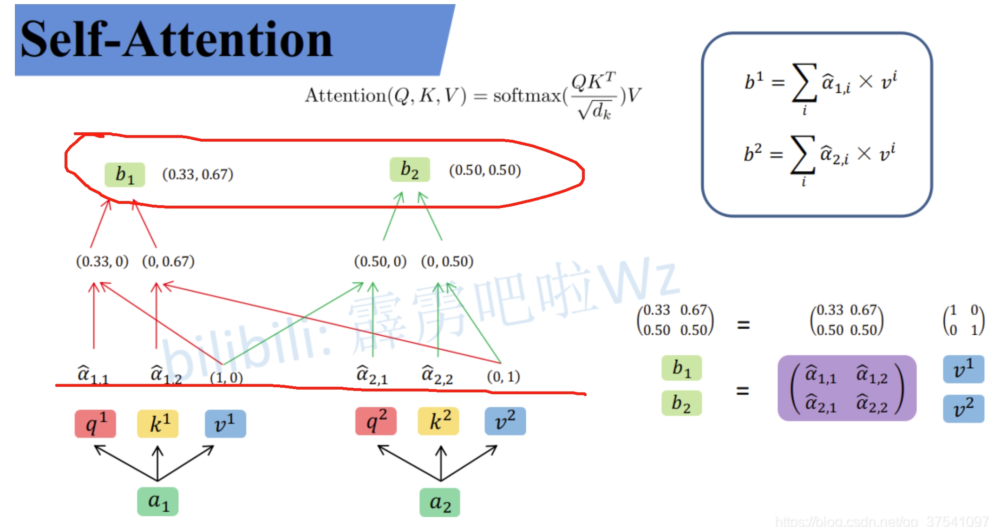
<figcaption>  
</figcaption>

所谓的`Self-Attention`就是论文中的一个公式,也就是通过输入序列$a_1$和$a_2$，得到对应的映射$b_1$和$b_2$

  
  
<figcaption>  
</figcaption>

## Multi-Head Attention
`Multi-head attention allows the model to jointly attend to information from different representation subspaces at different positions`
所谓的Multi-Head其实也就是上面的self attention中$W_Q,W_K,W_V$得到对应的$q^i,k^i,v^i$分别拆分多个head（均分操作，将$q^i,k^i,v^i$均分为$h$份），然后分别对应部分汇聚到一个head中。如下图所示。$q^1$拆分为$q^{1,1}$和$q^{1,2}$，然后$q^{1,1}$就是属于head1，而$q^{1,2}$则是属于head2

  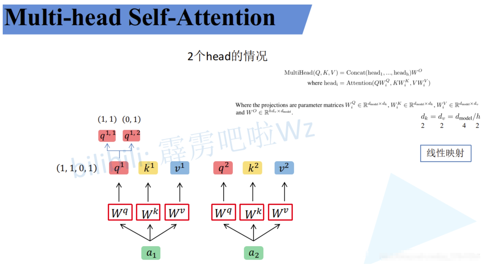
  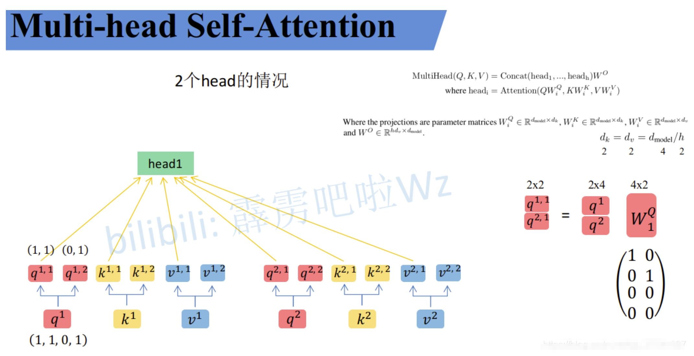
  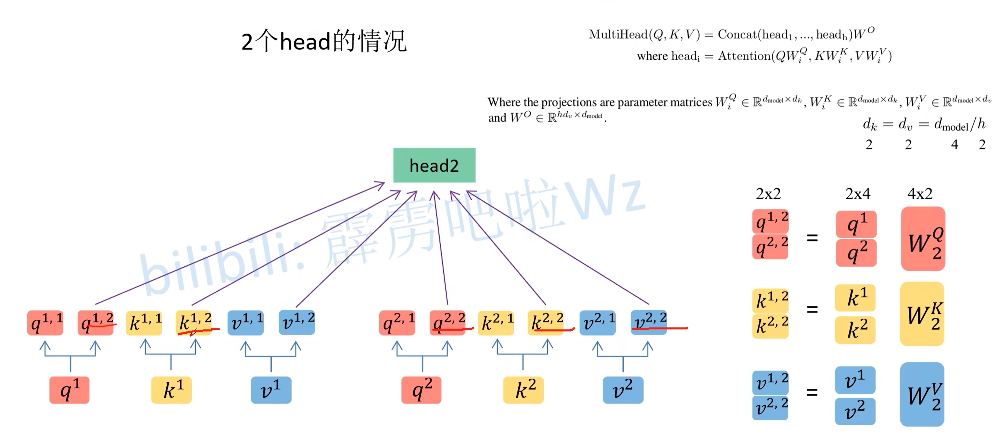
<figcaption>  
</figcaption>

这样就可以把数据可以分为head1和head2对应的数据，然后再对每个head执行上面self attention的一系列过程，就能得到对应的b(比如$head1$对应了$b_{1,1}$和$b_{2,2}$)

   
   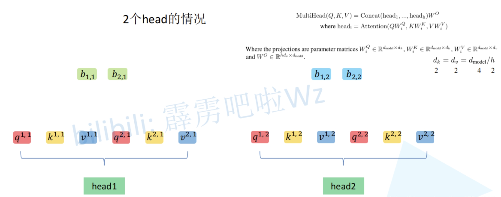
<figcaption>  
</figcaption>

接下来，再对每个head得到的结果b进行拼接（concat）

  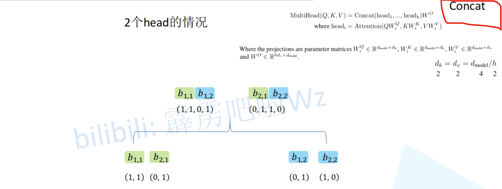
<figcaption>  
</figcaption>

接着将拼接后的结果通过一个可学习的参数$W^O$进行融合，得到最终的结果$b_1$和$b_2$

  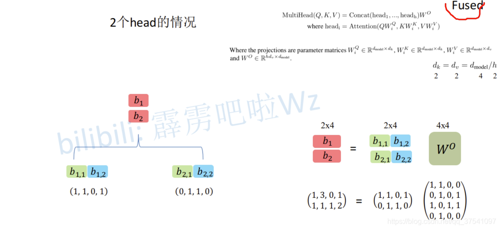
<figcaption>  
</figcaption>

因此，所谓的Multi-Head就是对应论文下面的公式：

  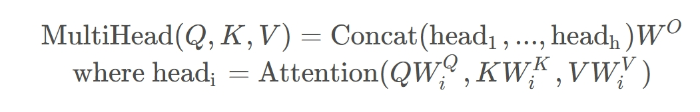
  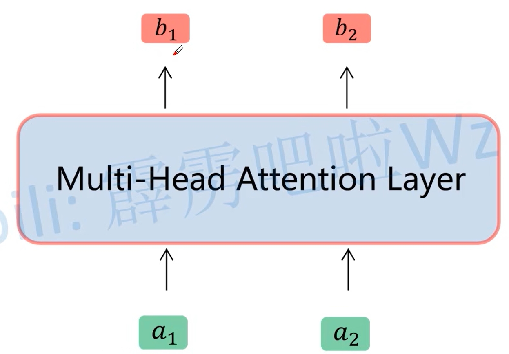
<figcaption>  
</figcaption>

## Positional Encoding
对于上面的multi-head attention，如果$a_2$和$a_3$位置变了，那么实际上对于$b_1$是没有影响的，因此就引入位置编码

  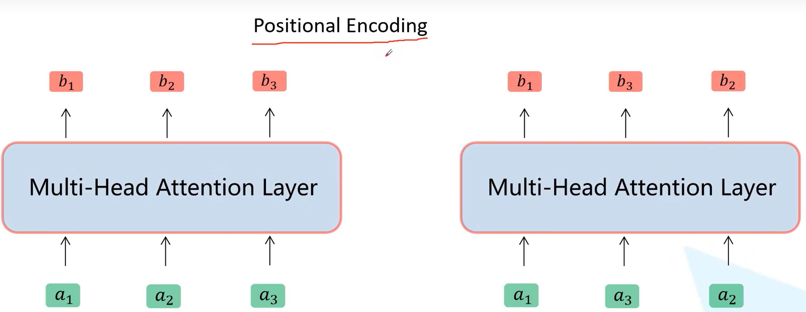
<figcaption>  
</figcaption>

而所谓的位置编码其实就是对于每个$a_i$都加入一个可训练的位置编码（或者论文计算公式算出的位置编码）

  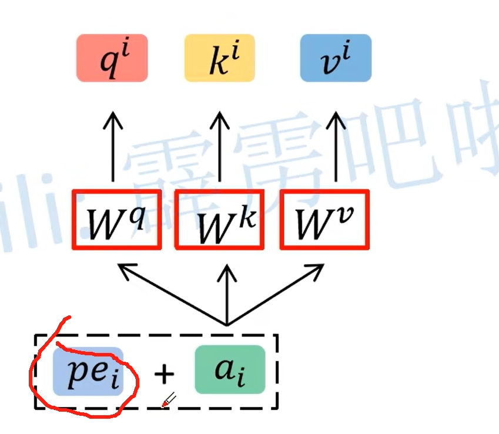
<figcaption>  
</figcaption>

# Transformers: from NLP to CV

## Vision Transformer (VIT)

# 参考资料
* [Course lectures for MIT Introduction to Deep Learning](https://www.youtube.com/playlist?list=PLtBw6njQRU-rwp5__7C0oIVt26ZgjG9NI)
* [Website of MIT Introduction to Deep Learning](https://introtodeeplearning.com/)
* [Code for MIT Introduction to Deep Learning](https://github.com/MITDeepLearning/introtodeeplearning)
* [B站的MIT深度学习: 循环神经网络、Transformer 和注意力机制](https://www.bilibili.com/list/watchlater?oid=114141507425125&bvid=BV1zkREYbE4E&spm_id_from=333.1387.top_right_bar_window_view_later.content.click)
* [Attention is All You Need精读](https://blog.csdn.net/weixin_73654895/article/details/142419678?spm=1001.2014.3001.5501)
* [Transformers: from NLP to CV](https://ibrahimsobh.github.io/Transformers/)
* [详解Transformer中Self-Attention以及Multi-Head Attention](https://blog.csdn.net/qq_37541097/article/details/117691873)

