<!-- * 目录
{:toc} -->


<!-- !!!!!!!!!!!!!!!!!!!!!!!!!!!!!!!!!!!!!!!!!!!!!!!!!!!!!!!!!!!!!!!!!!!!!!!!!!!!!!!!!!!!!!!!!!!!!!!!!!!!!!!!!!!!!!!!!!!!!!!!!!! -->
# 引言
之前博客对Transformer以及基于Transformer的SLAM进行了解读。而最近Oxford以及Meta AI在CVPR2025新开源了VGGT可以实现推理场景中的所有的关键三维属性（如：相机的内参与外参，point map，深度图，3D点跟踪）。

为此，写下本博文记录阅读及测试过程，本博文仅供本人学习记录用~

相关的资料：
* [paper](https://arxiv.org/pdf/2503.11651)
* [Github](https://github.com/facebookresearch/vggt)
* [Awesome Transformer-based SLAM](https://github.com/KwanWaiPang/Awesome-Transformer-based-SLAM)
* [Paper Survey之——Awesome Transformer-based SLAM](https://kwanwaipang.github.io/Transformer_SLAM/)
* [What is Transformer? Form NLP to CV](https://kwanwaipang.github.io/Transformer/)


# 理论解读

VGGT是一个 large feed-forward transformer，通过输入高达数百张图片，一次（少于1秒）预测出所有图片的三维属性（相机的内参与外参，point map，深度图，3D点跟踪），并且在这些3D task的任务中都取得非常优异的性能，并且进一步的把这个预训练的VGGT用到下游任务（如非刚体点跟踪，新视角合成）的feature backbone中也可以获得更好的性能~

<div align="center">
  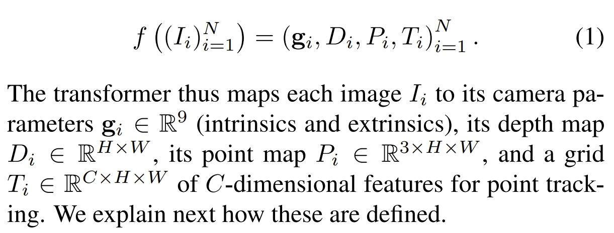
<figcaption>  
</figcaption>
</div>

跟DUSt3R和MASt3R一样，VGGT则是针对几乎完全避免几何后处理来直接解决3D tasks，但不一样的是前两着本质上还是处理成对图片，而VGGT则是一次输入，不需要任何额外的后端优化。

VGGT的结构如下图所示。

<div align="center">
  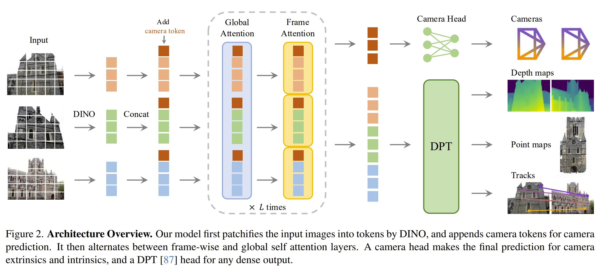
<figcaption>  
</figcaption>
</div>
注意，VGGT跟DUSt3R不一样，各个输出并不是独立的（DUSt3R的部分结果是额外推理得到的，比如pose可以通过pnp来计算出来）。因此，VGGT训练的时候是一个针对四个task的统一的loss，如下图所示

<div align="center">
  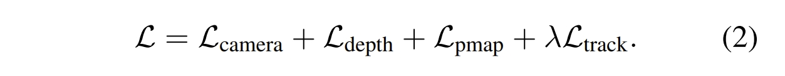
<figcaption>  
前面三个loss的尺度是近似的，而tracking loss需要尺度λ=0.05
</figcaption>
</div>

具体各个loss的定义请见原文（此处先跳过）
<div align="center">
  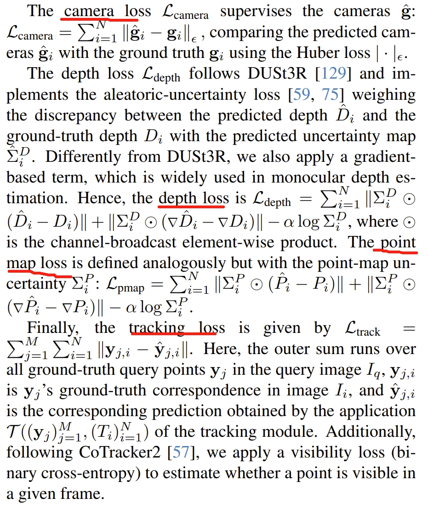
<figcaption>  
</figcaption>
</div>

而训练采用的数据大致跟MASt3R差不多

对于输入的图片，先用DINO V2(《[Dinov2: Learning robust visual features without supervision](https://arxiv.org/pdf/2304.07193)》)来获取K个token，然后通过alternating-attention（应该也就是执行标准的transformer L（L=24）次），而对于输出的prediction heads：
* camera parameters：4个self-attention layers+一个全连接层
* dense map，point map和tracking feature：都是用DPT layer(《[Vision transformers for dense prediction](https://openaccess.thecvf.com/content/ICCV2021/papers/Ranftl_Vision_Transformers_for_Dense_Prediction_ICCV_2021_paper.pdf)》)
* 至于实现tracking的过程，则是采用CoTracker2结构（《[Cotracker: It is better to track together](https://arxiv.org/pdf/2307.07635)》）


## 论文的结果

论文的实验可以说是非常solid的，也展示非常强大的泛化能力

1. 首先是pose estimation，如下图所示.
采用的评判指标是AUC（综合了Relative Rotation Accuracy (RRA)和Relative Translation Accuracy RTA，虽然是SLAM中比较少见的，但估计是为了跟PoseDiffusion对比）。
可以看到，时间上用时是最短的，而精度也是最高的。序列都是在Co3Dv2下训练，没有在Re10K下训练过的。对于像DUSt3R和MASt3R这种还是有global BA的也远不如VGGT。

此外，加上BA后，VGGT的性能会更好，而VGGT本身就可以获得精度比较搞的point/depth map，这可以给BA提供较好的初始化，也不需要三角化或者iterative refinement等一系列的操作

<div align="center">
  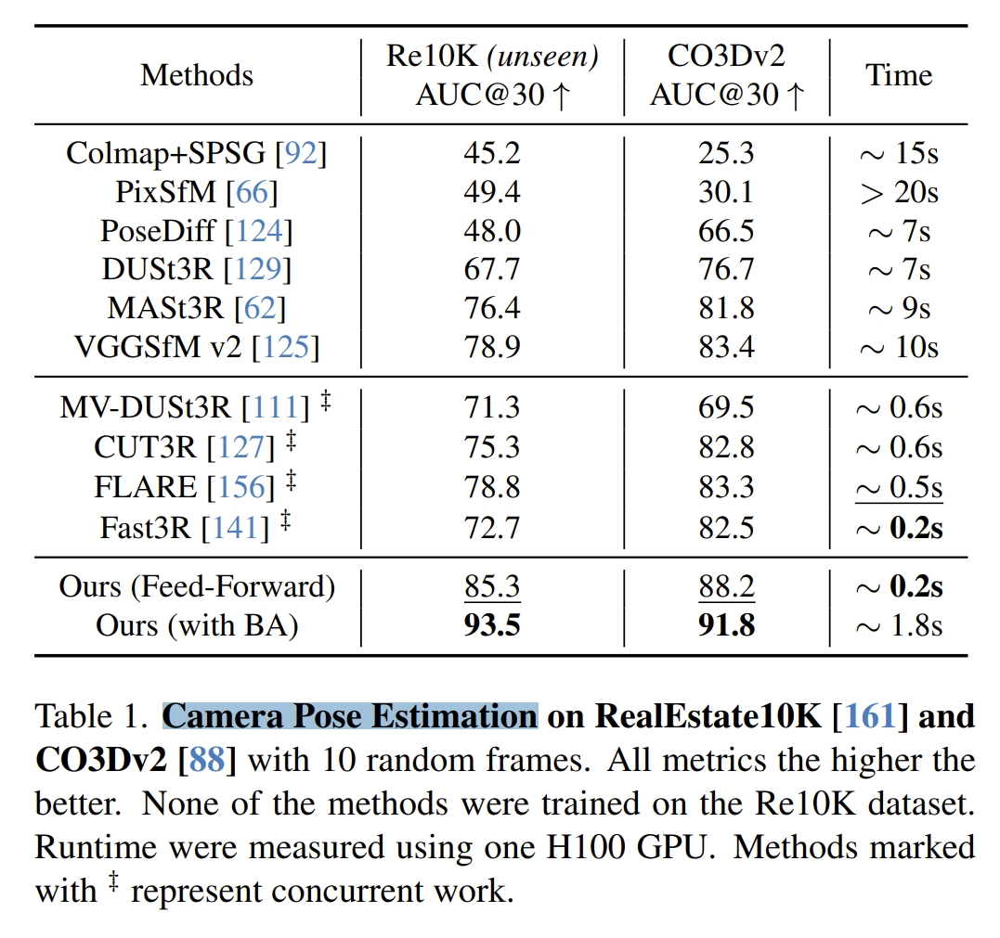
<figcaption>  
</figcaption>
</div>

2. 深度估计的实验对比，如下所示。只有DUSt3R和VGGT不需要GT pose，而MASt3R要估算深度是需要基于camera pose来做三角化的。
而VGGT也是取得最佳的performance的

<div align="center">
  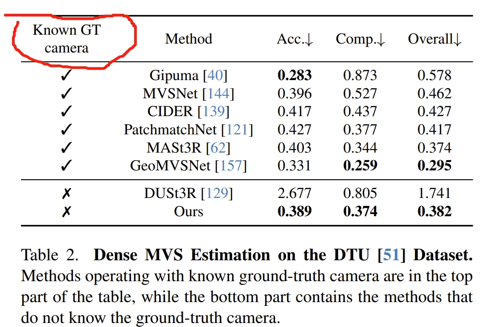
<figcaption>  
</figcaption>
</div>

3. point map估算的效果。如下左图所示，DUSt3R输入多张image的时候是成对的处理的，因此当32张图输入，时间爆炸式增长到200s但是VGGT仍然是0.6s。相比起单张或者两张图片的输入，时间增长并没有DUSt3R那么大。

<div align="center">
  <table style="border: none; background-color: transparent;">
    <tr align="center">
      <td style="width: 50%; border: none; padding: 0.01; background-color: transparent; vertical-align: middle;">
        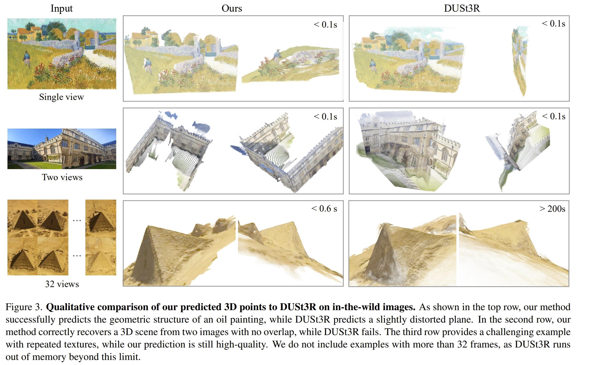
      </td>
      <td style="width: 50%; border: none; padding: 0.01; background-color: transparent; vertical-align: middle;">
        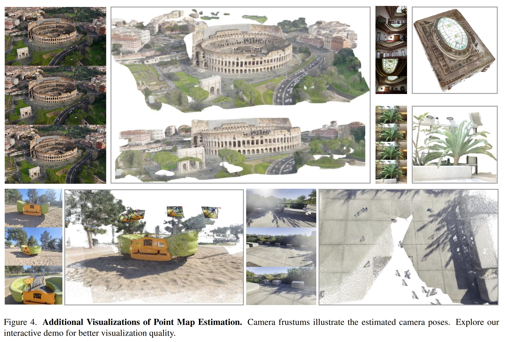
      </td>
    </tr>
  </table>
  <figcaption>
  </figcaption>
</div>

此外，DUSt3R和MASt3R在处理单张图片输入的时候，是duplicate 图像的，但是VGGT则是实在的支持单张图片的输入，故此上左图可以看到单张图像的输入时，比DUSt3R要好些~

<div align="center">
  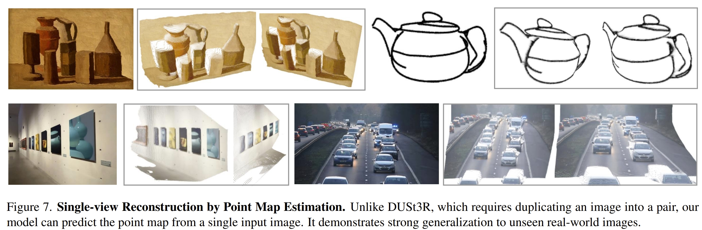
<figcaption>  
</figcaption>
</div>

4. 下面则是跟SuperGlue、LoFTR等image matching的方法对比，VGGT也是SOTA

<div align="center">
  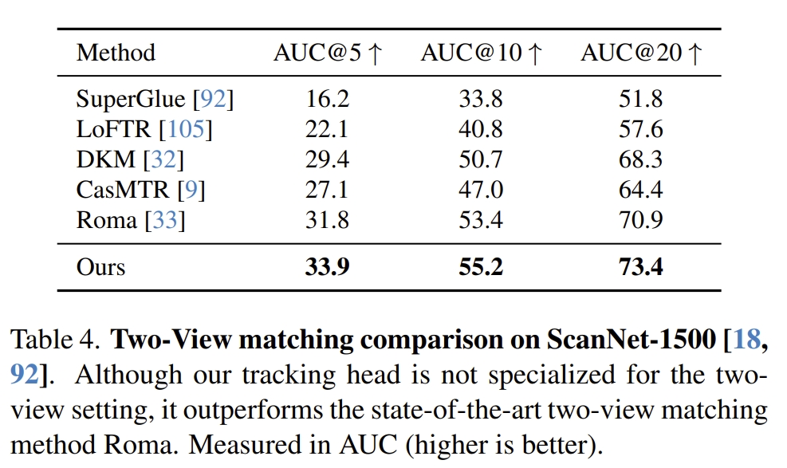
<figcaption>  
</figcaption>
</div>

5. point tracking以及新事件合成等任务
<div align="center">
  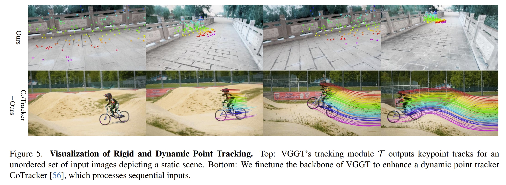
  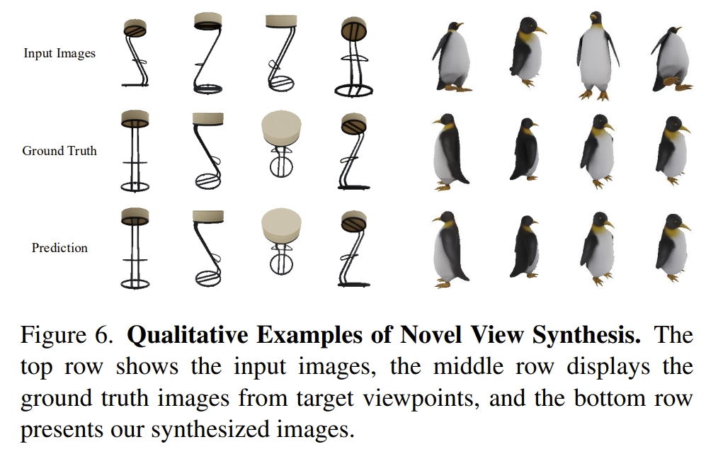
<figcaption>  
</figcaption>
</div>

<div align="center">
  <table style="border: none; background-color: transparent;">
    <tr align="center">
      <td style="width: 50%; border: none; padding: 0.01; background-color: transparent; vertical-align: middle;">
        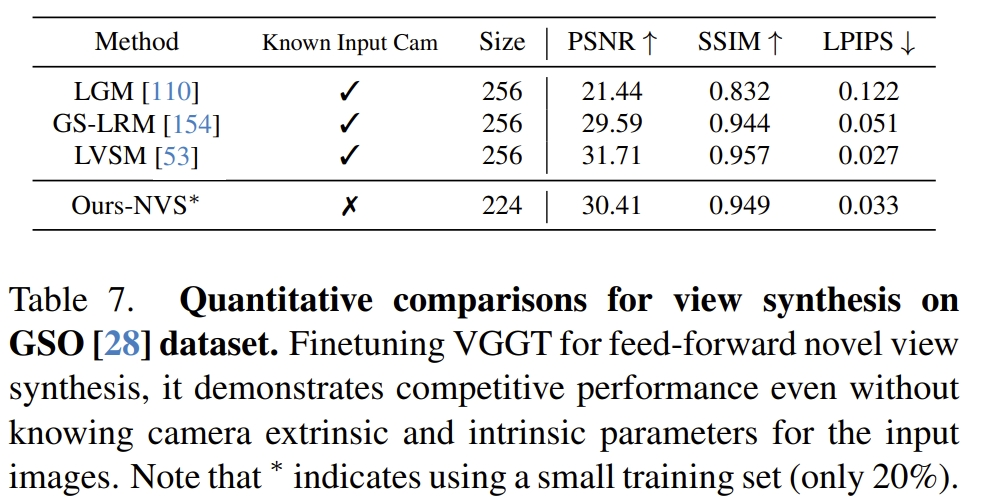
      </td>
      <td style="width: 50%; border: none; padding: 0.01; background-color: transparent; vertical-align: middle;">
        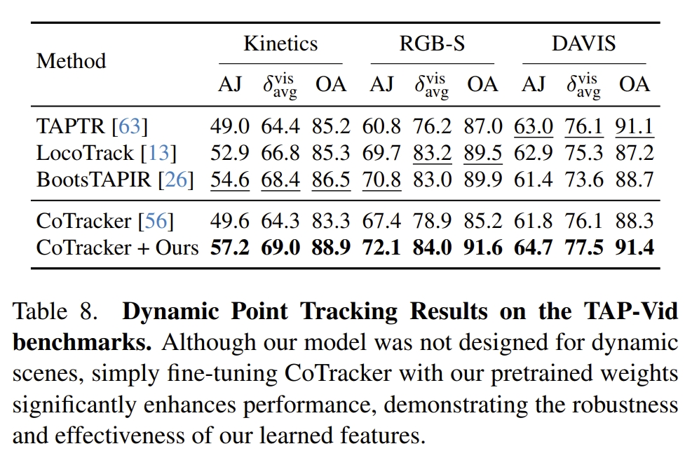
      </td>
    </tr>
  </table>
  <figcaption>
  </figcaption>
</div>


# 实验测试

* 本测试采用的代码及后续的注释（如有）均在[Github](https://github.com/KwanWaiPang/vggt)

## 配置测试
```bash
git clone https://github.com/KwanWaiPang/vggt.git
cd vggt

# 创建虚拟环境
conda create -n VGGT python=3.11
conda activate VGGT
# conda remove --name VGGT --all

pip install -r requirements.txt
```

* 安装可视化工具
```bash
pip install -r requirements_demo.txt
```

* 下载模型[link](https://huggingface.co/facebook/VGGT-1B/resolve/main/model.pt)

* 运行demo
```bash
conda activate VGGT
pip install matplotlib

python demo_gradio.py
```
运行后似乎会自动下载前面下载好的模型，因此手动下载过就注释掉就可以了吧（但测试的时候发现会报错，那还是直接重新下载算了~）

<div align="center">
  
<figcaption>  
</figcaption>
</div>

最终有权限类的错误

<div align="center">
  
<figcaption>  
</figcaption>
</div>

尝试采用下面的visualization
```bash
python demo_viser.py --image_folder path/to/your/images/folder

conda activate VGGT
python demo_viser.py --image_folder dataset/tandt_train
```
在vscode中运行应该就可以直接点击打开进去浏览器观看效果了~

看上去大场景的效果似乎比[Fast3R](https://kwanwaipang.github.io/Fast3R/)要好不少~

<div align="center">
  
   
   
<figcaption>  
</figcaption>
</div>

* 也可以采用在线的damo [Link](https://huggingface.co/spaces/facebook/vggt) 早说嘛，我就懒得配置了😂而且在线的UI也好不少~

* 在[原readme](./README%20original.md)中也从代码角度介绍了每个模块大致怎么使用

## 测试效果

* 首先先看看作者给的数据的效果

<!-- 在 Markdown 中插入以下代码 -->
<script type="module" src="https://cdn.skypack.dev/@google/model-viewer"></script>

<model-viewer
  src="{{ '/images/testing1.glb' | relative_url }}" 
  alt="3D Model"
  ar
  auto-rotate
  camera-controls
  style="width: 100%; height: 400px;"
></model-viewer>