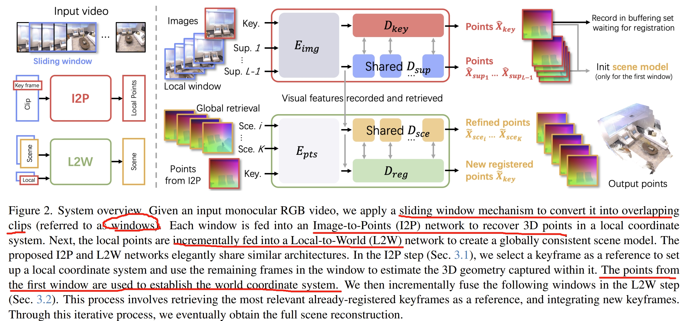
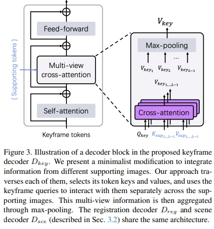
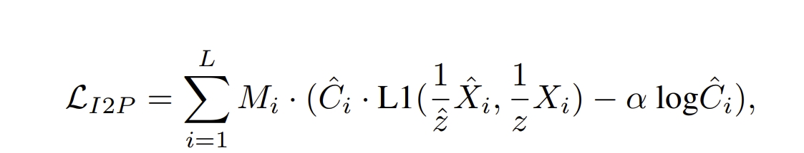
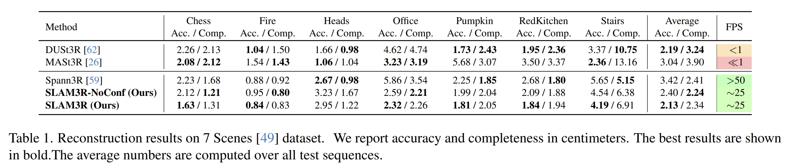
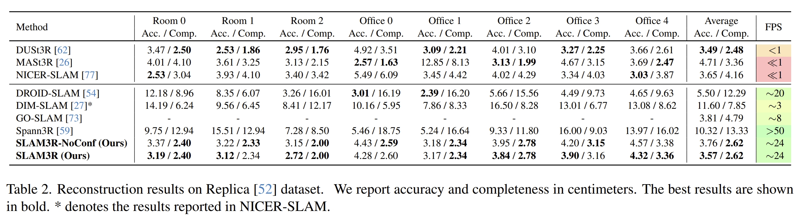
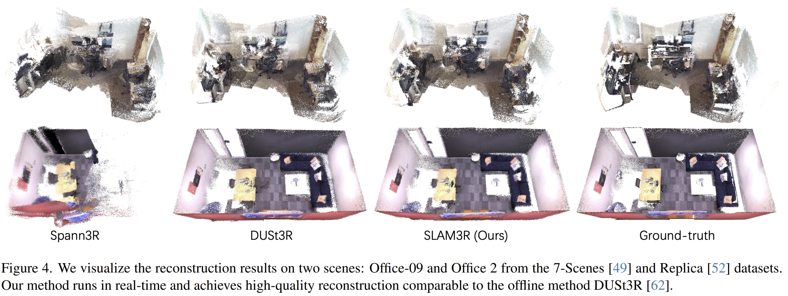
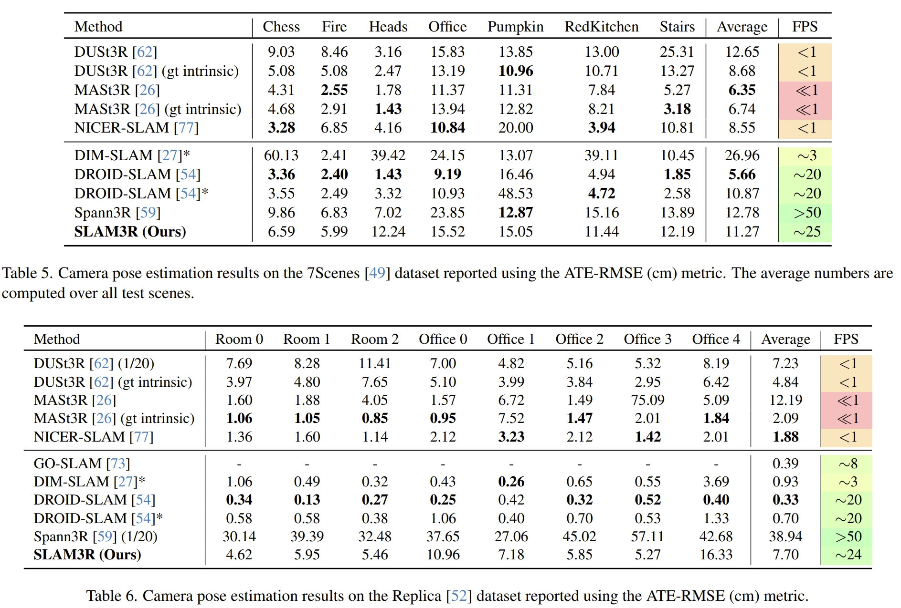

<!-- * 目录
{:toc} -->


<!-- !!!!!!!!!!!!!!!!!!!!!!!!!!!!!!!!!!!!!!!!!!!!!!!!!!!!!!!!!!!!!!!!!!!!!!!!!!!!!!!!!!!!!!!!!!!!!!!!!!!!!!!!!!!!!!!!!!!!!!!!!!! -->
# 引言
之前博客对Transformer以及基于Transformer的SLAM进行了解读。而最近北大开源了SLAM3R，一种实时（20+ FPS）、可稠密重建的单目SLAM系统，且也是基于Transformer架构的

为此，写下本博文记录阅读及测试过程，本博文仅供本人学习记录用~

相关的资料：
* [paper](https://arxiv.org/pdf/2412.09401)
* [Github](https://github.com/PKU-VCL-3DV/SLAM3R)
* 本博客采用的代码及注释（如有）均在[Github](https://github.com/KwanWaiPang/SLAM3R)
* 博客：[Paper Survey之——Awesome Transformer-based SLAM](https://kwanwaipang.github.io/Transformer_SLAM/)
* [Awesome Transformer-based SLAM](https://github.com/KwanWaiPang/Awesome-Transformer-based-SLAM)
* 博客：[What is Transformer? Form NLP to CV](https://kwanwaipang.github.io/Transformer/)


# 理论解读

对于输入的视频流，首先先通过滑窗的机制将其转换成有overlapping的片段，而由于采用了DUSt3R的架构，因此可以直接从每个窗口的RGB图像获取3D point map。
SLAM3R分为两个层次架构：
1. Images-to-Points (I2P) network ：通过滑动窗口来处理来自输入视频流的短片段，然后提取局部的3D几何信息
2. Local-to-World (L2W) network：将这些获得的3D局部信息逐步登记，以获取全局一致性的3D场景
而I2P应该也就是DUSt3R，只是只会处理关键帧的信号，并且可以处理multiple view；
而L2W网络则是增量数处理来自于DUSt3R的信息最终获取全局三维环境。

I2P和L2W两个网络都是基于DUSt3R的架构（做了小量的更改），训练的时候都是用DUSt3R的权重来初始化的

PS：个人感觉，SLAM3R本质上跟MASt3R-SLAM有点像，只不过是用MASt3R与DUSt3R的区别，且MASt3R-SLAM更接近于传统SLAM的思想，以two-view 3D point matching为架构搭建一个新的SLAM体系，但是SLAM3R则是把DUSt3R改成SLAM的输入输出流~

至于架构的理念感觉跟Spann3R是很像的，虽然在introduction提到了Spann3R缺点是会存在累积误差，但是作者自己也在Limitation提到SLAM3R在大场景也存在累积误差。

系统框架如下图所示。I2P将输入的窗口中的数据转换为3D pointmap，而系统也会从每个窗口中选择关键帧（窗口中的中间图片为关键帧）来作为当前point reconstruction的reference coordinate.而全局的初始坐标则是用第一个窗口

<div align="center">
  
<figcaption>  
</figcaption>
</div>

I2P相比起DUSt3R的改进应该是：
1. 采用multi-branch ViT，这样可以适用于多视角的输入（在这点上，MASt3R-SLAM应该仍然是两个视角输入的处理）
2. decoder部分，DUSt3R用的是标准的cross attention，此处用的是`multi-view cross-attention`
<div align="center">
  
<figcaption>  
</figcaption>
</div>
看上去似乎是将多个视角下得到的token都进行cross-attention，网络结构都是不变的，只是引入更多的数据流一起运算。

至于训练就跟DUSt3R一样，用GT scene point于估算的point map求loss：
<div align="center">
  
<figcaption>  
</figcaption>
</div>

对于I2W部分此处略过，感觉跟I2P差不多，只是改变一些DUSt3R的数据流，毕竟实验部分训练也提到尽量把网络架构的参数跟DUSt3R保持一致，可以用其预训练权重的~


## 论文的实验效果

首先看三维重建的效果，其中`SLAM3R-NoConf`是直接用所有帧预测出的全部的pointmap来进行重建的结果，而SLAM3R则是原系统（有根据confidence map filtering处理的）

<div align="center">
  
  
  
<figcaption>  
</figcaption>
</div>

其他的实验就属于消融实验来分析各个模块的性能了~

而在附加材料中有精度对比的实验
<div align="center">
  
<figcaption>  
</figcaption>
</div>

看似效果是没有超越DROID-SLAM的，也没有跟ORB-SLAM，DPVO或DPV-SLAM对比，应该从定位上来看是稍逊于MASt3R-SLAM的，MASt3R-SLAM在经典的精度评估数据集TUM上超越传统的方法

# 实验测试

## 配置测试
```bash
git clone https://github.com/KwanWaiPang/SLAM3R.git


conda create -n slam3r python=3.11 cmake=3.14.0
conda activate slam3r 
# conda remove --name slam3r --all

# install torch according to your cuda version
# pip install torch==2.5.0 torchvision==0.20.0 torchaudio==2.5.0 --index-url https://download.pytorch.org/whl/cu118

# 实验中采用A100 CUDA 12.2
pip install torch==2.5.0 torchvision==0.20.0 torchaudio==2.5.0 --index-url https://download.pytorch.org/whl/cu121


pip install -r requirements.txt
# optional: install additional packages to support visualization （可视化安装包）
pip install -r requirements_vis.txt

```

* Accelerate SLAM3R with XFormers and custom cuda kernels for RoPE (加速器)由于也是采用跟作者一样的torch==2.5.0，因此应该是一样的下载
```bash
# install XFormers according to your pytorch version, see https://github.com/facebookresearch/xformers
pip install xformers==0.0.28.post2
# compile cuda kernels for RoPE
cd slam3r/pos_embed/curope/
python setup.py build_ext --inplace
cd ../../../
```

接下来下载模型(但似乎运行的时候也会自动下载模型，此处先跳过~)
* [I2P](https://huggingface.co/siyan824/slam3r_i2p) 
* [L2W](https://huggingface.co/siyan824/slam3r_l2w)

<div align="center">
  
<figcaption>  
</figcaption>
</div>

然后下载数据[link](https://drive.google.com/file/d/1NmBtJ2A30qEzdwM0kluXJOp2d1Y4cRcO/view?usp=drive_link)或者[link](https://drive.google.com/file/d/1FVLFXgepsqZGkIwg4RdeR5ko_xorKyGt/view?usp=drive_link)

* 关于googledrie下载数据集到服务器请见[博客](https://kwanwaipang.github.io/File/Blogs/Poster/ubuntu%E5%91%BD%E4%BB%A4%E8%A1%8C%E4%B8%8B%E8%BD%BD%E6%95%B0%E6%8D%AE.html#google-driver)
```bash
pip install gdown 
gdown https://drive.google.com/uc?id=标识符

gdown https://drive.google.com/uc?id=1NmBtJ2A30qEzdwM0kluXJOp2d1Y4cRcO
gdown https://drive.google.com/uc?id=1FVLFXgepsqZGkIwg4RdeR5ko_xorKyGt

#下载Replica数据集
wget https://cvg-data.inf.ethz.ch/nice-slam/data/Replica.zip

unzip ***.zip -d dataset/***
```

注意数据集的名字如果改了，对应的`demo_wild.sh`文档里面要改路径

运行测试
```bash
#用open3D来可视化，需要用MobaXterm
cd SLAM3R
conda activate slam3r 
bash scripts/demo_wild.sh
#或者运行replica
# bash scripts/demo_replica.sh

#下面在MobaXterm中运行，而且要等上面的运行完生成完文件才行~
bash scripts/demo_vis_wild.sh
```
* 结果会存放在`./results/`文件中

<div align="center">
  
<figcaption>  
</figcaption>
</div>

但是运行可视化还是什么都没有，open3d窗口并没有跳出来，隔了一段时间后报错`AttributeError: 'NoneType' object has no attribute 'point_size'`

这似乎是由于我用远程服务器可视化导致的，别人在github issue似乎都不存在这个问题，并且可以正常可视化~

尝试升级open3d
```bash
pip install open3d --upgrade

# 更新一下下面即可解决
conda install -c conda-forge libstdcxx-ng
```
即可~

然后作者在github中提到`Please click space key to record the adjusted rendering view and close the window. The code will then do the rendering of the incremental reconstruction.`
也就是要先输入空格，然后关掉窗口即可，最终还会把渲染的结果用`mp4`保存下来~
如下demo所示

<div align="center" style="
  position: relative; 
  width: 80%; 
  height: 400px;
  margin: 0 auto;
  border-radius: 15px;
  background: url('https://kwanwaipang.github.io/File/Representative_works/loading-icon.gif') center/contain no-repeat;
  ">
  <iframe width="100%" height="100%"
    src="//player.bilibili.com/player.html?isOutside=true&aid=983500021&bvid=BV15t4y1t7yS&cid=777013703&p=1&autoplay=0" 
    title="Bilibili video player" frameborder="0" allow="accelerometer; autoplay; clipboard-write; encrypted-media; gyroscope; picture-in-picture; web-share" referrerpolicy="strict-origin-when-cross-origin" allowfullscreen  style="opacity: 0; transition: opacity 0.5s; border-radius: 15px;" onload="this.style.opacity='1'"
  ></iframe>
</div>

<br>

<div align="center">
  
<figcaption>  
</figcaption>
</div>

下面以Library为例，看看保存下来的视频是怎么样的~

<div align="center">
  <table style="border: none; background-color: transparent;">
    <tr align="center">
      <td style="width: 50%; border: none; padding: 0.01; background-color: transparent; vertical-align: middle;">
        <video playsinline autoplay loop muted src="https://kwanwaipang.github.io/ubuntu_md_blog/SLAM3R/imgs.mp4" poster="https://kwanwaipang.github.io/File/Representative_works/loading-icon.gif" alt="sym" width="80%" style="padding-top:0px;padding-bottom:0px;border-radius:15px;"></video>
      </td>
      <td style="width: 50%; border: none; padding: 0.01; background-color: transparent; vertical-align: middle;">
        <video playsinline autoplay loop muted src="https://kwanwaipang.github.io/ubuntu_md_blog/SLAM3R/render_frames.mp4" poster="https://kwanwaipang.github.io/File/Representative_works/loading-icon.gif" alt="sym" width="80%" style="padding-top:0px;padding-bottom:0px;border-radius:15px;"></video>
      </td>
    </tr>
  </table>
  <figcaption>
  输入的场景VS增量式重建的效果
  </figcaption>
</div>


<div align="center">
  <table style="border: none; background-color: transparent;">
    <tr align="center">
      <td style="width: 50%; border: none; padding: 0.01; background-color: transparent; vertical-align: middle;">
        <video playsinline autoplay loop muted src="https://kwanwaipang.github.io/ubuntu_md_blog/SLAM3R/I2P_conf.mp4" poster="https://kwanwaipang.github.io/File/Representative_works/loading-icon.gif" alt="sym" width="80%" style="padding-top:0px;padding-bottom:0px;border-radius:15px;"></video>
      </td>
      <td style="width: 50%; border: none; padding: 0.01; background-color: transparent; vertical-align: middle;">
        <video playsinline autoplay loop muted src="https://kwanwaipang.github.io/ubuntu_md_blog/SLAM3R/I2P_pcds.mp4" poster="https://kwanwaipang.github.io/File/Representative_works/loading-icon.gif" alt="sym" width="80%" style="padding-top:0px;padding-bottom:0px;border-radius:15px;"></video>
      </td>
    </tr>
  </table>
  <figcaption>
  I2P网络
  </figcaption>
</div>

<div align="center">
  <table style="border: none; background-color: transparent;">
    <tr align="center">
      <td style="width: 50%; border: none; padding: 0.01; background-color: transparent; vertical-align: middle;">
        <video playsinline autoplay loop muted src="https://kwanwaipang.github.io/ubuntu_md_blog/SLAM3R/L2W_conf.mp4" poster="https://kwanwaipang.github.io/File/Representative_works/loading-icon.gif" alt="sym" width="80%" style="padding-top:0px;padding-bottom:0px;border-radius:15px;"></video>
      </td>
      <td style="width: 50%; border: none; padding: 0.01; background-color: transparent; vertical-align: middle;">
        <video playsinline autoplay loop muted src="https://kwanwaipang.github.io/ubuntu_md_blog/SLAM3R/L2W_pcds.mp4" poster="https://kwanwaipang.github.io/File/Representative_works/loading-icon.gif" alt="sym" width="80%" style="padding-top:0px;padding-bottom:0px;border-radius:15px;"></video>
      </td>
    </tr>
  </table>
  <figcaption>
  L2W网络
  </figcaption>
</div>


## 采用Gradio interface测试

vscode运行下面代码
```bash
conda activate slam3r 
python app.py
```
然后打开页面，如下：

<div align="center">
  
<figcaption>  
</figcaption>
</div>

* 测试作者给的Library以及room0数据集的效果如下：

<!-- 在 Markdown 中插入以下代码 -->
<script type="module" src="https://unpkg.com/@google/model-viewer/dist/model-viewer.min.js"></script>

<div align="center">
  <table style="border: none; background-color: transparent;">
    <tr align="center">
      <td style="width: 50%; border: none; padding: 0.01; background-color: transparent; vertical-align: middle;">
        <model-viewer  src="https://kwanwaipang.github.io/ubuntu_md_blog/SLAM3R/Library.glb"   alt="3D Model"  ar  auto-rotate  camera-controls  style="display: block; width: 100%; height: 500px; border-radius: 15px; box-shadow: 0 6px 12px rgba(0, 0, 0, 0.15); overflow: hidden;"></model-viewer>
      </td>
      <td style="width: 50%; border: none; padding: 0.01; background-color: transparent; vertical-align: middle;">
        <model-viewer  src="https://kwanwaipang.github.io/ubuntu_md_blog/SLAM3R/room.glb"   alt="3D Model"  ar  auto-rotate  camera-controls  style="display: block; width: 100%; height: 500px; border-radius: 15px; box-shadow: 0 6px 12px rgba(0, 0, 0, 0.15); overflow: hidden;"></model-viewer>
      </td>
    </tr>
  </table>
  <figcaption>
  </figcaption>
</div>

* 接下来测试室外经典的train数据看看

<model-viewer
  src="https://kwanwaipang.github.io/ubuntu_md_blog/SLAM3R/train.glb" 
  alt="3D Model"
  ar
  auto-rotate
  camera-controls
  style="display: block; width: 100%; height: 500px; border-radius: 15px; box-shadow: 0 6px 12px rgba(0, 0, 0, 0.15); overflow: hidden;"
></model-viewer>


* 然后测试自己的数据集看看(注意，单张图片或者两张图片都是不能成功的，应该是对于input window的radius有关，默认设置为5)

<model-viewer
  src="https://kwanwaipang.github.io/ubuntu_md_blog/SLAM3R/mydesk.glb" 
  alt="3D Model"
  ar
  auto-rotate
  camera-controls
  style="display: block; width: 100%; height: 500px; border-radius: 15px; box-shadow: 0 6px 12px rgba(0, 0, 0, 0.15); overflow: hidden;"
></model-viewer>

将`the radius of the input window`和`the number of frames for initialization`改为2看看两个视角下的效果：

<model-viewer
  src="https://kwanwaipang.github.io/ubuntu_md_blog/SLAM3R/two_view_close.glb" 
  alt="3D Model"
  ar
  auto-rotate
  camera-controls
  style="display: block; width: 100%; height: 500px; border-radius: 15px; box-shadow: 0 6px 12px rgba(0, 0, 0, 0.15); overflow: hidden;"
></model-viewer>

<model-viewer
  src="https://kwanwaipang.github.io/ubuntu_md_blog/SLAM3R/two_view_far.glb" 
  alt="3D Model"
  ar
  auto-rotate
  camera-controls
  style="display: block; width: 100%; height: 500px; border-radius: 15px; box-shadow: 0 6px 12px rgba(0, 0, 0, 0.15); overflow: hidden;"
></model-viewer>

