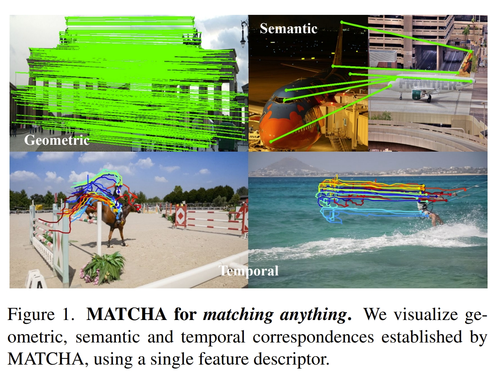
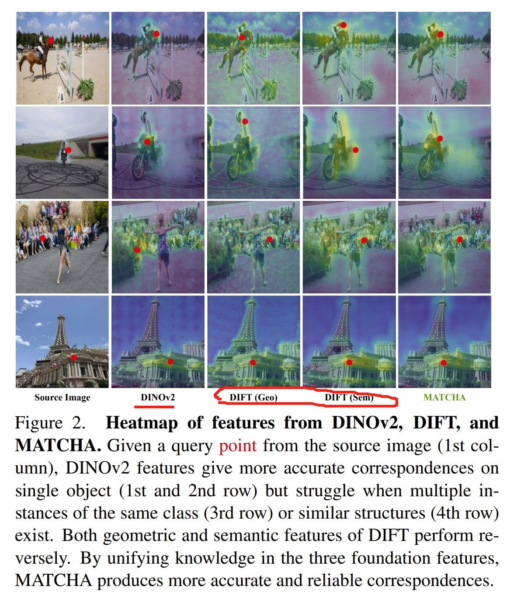
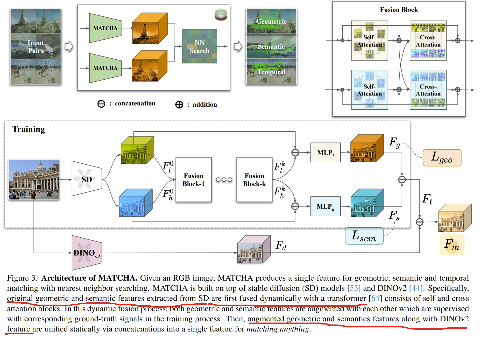
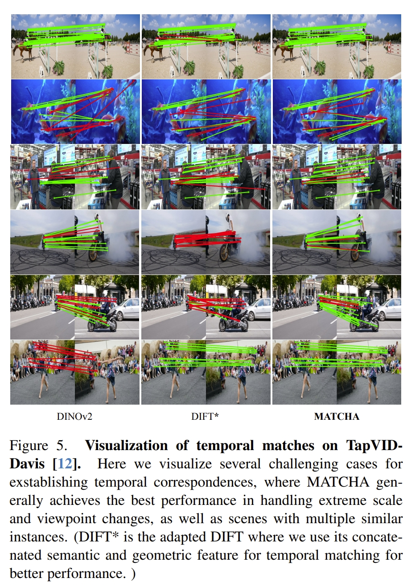
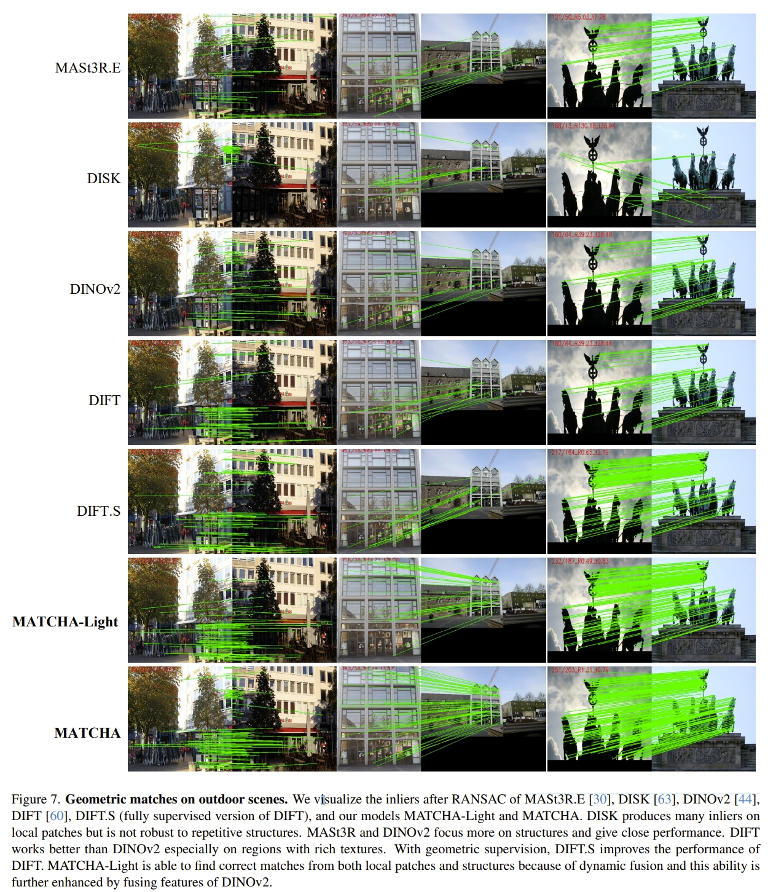
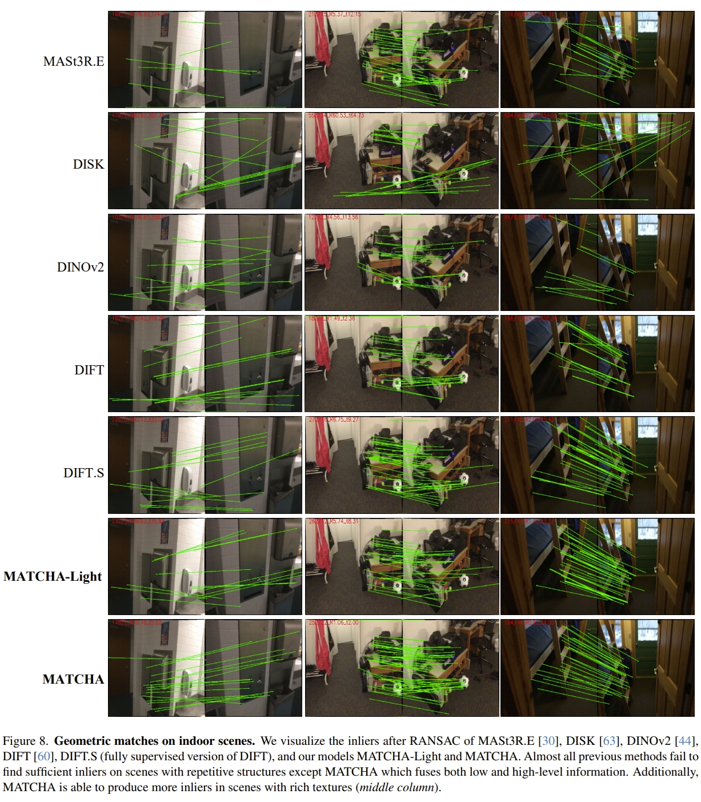
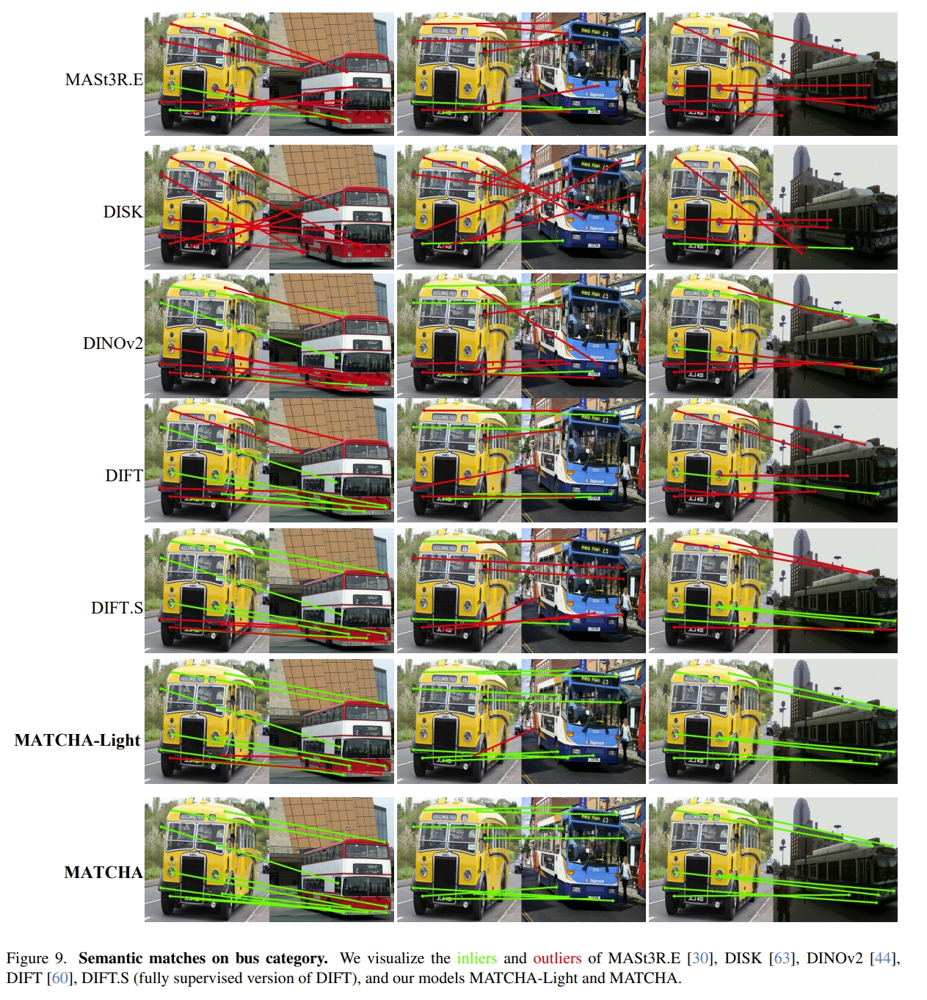
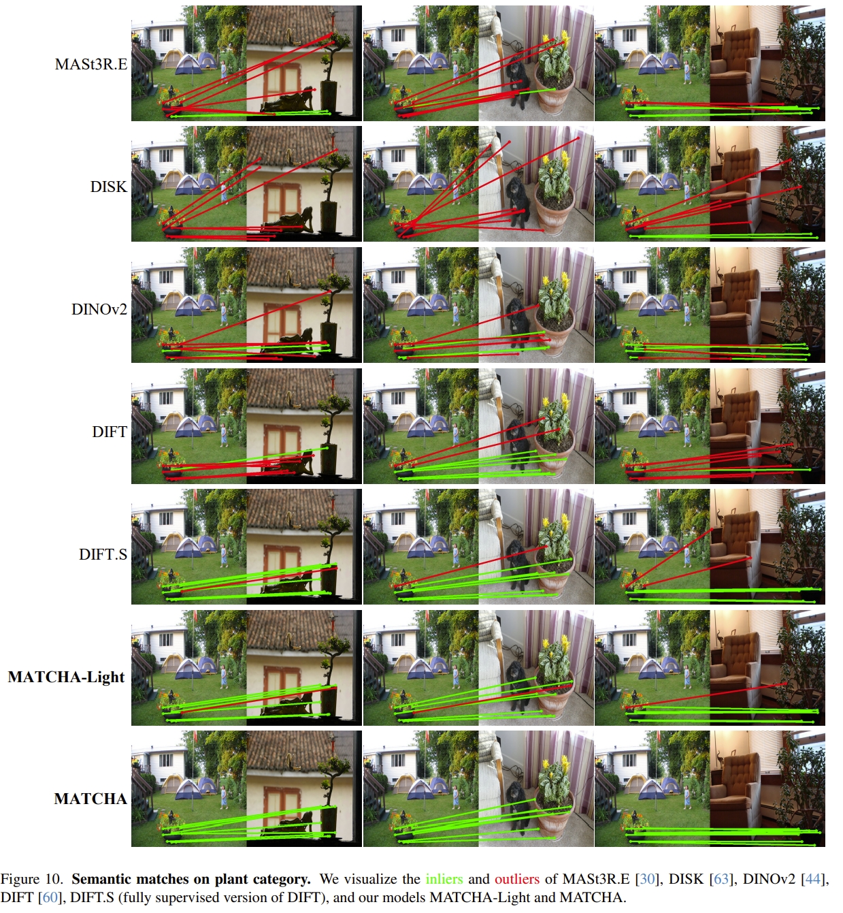

<!-- !!!!!!!!!!!!!!!!!!!!!!!!!!!!!!!!!!!!!!!!!!!!!!!!!!!!!!!!!!!!!!!!!!!!!!!!!!!!!!!!!!!!!!!!!!!!!!!!!!!!!!!!!!!!!!!!!!!!!!!!!!! -->
# 引言
之前博客在对Transformer-based SLAM进行调研的时候，无意中发现竟然还要基于Diffusion的SLAM相关的工作，为此针对其进行调研，看看Diffusion在SLAM、光流、深度估计、数据关联、姿态估计等相关任务上表现如何~

本博文仅供本人学习记录用~

* 目录
{:toc}

其他相关链接：

* [What is Diffusion?](https://kwanwaipang.github.io/Diffusion/)
* Learning-based VO,VIO,IO：[Paper List](https://github.com/KwanWaiPang/Awesome-Learning-based-VO-VIO) 以及[博客](https://kwanwaipang.github.io/Learning-based-VO-VIO/)
* Transformer-based SLAM：[Paper List](https://github.com/KwanWaiPang/Awesome-Transformer-based-SLAM) 以及[博客](https://kwanwaipang.github.io/Transformer_SLAM/)
* NeRF-based SLAM：[博客](https://kwanwaipang.github.io/Awesome-NeRF-SLAM/)
* 3DGS-based SLAM: [博客](https://kwanwaipang.github.io/File/Blogs/Poster/survey_3DGS_SLAM.html)

# Paper List

* 注意，此处非最新版，仅仅是写此博客的时候的记录
* Keep update the paper list in: [Awesome-Diffusion-based-SLAM](https://github.com/KwanWaiPang/Awesome-Diffusion-based-SLAM)

## Matching

or data association, or correspondence

<!-- |---|`arXiv`|---|---|---| -->
<!--  -->

| Year | Venue | Paper Title | Repository | Note |
|:----:|:-----:| ----------- |:----------:|:----:|
|2025|`arXiv`|[MATCHA: Towards Matching Anything](https://arxiv.org/pdf/2501.14945)|---|SD+DINOv2|
|2024|`CVPR`|[Sd4match: Learning to prompt stable diffusion model for semantic matching](https://openaccess.thecvf.com/content/CVPR2024/papers/Li_SD4Match_Learning_to_Prompt_Stable_Diffusion_Model_for_Semantic_Matching_CVPR_2024_paper.pdf)||[website](https://sd4match.active.vision/)|
|2023|`NIPS`|[Emergent correspondence from image diffusion](https://proceedings.neurips.cc/paper_files/paper/2023/file/0503f5dce343a1d06d16ba103dd52db1-Paper-Conference.pdf)||[website](https://diffusionfeatures.github.io/) DIFT|
|2023|`NIPS`|[A tale of two features: Stable diffusion complements dino for zero-shot semantic correspondence](https://proceedings.neurips.cc/paper_files/paper/2023/file/8e9bdc23f169a05ea9b72ccef4574551-Paper-Conference.pdf)||[website](https://sd-complements-dino.github.io/) SD+DINO|
|2023|`NIPS`|[Diffusion hyperfeatures: Searching through time and space for semantic correspondence](https://proceedings.neurips.cc/paper_files/paper/2023/file/942032b61720a3fd64897efe46237c81-Paper-Conference.pdf)||[website](https://diffusion-hyperfeatures.github.io/) DHF|

## Depth Estimation

or 3D reconstruction

<!-- |---|`arXiv`|---|---|---| -->
<!--  -->

| Year | Venue | Paper Title | Repository | Note |
|:----:|:-----:| ----------- |:----------:|:----:|
|2025|`arXiv`|[Bolt3D: Generating 3D Scenes in Seconds](https://arxiv.org/pdf/2503.14445)|---|[website](https://szymanowiczs.github.io/bolt3d)|
|2025|`arXiv`|[Stable Virtual Camera: Generative View Synthesis with Diffusion Models](https://arxiv.org/pdf/2503.14489)| |---|
|2025|`CVPR`|[Difix3D+: Improving 3D Reconstructions with Single-Step Diffusion Models](https://arxiv.org/pdf/2503.01774?)|---|[website](https://research.nvidia.com/labs/toronto-ai/difix3d/)|
|2025|`CVPR`|[Multi-view Reconstruction via SfM-guided Monocular Depth Estimation](https://arxiv.org/pdf/2503.14483)||[website](https://zju3dv.github.io/murre/)|
|2025|`CVPR`|[Align3r: Aligned monocular depth estimation for dynamic videos](https://arxiv.org/pdf/2412.03079)||---|
|2024|`ECCV`|[Diffusiondepth: Diffusion denoising approach for monocular depth estimation](https://arxiv.org/pdf/2303.05021)||[website](https://igl-hkust.github.io/Align3R.github.io/)|
|2023|`NIPS`|[The surprising effectiveness of diffusion models for optical flow and monocular depth estimation](https://proceedings.neurips.cc/paper_files/paper/2023/file/7c119415672ae2186e17d492e1d5da2f-Paper-Conference.pdf)|---|[website](https://diffusion-vision.github.io/)|
|2023|`arXiv`|[Monocular depth estimation using diffusion models](https://arxiv.org/pdf/2302.14816)|---|[website](https://depth-gen.github.io/)| 

## Pose Estimation

<!-- |---|`arXiv`|---|---|---| -->
<!--  -->

| Year | Venue | Paper Title | Repository | Note |
|:----:|:-----:| ----------- |:----------:|:----:|
|2023|`ICCV`|[Posediffusion: Solving pose estimation via diffusion-aided bundle adjustment](https://openaccess.thecvf.com/content/ICCV2023/papers/Wang_PoseDiffusion_Solving_Pose_Estimation_via_Diffusion-aided_Bundle_Adjustment_ICCV_2023_paper.pdf)||[website](https://posediffusion.github.io/)|

* Some basic paper for Diffusion Model

<!-- |---|`arXiv`|---|---|---| -->
<!--  -->

| Year | Venue | Paper Title | Repository | Note |
|:----:|:-----:| ----------- |:----------:|:----:|
|2022|`CVPR`|[High-resolution image synthesis with latent diffusion models](https://openaccess.thecvf.com/content/CVPR2022/papers/Rombach_High-Resolution_Image_Synthesis_With_Latent_Diffusion_Models_CVPR_2022_paper.pdf)||stable diffusion|
|2021|`NIPS`|[Diffusion models beat gans on image synthesis](https://proceedings.neurips.cc/paper_files/paper/2021/file/49ad23d1ec9fa4bd8d77d02681df5cfa-Paper.pdf)|---|---|
|2020|`ICLR`|[Denoising diffusion implicit models](https://arxiv.org/pdf/2010.02502)|---|DDIM|
|2020|`NIPS`|[Denoising diffusion probabilistic models](https://proceedings.neurips.cc/paper/2020/file/4c5bcfec8584af0d967f1ab10179ca4b-Paper.pdf)||DDPM|

# Paper Reading
接下来重点阅读几篇论文

## MATCHA: Towards Matching Anything

建立于insights:`diffusion model features can encode multiple correspondence types`,作者提出基于diffusion model 的MATCHA，并进一步通过基于注意力的动态融合高级语义和低级几何特征，进而获取具有代表性的、通用的以及强鲁棒性的特征。

这里所谓的特征匹配包括了几何( geometric)、语义(semantic)、时间（temporal）等多个维度的特征匹配，也就是同一个框架,只需要学习单个特征的描述子即可完成这三个任务下的特征匹配

  
<figcaption>  
</figcaption>

MATCHA整合了来自于DINO V2(《[Dinov2: Learning robust visual features without supervision](https://arxiv.org/pdf/2304.07193)》)的特征来进一步增强泛化能力。
关于这点，应该是由于缺乏来自语义以及几何的足够的真实数据，因此作者直接用了预训练的transformer模型来增强泛化能力。如下图所示

  
<figcaption>  
</figcaption>

DINO V2提供的应该是 semantic knowledge, DIFT提供的semantic和geometric信息，在图例上具有互补性，而MATCHA则是利用了这三种基本的特征来提供更可靠的特征匹配。

其框架如下图所示。首先通过stable diffusion来分别提取语义以及几何特征，并通过transformer来融合一起，再通过对应的真值来分别训练。
然后把来自于DINOv2的特征与stable diffusion的语义及几何特征concatenate到一起，作为matching anything的特征.
说实话，这个框架感觉有点大力出奇迹的意味，stable diffusion+transformer+DINOv2全部柔到一块,而其中的`stable diffusion+transformer`则是DIFT，因此算是DIFT+DINOv2

  
<figcaption>  
</figcaption>

下面看看实验效果

  
<figcaption>  
</figcaption>

红色应该是误匹配的，但是哪怕是六张图，感觉上也就只有两张MATCHA没有误匹配，其他对比效果个人觉得不太明显。毕竟考虑到是把前两者融合到一起的大模型😂

当然，作者也有跟MASt3R等SOTA对比的几何、语义、跟踪等匹配的效果（太多了，就随机列出一些，更多的请见原文~）。
下图的结果都是RANSAC输出的inliers

  <table style="border: none; background-color: transparent;">
    <tr align="center">
      <td style="width: 50%; border: none; padding: 0.01; background-color: transparent; vertical-align: middle;">
        
      </td>
      <td style="width: 50%; border: none; padding: 0.01; background-color: transparent; vertical-align: middle;">
        
      </td>
    </tr>
  </table>
  <figcaption>
  </figcaption>

语义匹配的效果

  <table style="border: none; background-color: transparent;">
    <tr align="center">
      <td style="width: 50%; border: none; padding: 0.01; background-color: transparent; vertical-align: middle;">
        
      </td>
      <td style="width: 50%; border: none; padding: 0.01; background-color: transparent; vertical-align: middle;">
        
      </td>
    </tr>
  </table>
  <figcaption>
  </figcaption>

## Emergent correspondence from image diffusion

这篇论文就是DIFT，也就是利用diffusion来获取图像之间的correspondence，同样地，也是针对semantic, geometric, 和 temporal数据关联