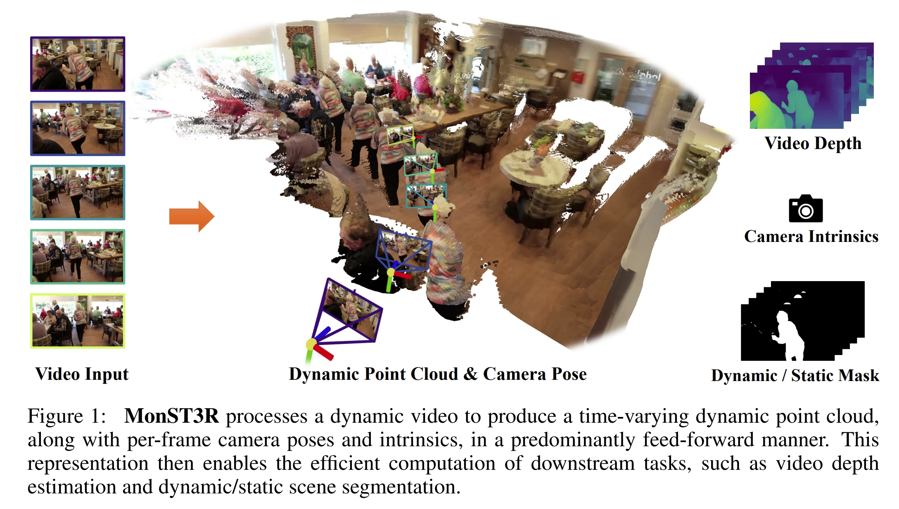
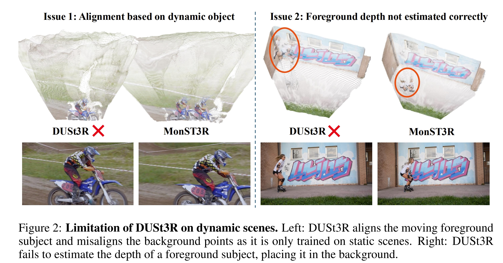
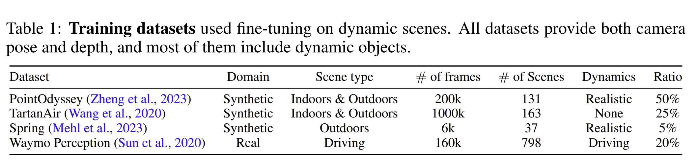
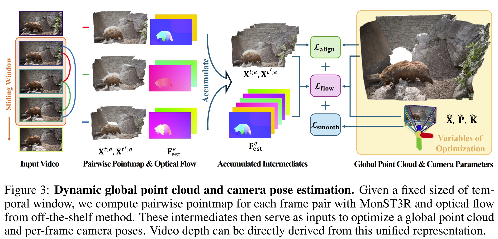
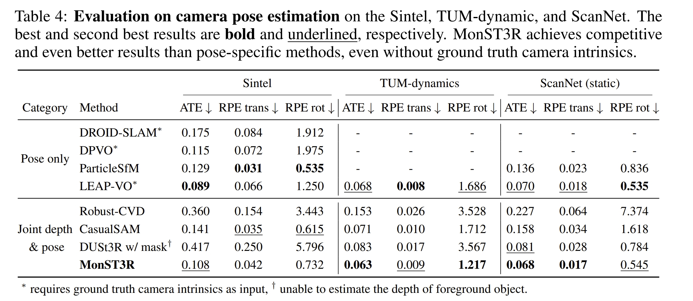

<!-- * 目录
{:toc} -->


<!-- !!!!!!!!!!!!!!!!!!!!!!!!!!!!!!!!!!!!!!!!!!!!!!!!!!!!!!!!!!!!!!!!!!!!!!!!!!!!!!!!!!!!!!!!!!!!!!!!!!!!!!!!!!!!!!!!!!!!!!!!!!! -->
# 引言
DUSt3R具有非常强大的性能，但是还是针对静态场景的。而在ICLR2025上新出的Motion DUSt3R (MonST3R)则是从动态场景中直接估计每个时间下的几何信息。进而实现对动态场景的建模~

为此，写下本博文记录阅读及测试过程，本博文仅供本人学习记录用~

相关的资料：
* [paper](https://arxiv.org/pdf/2410.03825)
* [Github](https://github.com/Junyi42/monst3r)
* 本博客采用的代码及注释（如有）均在[Github Link](https://github.com/KwanWaiPang/monst3r)
* Survey for Transformer-based SLAM：[Paper List](https://github.com/KwanWaiPang/Awesome-Transformer-based-SLAM) and [Blog](https://kwanwaipang.github.io/Transformer_SLAM/)
* 博客：[What is Transformer? Form NLP to CV](https://kwanwaipang.github.io/Transformer/)


<!-- !!!!!!!!!!!!!!!!!!!!!!!!!!!!!!!!!!!!!!!!!!!!!!!!!!!!!!!!!!!!!!!!!!!!!!!!!!!!!!!!!!!!!!!!!!!!!!!!!!!!!!!!!!!!!!!!!!!!!!!!!!! -->

# 理论解读
本文关键的insight则是将每个timestep下的pointmap估算出来（这样可以直接用DUSt3R的框架），进而实现动态场景的建模。
但是由于动态场景的数据并不好获取，因此，作者采用的是 fine-tuning 的形式，那么原始DUSt3R的网络权重也可以复用。
此外，动态场景也并不多，但是作者还是找到了几个small-scale的数据集可以让网络finetune一下即可使用。

如下图所示，本文所指的从dynamic场景中估算的pointmap，则是根据物体的移动把动态物体的点云也在上面显示出来。而静态部分的场景则需要实现Multi-frame alignment~
<div align="center">
  
<figcaption>  
</figcaption>
</div>

下图则是展示了MonST3R与DUSt3R在动态场景下的对比效果。可以看到首先由于训练数据中缺乏动态场景，因此DUSt3R是没有办法align运动物体的pointmap的。同时由于运动物体的存在也会影响到静态背景的align。当然作者在论文也提到，这一缺陷是因为数据domain 的mismatch，所以在实际MonST3R中还是需要对DUSt3R的权重进行fine-tune

<div align="center">
  
<figcaption>  
</figcaption>
</div>

采用的模型的结构跟DUSt3R是一样的。主要不一样的点只是对于每个pointmap，MonST3R都是refer to时间的一个点。而采用的带有动态物体的数据集则是如下四个：

<div align="center">
  
  
<figcaption>  
</figcaption>
</div>
对于finetune过程中，首先只finetune perediction head以及decoder，而网络的encoder是固定不变的。

此外，额外加了模块来估算光流（off-the-shelf method），这一可以很好的把动态与静态物体分离出来。而对于多个视角下的全局优化都是采用DUSt3R的全局alignment的模块来做的，只是分别构建三个loss（针对光流、相机姿态的平衡、以及全局对齐）进而实现动态场景下全局pointmap的构建。

作者用TUM-dymanic数据集来进行测试。可以看到，通过采用运动物体的GT mask，可以将DUSt3R处理数据的运动物体部分给mask掉，但这会导致位姿估计的退化（这应该是由于黑色的区域跟原本DUSt3R的数据分布不一样导致的~）。
<div align="center">
  
<figcaption>  
</figcaption>
</div>


<!-- !!!!!!!!!!!!!!!!!!!!!!!!!!!!!!!!!!!!!!!!!!!!!!!!!!!!!!!!!!!!!!!!!!!!!!!!!!!!!!!!!!!!!!!!!!!!!!!!!!!!!!!!!!!!!!!!!!!!!!!!!!! -->

# 实验测试

## 配置测试

首先安装一系列的依赖项

```bash
git clone --recursive https://github.com/KwanWaiPang/monst3r.git
 
# rm -rf .git

conda create -n monst3r python=3.11 cmake=3.14.0
conda activate monst3r 
# conda remove --name monst3r --all

#A100用的就是CUDA12.2，应该是可以兼容的
pip install torch==2.5.0 torchvision==0.20.0 torchaudio==2.5.0 --index-url https://download.pytorch.org/whl/cu121
# conda install pytorch torchvision pytorch-cuda=12.1 -c pytorch -c nvidia  # use the correct version of cuda for your system
pip install -r requirements.txt

# 额外单独安装
# pip install -e third_party/sam2
cd /home/gwp/monst3r/third_party/sam2
# 清理之前的构建缓存
rm -rf build/ dist/ *.egg-info/
python setup.py build_ext --inplace
python setup.py install --user

# 可视化相关依赖，
pip install -r requirements_optional.txt

# 额外单独安装
pip install waymo-open-dataset-tf-2-12-0 --no-deps

```

然后安装4d的可视化工具

```bash
pip install -e viser
```

安装RoPE 的cuda kernal

```bash
# DUST3R relies on RoPE positional embeddings for which you can compile some cuda kernels for faster runtime.
cd croco/models/curope/
python setup.py build_ext --inplace
cd ../../../
```

然后下载MonST3R，光流及语义三个模型的权重

```bash
# pip install gdown 
# gdown https://drive.google.com/uc?id=标识符
# conda activate monst3r
# gdown https://drive.google.com/uc?id=1Z1jO_JmfZj0z3bgMvCwqfUhyZ1bIbc9E

# download the weights
cd data
bash download_ckpt.sh
cd ..
```

下载数据集

```bash
cd data; python download_davis.py; cd ..
```

不过项目本身给了lady-running数据，下面先以其为例

```bash
python demo.py # launch GUI, input can be a folder or a video
# use memory efficient optimization: --not_batchify

# 用MobaXterm 来可视化
conda activate monst3r 
CUDA_VISIBLE_DEVICES=3 python demo.py --input demo_data/lady-running --output_dir demo_tmp --seq_name lady-running
# use video as input: --input demo_data/lady-running.mp4 --num_frames 65
# (update 12/15) use memory efficient optimization: --not_batchify
# (update 1/20) use real-time mode: --real_time
```

* 结果会存放在demo_tmp路径下。`The results will be saved in the demo_tmp/{Sequence Name} (by default is demo_tmp/NULL) folder for future visualization.`
* 推理的结果似乎很久，并且很容易out of memory

输入序列

<div align="center">
<video playsinline autoplay loop muted src="https://kwanwaipang.github.io/ubuntu_md_blog/MonST3R/lady-running.mp4" poster="https://kwanwaipang.github.io/File/Representative_works/loading-icon.gif" alt="sym" width="80%" style="padding-top:0px;padding-bottom:0px;border-radius:15px;"></video>
</div>

估算出来的深度结果如下图所示

<div align="center">
  
<figcaption>  
</figcaption>
</div>


可视化4D结果，在vscode下运行即可打开浏览器~

```bash
python viser/visualizer_monst3r.py --data demo_tmp/lady-running
# to remove the floaters of foreground: --init_conf --fg_conf_thre 1.0 (thre can be adjusted)

# 下面是实时可视化(但是似乎运行不成功，难道是实测的时候用的？)
# (update 1/20) for results generated by real-time mode, please (update viser and) using the following command: 
python viser/visualizer_monst3r_realtime.py --data-path demo_tmp/lady-running
```

<div id="wrapper" style="
        display: flex;
        flex-wrap: wrap;
        justify-content: center;
        align-items: center;
        gap: 2em;
      ">
<iframe
      src="https://github.com/KwanWaiPang/monst3r/raw/main/viser_result/recording_lady-running.viser&initDistanceScale=1&initHeightOffset=0.0"></iframe>
</div>


接下来验证其他序列看看效果

```bash
CUDA_VISIBLE_DEVICES=3 python demo.py --input data/davis_videos/breakdance.mp4 --output_dir demo_tmp --seq_name breakdance
python viser/visualizer_monst3r.py --data demo_tmp/breakdance


CUDA_VISIBLE_DEVICES=3 python demo.py --input data/davis_videos/judo.mp4 --output_dir demo_tmp --seq_name breakdance
python viser/visualizer_monst3r.py --data demo_tmp/judo
```

<div align="center">
  <table style="border: none; background-color: transparent;">
    <tr align="center">
      <td style="width: 50%; border: none; padding: 0.01; background-color: transparent; vertical-align: middle;">
        
        breakdance
      </td>
      <td style="width: 50%; border: none; padding: 0.01; background-color: transparent; vertical-align: middle;">
        
        judo
      </td>
    </tr>
  </table>
  <figcaption>
  </figcaption>
</div>

