<!-- !!!!!!!!!!!!!!!!!!!!!!!!!!!!!!!!!!!!!!!!!!!!!!!!!!!!!!!!!!!!!!!!!!!!!!!!!!!!!!!!!!!!!!!!!!!!!!!!!!!!!!!!!!!!!!!!!!!!!!!!!!! -->
# 引言
本博文为本人针对基于人形机械狗等足式机器人的SLAM进行技术洞察的记录

本技术洞察从3DSLAM到基于足式机器人的SLAM，以求给与相关领域开发者启发,由于笔者水平有限，不足之处，敬请谅解。

<!-- 本博文仅供本人学习记录用~ -->

* 目录
{:toc}

# Paper List

* 注意，此处非最新版，仅仅是写此博客的时候的记录
* Keep update the paper list in: [Awesome-Humanoid-Robot-Localization-and-Mapping](https://github.com/KwanWaiPang/Awesome-Humanoid-Robot-Localization-and-Mapping)

<!-- |---|`arXiv`|---|---|---| -->
<!--  -->

| Year | Venue | Paper Title | Repository | Note |
|:----:|:-----:| ----------- |:----------:|:----:|
|2025|`IEEE Signal Processing Letters`|[A 3D reconstruction and relocalization method for humanoid welding robots](https://github.com/KwanWaiPang/Awesome-Humanoid-Robot-Localization-and-Mapping/blob/pdf/A_3D_Reconstruction_and_Relocalization_Method_for_Humanoid_Welding_Robots.pdf)|---|---|
|2024|`RAL`|[Leg-KILO: Robust Kinematic-Inertial-Lidar Odometry for Dynamic Legged Robots](https://github.com/KwanWaiPang/Awesome-Humanoid-Robot-Localization-and-Mapping/blob/pdf/Leg-KILO%20Robust%20Kinematic-Inertial-Lidar%20Odometry%20for%20Dynamic%20Legged%20Robots.pdf)||[dataset](https://github.com/ouguangjun/legkilo-dataset)|
|2023|`ICRA`|[Visual-inertial and leg odometry fusion for dynamic locomotion](https://arxiv.org/pdf/2210.02127)|---|---| 
|2023|`ICRA`|[Cerberus: Low-drift visual-inertial-leg odometry for agile locomotion](https://arxiv.org/pdf/2209.07654)||---|
|2023|`RAL`|[Tunable impact and vibration absorbing neck for robust visual-inertial state estimation for dynamic legged robots](https://ieeexplore.ieee.org/stamp/stamp.jsp?arnumber=10027207)|---|---|
|2023|`International Conference on Robotics and Mechatronics`|[Comparative evaluation of rgb-d slam methods for humanoid robot localization and mapping](https://arxiv.org/pdf/2401.02816)|---|---|
|2023|`TASE`|[Humanoid loco-manipulations using combined fast dense 3D tracking and SLAM with wide-angle depth-images](https://hal.science/hal-04125159v1/file/2023_TASE_Chappellet.pdf)|---|---|
|2022|`TRO`|[Vilens: Visual, inertial, lidar, and leg odometry for all-terrain legged robots](https://arxiv.org/pdf/2107.07243)|---|---|
|2022|`RAL`|[Step: State estimator for legged robots using a preintegrated foot velocity factor](https://arxiv.org/pdf/2202.05572)|---|---|
|2021|`RAL`|[Online Object Searching by a Humanoid Robot in an Unknown Environment](https://github.com/KwanWaiPang/Awesome-Humanoid-Robot-Localization-and-Mapping/blob/pdf/2021_RAL_Tsuru.pdf)|---|---|
|2020|`ICRA`|[Preintegrated velocity bias estimation to overcome contact nonlinearities in legged robot odometry](https://arxiv.org/pdf/1910.09875)|---|---|
|2020|`IJRR`|[Contact-aided invariant extended Kalman filtering for robot state estimation](https://journals.sagepub.com/doi/pdf/10.1177/0278364919894385?casa_token=uQLkhLPMngkAAAAA:8BFM9dE1oo8qr_iiOXpZyhTf0-plTFQs2tbRezy_Njqb6aiuCykDYh4Odds7pEGOa1_2RuuefeHduKY)|---|---| 
|2019|`RAL`|[Robust legged robot state estimation using factor graph optimization](https://arxiv.org/pdf/1904.03048)|---|---|
|2018|`Mechatronics`|[Novel lightweight odometric learning method for humanoid robot localization](https://github.com/KwanWaiPang/Awesome-Humanoid-Robot-Localization-and-Mapping/blob/pdf/1-s2.0-S0957415818301338-main.pdf)|---|---|
|2018|`IROS`|[Mit cheetah 3: Design and control of a robust, dynamic quadruped robot](https://dspace.mit.edu/bitstream/handle/1721.1/126619/iros.pdf?sequence=2)|---|---|
|2017|`Intelligent Service Robotics`|[A closed-loop approach for tracking a humanoid robot using particle filtering and depth data](https://upcommons.upc.edu/bitstream/handle/2117/107765/ISR2016v2-CR-submitted.pdf?sequence=1)|---|---| 
|2016|`IJRR`|[Real-time pose estimation of a dynamic quadruped in GPS-denied environments for 24-hour operation](https://journals.sagepub.com/doi/pdf/10.1177/0278364915587333?casa_token=yLMhh0p_DsoAAAAA:28GnrhizmgotGH4q0DjWKNXJnA4lb-21GdjpeXJDKsDSdDjJg_FPlt9vHaH_XOC4rYfCKER32UXaoAY)|---|---| 
|2016|`IROS`|[Achievement of localization system for humanoid robots with virtual horizontal scan relative to improved odometry fusing internal sensors and visual information](https://github.com/KwanWaiPang/Awesome-Humanoid-Robot-Localization-and-Mapping/blob/pdf/Achievement_of_localization_system_for_humanoid_robots_with_virtual_horizontal_scan_relative_to_improved_odometry_fusing_internal_sensors_and_visual_information.pdf)|---|---|
|2016|`Autonomous Robots`|[Humanoid odometric localization integrating kinematic, inertial and visual information](https://iris.uniroma1.it/bitstream/11573/796335/6/796335.pdf)|---|---|
|2016|`IEEE/SICE International Symposium on System Integration`|[Closed-loop RGB-D SLAM multi-contact control for humanoid robots](https://hal.science/hal-01568048v1/file/iis2016.pdf)|---|---|
|2016|`ICRA`|[Learning the odometry on a small humanoid robot](https://www.researchgate.net/profile/Steve-Nguyen-2/publication/303885984_Learning_the_odometry_on_a_small_humanoid_robot/links/59e0f7af0f7e9b97fbe1382f/Learning-the-odometry-on-a-small-humanoid-robot.pdf)||---|
|2015|`Advanced Robotics`|[Dead reckoning for biped robots that suffers less from foot contact condition based on anchoring pivot estimation](https://www.tandfonline.com/doi/pdf/10.1080/01691864.2015.1011694)|---|---|
|2014|`IEEE-RAS International Conference on Humanoid Robots`|[Drift-free humanoid state estimation fusing kinematic, inertial and lidar sensing](https://www.pure.ed.ac.uk/ws/portalfiles/portal/18903340/14_fallon_humanoids.pdf)|---|---|
|2013|`IROS`|[State estimation for legged robots on unstable and slippery terrain](https://www.research-collection.ethz.ch/bitstream/handle/20.500.11850/75852/eth-7743-01.pdf)|---|---|
|2013|`Robotics`|[State estimation for legged robots-consistent fusion of leg kinematics and IMU](https://infoscience.epfl.ch/server/api/core/bitstreams/bb6c046d-6633-4c8c-8a5f-f8729667c6b6/content)|---|---|
|2012|`IEEE-RAS International Conference on Humanoid Robots`|[Vision-based odometric localization for humanoids using a kinematic EKF](http://www.diag.uniroma1.it/~labrob/pub/papers/Humanoids2012.pdf)|---|---| 
|2010|`IEEE/RSJ International Conference on Intelligent Robots and Systems`|[Humanoid robot localization in complex indoor environments](http://www2.informatik.uni-freiburg.de/~wurm/papers/hornung10iros.pdf)|---|---|
|2009|`IEEE-RAS International Conference on Humanoid Robots`|[3D grid and particle based SLAM for a humanoid robot]()|---|---|
|2008|`IEEE-RAS International Conference on Humanoid Robots`|[Autonomous humanoid navigation using laser and odometry data](https://d1wqtxts1xzle7.cloudfront.net/84814066/navigation2008-libre.pdf?1650840576=&response-content-disposition=inline%3B+filename%3DAutonomous_humanoid_navigation_using_las.pdf&Expires=1742998314&Signature=PhG-Jac79p3DdteQuhFeKYbJZhHd01wTVhFGRVwaI3-4XHejDUzPm1bwtv6fHNIMK~ePhalBmacKGeJgh7nMPlNQ44VsY2JojP0dEdnwtdbgpL3JDl6I5gzMRpNDPmwxUQTo8gzIMYpZx5WVccgNizHM7bu0gk1oHP8Zz~Nq5JOwgKim1dI77wvu2pQeVWxv9TyFr0BjXus4p23lx3gA6PLtRqddiwJJ0Sd1plMa-EVRpc3KtvbFdIRgUBtRnm8y37TeAw6PtwWpQ~-4ODqrpEC5M-4Ys1Y9ACnaRU6YVolOkZRYdG~MguXeB8Bg1ElCJhhqxXH49ZoHwH6XOUMtvA__&Key-Pair-Id=APKAJLOHF5GGSLRBV4ZA)|---|---|
|2006|`IEEE-RAS International Conference on Humanoid Robots`|[Localisation for autonomous humanoid navigation]()|---|---|
|2006|`IEEE/RSJ International Conference on Intelligent Robots and Systems`|[Real-time 3d slam for humanoid robot considering pattern generator information](https://citeseerx.ist.psu.edu/document?repid=rep1&type=pdf&doi=8f13256fa676153aafccad3e32dabbfec1fce32a)|---|---|
|2005|`IEEE-RAS International Conference on Humanoid Robots`|[Humanoid robot localisation using stereo vision]()|---|---|

# Related Resource
* Survey for Learning-based VO,VIO,IO：[Paper List](https://github.com/KwanWaiPang/Awesome-Learning-based-VO-VIO) and [Blog](https://kwanwaipang.github.io/Learning-based-VO-VIO/)
* Survey for Transformer-based SLAM：[Paper List](https://github.com/KwanWaiPang/Awesome-Transformer-based-SLAM) and [Blog](https://kwanwaipang.github.io/Transformer_SLAM/)
* Survey for Diffusion-based SLAM：[Paper List](https://github.com/KwanWaiPang/Awesome-Diffusion-based-SLAM) and [Blog](https://kwanwaipang.github.io/Diffusion_SLAM/)
* Survey for NeRF-based SLAM：[Blog](https://kwanwaipang.github.io/Awesome-NeRF-SLAM/)
* Survey for 3DGS-based SLAM: [Blog](https://kwanwaipang.github.io/File/Blogs/Poster/survey_3DGS_SLAM.html)
* Survey for Deep IMU-Bias Inference [Blog](https://kwanwaipang.github.io/Deep-IMU-Bias/)
* [Paper Survey for Degeneracy for LiDAR-based SLAM](https://kwanwaipang.github.io/Lidar_Degeneracy/)
* [Reproduction and Learning of LOAM Series](https://blog.csdn.net/gwplovekimi/article/details/119711762?spm=1001.2014.3001.5502)
* [Awesome-LiDAR-Visual-SLAM](https://github.com/sjtuyinjie/awesome-LiDAR-Visual-SLAM)
* [Awesome-LiDAR-Camera-Calibration](https://github.com/Deephome/Awesome-LiDAR-Camera-Calibration)
* Overview of Humanoid Robots and 3D SLAM Works (in the PPT)：

<!-- |---|`arXiv`|---|---|---| -->
<!--  -->

| Year | Venue | Paper Title | Repository | Note |
|:----:|:-----:| ----------- |:----------:|:----:|
|2025|`arXiv`|[Humanoid locomotion and manipulation: Current progress and challenges in control, planning, and learning](https://arxiv.org/pdf/2501.02116)|---|---|
|2024|`IEEE/CAA Journal of Automatica Sinica`|[Advancements in humanoid robots: A comprehensive review and future prospects](https://www.ieee-jas.net/article/doi/10.1109/JAS.2023.124140)|---|---|
|2024|`TPAMI`|[R3LIVE++: A Robust, Real-time, Radiance Reconstruction Package with a Tightly-coupled LiDAR-Inertial-Visual State Estimator](https://arxiv.org/pdf/2209.03666)||dataset |
|2023|`IROS`|[Event camera-based visual odometry for dynamic motion tracking of a legged robot using adaptive time surface](https://arxiv.org/pdf/2305.08962)|---|[demo](https://www.youtube.com/watch?v=-5ieQSh0g3M&feature=youtu.be)|
|2022|`ICRA`|[R3LIVE: A Robust, Real-time, RGB-colored, LiDAR-Inertial-Visual tightly-coupled state Estimation and mapping package](https://arxiv.org/pdf/2109.07982)||---|
|2021|`RAL`|[R2LIVE: A Robust, Real-Time, LiDAR-Inertial-Visual Tightly-Coupled State Estimator and Mapping](https://arxiv.org/pdf/2102.12400)||---|
|2024|`TRO`|[FAST-LIVO2: Fast, Direct LiDAR–Inertial–Visual Odometry](https://arxiv.org/pdf/2408.14035)||---|
|2022|`IROS`|[Fast-livo: Fast and tightly-coupled sparse-direct lidar-inertial-visual odometry](https://arxiv.org/pdf/2203.00893)||---|
|2023|`TRO`|[Immesh: An immediate lidar localization and meshing framework](https://arxiv.org/pdf/2301.05206)||---|
|2023|`Advanced Intelligent Systems`|[Point‐LIO: Robust high‐bandwidth light detection and ranging inertial odometry](https://advanced.onlinelibrary.wiley.com/doi/pdf/10.1002/aisy.202200459)||---|
|2022|`TRO`|[FAST-LIO2: Fast Direct LiDAR-inertial Odometry](https://arxiv.org/pdf/2107.06829)||---| 
|2021|`RAL`|[Fast-lio: A fast, robust lidar-inertial odometry package by tightly-coupled iterated kalman filter](https://arxiv.org/pdf/2010.08196)||---|
|2019|`JFR`|[RTAB‐Map as an open‐source lidar and visual simultaneous localization and mapping library for large‐scale and long‐term online operation](https://arxiv.org/pdf/2403.06341)||---| 
|2019|`ICRA`|[Tightly coupled 3d lidar inertial odometry and mapping](https://arxiv.org/pdf/1904.06993)||LIO-Mapping|
|2018|`IROS`|[Scan context: Egocentric spatial descriptor for place recognition within 3d point cloud map](https://gisbi-kim.github.io/publications/gkim-2018-iros.pdf)||SC-LIO-SAM| 
|2021|`ICRA`|[Lvi-sam: Tightly-coupled lidar-visual-inertial odometry via smoothing and mapping](https://arxiv.org/pdf/2104.10831)||---|
|2020|`IROS`|[Lio-sam: Tightly-coupled lidar inertial odometry via smoothing and mapping](https://arxiv.org/pdf/2007.00258)||---| 
|2018|`IROS`|[Lego-loam: Lightweight and ground-optimized lidar odometry and mapping on variable terrain](https://static.ux5.de/Moving-Object-Detection-with-OpenCV/archiv/learnopencv-master/LeGO-LOAM-ROS2/Shan_Englot_IROS_2018_Preprint.pdf)||---| 
|2020|`ICRA`|[Loam livox: A fast, robust, high-precision LiDAR odometry and mapping package for LiDARs of small FoV](https://arxiv.org/pdf/1909.06700)||---|
|2022|`TRO`|[GVINS: Tightly coupled GNSS–visual–inertial fusion for smooth and consistent state estimation](https://arxiv.org/pdf/2103.07899)||---|
|2019|`arXiv`|[A General Optimization-based Framework for Global Pose Estimation with Multiple Sensors](https://arxiv.org/pdf/1901.03642)||VINS-Fusion|
|2018|`TRO`|[Vins-mono: A robust and versatile monocular visual-inertial state estimator](https://arxiv.org/pdf/1708.03852)| |---|
|2014|`Robotics: Science and systems`|[LOAM: Lidar odometry and mapping in real-time](https://www.ri.cmu.edu/pub_files/2014/7/Ji_LidarMapping_RSS2014_v8.pdf)|---|non-official A-LOAM |

# PPT Demonstration

  <iframe width="100%" height="100%"
    src="***.pdf#toolbar=0&navpanes=0&scrollbar=0" ></iframe>

# Paper Reading

下面对细看的论文进行概述性解读

## Humanoid locomotion and manipulation: Current progress and challenges in control, planning, and learning
首先建议看一下这篇人形机器人相关的综述。对人形机器人领域进行了系统性回顾。

  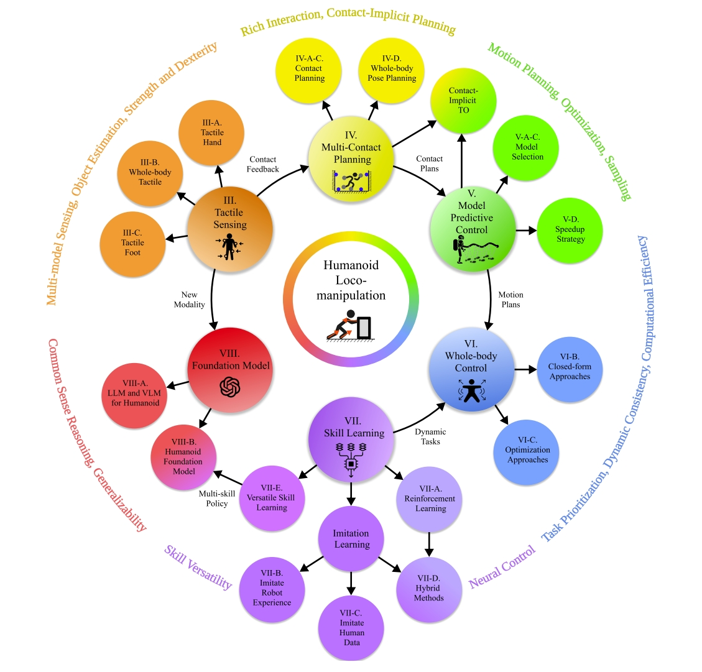
<figcaption>  
</figcaption>

## Advancements in humanoid robots: A comprehensive review and future prospects
这也是一篇综述性论文，其中的`Perception & Interaction`一节对人形机器人相关的感知与交互做了介绍

## Comparative Evaluation of RGB-D SLAM Methods for Humanoid Robot Localization and Mapping
* [参考资料](https://mp.weixin.qq.com/s/-rMezi2-hMNj0jPT0Srv0Q)

本研究通过对比评估了三种RGB-D SLAM算法在SURENA-V人形机器人的定位和地图构建任务中的性能。在定位精度方面，ORB-SLAM3表现最佳，其ATE为0.1073，次之为RTAB-Map（0.1641）和OpenVSLAM（0.1847）。然而，ORB-SLAM3和OpenVSLAM在机器人遇到具有有限特征点的墙壁时存在准确里程计的挑战。OpenVSLAM表现出在机器人接近初始位置时检测循环闭合并成功重新定位的能力。地图制作方面，RTAB-Map通过提供多样化的地图输出（密集地图、OctoMap和占据格地图）领先于ORB-SLAM3和OpenVSLAM，它们仅提供稀疏地图。

这篇论文只是普通的会议论文，只是把三种开源的方法(ORB-SLAM3, RTAB-MAP, OpenVSLAM)在人形平台上测试了一下，也没用结合人形机器人的特点来进行分析，单纯就是三个算法的分析，个人感觉参考价值不大~

  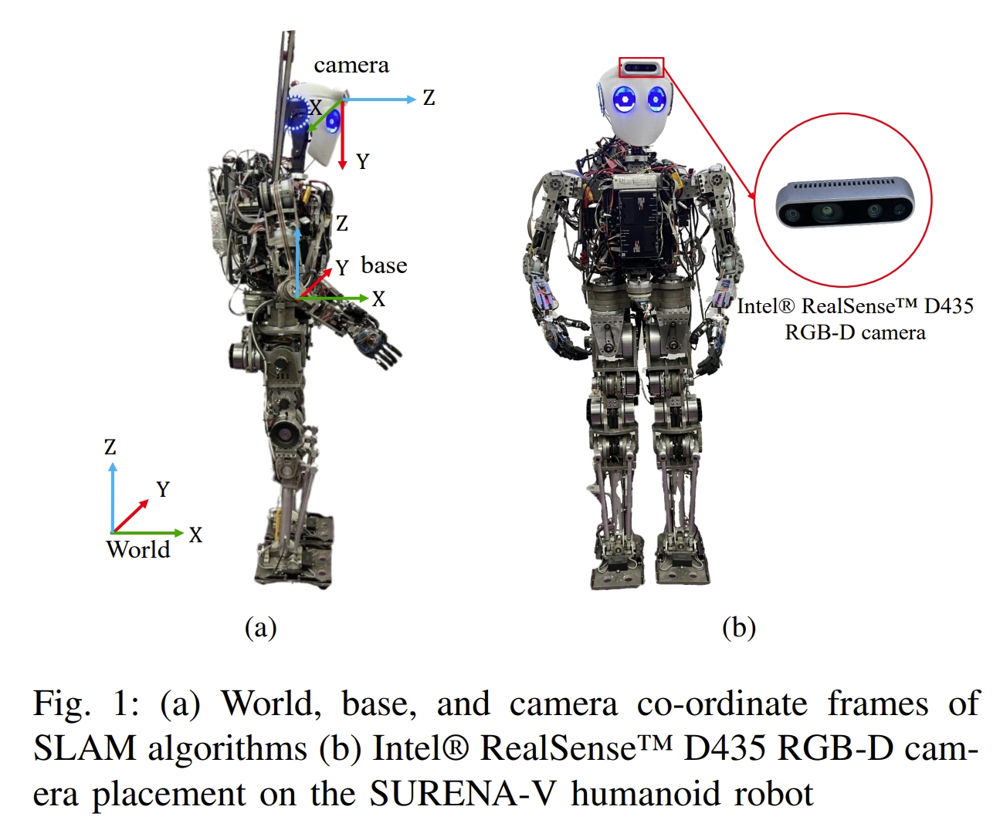
<figcaption>  
</figcaption>

## A 3D Reconstruction and Relocalization Method for Humanoid Welding Robots
本文的关键是给焊接机器人加上一个移动载体以及双臂，同时结合SLAM来进行姿态估计与三维重建。
其架构如下图所示。
通过RGB-D+IMU实现位姿的估计（应该是基于ORB-SLAM3开发的），同时结合深度相机可以获取三维环境信息。基于构建的3D地图，通过点云的匹配额外提供一个重定位的约束来进一步提升精度。
此外，对于3D地图会进行语义分割，并且结合YOLOv10来进行目标识别以此确认作业目标的位置。

  <table style="border: none; background-color: transparent;">
    <tr align="center">
      <td style="width: 50%; border: none; padding: 0.01; background-color: transparent; vertical-align: middle;">
          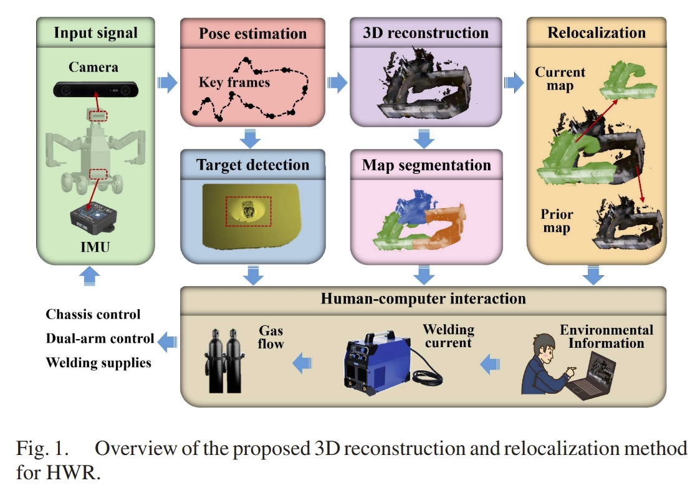
      </td>
      <td style="width: 50%; border: none; padding: 0.01; background-color: transparent; vertical-align: middle;">
        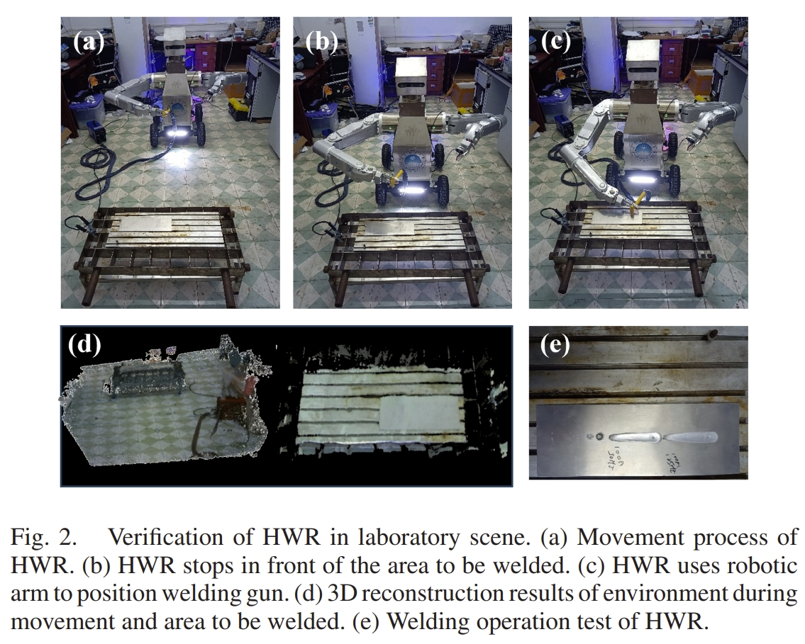
      </td>
    </tr>
  </table>
  <figcaption>
  </figcaption>

## Humanoid loco-manipulations using combined fast dense 3D tracking and SLAM with wide-angle depth-images
本文提出了一个结合基于视觉的跟踪定位作为人形机器人的whole-body 优化控制，看着似乎跟视觉伺服有点类似。
而为了将操作与定位更好的结合，作者提出了一个基于广角深度相机的稠密3D跟踪算法，并且跟SLAM结合起来。进而使得人形机器人可以实现在行走的同时来操作和组装大型的物体。

本文一个基本的insight就是，机器人手持着一个物体行走，那么这个物体对于机器人的视觉系统而言就是outlier，因此要去掉这个outlier，用其他的环境信息来进行定位。此外对于嵌入在人形机器人上的视觉系统而言，将四周的背景环境跟要操控的物体分割开来是非常重要的。

  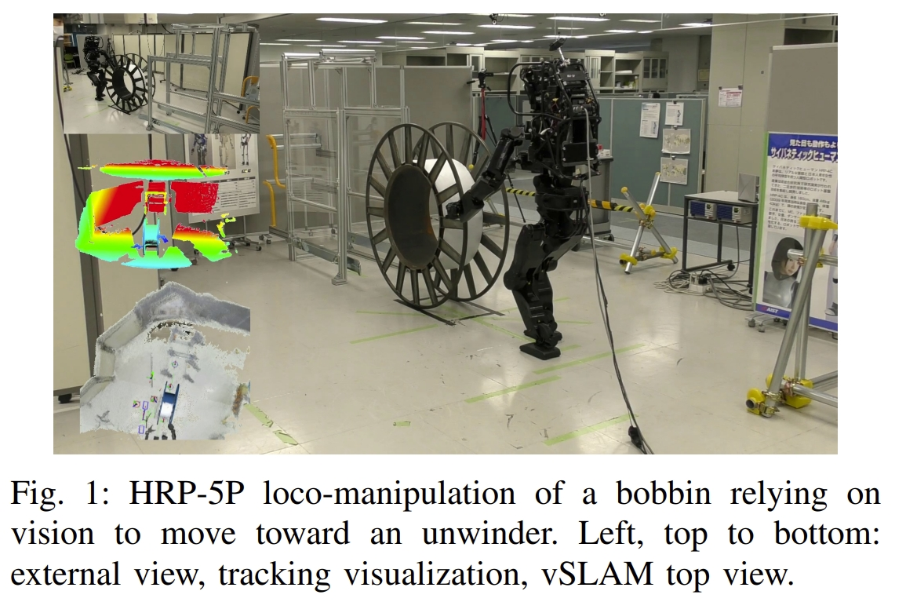
<figcaption>  
</figcaption>

系统的框架如下图所示。所采用的SLAM算法是RTAB-Map，在其基础上添加对于机器人操作物体的跟踪

  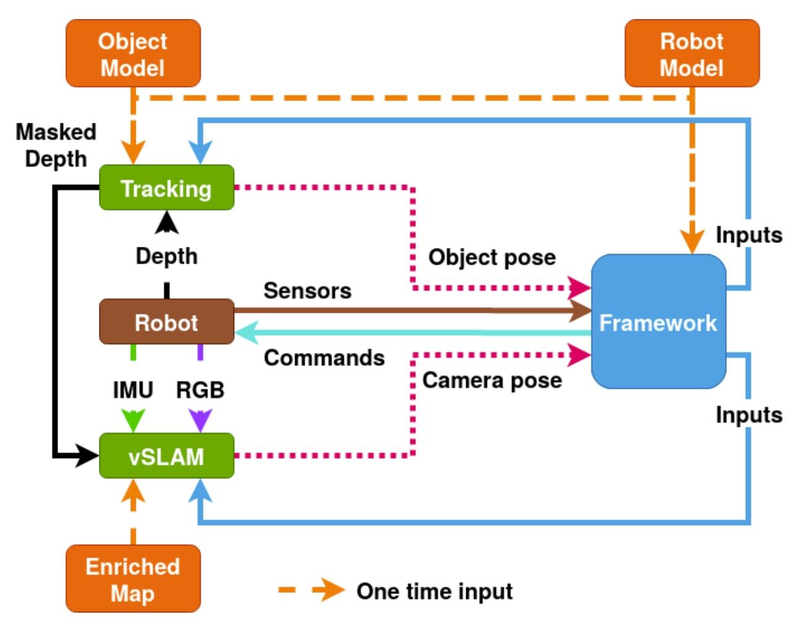
<figcaption>  
</figcaption>

## Novel lightweight odometric learning method for humanoid robot localization
本文提出的就是基于人形机器人的惯性里程计(inertial odometry),不依赖于其他外部的感知，仅仅用IMU，并且采用ANN来进行运动学计算。
采用的网络是最基本的MLP，输入为来自人形机器人上的IMU、里程计、腿式压力等数据，输出直接为全局坐标系下的位置信息。如下图所示：

  <table style="border: none; background-color: transparent;">
    <tr align="center">
      <td style="width: 50%; border: none; padding: 0.01; background-color: transparent; vertical-align: middle;">
        
      </td>
      <td style="width: 50%; border: none; padding: 0.01; background-color: transparent; vertical-align: middle;">
        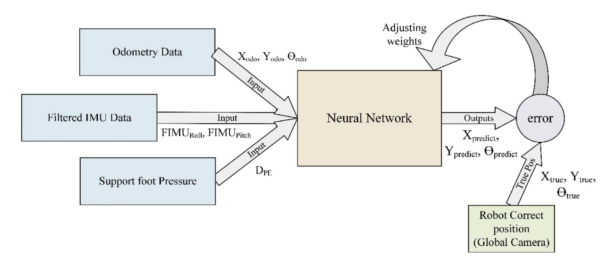
      </td>
    </tr>
  </table>
  <figcaption>
  </figcaption>

从实验的结果来看，所提提出的算法确实要比纯航位推算的精度要高（更加接近真值），但是运动的剧烈并不长，图上的单位是cm

  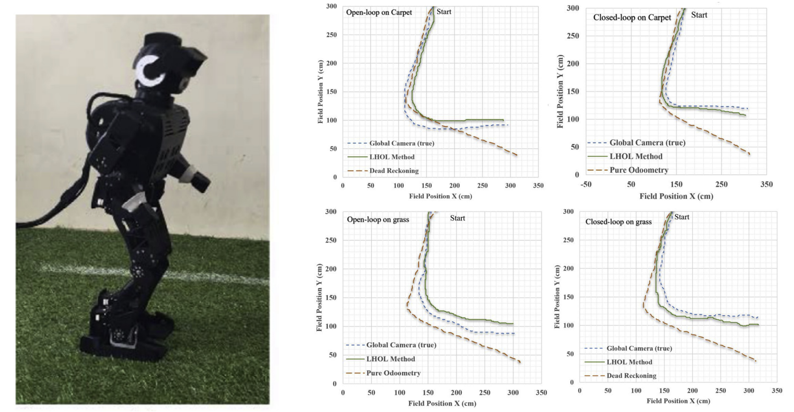
<figcaption>  
</figcaption>

## Achievement of Localization System for Humanoid Robots with Virtual Horizontal Scan Relative to Improved Odometry Fusing Internal Sensors and Visual Information

将视觉里程计、步态发生器的前馈命令以及惯性传感器的方位信息来提升里程计的性能。
进一步地，将该里程计用于从连续激光扫描的累积中生成3D点云，
然后对所获得的3D点云进行适当的切片，以创建高度固定的水平虚拟激光扫描。
而这个虚拟的激光扫描又进一步放到2D SLAM方法(也就是Gmapping)中来实现更高精度的SLAM。
其架构如下图所示：

  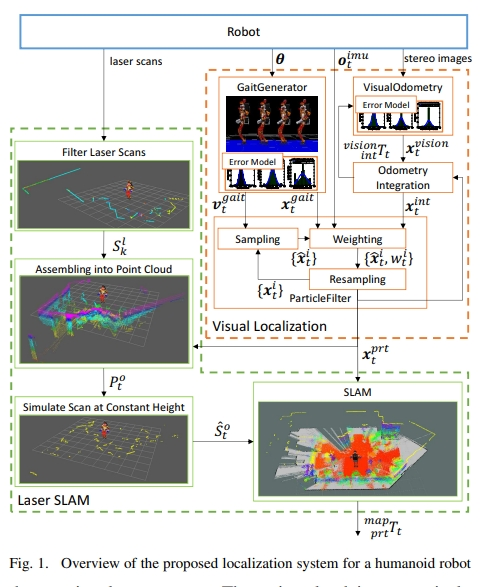
<figcaption>  
</figcaption>

  <table style="border: none; background-color: transparent;">
    <tr align="center">
      <td style="width: 50%; border: none; padding: 0.01; background-color: transparent; vertical-align: middle;">
        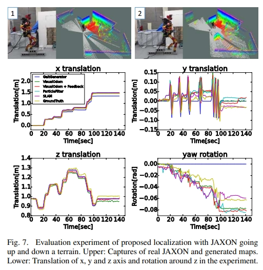
      </td>
      <td style="width: 50%; border: none; padding: 0.01; background-color: transparent; vertical-align: middle;">
        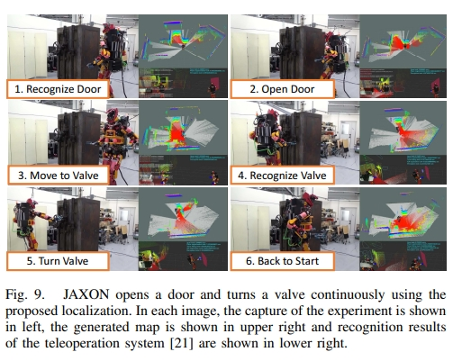
      </td>
    </tr>
  </table>
  <figcaption>
  </figcaption>

## Leg-KILO: Robust Kinematic-Inertial-Lidar Odometry for Dynamic Legged Robots
本文提出基于四足机器人运动学的LIO。
足式机器人上高频的运动(如小跑步态)会引入频繁的脚部撞击，进而导致IMU的退化以及lidar的运动失真。
而直接用IMU观测的数据会容易导致明显的漂移（特别是在Z轴上）。
那么针对这些局限性，本文提出了基于图优化的腿式里程计、雷达里程计以及回环检测三者紧耦合的系统。
* leg odometry：提出了基于on-manifold error-state Kalman filter的运动惯性里程计，通过结合接触高度检测的约束来进一步减少高度方向的波动；
* lidar odometry:设计了一种自适应激光束切片和拼接的方法，以减轻高动态运动的影响；
* loop closure：提出机器人位中心的增量式建图方式来提高地图的维护效率；

系统的框架如下图所示

  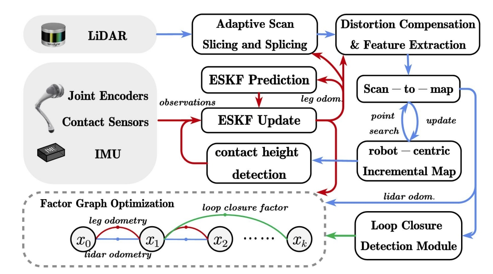
<figcaption>  
</figcaption>

作者跟A-LOAM、Fast-LIO2以及Point-LIO进行了对比，值得一提的是，本文是基于LIO-SAM开发的，而LIO-SAM之前的测试经验是远不如Fast-LIO2以及Point-LIO的，但是在作者改动的框架下却可以超越这两者，可以看出所提出算法应该是有效的~

  
<figcaption>  
</figcaption>

而在下右图的实验中也发现，在平地运动时，baseline方法均有较大的高度变化，而Leg-KILO则是在10cm以内。

  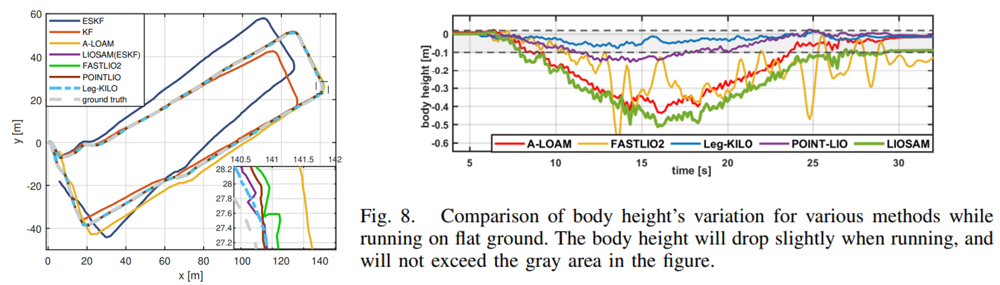
<figcaption>  
</figcaption>

## Online object searching by a humanoid robot in an unknown environment