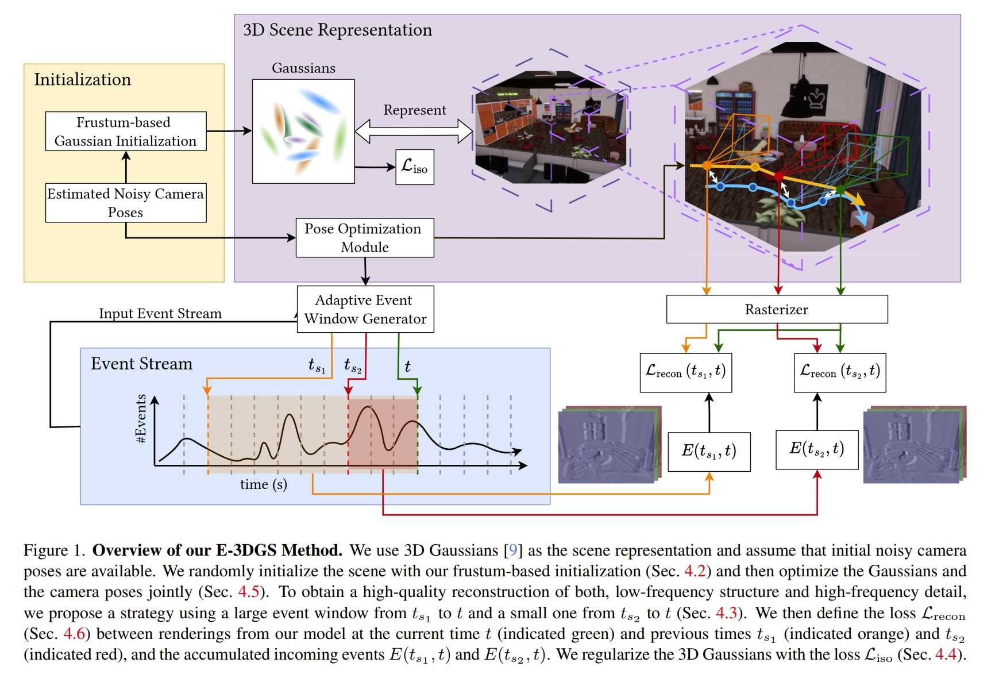
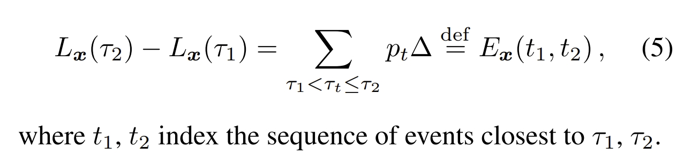
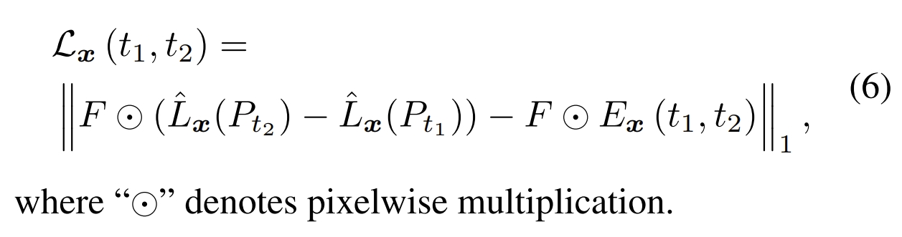
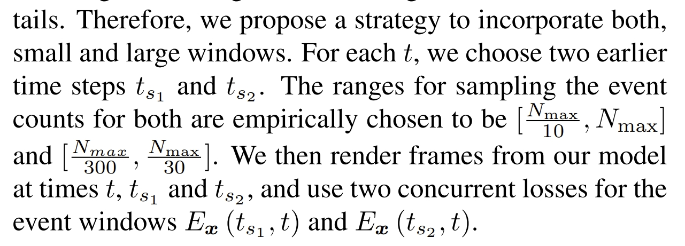
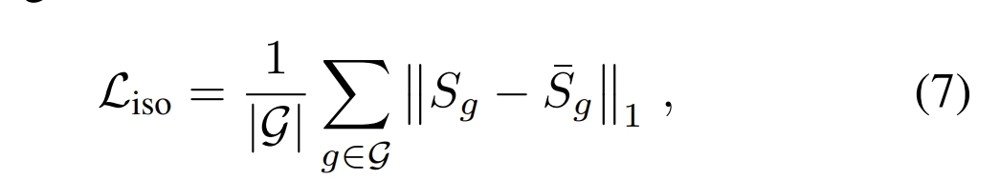
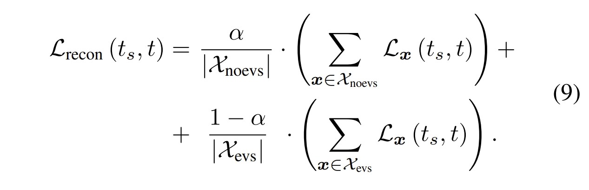
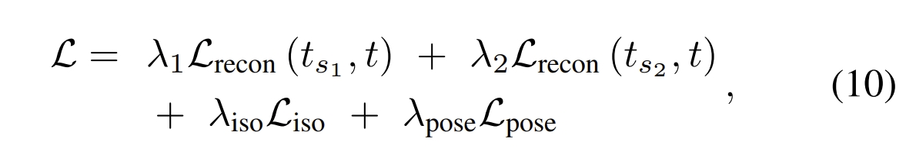
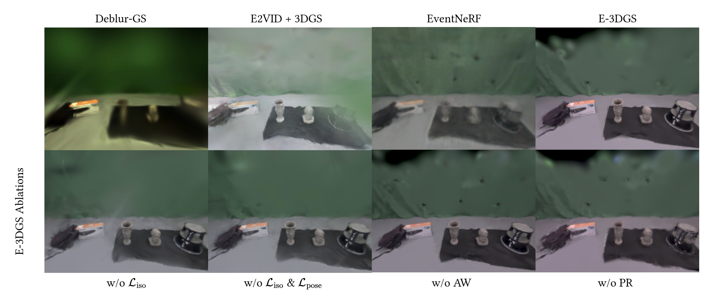
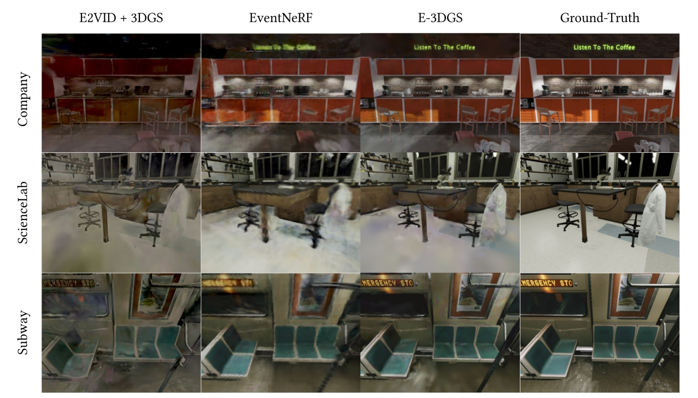
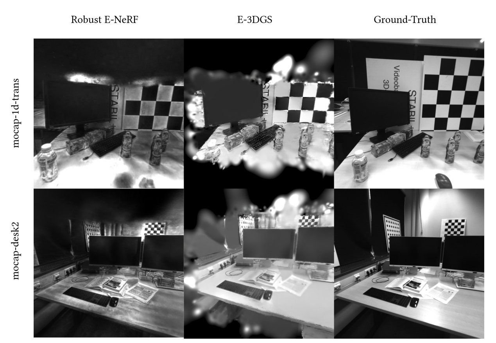

<!-- * 目录
{:toc} -->


<!-- !!!!!!!!!!!!!!!!!!!!!!!!!!!!!!!!!!!!!!!!!!!!!!!!!!!!!!!!!!!!!!!!!!!!!!!!!!!!!!!!!!!!!!!!!!!!!!!!!!!!!!!!!!!!!!!!!!!!!!!!!!! -->
# 引言
3DGS在新视觉合成上受到广泛的关注，而基于事件相机也有不少3DGS相关的工作。
本博文对于 2025 3DV的这个event-based 3DGS工作进行复现，测试效果。
本博文仅供本人学习记录用~

* [paper](https://arxiv.org/pdf/2502.10827)
* [website](https://4dqv.mpi-inf.mpg.de/E3DGS/)
* [code](https://github.com/sohaib023/E-3DGS)
* 基于3DGS的SLAM工作调研：[paper list](https://github.com/KwanWaiPang/Awesome-3DGS-SLAM)
* 本博文复现过程采用的代码及代码注释（如有）：[My github repository](https://github.com/KwanWaiPang/E-3DGS)


# 理论解读
首先开篇还是老套路，提到的是事件相机在运动模糊及特殊光照条件下比传统相机有优势（不过还是没有实验验证在fast motion或者hdr环境下与image baseline对比）。
虽然现有不少event-based 3DGS的工作，不过还是以面向前端或以物体为中心的场景，因此，作者还是宣称自己是首次提出基于3DGS的event-based 新视觉合成。该方法可以重构大型环境并且保证高的视觉质量。
主要的对比baseline是他们之前的工作[EventNeRF](https://openaccess.thecvf.com/content/CVPR2023/papers/Rudnev_EventNeRF_Neural_Radiance_Fields_From_a_Single_Colour_Event_Camera_CVPR_2023_paper.pdf)

论文的主要贡献点有：
1. 采用的是color event camera（应该是由拜尔滤波器产生的带颜色事件），因此可以实现带颜色的彩色渲染。
2.  初始化（frustum-based initialization）、自适应的事件窗口、3D gaussian的正则化，camera pose refinement等等的策略设计。
3. 开源了一个数据集（包含仿真数据以及真实数据），也即[E-3DGS-Dataset](https://drive.google.com/drive/folders/1yRlg33ttbhm27EeyCpZTxrWlkX3C5bz1)

系统的架构如下图所示.首先输入的为彩色事件，此外，需要相机的内参以及pose为已知（虽然论文中提到的是noisy initial poses，但应该就是跟GT pose差不多了）。
整体的架构主要分为：在无sfm的情况下初始化3D Gaussian，3DGS的自适应事件帧监督，以及pose refinement。

<div align="center">
  
<figcaption>  
</figcaption>
</div>

point 1：对于事件帧的监督，实际上就是利用下面两条公式以及拜尔滤波器累积获得颜色信息并求loss用于作为3DGS的监督
<div align="center">
  
  
<figcaption>  
</figcaption>
</div>

point 2：而对于原版的3DGS是通过sfm来获取初始化点云的，3DGS的作者还尝试了在立方体内的随机位置初始化高斯分布。虽然这对他们来说是有效的，但性能略有下降，但需要对场景的范围做出假设。
对于event camera而言，直接用sfm是比较困难的，因此作者采用随机初始化，对于每个相机所对应的锥体，随机初始化约$10^{4}$个高斯点。这有两个好处：1、所有初始化的高斯都必然在观测区域；2.只需要一个关于场景的假设（也就是最大的深度）

point 3：自适应的事件窗口，对于EventNeRF都是采用固定的事件窗口的，它们发现更大的时间窗口会导致低频的彩色及场景的部分，因此，小的事件窗口有利于恢复高频的细节信息。
而由于本文采用的数据集是带有不同的相机速度的，因此通过事件的数量来划分窗口而并非通过时间维度（其实也就是以时间还是以数量划分event的区别而已~）
但同时又为了保留低频的细节，故此同时采用两种事件的划分方式.也即通过大的窗口和小的窗口累积事件来恢复高频和低频结构信息。
<div align="center">
  
<figcaption>  
</figcaption>
</div>

point 4：给3DGS引入了正则化项来保证其尽可能的各向同性
<div align="center">
  
<figcaption>  
</figcaption>
</div>

point 5：进一步对输入的pose做一个refinement，这点略过

而对于最后的优化，首先基于上面的公式6，同时对带有时间以及不带事件的区域都计算loss

<div align="center">
  
<figcaption>  
</figcaption>
</div>

而最终的loss则是在此基础上加上正则化：

<div align="center">
  
<figcaption>  
</figcaption>
</div>

论文中列出的新视觉合成的效果还是比较不错的（除了作者给的数据集外，也测试TUM-VIE序列）：
<div align="center">
  
  
  
<figcaption>  
</figcaption>
</div>


# 实验复现

## 配置测试

```bash
git clone https://github.com/KwanWaiPang/E-3DGS.git --recursive

# rm -rf .git


conda env create --yes --file environment_cuda12.2.yml #注意A100需要采用这个
#conda env create --yes --file environment_cuda11.6.yml #为cuda11.7采用的版本
conda activate E-3DGS
# conda remove --name E-3DGS --all

conda install pytorch3d -c pytorch3d
pip install submodules/diff-gaussian-rasterization
pip install submodules/simple-knn
# pip install opencv-python pandas piq scipy numba tensorboard matplotlib lpips
pip install pandas piq scipy matplotlib lpips

```

* 下面安装可视化插件

```bash
# Dependencies (注意要su user切换成user)
sudo apt install -y libglew-dev libassimp-dev libboost-all-dev libgtk-3-dev libopencv-dev libglfw3-dev libavdevice-dev libavcodec-dev libeigen3-dev libxxf86vm-dev libembree-dev
# Project setup
cd SIBR_viewers
cmake -Bbuild . -DCMAKE_BUILD_TYPE=Release # add -G Ninja to build faster
cmake --build build -j24 --target install

```


## 训练
首先下载数据集[link](https://drive.google.com/file/d/1AfWS1Pp0Sl_3fRgUuOQ3JLNX86pq3Tn_/view?usp=sharing)
* 下载google drvie数据到服务[link](https://kwanwaipang.github.io/File/Blogs/Poster/ubuntu%E5%91%BD%E4%BB%A4%E8%A1%8C%E4%B8%8B%E8%BD%BD%E6%95%B0%E6%8D%AE.html)

```bash
pip install gdown 
# gdown https://drive.google.com/uc?id=标识符
# conda activate E-3DGS
gdown https://drive.google.com/uc?id=1AfWS1Pp0Sl_3fRgUuOQ3JLNX86pq3Tn_
```

* 然后运行下面命令执行

~~~
python train.py -s /path/to/data/dir/shot_009 -m /path/to/model/output/dir --pose_lr 0.001 --sh_degree 1

python train.py -s /home/gwp/E-3DGS/dataset/shot_009 -m /home/gwp/E-3DGS/output/shot_009 --pose_lr 0.001 --sh_degree 1
~~~

训练要接近一个小时hhh

<div align="center">
  
<figcaption>  
</figcaption>
</div>

* 采用MobaXterm来查看训练效果

~~~
conda activate E-3DGS
cd E-3DGS

./SIBR_viewers/install/bin/SIBR_remoteGaussian_app --path /home/gwp/E-3DGS/output/shot_009 #训练过程查看
./SIBR_viewers/install/bin/SIBR_gaussianViewer_app -m /home/gwp/E-3DGS/output/shot_009 #训练完后查看
~~~

<div align="center">
  
<figcaption>  
</figcaption>
</div>

<div align="center">
  
<figcaption>  
</figcaption>
</div>


* 其他数据的下载链接[E-3DGS-Dataset](https://drive.google.com/drive/folders/1yRlg33ttbhm27EeyCpZTxrWlkX3C5bz1)

~~~
conda activate E-3DGS
gdown https://drive.google.com/uc?id=1K2V0VrIYKDZKNqbQpHEZiBpGaI4Wbh_s
gdown https://drive.google.com/uc?id=1G5o9FY80gcXB7uc5iyVFkRUsv6SfToj6
gdown https://drive.google.com/uc?id=1Grta1sarkejUxskS3I8tPMO_WLRfPgMT
gdown https://drive.google.com/uc?id=1TGYJ_QGr3cuMp0RbdFH33I5AZ6Z30-w0
gdown https://drive.google.com/uc?id=1o92_Dd0ogADas7OCVs5nrFgGOCOKX9zU
gdown https://drive.google.com/uc?id=1sEl361E6_34U4kaRsIue4qjhUlsK0pWI
gdown https://drive.google.com/uc?id=1z34uA6iEmBQfa9hHSNmQlcfrdKqFviZa
gdown https://drive.google.com/uc?id=1P8JykSKwVIxkMr3_v4NIGMjzYrVPJQNW
~~~

## 推理（新视觉合成）

* 注意，此处的`--skip_train`是跳过训练视角，直接只有新视角

```bash
python render.py -s /home/gwp/E-3DGS/dataset/shot_009 -m /home/gwp/E-3DGS/output/shot_009 --skip_train
```

合成的新视觉的效果（注意，非训练视觉）

<div align="center">
  <table style="border: none; background-color: transparent;">
    <tr align="center">
      <td style="width: 50%; border: none; padding: 0.01; background-color: transparent; vertical-align: middle;">
        
      </td>
      <td style="width: 50%; border: none; padding: 0.01; background-color: transparent; vertical-align: middle;">
        
      </td>
    </tr>
     <tr align="center">
      <td style="width: 50%; border: none; padding: 0.01; background-color: transparent; vertical-align: middle;">
        
      </td>
      <td style="width: 50%; border: none; padding: 0.01; background-color: transparent; vertical-align: middle;">
        
      </td>
    </tr>
  </table>
  <figcaption>
  </figcaption>
</div>


