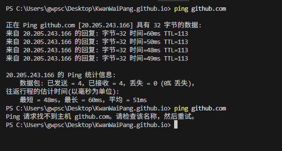
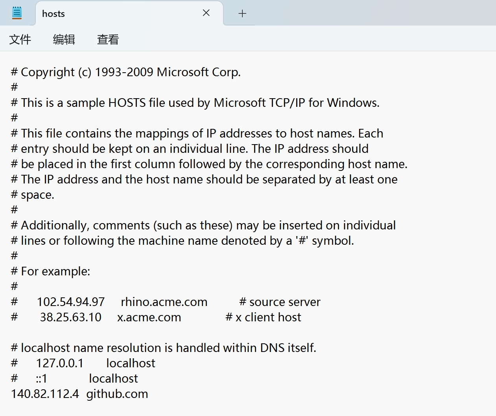
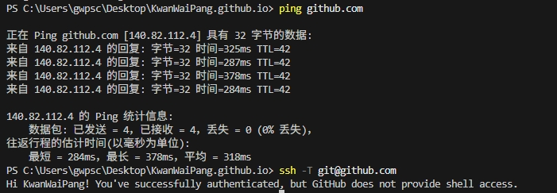

<!-- * 目录
{:toc} -->


<!-- !!!!!!!!!!!!!!!!!!!!!!!!!!!!!!!!!!!!!!!!!!!!!!!!!!!!!!!!!!!!!!!!!!!!!!!!!!!!!!!!!!!!!!!!!!!!!!!!!!!!!!!!!!!!!!!!!!!!!!!!!!! -->
# 引言
本博文记录一些常用的git命令

本博文仅供本人学习记录用~


## 下载GitHub仓库

```bash
git clone --recursive https://github.com/{仓库名}

```

## 重新初始化

```bash
rm -rf .git
```

## push到已有仓库并创新新分支

1. 初始化 Git 仓库（如果尚未初始化）

```bash
git init
```

2. 添加远程仓库

```bash
git remote add origin https://github.com/{仓库名}.git
```

3. 创建并切换到新分支（如分支名a100）

```bash
git checkout -b a100
```

4. 添加并提交更改

```bash
git add .
git commit -m "Initial commit on branch a100"
```

5. 推送到远程仓库

```bash
git push -u origin a100
```

## 更改默认分支
如下图所示

<div align="center">
  
<figcaption>  
</figcaption>
</div>

## 拉取远程新的分支

~~~
git pull origin <分支名>:<分支名>
~~~

# 重新生成并配置 ssh key

```bash
ssh-keygen
```

进去我的电脑，C盘，自己用户名那个文件夹，找到.ssh文件夹。

然后找到.pub结尾的,也就是`id_rsa.pub`，就是公钥。在进入自己的github，个人设置界面，找到SSH key那栏，new ssh key。添加好再push。

下面输入命令，验证是否配置成功

~~~
ssh -T git@github.com 
~~~

# DNS解析失败

报错：
`Could not resolve hostname github.com: No address associated with hostname`
然后重新生成并配置 ssh key也还是不行。

下面看看ping会发现`ping github.com`发现是链接不上的,但是用HKU-VPN却是可以的

<div align="center">
  
<figcaption>  
</figcaption>
</div>

应该就是DNS问题，接下来先试试刷新DNS缓存

~~~
ipconfig /flushdns
~~~


把github ip加入到系统的hosts文件就行

通过[链接](https://www.ipaddress.com/website/github.com/#ipinfo)查看到最新的ip是`140.82.112.4`

在文件`C:\Windows\System32\drivers\etc\hosts`中加入

~~~
140.82.112.4	github.com
~~~

然后再次测试

```bash
ssh -T git@github.com
```

<div align="center">
  <table style="border: none; background-color: transparent;">
    <tr align="center">
      <td style="width: 50%; border: none; padding: 0.01; background-color: transparent; vertical-align: middle;">
        
      </td>
      <td style="width: 50%; border: none; padding: 0.01; background-color: transparent; vertical-align: middle;">
        
      </td>
    </tr>
  </table>
  <figcaption>
  </figcaption>
</div>