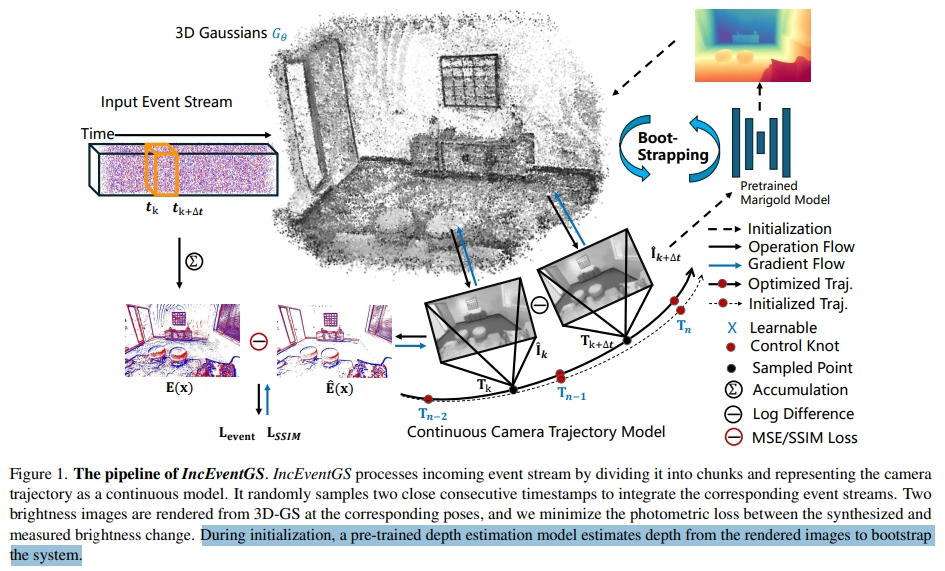
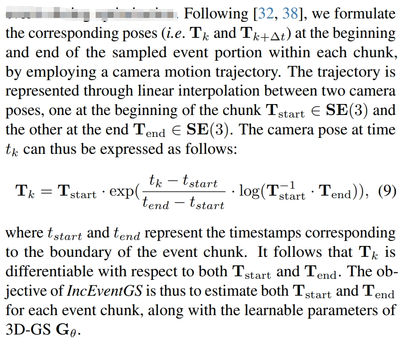
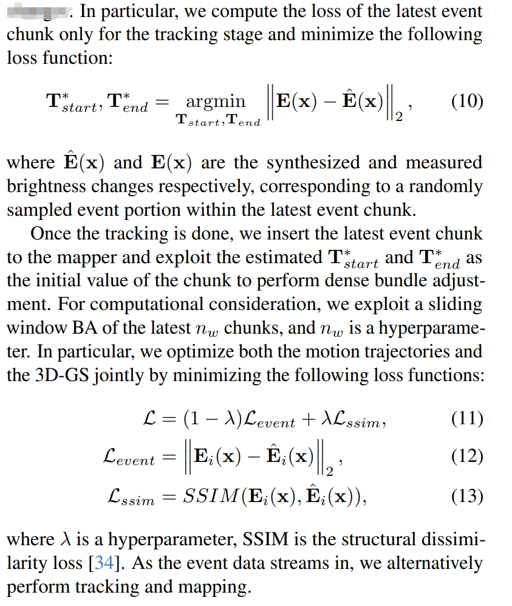
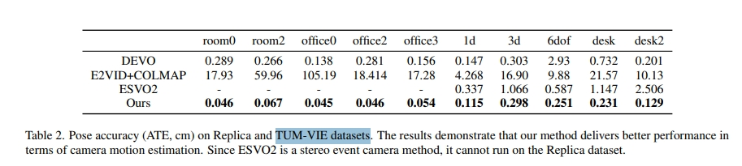
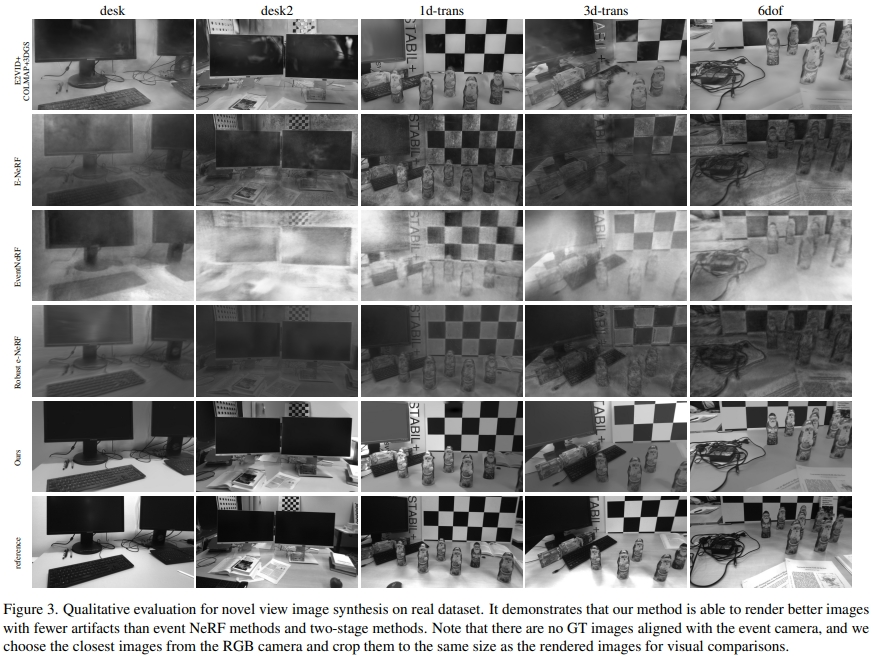
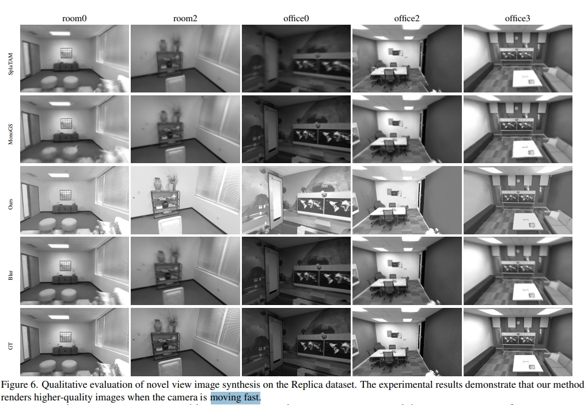

<!-- * 目录
{:toc} -->

<!-- !!!!!!!!!!!!!!!!!!!!!!!!!!!!!!!!!!!!!!!!!!!!!!!!!!!!!!!!!!!!!!!!!!!!!!!!!!!!!!!!!!!!!!!!!!!!!!!!!!!!!!!!!!!!!!!!!!!!!!!!!!! -->
# 引言
本博文对于 2025 CVPR的event-based 3DGS工作进行复现，测试效果。
本博文仅供本人学习记录用~

* [paper](https://arxiv.org/pdf/2410.08107)
* [code](https://github.com/WU-CVGL/IncEventGS)
* 基于3DGS的SLAM工作调研：[paper list](https://github.com/KwanWaiPang/Awesome-3DGS-SLAM)
* 本博文复现过程采用的代码及代码注释（如有）：[My github repository](https://github.com/ERGlab/IncEventGS)

# 理论解读
IncEventGS是一个基于单目事件相机的增量式3DGS重建算法（无需pose先验）。tracker首先基于重构的3DGS场景表达估算一个初始的相机运动，而mapper联合refine3D场景以及tracker估计的运动轨迹。
而初始化阶段，则是采用一个预训练的深度估算网络来从渲染的图片中估算深度。

  
<figcaption>  
</figcaption>

  <table style="border: none; background-color: transparent;">
    <tr align="center">
      <td style="width: 50%; border: none; padding: 0.01; background-color: transparent; vertical-align: middle;">
        
        相机运动轨迹模型
      </td>
      <td style="width: 50%; border: none; padding: 0.01; background-color: transparent; vertical-align: middle;">
        
        增量式tracking与maping联合优化
      </td>
    </tr>
  </table>
  <figcaption>
  </figcaption>

对于初始化，一般的3DGS都是采用COLMAP，但是对于事件相机，这并不容易获取。因此，对于限定的bounding box随机初始化一系列3D高斯采样点。
而相机的pose则是初始化为近单位矩阵。
而为了进一步提升性能，采用一个基于diffusion的深度估算网络，来对渲染后的图像进行估算深度。然后用该深度来重新初始化3D高斯点。

## 论文的实验效果

首先是pose的精度，比DEVO还要好一些。不过这里汇报的精度似乎跟DEVO原文的不一样，应该是自己重跑的。但是ESVO2却竟然能跑通（不过结果也跟原文不一样），故此推理应该只是采样了一小段序列而非完整序列来验证吧。

  
<figcaption>  
</figcaption>

真实数据集下的渲染效果如下：

  
<figcaption>  
</figcaption>

从恢复的效果可见，虽然不像[E-3DGS](https://kwanwaipang.github.io/E-3DGS/)那样可以渲染彩色视觉，但还是具有丰富的纹理细节的

也有在虚拟数据上跟MONOGS以及SplatTAM对比。不过这里宣称是fast motion似乎就是有所误导了😂

  
<figcaption>  
</figcaption>

总的来说本文并没有在挑战性场景中验证性能（HDR，fast motion）定位评价序列似乎也不是full sequence

# 代码复现