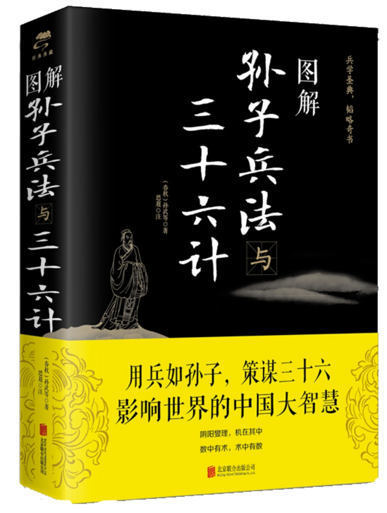
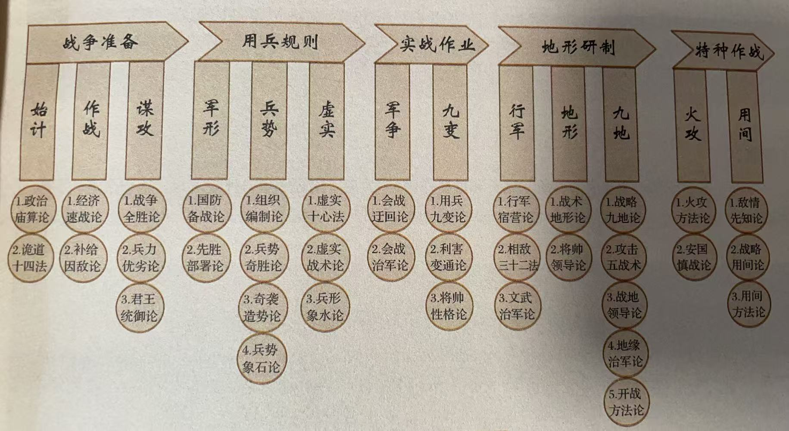
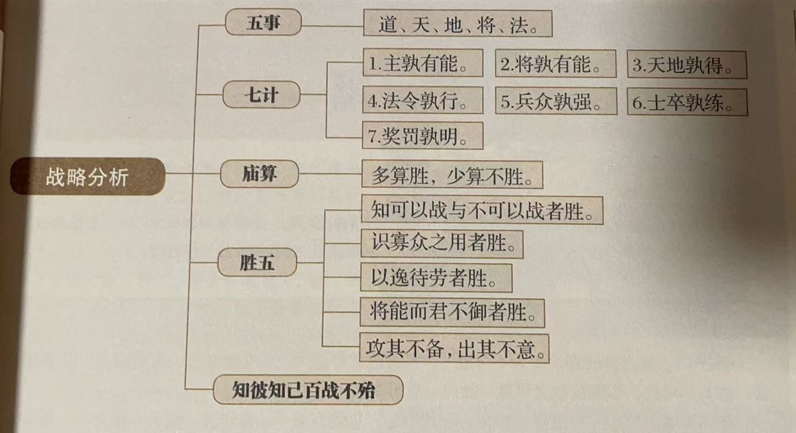
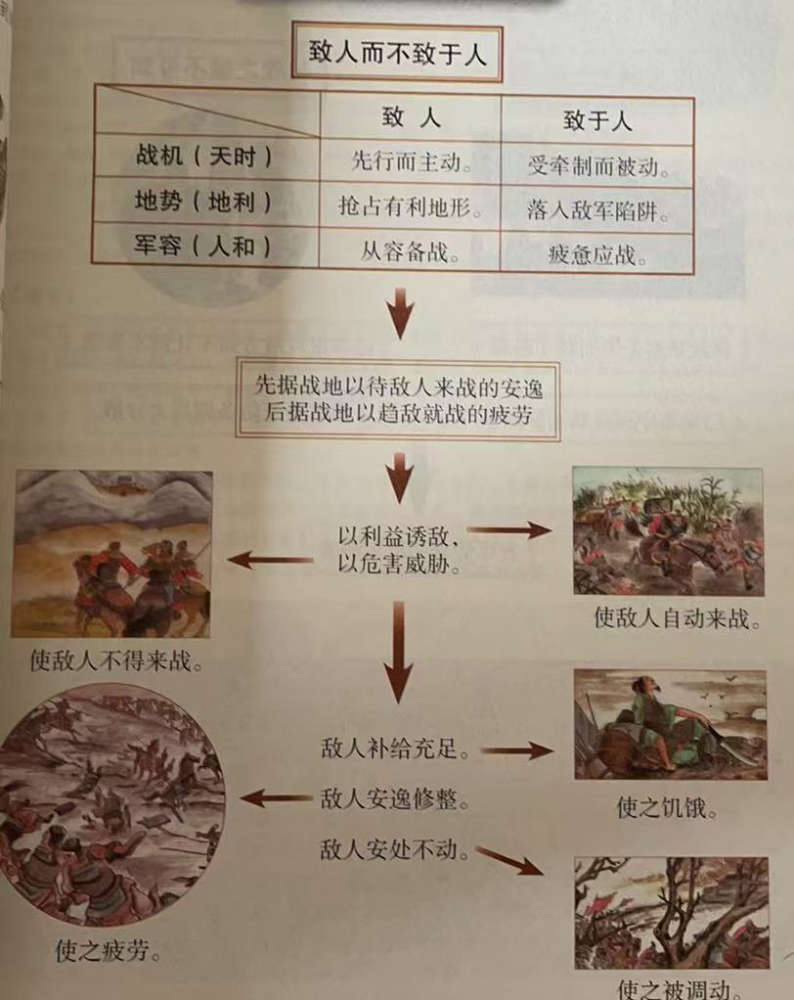
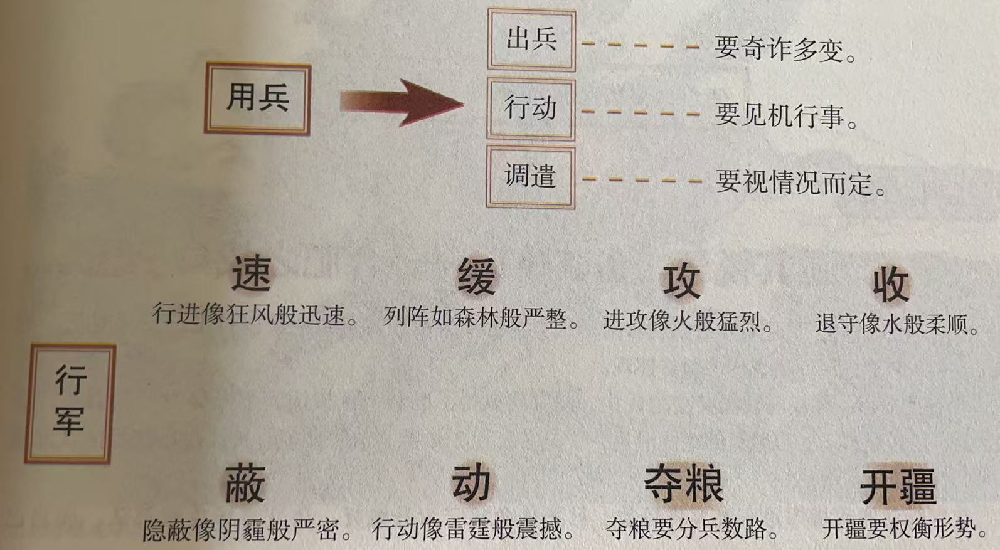

<!-- * 目录
{:toc} -->


<!-- !!!!!!!!!!!!!!!!!!!!!!!!!!!!!!!!!!!!!!!!!!!!!!!!!!!!!!!!!!!!!!!!!!!!!!!!!!!!!!!!!!!!!!!!!!!!!!!!!!!!!!!!!!!!!!!!!!!!!!!!!!! -->
# 引言
本博文为本人阅读《图解孙子兵法与三十六计(思履注)》这本书籍的阅读笔记。
记录本人读书过程的心得以及摘抄的一些句子。
本博文仅供本人学习记录用。

<div align="center">
  
<figcaption>  
</figcaption>
</div>

<br>
由于篇幅过长，对于本书的阅读笔记会分为上中下三个博客来开展：

[comment]: <> (  <h2 align="center">PAPER</h2>)
  <h3 align="center">
  《用兵如孙子，策谋三十六》之——
  <a href="/孙子兵法/">上</a> 
  | <a href="/三十六计上/">中</a> 
  | <a href="/三十六计下">下</a> 
  </h3>


# 孙子兵法

孙子兵法由十三章组成

<div align="center">
  
<figcaption>  
</figcaption>
</div>

## 1.计篇

`兵者，国之大事，生死之地，存亡之道，不可不察也。`
战争是国家的大事，关系到国家生死存亡，所以一定要重视战争，避免在战争中失利。否则就回影响国家的昌盛。

需要从五个主要的方面来考察和研究：
* 道：民众与君主的意志相一致，可与君主同生共死（是否上下一心，符合道义，亦可理解为目的和目标）。
* 天：阴阳、寒暑、四时的变化（季节、气候、天气条件）。
* 地：征战路途的远近，地形、作战场地的情况等（地理条件）。
* 将：将帅是否足智多谋、赏罚分明、爱护部署、果断勇敢、军纪严明。
* 法：军队的组织编制、将官的职责划分、军需供应管理等等的制度规定。

```bash
⭐ #例子
南唐虽然经济和文化都是非常繁荣，但是君臣懈于整军备战，终于败于北宋

⭐ #例子2
东晋谢石，淝水之战
淝水之战让前秦（苻坚）丢失了七十万军队，不仅由盛转衰，还被鲜卑慕容垂等趁乱造反，最终前秦灭亡。
```

必须要充分了解才可以获胜（`知之着胜，不知者不胜`）

此外，还需要从以下七个方面对敌我双方进行分析研究（度量思考，才可以推断战争的胜负）：
1. 主孰有道？哪一方君主更加正义
2. 将孰有能？哪一方奖励更加有才能
3. 天地孰得？哪一方占据更多的天时地利
4. 法令孰行？哪一方的法令更加彻底的被执行
5. 兵众孰强？哪一方的兵力更多
6. 士卒孰练？哪一方的士卒更训练有素
7. 赏罚孰明？哪一方的赏罚更加公正严明

`计利以听，乃为之势，以佐其外。势者，因利而制权也`
有利的计策被采纳了，还需要设法去造势。而所谓的造势，实际上就是根据敌我双方的利害得失的把握而掌握主动权。

`兵者，诡道也`用兵打仗就是使用诡诈之术：

``` tex
📕 %原文
兵者，诡道也。故能而示之不能（能打的却装作不能打），用而示之不用（能进攻却要装作不能进攻），近而示之远（要打近处就装作打远处），远而示之近；
利而诱之（敌人贪利就要利诱），乱而取之（敌人混乱就要乘机攻击），实而备之（敌人实力雄厚就要防备），强而避之（强的就要避其锋芒），怒而挠之（易怒的就要骚扰激怒），卑而骄之（鄙视我方的就要使其更加骄傲自大），佚而劳之（敌人休整充分就要设法使其疲困），亲而离之（内部团结就要离间）。攻其无备，出其不意（要在其没有防备的时候攻击，在其意料不到的时候采取行动）。此兵家之胜，不可先传也。
```

`夫未战而庙算胜者，多算胜，少算不胜，而况于无算乎？`
筹划周密，条件具备才能取得胜利

```bash
⭐ #例子
宋襄公坚守“仁义道德”，坚持“仁战”、“德战”
然而，春秋无义战，最终在“鹿上会盟”被楚国所擒。后又在泓水岸边大败于楚国

⭐ #例子2
越王勾践忍辱求和，一方面用卑屈的姿态麻痹吴王夫差（勾践尝粪；送西施使吴王沉迷酒色；离间计：疏远伍子胥而宠信伯嚭；夫差北上争霸，穷兵黩武），另一方面暗中积蓄力量（卧薪尝胆，准备充分；一系列政治使得“去民之所恶，补民之不足，令民与上同意”；避其锋芒，韬光养晦），最终“三千越甲可吞吴”
```

* 战争唯一的意义就是获胜，虽然人们或许会用道德标准去衡量，但最终关心的往往是结果

孙子的战略思维：
* 预见性：未战而庙算胜
* 智慧性：因形而措胜于众。此处的“制胜之形”既可以指作战方式，又可以指战略策略。要根据客观情况，随机应变，灵活处置。

```py
# 总结此篇
1. 先计而后战：即预先对决定战争胜负的基本条件进行研究
2. 以庙算胜：为实现胜负的基本条件而进行战略准备与筹划
3. 攻其无备，出其不意：灵活机动，提供作战时的能动性

曹操亦曾云：“选将、量敌、度地、料卒，远近险易，计于庙堂也”
```

## 2.作战篇

战争对人力、物力、财力的依赖：

``` tex
📕 %原文
孙子曰：凡用兵之法，驰车千驷，革车千乘，带甲十万，千里馈粮，则内外之费，宾客之用，胶漆之材，车甲之奉，日费千金，然后十万之师举矣。
```

`夫钝兵挫锐，屈力殚货，则诸侯乘其弊而起，虽有智者，不能善其后矣。故兵闻拙速，未睹巧之久也。夫兵久而国利者，未之有也。`
此处最关键的应该就是`故兵闻拙速，未睹巧之久也`。正所谓“兵贵神速”，行军打仗只有宁可粗略简单只求迅速取胜，没见过要求精巧而拖延战局的。速战速决才是胜负的关键。

`故不尽知用兵之害者，则不能尽知用兵之利也。`不能完全了解用兵的害处的人，也就不能完全了解用兵的益处。

下面则是描述善于用兵的人如何调配物资，尽量降低本国资源的消耗，想方设法从敌人手中夺取粮食（以战养战）

``` tex
📕 %原文
善用兵者，役不再籍（不一再征集兵源），粮不三载（不多次运送粮草）；取用于国（武器装备等从国内取得），因粮于敌（粮草则在敌国解决），故军食可足也。
```

```bash
#例子
诸葛亮，“重地则掠”，陇上抢割新麦
```

下面则是描述为何国家会因为用兵而变得贫困
~~~
国之贫于师者远输，远输则百姓贫。近于师者贵卖，贵卖则百姓财竭，财竭则急于丘役。力屈、财殚，中原内虚于家。百姓之费，十去其七；公家之费，破车罢马，甲胄矢弩。戟楯蔽橹，丘牛大车，十去其六。
~~~
因此,明智的将帅务求在敌国就地解决粮食供给的问题`故智将务食于敌。食敌一钟，当吾二十钟；芑秆一石，当吾二十石。`（钟为粮食重量；石为饲料重量）


``` tex
📕 %原文
故杀敌者，怒也(想要士兵奋勇杀敌，就要激发他们同仇敌忾的勇气)；取敌之利者，货也（想要夺取敌人的物资，就要用财货奖赏士兵）。故车战，得车十乘已上，赏其先得者，而更其旌旗。车杂而乘之（缴获的战车要纳入自己编队），卒善而养之（对于俘虏要善待和供养），是谓胜敌而益强（这样就可以战胜敌人同时又使自己的力量更强大）。
```

```bash
⭐ #例子
后金努尔哈赤，战前宣布七大恨，动员全军，在“萨尔浒之战”中大破明军
```

`故兵贵胜，不贵久。`鉴于前面提到的`国之贫于师者远输`,将帅应该尽量缩短出征的时日。

```bash
⭐ #例子
孙武本人的“吴楚伯举之战”
伍子胥问孙武：“吴军习于水性，善于水战，为何改从陆路进军呢？” 
孙武告诉他说：“用兵作战，最贵神速。要做到出其不意，攻敌之不备。逆水行舟，行军缓慢，楚军必然乘机加强防备，那就很难破敌了”

⭐ #例子2
卡西欧：“在产品成长期赚钱，而不是在成熟期赚钱”。新品上市，尽量压低价格，迅速推出新品，最大限度缩短产品更新周期。而作为市场的防御者，则是应该迅速识别入侵者的意图及时做出反应而非反复论证该新品的成本与市场前景，不应过于谨慎观望，否则机会将在犹豫中白白溜走。

⭐ #例子3
既贵胜又贵久，才有利于企业成长壮大。
黑松企业，根据瞬息万变的市场，向各地的经销商提供各种新的经营与销售训练。
同时，采用“卒善而养之”——用优厚的待遇留住经销商，用少量的付出而赢得长久的发展，这也是“胜敌而益强”

```

`故知兵之将，生民之司命，国家安危之主也。`

```py
# 总结此篇
此篇着重论述战争对于国家带来的影响。而针对这个影响，就应该以战养战（因粮于敌）以及兵贵神速。
除了因粮于敌，也应该奖励士兵，优待俘虏，以使得自己“胜敌而益强”

虽然说“故兵闻拙速，未睹巧之久也”（巧久不如拙速），但是生活中有些事情着急是没有用的，正所谓“心急吃不了热豆腐”，积累与扎实的基础是非常重要的。

```

## 3.谋攻篇

孙子曰：夫用兵之法：
* `全国为上，破国次之`：使敌国完整降服为上等策略，击破次等
* `全军为上，破军次之`；
* `全旅为上，破旅次之`；
* `全卒为上，破卒次之`；
* `全伍为上，破伍次之`；

`是故百战百胜，非善之善者也；不战而屈人之兵，善之善者也。`
因此，百战百胜还不算是高明，不出战而使敌人屈服的才是高明中的高明。

对于不战而胜的方法：
`故上兵伐谋，其次伐交，其次伐兵，其下攻城。攻城之法为不得已。`
因此。用兵的上策是通过谋略来战胜敌人；其次则是外交上封锁、孤立敌人；再其次是出兵击败敌人；最后才是攻打敌人的城池，选择攻城是迫不得已的办法。

```bash
⭐ #例子
苏秦谏齐王伐宋
从外交上孤立封锁敌人，也是战胜敌人的一种计谋。
苏秦实际上是燕国的卧底，为了实施对齐国的报复，说服齐王，去掉帝号放弃联秦攻赵，同时独自攻打盟友宋国。这样使得齐、秦交恶。而虽然灭了宋国但是大大削弱了齐国的实力。最终创造了条件，燕国乐毅连克齐国七十多城。

⭐ #例子2
三国演义中的赤壁之战就是典型的“伐谋”，此外还有“伐交”，“伐攻”，“用间”，“火攻”等后面会提到的策略

```

下面则是论述为什么攻城是迫不得已的办法：
``` tex
📕 %原文
修橹轒辒，具器械，三月而后成，距堙，又三月而后已。将不胜其忿而蚁附之，杀士三分之一而城不拔者，此攻之灾也。
```

攻略谋取敌人的法则：
``` tex
📕 %原文
故善用兵者，屈人之兵而非战也，拔人之城而非攻也，毁人之国而非久也(灭亡敌人的国家不是靠久战)，必以全争于天下（一定要以全胜的谋略争胜于天下）。故兵不顿而利可全，此谋攻之法也。
```

这也就是强调“不战而屈人之兵”以及“上兵伐谋”的原则：

```bash
#例子
韩信尺书平燕地
背水一战破了赵国后，赵国原谋士李左丰被俘，在韩信礼贤下士的招降后，建议韩信：安兵息甲，派能言善辩的谋士向燕王陈明利害。而此时韩信已经灭魏和赵，威震天下，燕王不敢不从。最终投降。

```

下面用兵的法则，如下：

```tex
📕 % 原文
故用兵之法，十则围之（十倍于敌人的兵力就包围），五则攻之（五倍于敌人的兵力就主动攻击），倍则分之（两倍于敌人的兵力就设法分割敌人），敌则能战之（兵力相当的就设法战胜），少则能逃之（兵力少于的就要设法摆脱），不若则能避之（各方面都不如敌人的就要避开其锋芒）。故小敌之坚，大敌之擒也（弱小的军队如果一味固守硬拼，就会成为强大敌人的俘虏）。
```

因此，实力悬殊时，要灵活应对，见机行事。

`夫将者，国之辅也。辅周，则国必强；辅隙，则国必弱。`将帅是国君的左膀右臂，辅助周密得力和缺失疏漏是影响国家的兴衰的关键。

国君可能对军队产生三种危害：

```bash
📕 # 原文
故君之所以患于军者三
1. 不知军之不可以进而谓之进，不知军之不可以退而谓之退，是谓“縻军”； #也就是不了解军队是否可以进退，却乱加命令，这会束缚军队。
2. 不知三军之事，而同三军之政者，则军士惑矣； #不懂军中事务却干预军队的行政
3. 不知三军之权，而同三军之任，则军士疑矣。 #不懂军事的权谋机变而干涉军队的指挥

三军既惑且疑，则诸侯之难至矣，是谓“乱军引胜”。 #以上三点也就是扰乱自己的军队而使得敌人胜利
```

能够预知胜利的情况有五种：

```bash
📕 # 原文
故知胜有五：
1. 知可以战与不可以战者胜， #知道什么情况可以打什么情况不能打（战机的判断）
2. 识众寡之用者胜， # 能够根据兵力多寡而采用不同战法的（军队规模和战术）
3. 上下同欲者胜， # 上下一心的（团结一致）
4. 以虞待不虞者胜， # 事先有准备来对付事先没有准备的（万全的准备）
5. 将能而君不御者胜。 #将帅贤能而国君不掣肘的（有能力的将领）
此五者，知胜之道也。
```

`故曰：知彼知己者，百战不殆；不知彼而知己，一胜一负，不知彼，不知己，每战必殆。`既要掌握敌军情报，也要清楚我军情况


```py
# 总结此篇
此篇强调的是以谋胜敌，对于谋划进攻强主要提出两点：
1. “不战而屈人之兵”
2. “上兵伐谋”
3. “必以全争于天下。兵不顿而利可全”。将战争的成本降至最低，而将战争的收益扩至最大。

同时也揭示了“知彼知己者，百战不殆”这一著名的军事规律。而现实生活中，知彼固然不易，真值知己却更难，知彼知己则是难上加难，而关键的则是“实践出真知”

```

至此，总结一下前面三章对于战略的分析：

<div align="center">
  
<figcaption>  
</figcaption>
</div>

而针对分析的情况，所采用的战略也就是`故上兵伐谋，其次伐交，其次伐兵，其下攻城`。
注意，所谓的`战略`就是在形式混沌复杂多种选择存在的情况下，选择一种成本最小，收益最大，并且操作性强的应对方略。


## 4. 形篇


```tex
📕 % 原文
孙子曰：昔之善战者，
先为不可胜，以待敌之可胜。%先创造条件使自己不被敌人战胜，等待可以战胜敌人的时机
不可胜在己，可胜在敌。%不能被敌人战胜的主动权掌握在自己，而能否战胜敌人则是取决于敌人是否留下可乘之机
故善战者，能为不可胜，不能使敌之可胜。%因此，擅长战斗的人，能创造条件使得自己不被战胜，而不能保证敌人一定能为我所战胜
故曰：胜可知，而不可为。%胜利可以预见而不可以强求
```

`先为不可胜`善于用兵的人先创造条件使自己不会被敌人战胜，然后才是等待可以战胜敌人的时机

```bash
⭐ #例子
荀彧劝说曹操先平吕布再图徐州。
再曹操为保杀父之仇攻打陶谦徐州的时候，后方被吕布偷袭，后曹操回军与吕布相斗，最终因为饥荒罢兵。
届时，曹操已经占上风，且刘备刚接手徐州，基础不稳。对于徐州这块大肥肉曹操是想先吃掉然后再回来吃吕布。
当时荀彧劝说曹操就是：正值秋收，应该先割麦，然后平吕布，以使得自己兖州立于不败之地，再图谋徐州。

⭐ #例子2
隋文帝先备后战灭陈国
杨坚先北上攻打突厥，同时稳住陈朝（礼待并归还间谍，拒绝投靠的人）
其后，面对长江天险，杨坚不急不躁。每逢收获季节，就调集大军于长江沿岸，大肆制造渡江攻打的舆论，使得陈朝多次紧急征调军队，延误了农时。此外派人焚毁南陈的粮仓。几年后导致陈朝国立日渐衰弱。
最终在大年初一，发动攻击，一举攻克陈朝。

⭐ #例子3
李牧养精蓄锐胜匈奴
李牧初守雁门关时下令不允许与匈奴交战，只许收拾财产，入城严防。同时整顿军纪，鼓舞士气，对制度进行修整。
即使面对赵王的命令，依然如故。
最后，士气高涨之时，先放出牛羊吸引匈奴来抢掠，然后假装不敌，暗布奇阵，等匈奴主力再来时，歼灭匈奴。

⭐ #例子4
王翦灭楚
王翦采用坚守之策，一方面韬光养晦，厉兵秣马；一方面示敌以弱，让其麻痹大意，掉以轻心。

```

* 下面则是如何可以做到不可战胜：
  * 加强自身的防务`不可胜者，守也`
  * 战术上完备，使得军队进可攻，退可守`守则不足，攻则有余`
  * 审时度势，对敌我双方进行综合对比`兵法：一曰度，二曰量，三曰数，四曰称，五曰胜。`
  * 整顿军纪，鼓舞士气，对制度进行修整，使敌军无可乘之机`修道而保法`

```tex
📕 % 原文
不可胜者，守也；可胜者，攻也。
守则不足，攻则有余（竹简为：守则有余，攻则不足）。%防守是因为取胜条件不足，进攻则是因为取胜条件有余
善守者，藏于九地之下，善攻者，动于九天之上，故能自保而全胜也。
```

`自保而全胜`确立优势地位，创造有利条件，先确保军队立于不败之地，再寻求可以战胜敌人的时机

```tex
📕 % 原文
见胜不过众人之所知，非善之善者也；%对胜利的预知不超过一般人，不算高明
战胜而天下曰善，非善之善者也。%因战胜而被天下称赞的，不能算高明
故举秋毫不为多力，见日月不为明目，闻雷霆不为聪耳。

古之所谓善战者，胜于易胜者也。故善战者之胜也，无智名，无勇功。故其战胜不忒，不忒者，其所措必胜，胜已败者也。%古时候所谓的善战之人，其实就是战胜了容易战胜的敌人。所以即使胜利了也不会留下智慧的名声和勇武的战功。之所以是他们的战胜是毫无疑问的是因为他们采取的作战方略和部署都是合理的，战胜的是已经处于失败地位的敌人。

故善战者，立于不败之地，而不失敌之败也。%所以善战之人，总是确保自己能立于不败之地，而又不放过任何击败敌人的机会
是故胜兵先胜而后求战，败兵先战而后求胜。%胜利的军队总是先从各方面寻找战胜敌人的条件，然后才交战；失败的军队则总是先与敌人交战，然后才希求侥幸获胜。
善用兵者，修道而保法，故能为胜败之政。%善于用兵的人，从各方面修治“先胜”之道，确保“自保而全胜”的法度，因而能掌握战争胜负的决定权
```

* 下面是兵法上用来估算胜利可能性的五条法则：

```tex
📕 % 原文
兵法：一曰度（土地大小），二曰量（物资数量），三曰数（军队数量），四曰称（敌我实力），五曰胜（最终胜利）。
地生度，度生量，量生数，数生称，称生胜。
%根据战场地形的实际情况，做出利用地形的判断；
%根据地形的判断，计算出战场容量的大小；
%根据战场容量的大小，计算出双方兵力的多寡；
%根据兵力的多寡，判断军事实力的强弱；
%根据实力的强弱，判断作战的胜负

故胜兵若以镒称铢，败兵若以铢称镒。%胜利的军队就居于绝对优势的地位，失败的军队就是居于绝对劣势的地位
胜者之战民也，若决积水于千仞之溪者，形也。%胜利者指挥军队作战，就像决开千仞上的溪水那样势不可挡，这就是所谓的“形”
```

基于上述五条确认自己处于绝对优势的地位，然后再寻求敌人的可乘之机，此过程则是需要因敌变化，灵活变通。根据条件是否充足采取攻势或守势`不可胜者，守也；可胜者，攻也。`进而实现`自保而全胜`


```bash
# 总结此篇
此篇是“全胜”思想的延申。主要论述的是攻守时的形势。
提出“先为不可胜，以待敌之可胜”，也就是要先确保自己立于不败之地，之后才去寻求可以打败敌人的可乘之隙。

胜利者与失败者在战争之前所处的形式就已经不同了，能够胜利者，往往在军事实力、外部环境、战前筹划等各个方面都比对手高一截，因此开战前已经处于胜利的地位。

当然，历史上“以少胜多，以弱胜强”的例子并不少，而此篇描述是普遍规律，也就是实力决定战争的主动权。实力强大就是“若决积水于千仞之溪者”，势不可挡。

当然胜利也不是完全由实力决定的。正所谓“不可胜在己，可胜在敌”是否能打败敌人有很多因素，但是至少要确保自己立于不败之地 “先为不可胜，以待敌之可胜”

同时“胜可知，而不可为”，做一件事能否成功，自己本身可以决定一部分，但是还有其他因素。因此客观来说，没有人能真正立于不败之地。但是打好基础，充分利用一切条件，尽最大的努力，这样成功的概率也就越大

```


## 5. 势篇

```tex
📕 % 原文
孙子曰：
凡治众如治寡，分数是也；% 要做到管理人多的军队就像管理人少的军队一样，靠的就是好的组织编制
斗众如斗寡，形名是也；% 要做到指挥人多的军队就像指挥人少的军队一样，靠的就是指挥号令的有力贯彻
三军之众，可使必受敌而无败者，奇正是也；%要是使得被敌人攻击也不会溃败，靠的就是“奇”与“正”
兵之所加，如以碫投卵者，虚实是也。%要使军队进攻时如同以石击卵一般，靠的是“以实击虚”的战略
```

只要编制合理，号令得当（也可以理解为信息通讯），治理再大的军队也如同治理小军队一样的简单。而只要运用好“虚实”和“正奇”就可以`敌而无败``碫投卵者`

* 何为“奇”与“正”？

```tex
📕 % 原文
凡战者，以正合，以奇胜。%正兵当敌，奇兵取胜

% 所谓的奇就是出奇制胜，战法变化无穷无尽
故善出奇者，无穷如天地，不竭如江海。终而复始，日月是也。死而更生，四时是也。声不过五，五声之变，不可胜听也；色不过五，五色之变，不可胜观也；味不过五，五味之变，不可胜尝也；

% 所谓的战势，不过就是奇和正两种，但是他们的变化无穷无尽
战势不过奇正，奇正之变，不可胜穷也。奇正相生，如循环之无端，孰能穷之哉！

```

“虚实”和“正奇”都属于“有所有余，有所不足”的妙用。“虚实”可以理解为战局的兵力部署（“我专而敌分”“我众敌寡”）；而“正奇”可以理解为投入实际战斗的兵力配置。
* 先出为正，正面为正，明战为正。正就是常规，最一般的方法和原则
* 后出为奇，侧翼为奇，暗攻为奇。奇则是不常规的，讲求以奇兵制胜。
以正兵当敌，以奇兵取胜。正奇搭配，可以衍生千万条计谋。

```bash
⭐ #例子
耿弁出奇制胜
东汉初年，耿弁奉光武帝之命东征。
耿弁首先准备攻城器具，这是常规的攻城之法，这就是“正”；
但是攻城是假，实际要骗敌人前来救援（围点打援）。
耿弁屯兵高地之上，等敌军援兵赶到，便冲下破之，这就是“奇”。


⭐ #例子2
东晋谢石，淝水之战
前秦的苻坚发百万雄兵攻打东晋（投鞭断流）
谢石率领八万北府兵正面迎战前秦主力，乘秦军尚未全部抵达，迅速进攻，挫其锐气。在洛涧通过迂回秦军阵后，以五千大败敌军五万。
之后对峙于寿阳，苻坚误把淝水东面八公山的草木当成是晋兵（草木皆兵）
谢石让苻坚先把军队后撤，待晋军渡过淝水一决胜负，苻坚竟然真的撤军（原本应该是想待晋军半渡而击之的），但是由于士气低落导致阵势大乱。
最终前方溃败引起后方惊恐大乱（风声鹤唳）。
而淝水之战让前秦丢失了七十万军队，不仅由盛转衰，还被鲜卑慕容垂等趁乱造反，最终前秦灭亡。

```


```tex
📕 % 原文
激水之疾，至于漂石者，势也；鸷鸟之疾，至于毁折者，节也。
故善战者，其势险，其节短。%因此，善于指挥作战的人，他所造成的态势是险峻的，行动节奏是短促的
势如扩弩，节如发机。

纷纷纭纭，斗乱而不可乱；%在混乱种作战要使自己军队整齐不乱
浑浑沌沌，形圆而不可败。%在战局模糊不清、势态混沌不明的情况下作战，要部署周密以应对四面八方的情况，保持态势让自己立于不败之地。
乱生于治，怯生于勇，弱生于强。%在一定的条件下，严整可以转化为混乱，勇敢可以转化为怯懦，强大可以转化为弱小。
治乱，数也；%军队的严整与混乱，是由组织编制是否有序决定的
勇怯，势也；%勇敢与怯懦，是由所处的战势得失决定的
强弱，形也。%强大与弱小，是由实力（兵力优劣）决定的。

故善动敌者，%善于调动（牵制）敌人的人
形之，敌必从之；%制造假象迷惑敌人，敌人一定会被他调动
予之，敌必取之。%给敌人一些小利，敌人一定前来夺取
以利动之，以卒待之。%用利益来引诱调动敌人，再埋伏士兵伺机打击。
```

`斗乱而不可乱`即使再混乱的局面，都不能使己方变得混乱，要冷静沉着，以合适的谋略方式应对。

而至于后续的`乱生于治，怯生于勇，弱生于强。`其实就是迷惑敌人：
* 有严整的组织--->装作混乱示敌
* 士卒勇猛有志--->装作怯懦示敌
* 有强大的兵力--->装作弱小示敌

迷惑敌人，利诱敌人，这两点达到牵动敌人，再用伏兵伺机伏击。

`形之，敌必从之。`
此处的`形`可以是故意摆出某种姿态，使敌人受到误导，从而受制于我，让我们牵着鼻子走。
而对应的`予之，敌必取之.`在军事上就是用行为迷惑敌人，用小利引诱敌人，然后用精锐之师等待敌人。
这点也是符合《老子》说的“将欲取之，必先予之”

```bash
⭐ #例子
孙膑示形诱敌，大破魏军。
韩魏交战，齐宣王待韩军五战五败，魏军实力受损后排田忌、孙膑率军直驱魏都大梁。
齐军前锋与魏军稍一接触就假装不敌向东撤退。
在撤退途中，齐军通过减灶来制造士兵逃散的假象。
于是庞涓丢下步兵和辎重，带轻骑日夜兼程追赶，想趁机全歼齐军。
最后，孙膑在马陵道设下埋伏，打败魏军，而庞涓亦羞愤自杀。


```


```tex
📕 % 原文
故善战者，求之于势，不责于人故能择人而任势。%善于指挥作战的人，所寻求的是可以利用的"势"，而不会苛求部属，能选到合适的人去利用有利的形势

任势者，其战人也，如转木石。
木石之性，安则静，危则动，方则止，圆则行。

故善战人之势，如转圆石于千仞之山者，势也。%善于指挥作战的人所造成的有利态势，就如同把圆石从千仞的高山上推下来一样势不可挡。
```

`故善战者，求之于势`善于指挥作战的人,会把精力专注于战势上，要善于创造和利用各种态势来制造胜利的机会。这也就是第一篇计篇提到的`势者，因利而制权也`


```bash
# 总结此篇
势篇主要论述在军事实力的基础上，如何发挥将帅的指挥才能：“奇”与“正”相结合，使战术生生不息，变化无穷。
此外，还要善于选择人才，从而形成有利的态势，并加以善用，出奇制胜。

```

* 总结`形`与`势`:
  * `形`主要指战争种客观、有常、易见的因素。客观的因素、实力等等，也就是`强弱，形也`。`胜可知，而不可为`，可以知道、了解但是难以改变。`形`对应于战争认识过程的第一阶段，即定计过程。
  * `势`主要指认为、易变、潜在的因素。它与`形`相反，指的是随机、能动的东西。`势者，因利而制权也`如何利用优势，制造机变灵活，利用环境，制造勇敢。`势`对应于战争认识过程的第二阶段，即计的实行过程。


## 6. 虚实篇

```tex
📕 % 原文
孙子曰：凡先处战地而待敌者佚，后处战地而趋战者劳。
故善战者，致人而不致于人。%善于指挥作战的人，能调动敌人而不为敌人所调动。
能使敌人自至者，利之也；%能使敌人自投罗网，就是用利益来诱惑
能使敌人不得至者，害之也。%使敌人不肯前来，则是因为它受到了威胁
故敌佚能劳之，饱能饥之，安能动之。%故此，敌人休整好，就要让它疲劳；敌人粮草充足，就要让它饥饿；敌人驻扎安稳就要使它移动
```

`致人而不致于人`抢先占据战场主动权，善于调用敌人，而不为敌人所牵制，才能主动灵活地争取战争的胜利。

<div align="center">
  
<figcaption>  
</figcaption>
</div>

```tex
📕 % 原文
出其所不趋，趋其所不意。%出兵要指向敌人无法救援的地方，行动要于敌人意料不到的方向

% 行军不疲困是因为在没有敌人防守的区域；进攻必获胜是因为攻打敌人没有防守的地方；防守固若金汤，而是敌人不敢或者不宜进攻的地方；
行千里而不劳者，行于无人之地也。
攻而必取者，攻其所不守也；
守而必固者，守其所不攻也。

故善攻者，敌不知其所守；善守者，敌不知其所攻。
微乎微乎，至于无形。神乎神乎，至于无声，故能为敌之司命（敌人命运的主宰）。

进而不可御者，冲其虚也；退而不可追者。速而不可及也。
故我欲战，敌虽高垒深沟，不得不与我战者，攻其所必救也；%己方如果想交战，敌人即使据守深沟高垒也不得不出来交战，这是因为己方攻打敌人必救的地方
我不欲战，画地而守之，敌不得与我战者，乖其所之也。%己方不想交战，那怕只是地上画个城池来防守，敌人也没法与我战斗，是因为诱敌改变了进攻方向。
```

```bash
⭐ #例子
司马懿平辽东（避实击虚，引蛇出洞）
不直接强攻敌人的城池，而是把敌人调动出来，最终将其歼灭。
司马懿命令魏军多插旗帜，伪装成要攻击敌人阵地南端。实际上率领大军偷偷向北直取襄平。而敌方知道这一消息就从高垒深沟中出来，救援襄平，最终半途为魏兵所败。

⭐ #例子2
李世民虎牢之战
李世民采用围城打援、避锐击惰，奇兵突袭，一举两克等策略。
1. 先期战局战略要地虎牢。
2. 注重观察、分析敌情，制定作战仿真，灵活打击敌人
3. 利用敌人骄傲轻敌，兵疲将惰等弱点，及时发动突袭
4. 选择正确的主攻方向，集中兵力打击窦建德军统帅部，造成敌军指挥瘫痪
5. 突袭得手后，展开追击，扩大战果
```


`出其所不趋，趋其所不意。`避实而击虚，才是战胜之道。
下面则根据进攻与防守两方面进行谋划：

```tex
📕 % 原文
故形人而我无形，则我专而敌分。%故此，要设法使敌人暴露形迹而我军不露痕迹，那么己方就可以集中兵力，敌人则不得不分散兵力。

% 对于进攻方面：
%我方力量集中于一处，而敌人力量分散，就能做到以众击寡，与我正面交战的敌人就会减少。
我专为一，敌分为十，是以十攻其一也，则我众而敌寡；
能以众击寡者，则吾之所与战者，约矣。

%我方进攻的地方敌人无法得知，那么就要防备的地方很多，那么己方进攻时，与我相交的敌人就减少
吾所与战之地不可知，不可知，则敌所备者多；
敌所备者多，则吾所与战者，寡矣。

%对于防守方面：
故备前则后寡，备后则前寡，备左则右寡，备右则左寡，无所不备，则无所不寡。
寡者，备人者也；众者，使人备己者也。%兵力之所以处处薄弱，是因为处处防备；兵力之所以强大，是迫使敌人分兵防备我方的结果
```

* `形人而我无形`以示形的方式诱敌暴露其目的，而不使自己暴露行迹。以“虚”掩“实”，巧妙运用战术，诱敌暴露企图而我军隐藏，使得己军集中而敌军分散。
* `与战之地不可知`己军进攻敌方而不让敌军知道，敌军处处防备则兵力分散。
以上两点结合，进而达到`我众而敌寡`，实际上并非我军真的势众，而是通过战术使敌军分散而无法聚合。


```bash
⭐ #例子
司马懿平辽东
同样的战役，司马懿在击败求援襄平的援军后，运用了示形诱敌的战术。
在秋雨连绵无法速攻之际，故意摆出无所作为之态，稳住敌人，不使其逃串。（远道而来，不怕敌人进攻，到怕敌人逃跑）
待雨过天晴后，日夜攻城。最终攻破襄平。
```


```tex
📕 % 原文
故知战之地，知战之日，则可千里而会战。%知道交战的地点和日期，那么即使远隔千里也可以前去与敌人交战
不知战地，不知战日，则左不能救右，右不能救左，前不能救后，后不能救前，而况远者数十里，近者数里乎？

以吾度之，越人之兵虽多，亦奚益于胜败哉？%越国士兵随当，但是对于决定战争又有什么帮助呢（孙子此时应该在吴国）
故曰：胜可为也。敌虽众，可使无斗。%胜利是可以争取的，敌人虽然众多，但可以使它无法与我交战
```


```tex
📕 % 原文
故策之而知得失之计，作之而知动静之理，形之而知死生之地，角之而知有余不足之处。
% 因此，要通过分析筹算来推知敌人作战计划的优劣得失；通过调动敌人来了解敌人的活动规律；通过佯动示形的方式来探明敌人生死命脉之所在；通过试探性的进攻来掌握敌人兵力的虚实强弱。

故形兵之极，至于无形。%佯动示形以诱敌的战术运用到极致，就是进入了“无形”的境界。
无形，则深间不能窥，智者不能谋。%没有了形迹，即使有深藏的间谍也无法窥知真实的动向，即使老谋深算的敌人也无法相处对应的计策。
因形而错胜于众，众不能知；%即使把根据具体情况灵活运用战术而取得的胜利摆在众人前面，众人还是看不出其中的奥秘。
人皆知我所以胜之形，而莫知吾所以制胜之形。%人们都只知道我军取胜的战略战术，却不知道我军所运用的战术必然克敌制胜的奥妙。
故其战胜不复，而应形于无穷。%这是因为每次取胜所采用的方法都不是简单的重复，而是根据不同的情况，灵活运用，变化无穷。
```

* 下面则是把用兵与水流进行对比。避实而击虚。用兵的规律则如同自然现象一样，永远处于变化之中。

```tex
📕 % 原文
夫兵形象水，
水之形，避高而趋下；
兵之形，避实而击虚。
水因地而制流，兵因敌而制胜。
故兵无常势，水无常形；能因敌变化而取胜者，谓之神。
故五行无常胜，四时无常位，日有短长，月有死生。
```


```bash
# 总结此篇
虚实篇主要论述如何“致人而不致于人”。
交战之前，应该“先处战地而待敌”，抢先完成作战部署，以逸待劳。
作战时，要善于隐藏和伪装自己，做到“我专而敌分”。同时要根据实际情况的变化，主动灵活地采用相应战术“避实而击虚”，“因敌而制胜”

而“兵形象水”则是为了说明:战场上瞬息万变，因而选择作战方向、制定作战方针、实施作战计划都必须灵活机动。需要因势利导，具体问题具体分析
```

## 7. 军争篇

* 开篇讲军争是很重要的：

```tex
📕 % 原文
孙子曰：凡用兵之法，将受命于君，合军聚众，交和而舍(开赴前线与敌人对阵)，莫难于军争。%这期间，最困难的事莫过于与敌人争夺制胜的条件。

军争之难者，以迂为直，以患为利。%对于争夺制胜的条件最困难的地方，又在与如何迂回曲折的方法达到近直的目的，如何化不利因素为有利因素。

故迂其途，而诱之以利，后人发，先人至，此知迂直之计者也。
% 因此要是敌人的路途变得迂回曲折，用小利引诱误导敌人，这样，即使自己比敌人后出发，也能比敌人更先到达。这样就是算掌握了“迂”和“直”的道理的人了。
```

`军争之难者`两军争夺制胜条件最难的是如何将自己的劣势加以利用，使之成为对抗敌军的有利条件。
应该通过谋略筹措计划，使之实现；同时先发制人，化不利为有利。（`以迂为直，以患为利`）

* 下面就是要意识到军争的害：

```tex
📕 % 原文
军争为利，军争为危。
举军而争利，则不及；%若整支军队去争利，往往因为行动迟缓而无法按时达到地点
委军而争利，则辎重捐。%若放弃辎重去争利，那么就丢失物资
是故卷甲而趋，日夜不处，倍道兼行，百里而争利，则擒三将军，劲者先，疲者后，其法十一而至；%若奔袭百里，三军将帅很有可能为敌人所擒，最终只有十分之一的兵力可以到达。
五十里而争利，则蹶上将军，其法半至；%奔袭五十里，前锋将领可以受挫，兵力也只有一半能到
三十里而争利，则三分之二至。%奔袭三十里，只有三分之二的兵力可以到达。
是故军无辎重则亡，无粮食则亡，无委积则亡。%军队没有辎重就会失败，无粮不能生存，无物资储备就会无以为继。
```

* 下面其实是备战的准备：
  * 结交诸侯：了解诸侯列国的计谋
  * 行军作战：熟悉山林沼泽， 险阻地势
  * 了解地形：要任用当地人做向导

```tex
📕 % 原文
故不知诸侯之谋者，不能豫交；
不知山林、险阻、沮泽之形者，不能行军；
不用乡导者，不能得地利。
```

* 下面则是行军用兵的注意事项：
<div align="center">
  
<figcaption>  
</figcaption>
</div>

```tex
📕 % 原文
故兵以诈立，以利动，以分合为变者也;%用兵打仗是建立在诡诈多变的基础上的，任何举措根据是否对自己有利来决定，分散或集中兵力要根据情况而灵活变化
故其疾（急速行进）如风，其徐（缓慢行进）如林，侵掠（攻击敌人）如火，不动（原地待命）如山，难知（隐蔽时）如阴，动（行动时）如雷震;
掠乡分众，廓地分利，悬权而动。%掠夺乡邑要分兵多路，开疆拓土要分别扼守有利地形，先权衡利弊得失，然后相机而动
先知迂直之计者胜，此军争之法也。
```

`先知迂直之计者胜`战争中懂得运用以迂为直计谋的人才能取得胜利。战争并不是向前进攻才能胜利，迂回的作战方式可能带来更大的利益

* 下面时描述金鼓，旌旗。这是古代战争是用于统一指挥军队作战的：

```tex
📕 % 原文
《军政》曰：“言不相闻，故为之金鼓；视不相见，故为之旌旗。”
夫金鼓旌旗者，所以一人之耳目也;
人即专一，则勇者不得独进，怯者不得独退，此用众之法也。%全军行动统一，勇者与怯者都不会单独进退，
故夜战多金鼓，昼战多旌旗，所以变人之耳目也。%夜晚作战多用火光和锣鼓，白天作战则是多用旌旗，这都是为了适应士卒的视听能力
```

```tex
📕 % 原文
三军可夺气，将军可夺心。%对于军队可设法使其士气低落，对于将领可设法动摇其心志
是故朝气锐，昼气惰，暮气归。
故善用兵者，避其锐气，击其惰归，此治气者也。%善于用兵的人，设法避开敌人锐气，等它怠惰疲惫、士气低沉再去攻击，这就是掌握士气的方法。
以治待乱，以静待哗，此治心者也。%以我军的严整来对待敌军的混乱，以我军的镇静来对待敌军的哗恐，这是掌握军心的方法。
以近待远，以佚待劳，以饱待饥，此治力者也。%以我军靠近战场的优势来对待敌人奔走疲劳，以我军粮草充足来对待敌人的饥肠辘辘，这是掌握军队战斗力的方法。
无邀正正之旗，勿击堂堂之阵，此治变者也。%不截击旗帜整齐、部署周密的敌人，不攻击士气旺盛、阵容严整的敌人，这是掌握灵活机变的方法。
```

`避其锐气，击其惰归`善于用兵之人，总是避开敌人初来时的锐势，等待敌人疲惫时再狠狠予以打击。

```bash
⭐ #例子
三国吴魏，合肥之战
曹军躲避东吴军队的锋芒，趁其麻痹大意时，张辽率精锐偷袭。
待东吴军队无奈撤退时，曹军又偷袭其后备军队，险些擒获孙权。

⭐ #例子2
春秋时期，邲之战
首先，楚国通过诱敌，围困郑国，引诱晋军远道来救援。楚军以逸待劳。
其次，示弱，为了麻痹晋军，楚国多次示弱求和。
最后，待对方疏于防范，发动突袭。
而实际上，伍参当时也跟楚庄王说“利用晋军将帅之间的矛盾，荀父林难下决定”
即便正面交锋，楚军也有较大胜算，而采用上述战略，取得完胜。

⭐ #例子2
明洪武年间，李文忠劳敌之术
先派小股部队与敌人纠缠，把敌人搞得疲惫不堪，大部队则以逸待劳，待时机成熟再发起猛攻。

⭐ #例子3
四面楚歌，则是典型的张良设计的“攻心夺气”的计策。
```


* 下面则是用兵的法则：

```tex
📕 % 原文
故用兵之法，
高陵勿向，%敌人占据高地，就不要去仰攻
背丘勿逆，%敌人背靠丘陵险阻，就不要从正面攻击
佯北勿从，%敌人假装败退，就不要跟着追击
锐卒勿攻，%敌人部队精锐，就不要主动与之交锋
饵兵勿食，%敌人诱我进攻，就不要去理睬
归师勿遏，%对于正在撤退回国的敌人，就不要加以阻截
围师必阙，%包围伏击敌人时，一定要留出缺口
穷寇勿迫，%对于陷入绝境的敌人，不要过分逼迫
此用兵之法也。
```

```bash
# 总结此篇
军争篇主要论述军争的意义、利弊、原则和方法：要先于敌人占据要地，掌握有利战机，争取战场的主动权。
此外，还要看到军争的害，要学会趋利避害，并提出了“避其锐气，击其惰归”的军事原则。

而所谓的军争，就是与敌争取有利的制胜条件，包括有利的战地和战机。
其中，“迂直”就是以迂为值，战略表面上可能是意味付出更多，但实际上可能可以让自己处于主动地位，以退为进。
```


