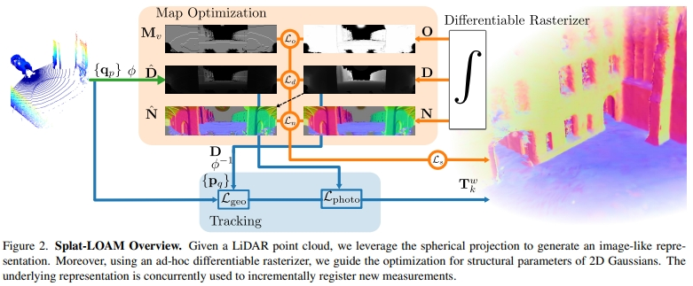
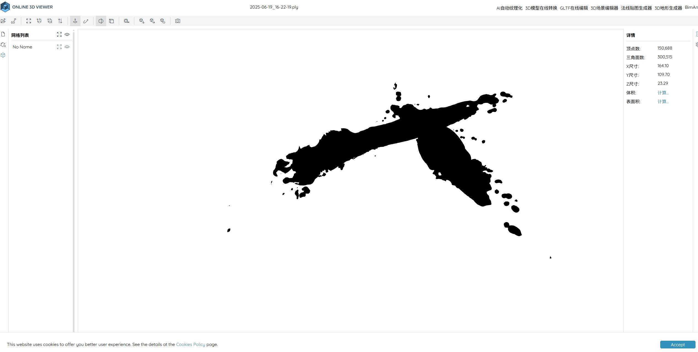

<!-- * 目录
{:toc} -->


<!-- !!!!!!!!!!!!!!!!!!!!!!!!!!!!!!!!!!!!!!!!!!!!!!!!!!!!!!!!!!!!!!!!!!!!!!!!!!!!!!!!!!!!!!!!!!!!!!!!!!!!!!!!!!!!!!!!!!!!!!!!!!! -->
# 引言

最近开源了一个基于lidar的2DGS工作。写下本博文，记录进行配置测试过程。

本博文仅供本人学习记录用~

* [paper](https://arxiv.org/pdf/2503.17491)
* [code](https://github.com/rvp-group/Splat-LOAM)
* 本博文复现过程采用的代码及代码注释（如有）：[My github repository](https://github.com/R-C-Group/Splat-LOAM)
* paper list for the 3DGS：[Awesome-3DGS-SLAM](https://github.com/KwanWaiPang/Awesome-3DGS-SLAM)


# 理论解读

本文提出的就是一个基于lidar以及2DGS场景表征的SLAM系统。并且是纯lidar没有跟image或者IMU相结合。
系统的框架如下图所示
<div align="center">
  
<figcaption>  
</figcaption>
</div>
直观来看应该就是把lidar点云投影成image，然后走2DGS一套。个人觉得跟最开始的lidar-based 3DGS《Drivinggaussian: Composite gaussian splatting for surrounding dynamic autonomous driving scenes》应该是很像的~
对比的方法则是用基于nerf的或者voxelbox的，没有跟最经典的算法进行对比。

# 实验测试

## 安装配置

* 可以采用作者提供的Docker或者Pixi，不过此处采用conda配置：

```sh
git clone --recursive https://github.com/R-C-Group/Splat-LOAM.git

# rm -rf .git

conda env create -f environment.yaml # for A100 with CUDA12.2/12.1
# # conda remove --name Splat-LOAM --all
conda activate Splat-LOAM
# bash post_install.sh

# 安装第一个模块
pip install ./submodules/diff-surfel-spherical-rasterization/

# 安装第二个模块
pip install ./submodules/gsaligner/

# 安装第三个模块
pip install ./submodules/simple-knn/
```

## 实验测试

* `configs`文件中含有运行所需要的配置
* 运行代码（注意要修改数据的路径,同时下载[kitti](https://www.cvlibs.net/datasets/kitti/eval_odometry.php)数据）

```sh
python3 run.py slam <path/to/config.yaml>

conda activate Splat-LOAM
python3 run.py slam configs/kitti/kitti-00-odom.yaml
```

* 注意，上述需要在`sequences/00`内还要有times.txt文件，故此需要下载图像帧
* 下面是成功运行的截图：

<div align="center">
  
<figcaption>  
</figcaption>
</div>

>[!TIP]
>If you want to solve `Mapping-only`, provide a trajectory in `data.trajectory_reader.filename`, set tracking to use it with `tracking.method=gt` and enable skipping of clouds that have no associated pose with `data.skip_clouds_wno_sync=true`

* 运行后提醒打开浏览器`http://127.0.0.1:9876/`,但是加载好久都加载不出来（改为MobaXterm即可）

<div align="center">
  
<figcaption>  
</figcaption>
</div>

* 若`output.folder`没有设置，实验结果会保存在 `results/<date_of_the_experiment>/`文件中(但实际运行中会遇到没有results导致跑了几个小时后没法保存模型...)

<div align="center">
  
<figcaption>  
</figcaption>
</div>

* 运行完SLAM后(运行的时间应该要好几个小时)，接下来可以基于SLAM的结果来生成mesh：

```sh
python3 run.py mesh <path/to/result/folder>
# conda activate Splat-LOAM
# python3 run.py mesh /home/gwp/Splat-LOAM/results/2025-06-19_09-40-53
```

<div align="center">
  
<figcaption>  
</figcaption>
</div>

* `.ply`文件拉到在线网站进行可视化:

<div align="center">
  
<figcaption>  
</figcaption>
</div>

* 为了验证所计算的mesh以及odometry，运行下面命令:

```sh
python3 run.py eval_recon <reference_pointcloud_file> <estimate_mesh> 

python3 run.py eval_odom <path/to/odom/estimate> \
                          --reference-filename <path/to/reference/trajectory> \
                          --reference-format <tum|kitti|vilens> \
                          --estimate-format <tum|kitti|vilens> \
```