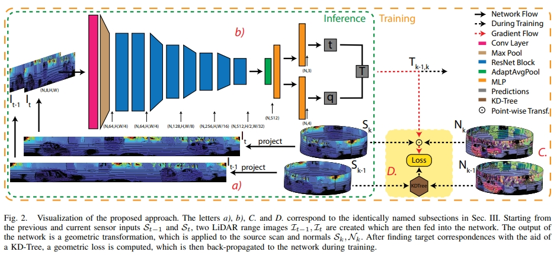
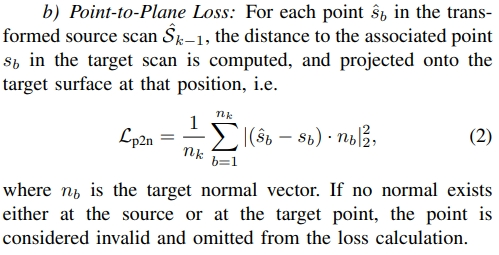
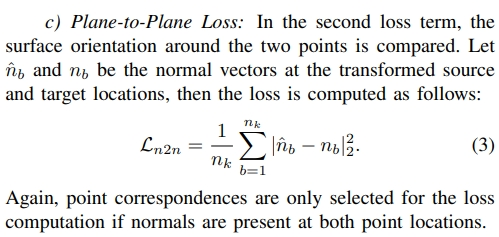
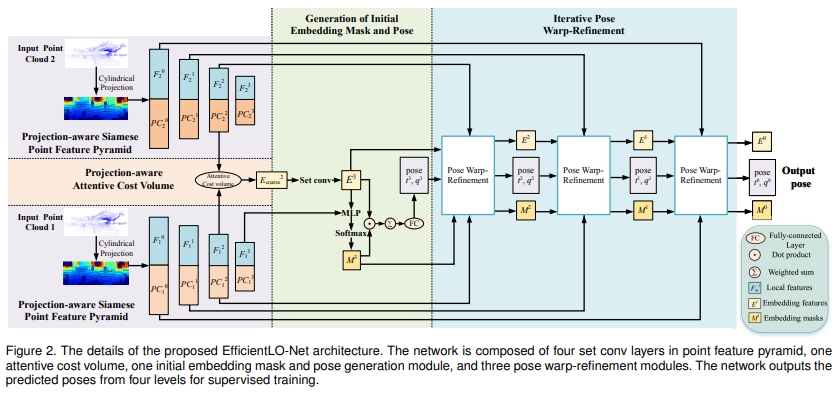
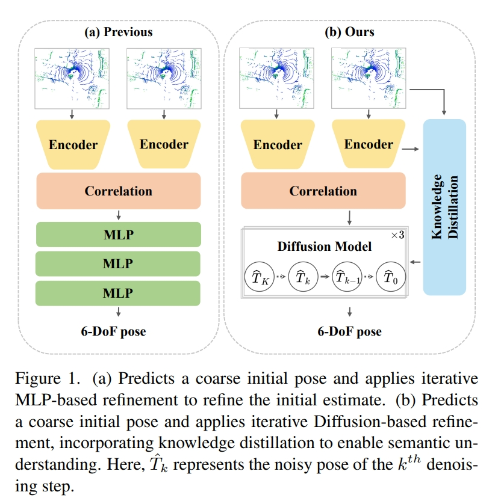
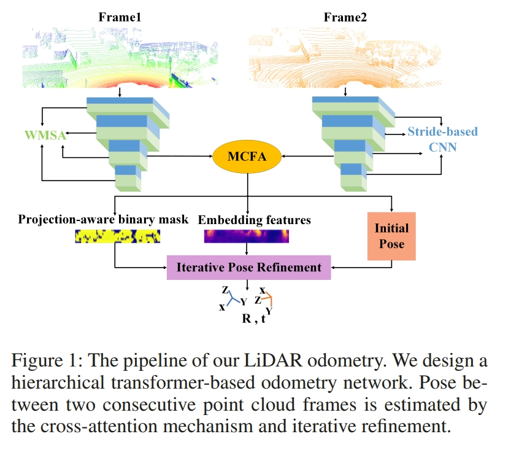
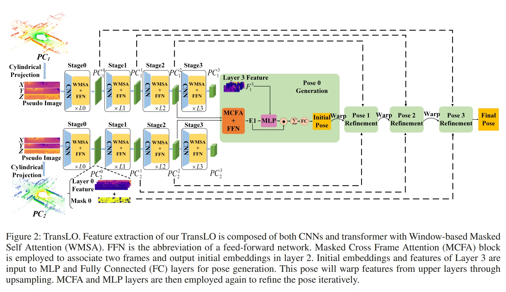
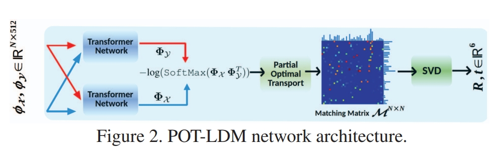

<!-- * 目录
{:toc} -->

<!--!!!!!!!!!!!!!!!!!!!!!!!!!!!!!!!!!!!!!!!!!!!!!!!!!!!!!!!!!!!-->
# 引言

本博文对基于learning的lidar odometry（包括lidar，lidar+IMU等）进行调研，并对一些经典的工作进行阅读。
本博文仅供本人学习记录用~

<!--!!!!!!!!!!!!!!!!!!!!!!!!!!!!!!!!!!!!!!!!!!!!!!!!!!!!!!!!!!!-->
# Paper List

* Keep update the paper list in: [Awesome-Learning-based-VO-VIO](https://github.com/KwanWaiPang/Awesome-Learning-based-VO-VIO#Learning-based-LiDAR-Odometry)

<!-- |---|`arXiv`|---|---|---| -->
<!--  -->

| Year | Venue | Paper Title | Repository | Note |
|:----:|:-----:| ----------- |:----------:|:----:|
|2025|`IEEE Sensor Journal`|[A Generative Hierarchical Optimization Framework for LiDAR Odometry Using Conditional Diffusion Models](https://ieeexplore.ieee.org/abstract/document/11026785/)|---|---|
|2025|`CVPR`|[DiffLO: Semantic-Aware LiDAR Odometry with Diffusion-Based Refinement](https://openaccess.thecvf.com/content/CVPR2025/papers/Huang_DiffLO_Semantic-Aware_LiDAR_Odometry_with_Diffusion-Based_Refinement_CVPR_2025_paper.pdf)||---| 
|2025|`arXiv`|[LIR-LIVO: A Lightweight, Robust LiDAR/Vision/Inertial Odometry with Illumination-Resilient Deep Features](https://arxiv.org/pdf/2502.08676)||Fast-LIVO+AirSLAM|
|2024|`arXiv`|[LiDAR Inertial Odometry And Mapping Using Learned Registration-Relevant Features](https://arxiv.org/pdf/2410.02961)||---|
|2024|`IEEE 100th Vehicular Technology Conference`|[LiDAR-OdomNet: LiDAR Odometry Network Using Feature Fusion Based on Attention](https://www.researchgate.net/profile/Parvez-Alam-20/publication/387812406_LiDAR-OdomNet_LiDAR_Odometry_Network_Using_Feature_Fusion_Based_on_Attention/links/677e43b8fb021f2a47e1e77e/LiDAR-OdomNet-LiDAR-Odometry-Network-Using-Feature-Fusion-Based-on-Attention.pdf)|---|---| 
|2024|`IROS`|[LiDAR-Visual-Inertial Tightly-coupled Odometry with Adaptive Learnable Fusion Weights](https://comrob.fel.cvut.cz/papers/iros24loc.pdf)|---|F-LOAM+VINS-Mono|
|2024|`TRO`|[PIN-SLAM: LiDAR SLAM Using a Point-Based Implicit Neural Representation for Achieving Global Map Consistency](https://arxiv.org/pdf/2401.09101v1)||---| 
|2024|`AAAI`|[DeepPointMap: Advancing LiDAR SLAM with Unified Neural Descriptors](https://arxiv.org/abs/2312.02684)||---| 
|2023|`ICCV`|[NeRF-LOAM: Neural Implicit Representation for Large-Scale Incremental LiDAR Odometry and Mapping](https://arxiv.org/pdf/2303.10709)||---| 
*|2023|`ICCV`|[DELO: Deep Evidential LiDAR Odometry using Partial Optimal Transport](https://openaccess.thecvf.com/content/ICCV2023W/UnCV/papers/Ali_DELO_Deep_Evidential_LiDAR_Odometry_Using_Partial_Optimal_Transport_ICCVW_2023_paper.pdf)||[website](https://skazizali.com/delo.github.io/)|
|2023|`AAAI`|[Translo: A window-based masked point transformer framework for large-scale lidar odometry](https://ojs.aaai.org/index.php/AAAI/article/download/25256/25028)||---| 
|2023|`RAL`|[LONER: LiDAR Only Neural Representations for Real-Time SLAM](https://arxiv.org/abs/2309.04937)||---| 
|2023|`TIV`|[HPPLO-Net: Unsupervised LiDAR Odometry Using a Hierarchical Point-to-Plane Solver](https://ieeexplore.ieee.org/stamp/stamp.jsp?tp=&arnumber=10160144&tag=1)||---| 
|2022|`TPAMI`|[Efficient 3D Deep LiDAR Odometry](https://arxiv.org/abs/2111.02135)||---| 
|2021|`ICRA`|[Self-supervised learning of lidar odometry for robotic applications](https://arxiv.org/pdf/2011.05418)||---| 
|2021|`CVPR`|[PWCLO-Net: Deep LiDAR Odometry in 3D Point Clouds Using Hierarchical Embedding Mask Optimization](https://openaccess.thecvf.com/content/CVPR2021/html/Wang_PWCLO-Net_Deep_LiDAR_Odometry_in_3D_Point_Clouds_Using_Hierarchical_CVPR_2021_paper.html)||---| 
|2021|`ISPRS`|[Deeplio: deep lidar inertial sensor fusion for odometry estimation](https://isprs-annals.copernicus.org/articles/V-1-2021/47/2021/isprs-annals-V-1-2021-47-2021.pdf)||---| 
|2020|`ACM international conference on multimedia`|[Lodonet: A deep neural network with 2d keypoint matching for 3d lidar odometry estimation](https://arxiv.org/pdf/2009.00164)|---|---|
|2020|`ICRA`|[Unsupervised geometry-aware deep lidar odometry](https://gisbi-kim.github.io/publications/ycho-2020-icra.pdf)|---|[website](https://sites.google.com/view/deeplo)|
|2020|`IROS`|[DMLO: Deep Matching LiDAR Odometry](https://arxiv.org/pdf/2004.03796)|---|---|
|2019|`IROS`|[Deeppco: End-to-end point cloud odometry through deep parallel neural network](https://arxiv.org/pdf/1910.11088)|---|---|
|2019|`CVPR`|[Lo-net: Deep real-time lidar odometry](https://openaccess.thecvf.com/content_CVPR_2019/papers/Li_LO-Net_Deep_Real-Time_Lidar_Odometry_CVPR_2019_paper.pdf)|---|---|
|2019|`CVPR`|[L3-net: Towards learning based lidar localization for autonomous driving](http://openaccess.thecvf.com/content_CVPR_2019/papers/Lu_L3-Net_Towards_Learning_Based_LiDAR_Localization_for_Autonomous_Driving_CVPR_2019_paper.pdf)|---|---|
|2018|`IEEE International Conference on Autonomous Robot Systems and Competitions`|[CNN for IMU assisted odometry estimation using velodyne LiDAR](https://arxiv.org/pdf/1712.06352)|---|---|
|2016|`RSS workshop`|[Deep learning for laser based odometry estimation](https://nicolaia.github.io/papers/rss_16_workshop.pdf)|---|---|

<!-- |---|`arXiv`|---|---|---| -->
<!--  -->

* 其他有代表性的基于learning的lidar工作或者point cloud registration：

| Year | Venue | Paper Title | Repository | Note |
|:----:|:-----:| ----------- |:----------:|:----:|
|2024|`arXiv`|[A Consistency-Aware Spot-Guided Transformer for Versatile and Hierarchical Point Cloud Registration](https://arxiv.org/pdf/2410.10295)||---|
|2020|`CVPR`|[3dregnet: A deep neural network for 3d point registration](https://openaccess.thecvf.com/content_CVPR_2020/papers/Pais_3DRegNet_A_Deep_Neural_Network_for_3D_Point_Registration_CVPR_2020_paper.pdf)||---|
|2020|`CVPR`|[P2b: Point-to-box network for 3d object tracking in point clouds](http://openaccess.thecvf.com/content_CVPR_2020/papers/Qi_P2B_Point-to-Box_Network_for_3D_Object_Tracking_in_Point_Clouds_CVPR_2020_paper.pdf)|---|---|
|2019|`CVPR`|[Pointconv: Deep convolutional networks on 3d point clouds](https://openaccess.thecvf.com/content_CVPR_2019/papers/Wu_PointConv_Deep_Convolutional_Networks_on_3D_Point_Clouds_CVPR_2019_paper.pdf)|---|---|
|2019|`ICCV`|[Meteornet: Deep learning on dynamic 3d point cloud sequences](https://openaccess.thecvf.com/content_ICCV_2019/papers/Liu_MeteorNet_Deep_Learning_on_Dynamic_3D_Point_Cloud_Sequences_ICCV_2019_paper.pdf)|---|---|
|2019|`ICCV`|[Deep closest point: Learning representations for point cloud registration](https://openaccess.thecvf.com/content_ICCV_2019/papers/Wang_Deep_Closest_Point_Learning_Representations_for_Point_Cloud_Registration_ICCV_2019_paper.pdf)|---|---|
|2019|`CVPR`|[Pointnetlk: Robust & efficient point cloud registration using pointnet](https://openaccess.thecvf.com/content_CVPR_2019/papers/Aoki_PointNetLK_Robust__Efficient_Point_Cloud_Registration_Using_PointNet_CVPR_2019_paper.pdf)||---|
|2019|`CVPR`|[3D local features for direct pairwise registration](https://openaccess.thecvf.com/content_CVPR_2019/papers/Deng_3D_Local_Features_for_Direct_Pairwise_Registration_CVPR_2019_paper.pdf)|---|---|
|2019|`ICCV`|[Deepvcp: An end-to-end deep neural network for point cloud registration](https://openaccess.thecvf.com/content_ICCV_2019/papers/Lu_DeepVCP_An_End-to-End_Deep_Neural_Network_for_Point_Cloud_Registration_ICCV_2019_paper.pdf)|---|---|
|2019|`CVPR`|[Flownet3d: Learning scene flow in 3d point clouds](http://openaccess.thecvf.com/content_CVPR_2019/papers/Liu_FlowNet3D_Learning_Scene_Flow_in_3D_Point_Clouds_CVPR_2019_paper.pdf)|---|---|
|2019|`IROS`|[Rangenet++: Fast and accurate lidar semantic segmentation](https://www.ipb.uni-bonn.de/wp-content/papercite-data/pdf/milioto2019iros.pdf)|---|---|
|2019|`ACM Transactions on Graphics`|[Dynamic graph cnn for learning on point clouds](https://dl.acm.org/doi/pdf/10.1145/3326362)|---|---|
|2018|`ECCV`|[3dfeat-net: Weakly supervised local 3d features for point cloud registration](http://openaccess.thecvf.com/content_ECCV_2018/papers/Zi_Jian_Yew_3DFeat-Net_Weakly_Supervised_ECCV_2018_paper.pdf)||---|
|2017|`NIPS`|[Pointnet++: Deep hierarchical feature learning on point sets in a metric space](https://proceedings.neurips.cc/paper_files/paper/2017/file/d8bf84be3800d12f74d8b05e9b89836f-Paper.pdf)|---|---|
|2017|`CVPR`|[Pointnet: Deep learning on point sets for 3d classification and segmentation](https://openaccess.thecvf.com/content_cvpr_2017/papers/Qi_PointNet_Deep_Learning_CVPR_2017_paper.pdf)|---|---|
|2015|`IROS`|[Voxnet: A 3d convolutional neural network for real-time object recognition](http://graphics.stanford.edu/courses/cs233-21-spring/ReferencedPapers/voxnet_07353481.pdf)|---|---|

<!-- |---|`arXiv`|---|---|---| -->
<!--  -->

<!--!!!!!!!!!!!!!!!!!!!!!!!!!!!!!!!!!!!!!!!!!!!!!!!!!!!!!!!!!!!-->
# 经典工作介绍

对于基于learning的lidar odometry主要有以下几个挑战：
1. 两帧离散的lidar scans如何建立准确的数据关联
2. 由于遮挡或者lidar的分辨率限制而导致的，属于同一个物体的点云，在两帧中不一致
3. 动态点云
4. 直接从原始3D点云学数据通常是低效的（由于点云的不规则及无序性），也就是如何获取更好的representation learning

## LONet: deep real-time LiDAR odometry
LONet是首个基于learning的lidar odometry，依赖于CNN的拟合能力。输入两个lidar scans，直接输出两者的relative motion。

网络end-to-end训练，没有任何的几何约束，容易出现overfitting的情况.

  <table style="border: none; background-color: transparent;">
    <tr align="center">
      <td style="width: 50%; border: none; padding: 0.01; background-color: transparent; vertical-align: middle;">
        
      </td>
      <td style="width: 50%; border: none; padding: 0.01; background-color: transparent; vertical-align: middle;">
        
      </td>
    </tr>
  </table>
  <figcaption>
  </figcaption>

## DMLO: Deep Matching LiDAR Odometry
DMLO在框架中明确强制执行几何约束,将6DoF姿态估计分为两个部分：
1. learning-based matching network给两个lidar扫描提供精确的correspondence
2. 通过近似的奇异值分解（SVD）来估算刚体变换。

将所有的lidar信息编码成2D的图像（如下图所示），进而可以通过CNN来提取feature以及局部的相似性，进而计算出scans之间的数据关联。

  
<figcaption>  
</figcaption>

而对于所获得的correspondence，也会额外估算其对应的权重，而对于获得的这些点云对（ matched pairs）再通过SVD来计算姿态变换。直观来看，有点像基于learning的`point cloud registration`+SVD进而实现lidar-based odometry.

  
<figcaption>  
</figcaption>

## Self-supervised Learning of LiDAR Odometry for Robotic Applications
关键点：
* no labeled or ground-truth data is required
* applicable to a wide range of environments and sensor modalities without requiring any network or loss function adjustments
* 6-DOF pose, being able to operate in real-time on a mobile-CPU.

对于lidar的点云，一般有三种处理的方式：
1. 将点云投影到2D image，然后用基于image的架构处理（比如Rangenet++）
2. 使用基于voxel的3D卷积（比如Voxnet，high memory-requirement）
3. 直接作用在disordered point cloud scans（比如Pointnet）

而本文采用的是第一种。

  
<figcaption>  
</figcaption>

通过KD-Tree寻找到所有的点云的 source 和 target的对应，构建`point-to-plane` 和 `plane-to-plane` 的loss.

  <table style="border: none; background-color: transparent;">
    <tr align="center">
      <td style="width: 50%; border: none; padding: 0.01; background-color: transparent; vertical-align: middle;">
        
      </td>
      <td style="width: 50%; border: none; padding: 0.01; background-color: transparent; vertical-align: middle;">
        
      </td>
    </tr>
  </table>
  <figcaption>
  </figcaption>

## Efficient 3D Deep LiDAR Odometry
首先提出了一种projection-aware representation of the 3D point cloud，然后提出了一个Pyramid, Warping, and Cost volume (PWC) 架构，而关于点云之间的关联则是采用`projection-aware attentive cost volume`
针对点云表达、数据关联、（动态点云）、如何提取有效的信息这四个问题，分别提出对应的模块针对处理。

  
<figcaption>  
</figcaption>

## DiffLO: Semantic-Aware LiDAR Odometry with Diffusion-Based Refinement
直观理解为将MLP或者ICP对coarse initial pose refine的过程用Diffusion来做
（the first diffusion-based LiDAR odometry network）

  <table style="border: none; background-color: transparent;">
    <tr align="center">
      <td style="width: 50%; border: none; padding: 0.01; background-color: transparent; vertical-align: middle;">
        
      </td>
      <td style="width: 50%; border: none; padding: 0.01; background-color: transparent; vertical-align: middle;">
        
      </td>
    </tr>
  </table>
  <figcaption>
  </figcaption>

点云的特征提取则是采用PointConv。而对于图中的语义感知模块，在推理的时候都需要retraining

## Translo: A window-based masked point transformer framework for large-scale lidar odometry
这个工作则是基于transformer的lidar odometry（the first transformer-based LiDAR odometry network）
而点云则是也是投影到2D 图像平面来处理的`project point clouds onto a cylindrical surface to get pseudo images`

  <table style="border: none; background-color: transparent;">
    <tr align="center">
      <td style="width: 50%; border: none; padding: 0.01; background-color: transparent; vertical-align: middle;">
        
      </td>
      <td style="width: 50%; border: none; padding: 0.01; background-color: transparent; vertical-align: middle;">
        
      </td>
    </tr>
  </table>
  <figcaption>
  </figcaption>

# DELO: Deep Evidential LiDAR Odometry using Partial Optimal Transpor
则是采用将点云降采样为固定的数量的点，然后用graph cnn来编码获取特征。然后也用transformer进行数据关联，然后再通过一个网络来估算变换以及用GTSAM来优化姿态：

  <table style="border: none; background-color: transparent;">
    <tr align="center">
      <td style="width: 50%; border: none; padding: 0.01; background-color: transparent; vertical-align: middle;">
        
      </td>
      <td style="width: 50%; border: none; padding: 0.01; background-color: transparent; vertical-align: middle;">
        
      </td>
    </tr>
  </table>
  <figcaption>
  </figcaption>

## Pointconv: Deep convolutional networks on 3d point clouds

