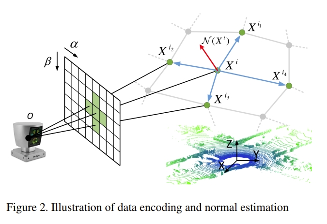
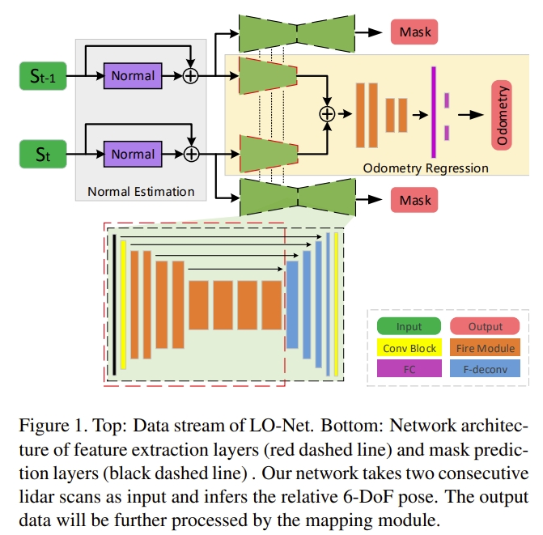
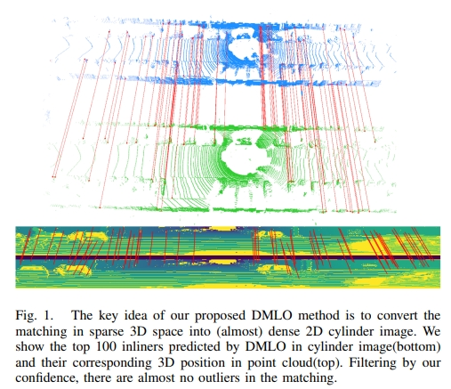
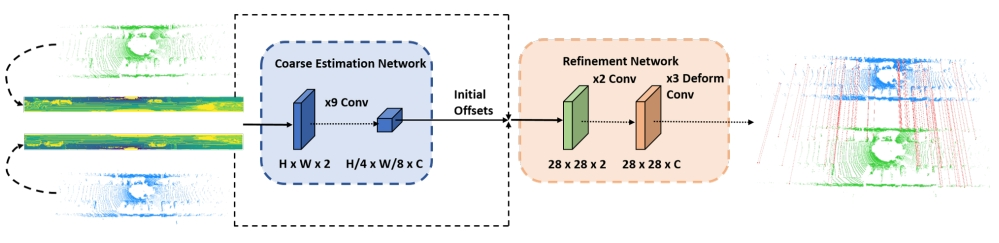

<!-- * 目录
{:toc} -->

<!--!!!!!!!!!!!!!!!!!!!!!!!!!!!!!!!!!!!!!!!!!!!!!!!!!!!!!!!!!!!-->
# 引言

本博文对基于learning的lidar odometry（包括lidar，lidar+IMU等）进行调研，并对一些经典的工作进行阅读。
本博文仅供本人学习记录用~

<!--!!!!!!!!!!!!!!!!!!!!!!!!!!!!!!!!!!!!!!!!!!!!!!!!!!!!!!!!!!!-->
# Paper List

* Keep update the paper list in: [Awesome-Learning-based-VO-VIO](https://github.com/KwanWaiPang/Awesome-Learning-based-VO-VIO#Learning-based-LiDAR-Odometry)

<!-- |---|`arXiv`|---|---|---| -->
<!--  -->

| Year | Venue | Paper Title | Repository | Note |
|:----:|:-----:| ----------- |:----------:|:----:|
|2025|`arXiv`|[LIR-LIVO: A Lightweight, Robust LiDAR/Vision/Inertial Odometry with Illumination-Resilient Deep Features](https://arxiv.org/pdf/2502.08676)||Fast-LIVO+AirSLAM| 
|2024|`IROS`|[LiDAR-Visual-Inertial Tightly-coupled Odometry with Adaptive Learnable Fusion Weights](https://comrob.fel.cvut.cz/papers/iros24loc.pdf)|---|---|
|2024|`TRO`|[PIN-SLAM: LiDAR SLAM Using a Point-Based Implicit Neural Representation for Achieving Global Map Consistency](https://arxiv.org/pdf/2401.09101v1)||---| 
|2024|`AAAI`|[DeepPointMap: Advancing LiDAR SLAM with Unified Neural Descriptors](https://arxiv.org/abs/2312.02684)||---| 
|2023|`ICCV`|[NeRF-LOAM: Neural Implicit Representation for Large-Scale Incremental LiDAR Odometry and Mapping](https://arxiv.org/pdf/2303.10709)||---| 
|2023|`RAL`|[LONER: LiDAR Only Neural Representations for Real-Time SLAM](https://arxiv.org/abs/2309.04937)||---| 
|2023|`TIV`|[HPPLO-Net: Unsupervised LiDAR Odometry Using a Hierarchical Point-to-Plane Solver](https://ieeexplore.ieee.org/stamp/stamp.jsp?tp=&arnumber=10160144&tag=1)||---| 
|2022|`TPAMI`|[Efficient 3D Deep LiDAR Odometry](https://arxiv.org/abs/2111.02135)||---| 
|2021|`ICRA`|[Self-supervised learning of lidar odometry for robotic applications](https://arxiv.org/pdf/2011.05418)||---| 
|2021|`CVPR`|[PWCLO-Net: Deep LiDAR Odometry in 3D Point Clouds Using Hierarchical Embedding Mask Optimization](https://openaccess.thecvf.com/content/CVPR2021/html/Wang_PWCLO-Net_Deep_LiDAR_Odometry_in_3D_Point_Clouds_Using_Hierarchical_CVPR_2021_paper.html)||---| 
|2021|`ISPRS`|[Deeplio: deep lidar inertial sensor fusion for odometry estimation](https://isprs-annals.copernicus.org/articles/V-1-2021/47/2021/isprs-annals-V-1-2021-47-2021.pdf)||---| 
|2020|`ACM international conference on multimedia`|[Lodonet: A deep neural network with 2d keypoint matching for 3d lidar odometry estimation](https://arxiv.org/pdf/2009.00164)|---|---|
|2020|`ICRA`|[Unsupervised geometry-aware deep lidar odometry](https://gisbi-kim.github.io/publications/ycho-2020-icra.pdf)|---|[website](https://sites.google.com/view/deeplo)|
|2020|`IROS`|[DMLO: Deep Matching LiDAR Odometry](https://arxiv.org/pdf/2004.03796)|---|---|
|2019|`IROS`|[Deeppco: End-to-end point cloud odometry through deep parallel neural network](https://arxiv.org/pdf/1910.11088)|---|---|
|2019|`CVPR`|[Lo-net: Deep real-time lidar odometry](https://openaccess.thecvf.com/content_CVPR_2019/papers/Li_LO-Net_Deep_Real-Time_Lidar_Odometry_CVPR_2019_paper.pdf)|---|---|
|2018|`IEEE International Conference on Autonomous Robot Systems and Competitions`|[CNN for IMU assisted odometry estimation using velodyne LiDAR](https://arxiv.org/pdf/1712.06352)|---|---|
|2016|`RSS workshop`|[Deep learning for laser based odometry estimation](https://nicolaia.github.io/papers/rss_16_workshop.pdf)|---|---|

*  point cloud registration: 

<!-- |---|`arXiv`|---|---|---| -->
<!--  -->

| Year | Venue | Paper Title | Repository | Note |
|:----:|:-----:| ----------- |:----------:|:----:|
|2020|`CVPR`|[3dregnet: A deep neural network for 3d point registration](https://openaccess.thecvf.com/content_CVPR_2020/papers/Pais_3DRegNet_A_Deep_Neural_Network_for_3D_Point_Registration_CVPR_2020_paper.pdf)||---|
|2019|`ICCV`|[Deep closest point: Learning representations for point cloud registration](https://openaccess.thecvf.com/content_ICCV_2019/papers/Wang_Deep_Closest_Point_Learning_Representations_for_Point_Cloud_Registration_ICCV_2019_paper.pdf)|---|---|
|2019|`CVPR`|[Pointnetlk: Robust & efficient point cloud registration using pointnet](https://openaccess.thecvf.com/content_CVPR_2019/papers/Aoki_PointNetLK_Robust__Efficient_Point_Cloud_Registration_Using_PointNet_CVPR_2019_paper.pdf)||---|
|2019|`CVPR`|[3D local features for direct pairwise registration](https://openaccess.thecvf.com/content_CVPR_2019/papers/Deng_3D_Local_Features_for_Direct_Pairwise_Registration_CVPR_2019_paper.pdf)|---|---|
|2018|`ECCV`|[3dfeat-net: Weakly supervised local 3d features for point cloud registration](http://openaccess.thecvf.com/content_ECCV_2018/papers/Zi_Jian_Yew_3DFeat-Net_Weakly_Supervised_ECCV_2018_paper.pdf)||---|
|2019|`ICCV`|[Deepvcp: An end-to-end deep neural network for point cloud registration](https://openaccess.thecvf.com/content_ICCV_2019/papers/Lu_DeepVCP_An_End-to-End_Deep_Neural_Network_for_Point_Cloud_Registration_ICCV_2019_paper.pdf)|---|---|

<!-- |---|`arXiv`|---|---|---| -->
<!--  -->

* 其他有代表性的基于learning的lidar工作

| Year | Venue | Paper Title | Repository | Note |
|:----:|:-----:| ----------- |:----------:|:----:|
|2017|`CVPR`|[Pointnet: Deep learning on point sets for 3d classification and segmentation](https://openaccess.thecvf.com/content_cvpr_2017/papers/Qi_PointNet_Deep_Learning_CVPR_2017_paper.pdf)|---|---|

<!-- |---|`arXiv`|---|---|---| -->
<!--  -->

<!--!!!!!!!!!!!!!!!!!!!!!!!!!!!!!!!!!!!!!!!!!!!!!!!!!!!!!!!!!!!-->
# 经典工作介绍

## LONet: deep real-time LiDAR odometry
LONet是首个基于learning的lidar odometry，依赖于CNN的拟合能力。输入两个lidar scans，直接输出两者的relative motion。

网络end-to-end训练，没有任何的几何约束，容易出现overfitting的情况.

  <table style="border: none; background-color: transparent;">
    <tr align="center">
      <td style="width: 50%; border: none; padding: 0.01; background-color: transparent; vertical-align: middle;">
        
      </td>
      <td style="width: 50%; border: none; padding: 0.01; background-color: transparent; vertical-align: middle;">
        
      </td>
    </tr>
  </table>
  <figcaption>
  </figcaption>

## DMLO: Deep Matching LiDAR Odometry
DMLO在框架中明确强制执行几何约束,将6DoF姿态估计分为两个部分：
1. learning-based matching network给两个lidar扫描提供精确的correspondence
2. 通过近似的奇异值分解（SVD）来估算刚体变换。

将所有的lidar信息编码成2D的图像（如下图所示），进而可以通过CNN来提取feature以及局部的相似性，进而计算出scans之间的数据关联。

  
<figcaption>  
</figcaption>

而对于所获得的correspondence，也会额外估算其对应的权重，而对于获得的这些点云对（ matched pairs）再通过SVD来计算姿态变换。直观来看，有点像基于learning的`point cloud registration`+SVD进而实现lidar-based odometry.

  
<figcaption>  
</figcaption>

