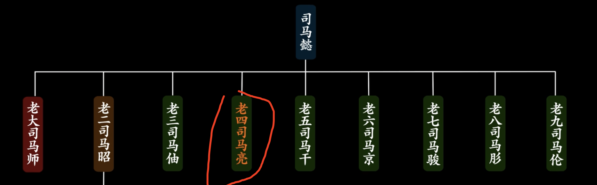
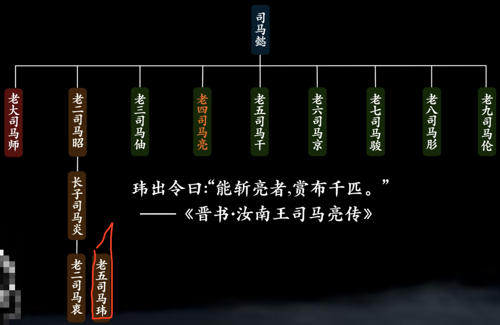
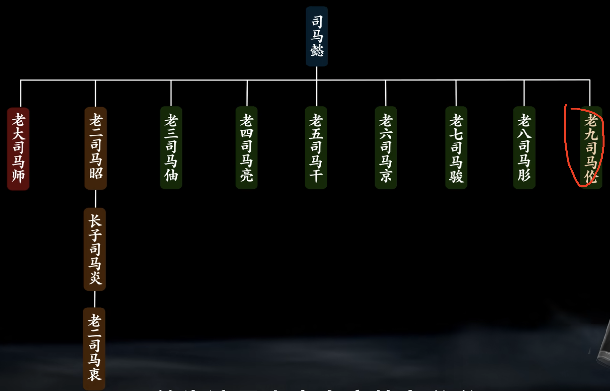
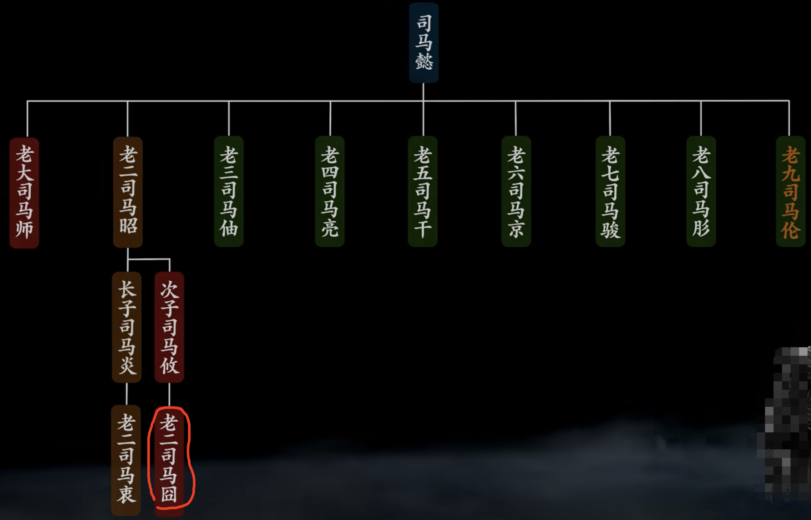
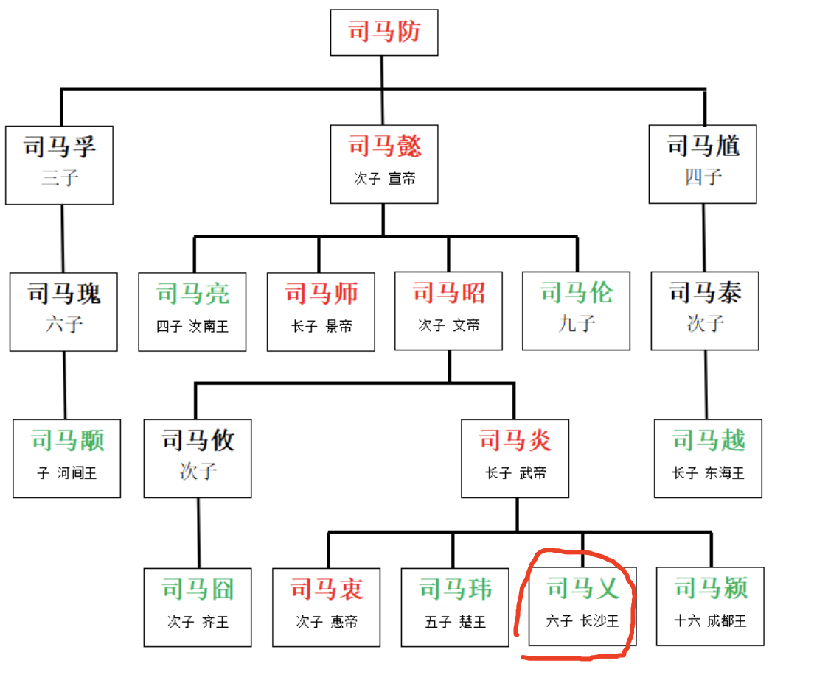
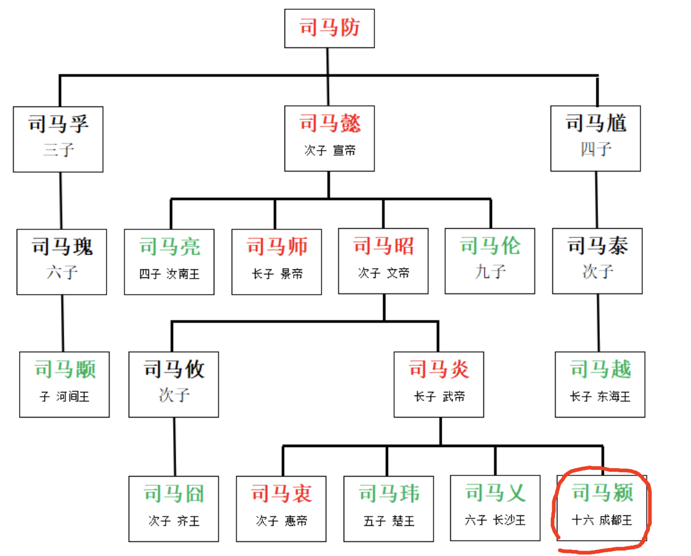
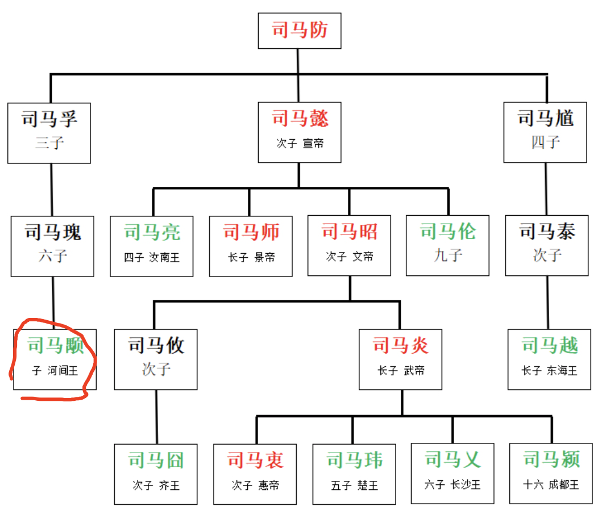
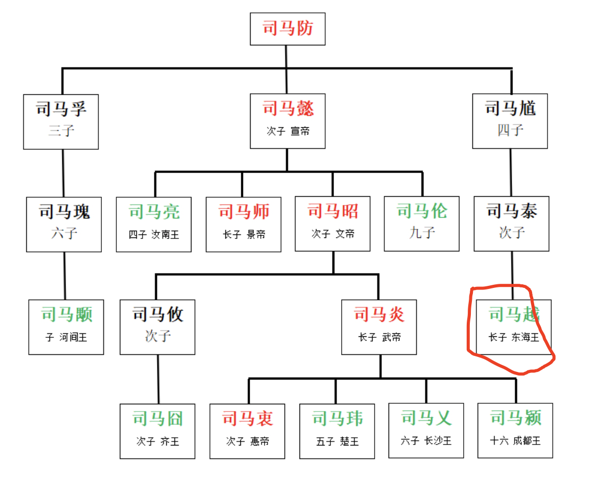
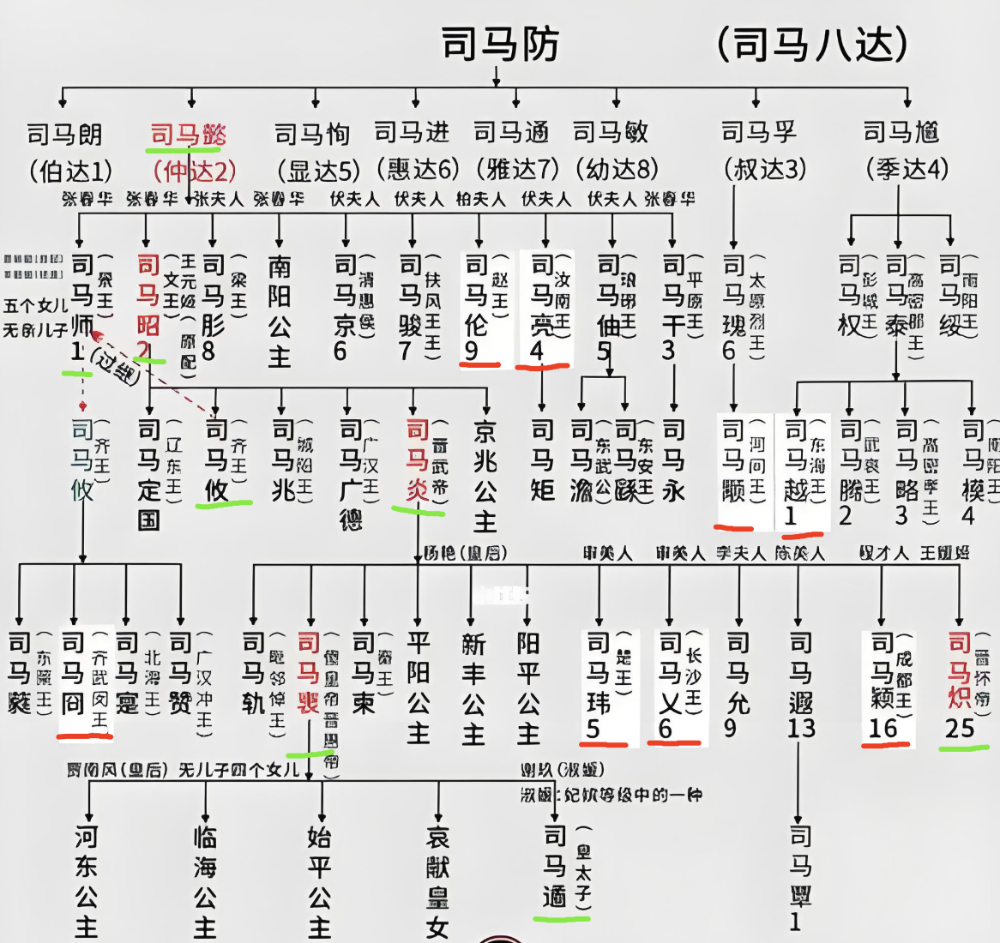

<!-- * 目录
{:toc} -->

<!-- !!!!!!!!!!!!!!!!!!!!!!!!!!!!!!!!!!!!!!!!!!!!!!!!!!!!!!!!!!!!!!!!!!!!!!!!!!!!!!!!!!!!!!!!!!!!!!!!!!!!!!!!!!!!!!!!!!!!!!!!!!! -->
# 引言

在了解两晋历史的时候，对于八王之乱可以说是非常的乱。

为了理顺这个关系，本博文对八王之乱进行整理总结。部分资料来源于网络

晋武帝司马炎为了让自己的儿子笨儿子晋惠帝司马衷（`何不食肉糜`）能顺利保住帝位最终能传给他最爱的孙子司马遹制定了三大权利集团：
1. 外戚（老丈人）杨骏（皇后杨芷之父）
2. 宗室（叔叔）司马亮辅政，并且分封诸司马为王
3. 世家大族

但杨骏及杨芷却在司马炎病重的时刻大权独揽了。

而妖后——贾南风（贾充之女），则是八王之乱的揭幕人，她秘密联系司马玮，让其入京（带着弟弟，淮南王司马允）

而贾南风借司马衷之名下诏，以谋反之罪，让司马玮等去诛杀杨骏。

## 第一王——（汝南王）司马亮

  
<figcaption>  
</figcaption>

贾南风政变成功后，为了不让自己成为众矢之的，让司马亮（宗亲代表）为太宰，卫瓘（士族代表，曾摸着龙椅对司马炎说`此座可惜`）为录尚书事，两人掌权。

司马玮此时为禁军的一把手，但司马亮和卫瓘并不喜欢他，觉得“太黑了”，想让废掉其禁军之位以及让封王回封地。

贾南风则借此机会，用马衷之名秘诏，司马玮去平调司马亮和卫瓘。

## 第二王——司马玮（楚王）

  
<figcaption>  
</figcaption>

司马玮灭掉了司马亮和卫瓘后，却被贾南风命人以“驺虞幡”（用于解兵，止战）说司马玮是假传圣纸诛杀大臣，就把他擒住并杀了

## 第三王——（赵王）司马伦

  
<figcaption>  
</figcaption>

司马伦本为关中地区的负责人，但是其怠政，导致小数民族造反，并召回京城洛阳。

而他回到京城后确跟贾南风混到一起了。

而贾南风却用计谋让司马遹在醉酒的情况下写（照抄）下大逆不道的信件。
最终司马遹被废去太子之位。

而太子党并不服气，准备联合司马伦一起政变。
但其谋主孙秀却建议，先股动贾南风弄掉司马遹，然后再以太子之名去弄掉皇后。

之后，司马伦以此为由，联合司马囧（齐王），发动政变，诛杀贾南风及贾家党

而司马伦则在孙秀的策划下，独揽大权，大肆封官（狗尾续貂）

期间，（淮南王）司马允（司马炎的第九子）也曾举兵讨伐司马伦，结果兵败被杀。

最后，司马伦甚至篡位称帝，改称司马衷为太上皇。

## 第四王——（齐王）司马囧

  
<figcaption>  
</figcaption>

但对于一起政变的司马囧，却被调到许昌，并且被安插眼线监视。

因此，司马囧起兵叛变，并派使节通知（成都王）司马颖，（河间王）司马颙，（长沙王）司马乂；以诛杀逆贼孙秀的名义共同出兵。

其中，（成都王）司马颖在半路就集结了二十万大军

在长安的（河间王）司马颙本来是支持司马伦的，结果得到情报，看到藩王们声势好大，因此反水。

最终京师兵大败。而洛阳城的文武百官则是发动政变，在王舆的带领下，诛杀了司马伦，然后让司马衷复位。

而此时，司马囧、司马颖、司马颙则是被封九锡，分别为大将军、大司马、太尉。

  
<figcaption> 
什么是九锡？ 
</figcaption>

但这三者都对皇位心心念念。
其中，（成都王）司马颖在谋士卢志的建议下，辞官回封地，收揽人心。

而司马囧（齐王）则是大权在握，骄奢淫逸。

而李含则是到长安骗（河间王）司马颙说“皇帝密诏其出兵伐司马囧”。而（河间王）司马颙则是上书“请（长沙王）司马乂废掉（齐王）司马囧，让（成都王）司马颖辅政”，强行把众人拉入局。

于是（齐王）司马囧想先把身在洛阳的（长沙王）司马乂干掉。最后双方进行了激烈的巷战，最终（齐王）司马囧被手下人抓住，纳“投名状”

## 第五王——（长沙王）司马乂

  
<figcaption>  
</figcaption>

（河间王）司马颙一下懵逼了，本来当枪使的却成了主角。于是，先是派李含等人去谋杀（长沙王）司马乂，但不成功，于是起兵讨伐。

而（成都王）司马颖也一起谋划，共同起兵。

三王在洛阳斗得精疲力尽。

而此时，（东海王）司马越暗中出手，联合禁卫军将（长沙王）司马乂抓起来，用火烤死了。

## 第六王——（成都王）司马颖

  
<figcaption>  
</figcaption>

而此时权利最强，口碑最好的则是（成都王）司马颖。

他自封丞相，留下五万大军控制洛阳，自己则回邺城，遥控朝政。

然后（河间王）司马颙提议下，（成都王）司马颖被封为`皇太弟`

看着自己已经大权在握，（成都王）司马颖开始享乐，把自己的口碑败光了。
而留守洛阳的五万大军更是被（东海王）司马越策反，起兵十万，由司马衷御驾亲征，带兵去讨伐（成都王）司马颖。

但是被司马颖的大将石超大败，而司马衷也被带到邺城囚禁了。

而幽州的王浚则拉着鲜卑、乌桓以及并州的（东赢公）司马腾一起进攻邺城。而刘渊此时在（成都王）司马颖手下，说自己可以回去召集五部匈奴。

但没等到救兵，（成都王）司马颖就被击败，带着司马衷一起逃到洛阳。

而此时（河间王）司马颙则把司马衷迁到关中长安，走之前张方洗劫了洛阳

## 第七王——（河间王）司马颙

  
<figcaption>  
</figcaption>

司马衷到了长安后，权利落到（河间王）司马颙手中，其先把（成都王）司马颖的皇太弟身份给了（豫章王）司马炽。

同时封（东海王）司马越为太傅，和（河间王）司马颙共同辅政。但（东海王）司马越并不接受。

之后，（东海王）司马越号召各州郡，起兵勤王，并被选为盟主。并任命（琅琊王）司马睿监徐州诸军事（王导为参军）。
然后率军西征。

在军事不利的情况下，（河间王）司马颙将自己的大将张方刺杀，把其首级送给（东海王）司马越求和。但不被接受。

后来，王浚带着鲜卑兵杀入关中。守军一簇击溃。

（河间王）司马颙败逃，司马衷也被接回洛阳。

而（成都王）司马颖最后被捉住押到邺城，刘舆矫诏命其自尽。
之后司马衷则是因为吃了毒饼去世了，有说法是（东海王）司马越毒害的。

而皇太弟，（豫章王）司马炽即位（晋怀帝），又把（河间王）司马颙召回京当宰相。却在半路被大汉掐死了。

## 第八王——（东海王）司马越

  
<figcaption>  
</figcaption>

成为了十六年（公元291——公元306）八王之乱的胜利者

（晋怀帝）司马炽即位的第二年，改年号为“永嘉”（公元307）

司马越让督徐州的（琅琊王）司马睿去督扬州，镇守建业（南京），这也就是后来东晋得以延续的关键了～

接下来，胡人大举入侵：
* 石勒攻下邺城
* 刘渊下的刘聪、刘曜、王弥、石勒四处攻伐。最终称帝（汉赵国）。
* 四川此时被李特的成汉政权把持。

但此时（东海王）司马越只顾着自己的权利斗争。最终刘聪围攻洛阳。

虽然第一次围困洛阳不成。但是第二次继续发兵讨伐。

而（东海王）司马越则是以讨伐石勒的名义带兵出征，在路上听到（晋怀帝）司马炽密诏让荀晞讨伐自己，被气死了。

## 西晋——永嘉之乱

最后司马炽被刘曜俘虏，也就是史称的`永嘉之乱`。

此时西晋，名存实亡，而刘聪更是在宴会上让（晋怀帝）司马炽当小二给人倒酒。大臣失声痛哭，于是没多久（晋怀帝）司马炽被处死。

公元313年，皇太子（晋愍帝）司马邺即位于长安。而公元316年，十七岁的（晋愍帝）司马邺开城投降～

  
<figcaption>  
司马睿为司马伷的孙子
</figcaption>

# 参考资料
* [三百年乱世风云【两晋南北朝】](https://www.bilibili.com/video/BV1UWTXzAEbi/?spm_id_from=333.1387.top_right_bar_window_history.content.click&vd_source=a88e426798937812a8ffc1a9be5a3cb7)
