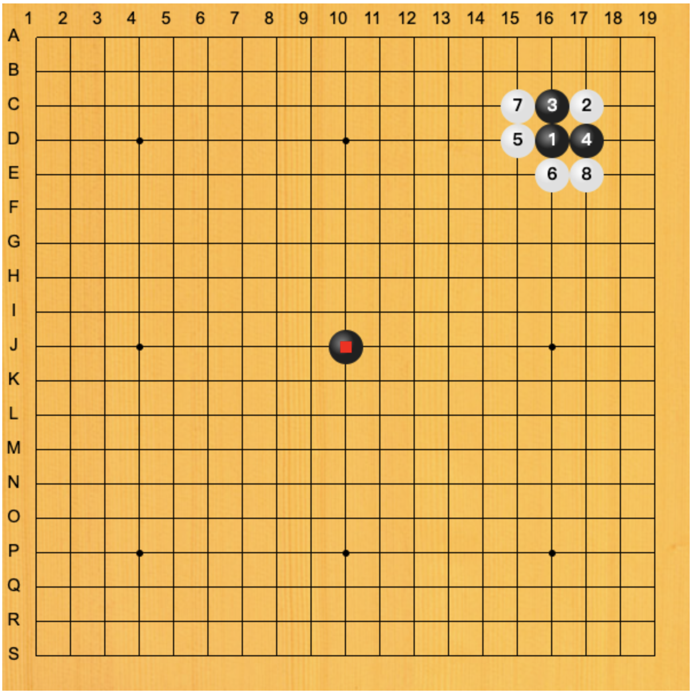
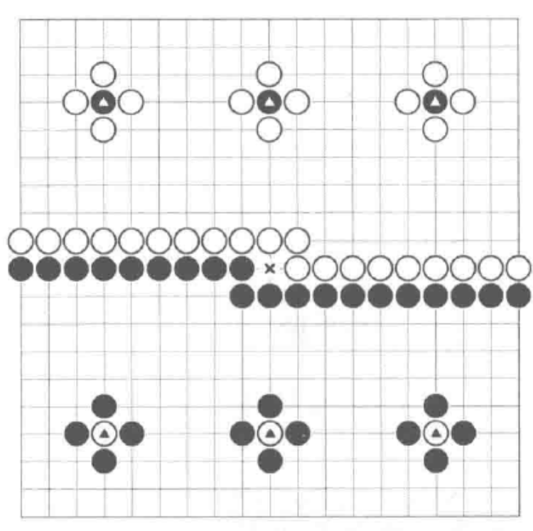

<!-- * 目录
{:toc} -->

<!-- !!!!!!!!!!!!!!!!!!!!!!!!!!!!!!!!!!!!!!!!!!!!!!!!!!!!!!!!!!!!!!!!!!!!!!!!!!!!!!!!!!!!!!!!!!!!!!!!!!!!!!!!!!!!!!!!!!!!!!!!!!! -->
# 引言

最近开始了解围棋。先是采用别人的项目做了[网页棋盘](https://kwanwaipang.github.io/Chess/Go/)，然后通过[OGS](https://online-go.com/)，跟各等级AI对弈；后续发现[101围棋网](https://www.101weiqi.com/)可以做题且对战.

慢慢的，觉得这并不足以更好学习围棋，为此开始看棋书，因此，写下本博文，记录本人看棋书过程中的一些摘抄～

# 棋盘各个位置的叫法：

  
<figcaption>  
</figcaption>

* 1号黑子：星位（角星、边星）
* 2号白子：三三
* 3、4号黑子：小目
* 5、6号白子：高目
* 7、8号白子：“目外”
* 中间黑子：天元
 

# 如何判断输赢
首先注意的是，围棋是围底盘来判断输赢，而非吃子。`子空皆为地，地多者胜`

棋盘上空着的交叉点为`空`，空的单位为`目`。

围棋一共有361个交叉点，而黑子有181个子，白子有180个。

注意，在实战中，明显可以提掉的棋子，没有必要浪费一手棋去提。

围棋中判定胜负主要是两种：中国围棋采用数子法，日韩则是数目法

## 数子法
`子空皆地，地多为胜`。一方的棋子及其所围的空的总和就是全部地盘。
* 黑棋有先行的优势，需要贴还3.75子给白棋。也就是黑棋为181+3.75=184.75为胜，记住为黑为185子为胜利即可。

如下图所示。标注△的棋子为被吃掉的棋子，双方都在自己的地盘内吃子，不影响地盘大小。故此黑子为180子，最后中间x为黑子下，故此最终黑子为181子。但根据要贴子的规则，黑子至少为185才算赢。因此，此局白子胜。

  
<figcaption>  
</figcaption>

## 数目法

`提子和空皆为目，目多为胜`
* 黑棋有先行的优势，需要贴6.5目给白棋，也就是最终黑棋至少比白棋多7目才可以获胜。

# 对弈记录
* 部分对弈的录屏放在[Link](https://www.youtube.com/playlist?list=PLfTJm1vL5ELO8ntWEcZDjbNVpczhxa1ew)

# 参考资料
* 这里有一些围棋的电子书资源[Link](https://www.qjql.net/newgo/qipupdf_list.asp)
* [知行合弈](https://www.qjql.net/newgo/pdfjs/web/viewer.html?file=../../pdf/%E5%9B%B4%E6%A3%8B%E5%9B%BE%E4%B9%A6/100155.pdf)
