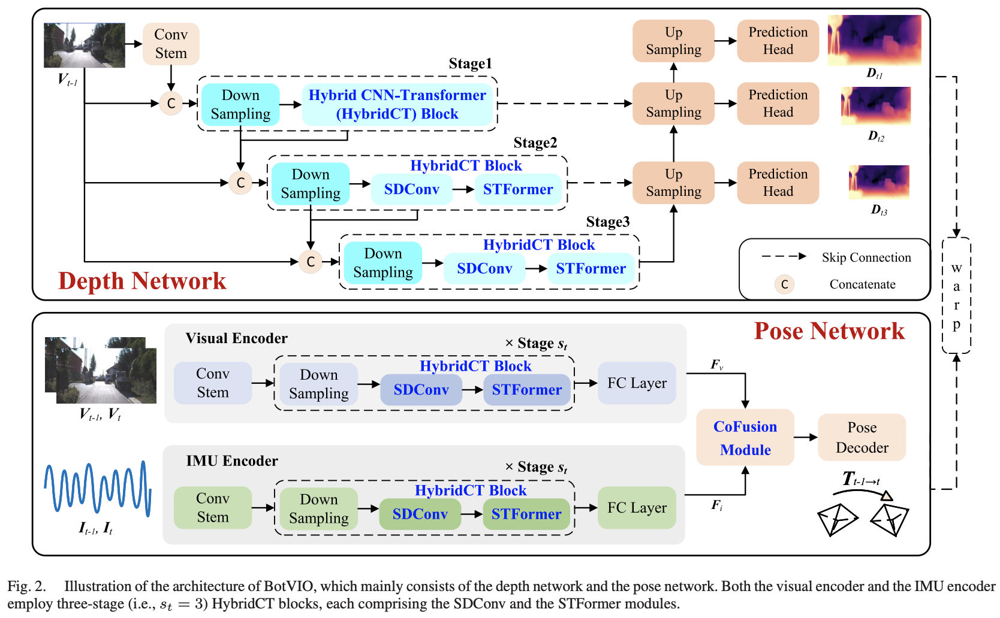

<!-- * 目录
{:toc} -->


<!-- !!!!!!!!!!!!!!!!!!!!!!!!!!!!!!!!!!!!!!!!!!!!!!!!!!!!!!!!!!!!!!!!!!!!!!!!!!!!!!!!!!!!!!!!!!!!!!!!!!!!!!!!!!!!!!!!!!!!!!!!!!! -->
# 引言

本博文对于 2025 TRO的Transformer-based VIO工作进行阅读及复现。

本博文仅供本人学习记录用~

* [paper](https://ieeexplore.ieee.org/abstract/document/11024235)
* [code](https://github.com/wenhuiwei-ustc/BotVIO)
* 基于Transformer的SLAM工作调研：[paper list](https://github.com/KwanWaiPang/Awesome-Transformer-based-SLAM)
* 基于Learning的SLAM工作调研：[paper list](https://github.com/KwanWaiPang/Awesome-Learning-based-VO-VIO)
* 本博文复现过程采用的代码及代码注释（如有）：[My github repository](https://github.com/R-C-Group/BotVIO)


# 理论阅读

本文提出的是一个基于transformer的自监督VIO模型，结合shallow CNN以及时空增强的transformer来代替传统的基于learning的卷积架构。而极简交叉融合模块（cross-fusion module）使用单层的交叉注意力机制（cross-attention）来增强多模态（视觉与IMU）的交互。

大部分的基于learning的VIO方法都是需要大数据来进行监督学习的，并且需要真值数据。
而现有也有一些自监督的工作<sup>[1](https://www.sciencedirect.com/science/article/pii/S0893608022000752),[2](https://github.com/KwanWaiPang/Awesome-Transformer-based-SLAM/blob/pdf/file/Attention_Guided_Unsupervised_learning_of_Monocular_Visual-inertial_Odometry.pdf),[3](https://ieeexplore.ieee.org/stamp/stamp.jsp?arnumber=8691513),[4](https://www.ijcai.org/proceedings/2020/0325.pdf)</sup>，都是利用pose和depth的估计作为自监督信号，最小化图像重构的loss来作为训练，这样也避免了对GT label的需求.
尽管如此，这些方法对计算量、硬件要求、实时性都带来了挑战。并且这些方法都是基于ResNet或者VGGNet为骨架的，他们虽然很优秀但是对于计算量和内存消耗都比较大。

CNN在提取局部特征上表现是比较好，但是`their limited receptive fields hinder the extraction of long-range features essential for accurate pose estimation`(个人解读为其无法提取长距离或者说更大的局部特征，比如时间维度、运动距离较大等～)，因此，一般都是通过更深或更复杂的网络来提升其感受野，但这也会导致计算量激增。

而基于LSTM（或者RNN）的网络，也同样面临着大计算量以及内存需求（并且根据之前调研learning-based IO的经验，LSTM类型的网络训练并不好收敛）。而近年来，基于transformer的VIO也有不少对工作<sup>[1](https://arxiv.org/pdf/2101.02143),[2](https://github.com/KwanWaiPang/Awesome-Transformer-based-SLAM/blob/pdf/file/Attention_Guided_Unsupervised_learning_of_Monocular_Visual-inertial_Odometry.pdf)</sup>,但这些工作都需要多层的transformer，特别是在高分辨率图像上计算量巨大，也没有达到轻量级VIO的需求。

因此，作者提出采用单层的transformer（single-layer transformers）来设计自监督的VIO模型。其架构主要包括：

1.轻量级的CNN-transformer级联结构，作为视觉与IMU的统一的encoder来提取特征。特别地，作者设计了一个` spatial–temporal-enhanced transformer`来更好的获取长距离的信息，以减少卷积层的数目。
2. 不再依赖于更深的CNN，而是采用`shallow dilated convolution (SDConv)`来增大感受野，SDConv可以用于减少特征的维度，进而减少计算量，并提高多尺度特征表达


<div align="center">
  
<figcaption>  
</figcaption>
</div>


# 代码复现

## 配置测试

```sh
git clone https://github.com/R-C-Group/BotVIO.git  --recursive

conda create -n botvio python=3.10
conda activate botvio

conda install pytorch torchvision torchaudio pytorch-cuda=12.1 -c pytorch -c nvidia
pip install timm==0.4.12
pip install matplotlib
pip install gdown
pip install scipy
pip install scikit-image
pip install einops
pip install opencv-python
```

Data Preparation:采用KITTI数据集(注意要留有空间)

```sh
cd data
source data_prep.sh 
```

然后下载预训练模型[link](https://drive.google.com/drive/folders/1D-CpdPKyOwRMFlU-sp0dhslvIBmx9oxf?usp=drive_link),并且放在`pretrain_models`路径下

~~~
cd ./pretrain_models
python download.py
~~~

计算pose的结果：

```sh
conda activate botvio

python ./evaluations/eval_odom.py #这句运行需要创建一个results文件，并且运行了没有任何结果输出～～～

# CUDA_VISIBLE_DEVICES=0 PYTHONPATH=/home/gwp/BotVIO/ python ./evaluations/evaluate_pose_vo.py --load_weights_folder=pretrain_models  --data_path=data
# Please modify '--data_path' in the options.py file to specify your dataset path. 
# Additionally, update the pose embedding data type to float16 in PositionalEncodingFourier function within the depth encoder.py file.  
# In addtion, comment out the fully connected (FC) layer in the pose_encoder.py.
# 注意vio中有一个额外的全链接层，如果运行vo的时候要注释

#需要先创建空的文件夹results
CUDA_VISIBLE_DEVICES=0 PYTHONPATH=/home/gwp/BotVIO/ python ./evaluations/evaluate_pose_vio.py --load_weights_folder=pretrain_models  --data_path=data --eval_data_path=data
# Please modify '--data_path' in the options.py file to specify your dataset path. Additionally, update the pose embedding data type to float16 in PositionalEncodingFourier function within the depth encoder.py file.
```

运行效果结果：

<div align="center">
  
<figcaption>  
</figcaption>
</div>

整体而言只能测试序列9，序列10结果是nan，并且代码似乎有不少bug，无法运行，本人github push的版本是fixed的了～

