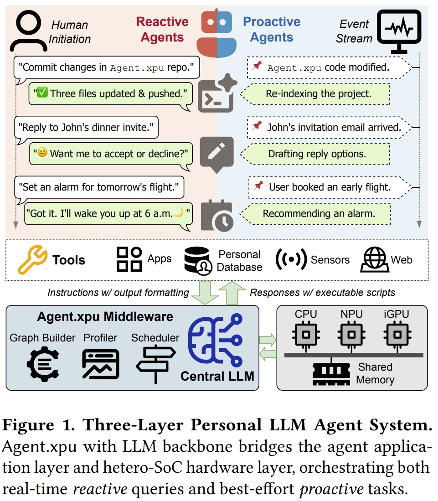
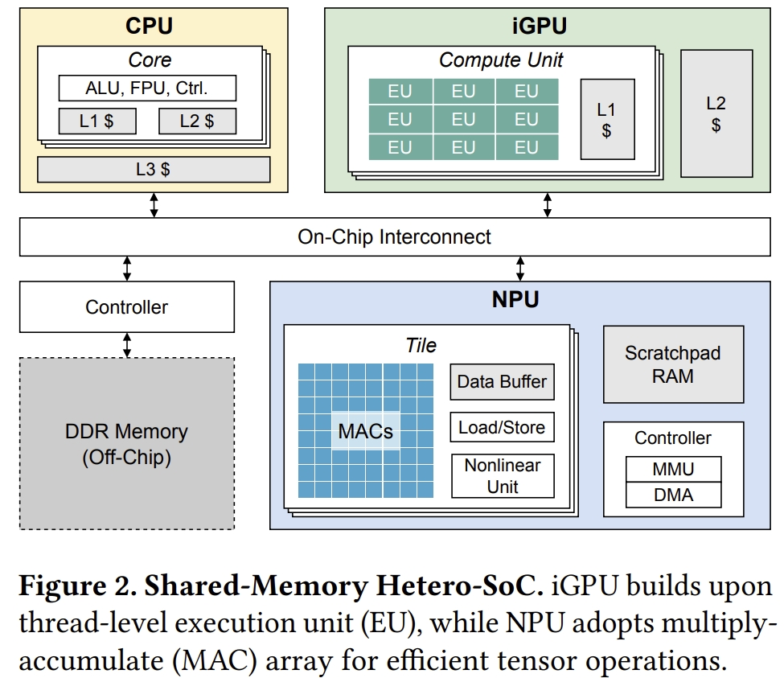

<!-- * 目录
{:toc} -->

最近在了解hardware acceleration方面的topic，正好前辈老师给我推荐了这篇论文，在此对其进行拜读。

本博文为论文阅读笔记，仅供本人学习记录用～

* 论文链接[Link](https://arxiv.org/pdf/2506.24045)

<!-- !!!!!!!!!!!!!!!!!!!!!!!!!!!!!!!!!!!!!!!!!!!!!!!!!!!!!!!!!!!!!!!!!!!!!!!!!!!!!!!!!!!!!!!!!!!!!!!!!!!!!!!!!!!!!!!!!!!!!!!!!!! -->
# 引言及研究背景

* LLM代理的兴起：代理式大语言模型（Large Language Models，LLMs）驱动的个人代理（如智能助手）需在本地设备（手机/PC）处理两类任务：
    * 反应式任务（Reactive tasks）：用户发起的，要求即时、低延迟的响应（例如＜100ms）。
    * 主动式任务（Proactive tasks）：在后台隐式运行的长期任务，优先考虑吞吐量。
* 硬件平台局限：现有的消费级SoC（如Intel Core Ultra）配备CPU、集成GPU（iGPU）和神经网络处理单元（NPU），但存在内存带宽受限（共享LPDDR）、加速器异构性（NPU静态计算 vs. iGPU动态支持）和资源竞争等问题，无法高效管理这些冲突的请求。

该工作介绍了Agent.xpu，首个面向代理负载的异构SoC调度系统。
通过专门的离线剖析（offline profiling），Agent.xpu首先构建一个异构执行图（heterogeneous execution graph, HEG），该图融合并分块模型内核，用于基于亲和性引导的弹性加速器映射，并带有预测性内核标注。
在运行时，其在线调度器支持细粒度的内核级抢占，以保证反应式任务的响应性。
为了最大化SoC利用率，它采用空闲感知内核回填（slack-aware kernel backfill）机会性地附加主动式任务，并通过带宽感知调度（bandwidth-aware dispatch）缓解NPU-iGPU争用。
该系统实现反应式任务延迟降低4.6倍；主动式任务吞吐提升1.6–6.8倍；最大化SoC资源利用率（NPU/iGPU协作）。

作为设备端AI的基础，现代系统级芯片（system-on-chip，SoC）倾向于集成异构加速器，包括
CPU、集成GPU（iGPU）和神经网络处理单元（neural processing units，NPU）。
而基于PC或手机端设备的LLM日益增长的需求引发了硬件层面的激烈竞争。

然而，现实世界的个人助手与设备端LLM之间的差距仍在扩大。一方面，现有的设备端推理优化工作专注于孤立的推理任务，忽略了代理式LLM调用的动态性和并发性。
另一方面，代理式工作流优化的工作主要针对具有任务语义的多租户LLM服务，而未考虑个人设备上个人LLM代理的独特工作负载。

下图展示了代理式LLM工作负载,也就是跟上面提到的两种任务相对应：
* 主动式工作负载（Proactive workload）：守护进程（daemon-like）式代理监听预定事件信号并据此采取行动，无需人工干预。主动式代理是轻松的，在后台消化事件流，没有严格的截止期限。
* 反应式工作负载（Reactive workload）：由用户对话触发并期望及时响应。以LLM驱动的编码为例，主动式代理监控代码变更，静默执行项目解析、缓存构建或代码补全；而反应式代理则按需响应用户提示，根据当前上下文提供解释、建议或修复。作为中央协调器，LLM解析自然语言查询并生成融合其内部知识与工具交互命令的输出。

  
<figcaption>  
</figcaption>

这两个混合的工作负载在高效执行上面临以下的挑战：
1. LLM的动态特性与加速器的硬件刚性之间存在不匹配。NPU擅长处理静态的、预编译的计算图，但难以应对LLM推理固有的可变序列长度问题；而更灵活的iGPU则面临较低能效和图形任务干扰的问题。
2. 共享内存SoC上受限的内存资源和带宽争用造成了关键瓶颈，导致性能下降，尤其是在延迟敏感型（latency-sensitive）和吞吐量导向型（throughput-oriented）任务并发运行时。
3. 当前的异构SoC运行时，为代理式工作负载提供的抽象不足，缺乏对细粒度抢占、优先级调度和动态批处理（dynamic batching）的原生支持，而这些对于高效地共置（co-locate）反应式和主动式任务是必需的。

针对现有的这些主流推理引擎的缺陷（孤立推理设计，无法协调混合负载）。本文提出的Agent.xpu以在异构SoC上高效调度代理式LLM工作负载。
在高动态性、资源受限的异构SoC上，同时保障反应式任务的低延迟与主动式任务的高吞吐。
其设计的关键在于理解并协调不同的主动式和反应式任务，将它们智能地映射到底层硬件上，以平衡延迟、吞吐量和能效。

主要贡献点如下：
1. 系统性地分析了代理式LLM工作负载的独特特性，量化了现代异构SoC上的算子-XPU亲和性（operator-XPU affinity）、内存争用（memory contention）、批处理效应（batching effects）以及主动-反应式干扰（proactive-reactive interference）。
2. 异构执行图（heterogeneous execution graph, HEG）：一种以异构为中心的计算抽象，用于弹性XPU映射。它支持一种原则性的、异构的预填充（prefill）和解码（decode）阶段分解（disaggregation）方法，跨越NPU和iGPU，以利用加速器优势并减轻干扰。
    * 弹性核映射：将LLM算子按亲和性分组（如GEMM→NPU、MHA→iGPU），支持运行时动态绑定。
    * 预填充-解码解耦：预填充（计算密集型）优先分派至NPU，解码（内存密集型）由iGPU处理，避免阶段干扰。
    * 分块优化：长序列拆分为固定大小块（如4096 tokens），适应NPU静态编译需求（详见图3）。
3. 在线调度器（online scheduler）：结合了用于保证反应式响应性的细粒度内核级抢占机制，以及用于主动式任务工作守恒（work conserving）的空闲感知回填（slack-aware backfill）机制。其内置的XPU协调器（XPU coordinator）实现自适应内核分派（adaptive kernel dispatch），以避免带宽争用、减少流水线气泡（pipeline bubbles）并最大化系统吞吐量。
    * 细粒度抢占：在核边界（非迭代级）保存上下文（KV缓存指针），实现反应式任务即时响应（＜100ms）
    * 空闲感知回填（Slack-Aware Backfill）：利用反应式任务空闲间隙（如iGPU内存等待期），动态附加主动式任务。
    * 带宽争用管理：实时监测DRAM压力，按阈值调度核并发。
    * 统一内存架构优化：消除CPU-加速器间数据拷贝，通过指针传递实现零开销上下文切换。

# 理论部分

## 异构SoC (Heterogeneous SoC)

  
<figcaption>  
</figcaption>

系统架构
* 离线阶段：
    1. 性能画像：量化算子-XPU亲和性（如GEMM在NPU能效比iGPU高3×）、内存带宽敏感度。
    2. HEG构建：融合线性/非线性算子，标注核执行时间、内存占用等预测参数。
* 在线阶段：
    1. 双队列调度：实时队列（反应式任务）优先于尽力而为队列（主动式任务）。
    2. XPU协调器：动态分派核至NPU/iGPU，支持核级抢占与回填（图5）。

# 主要实验结果与结论

关键性能：
* 反应式任务延迟：
    * Agent.xpu：平均4.6倍降低（图7），尤其在主动任务高负载下保持稳定（Llama.cpp延迟陡增）。
* 主动式任务吞吐：
    * Agent.xpu：1.6–6.8倍提升（图6），NPU利用率达85%，iGPU负载＜30%。
* 资源效率：
    * 内存带宽争用减少40%（通过分时调度GEMV类核）。
    * 能耗降低2.1倍（J/token），因NPU处理高能效GEMM。

Agent.xpu通过HEG解耦计算阶段与动态核调度，在异构SoC上首次实现代理负载的高效并发：低延迟（反应式）与高吞吐（主动式）的协同优化，为端侧LLM代理系统奠定基础。