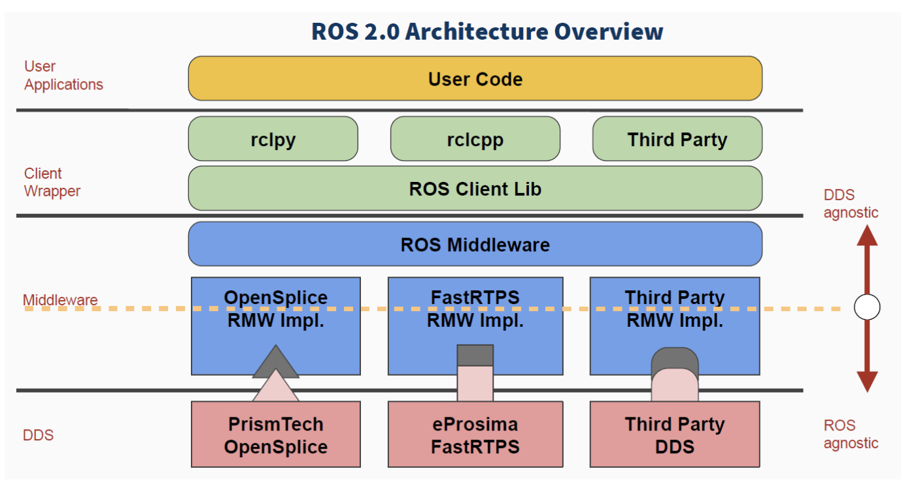

<!-- * 目录
{:toc} -->

之前开发一直上基于ROS的，而针对ROS也写过大量的技术博客[My CSDN Blog](https://blog.csdn.net/gwplovekimi/category_9361572.html?spm=1001.2014.3001.5482)（从学习、debug再到论文复现等等）。

后来，ROS2也发布了，但是由于两个平台的代码不太兼容，为此实验室SLAM团队一直还是使用ROS1，直到最近才慢慢有部分代码是支持ROS2的，为此，本博文在对ROS2做初步了解的同时，再针对ROS/ROS2存在的一些问题进行分析。

本博文仅供本人学习记录用～

<!-- !!!!!!!!!!!!!!!!!!!!!!!!!!!!!!!!!!!!!!!!!!!!!!!!!!!!!!!!!!!!!!!!!!!!!!!!!!!!!!!!!!!!!!!!!!!!!!!!!!!!!!!!!!!!!!!!!!!!!!!!!!! -->
# ROS1与ROS2的区别

ROS1 是2007年诞生的，在活跃的开源社区的支持下，功能不断丰富，代码数量不断庞大，但是其整体设计其实并不太科学，缺乏安全性、实时性、鲁棒性并不太符合工业和具体的行业应用。但是ROS1已经积重难返，一些重要涉及底层的修改，会使ROS1更加不稳定，而且会不可避免遇到大量ROS1 包代码兼容性问题。
与其缝缝补补，不如重新创建一个更加科学稳定的ROS2。而目前ROS1 的Noetic 将于2025年停止支持，

## 系统架构
* ROS1：采用中心化架构，依赖roscore或Master节点管理所有节点通信。Master一旦崩溃，整个系统瘫痪。
* ROS2：采用分布式架构，基于DDS（Data Distribution Service） 实现节点自发现通信，无单点故障风险，更适合多机器人协同和工业环境
  
## 通信机制
* ROS1：基于TCP/UDP协议（TCPROS/UDPROS），存在延迟高、丢包率高、无加密机制的问题，且服务调用为同步阻塞模式（客户端需等待响应）。
* ROS2：
    * 通过DDS支持多种QoS策略（如实时性、可靠性配置），适应弱网络环境。
    * 服务调用改为异步模式，支持零拷贝传输，降低CPU负载。
    * 提供端到端加密，满足工业安全需求。

## 跨平台与实时性
* ROS1：主要支持Linux，实时性差（非实时内核），难用于嵌入式或汽车控制等场景。
* ROS2：支持Linux、Windows、MacOS、RTOS（如VxWorks），甚至无操作系统的微控制器。通过DDS实现软/硬实时控制（如1ms级运动学解算）

下面表格对其进行对比：

|对比项	|ROS1	|ROS2|
|:----:|:-----:|:----:|
|架构|	中心化（依赖Master）|	分布式（DDS自发现）|
|实时性|	弱（非实时内核）|	强（支持软/硬实时）|
|通信协议|	TCP/UDP（无QoS）|	DDS（可配置QoS）|
|平台支持|	主要Linux	|Linux, Windows, MacOS, RTOS, MCU|
|默认语言|	Python2 + C++03|	Python3 + C++11/14/17|
|编译系统|	Catkin	|Ament + Colcon|

ROS1代码需重写才能在ROS2运行，主要因API和通信机制重构：
* API差异：如节点初始化、话题订阅、服务定义等接口完全不同（e.g., ros::init() → rclcpp::init()）。
* 消息定义：ROS2消息包需添加命名空间（如std_msgs/msg/String vs ROS1的std_msgs/String）。
* 编译系统：CMakeLists.txt和package.xml格式变更（e.g., catkin → ament_cmake）

通过bridge把ros1的消息类似于repub成ros2的格式，进而实现ros1和ros2节点双向通信。

# ROS2

ROS2在设计之初，就考虑到要满足各种各样机器人应用的需求。

1. 多机器人系统：未来机器人一定不会是独立的个体，机器人和机器人之间也需要通信和协作，ROS2为多机器人系统的应用提供了标准方法和通信机制。
2. 跨平台：机器人应用场景不同，使用的控制平台也会有很大差异，比如自动驾驶汽车中的算力性能肯定比AMR机器人强很多，为了让所有机器人都可以运行ROS2，ROS2可以跨平台运行于Linux、Windows、MacOS、RTOS，甚至是没有任何系统的微控制器（MCU）上，这样我们就不用纠结自己的控制器能不能用ROS了。
3. 实时性：机器人运动控制和很多行为策略要求机器人具备实时性，比如机器人要可靠得在100ms内发现前方的行人，或者稳定的在1ms周期内完成运动学、动力学的解算，ROS2为类似这样的实时性需求提供了基本保障。
4. 网络连接：无论在怎样的网络环境下，ROS2都可以尽量保障机器人大量数据的完整性和安全性，比如在wifi信号不好的时候数据也要尽力发送过去，在有黑客入侵风险的场景下要对数据进行加密解密。
5. 产品化：，大量机器人已经走向我们的生活，未来还会越来越多，ROS2不仅可以用于机器人研发阶段，还可以直接搭载在产品中，走向消费市场，这对ROS2的稳定性、强壮性也提除了巨大挑战。
6. 项目管理：机器人开发是一个复杂的系统工程，设计、开发、调试、测试、部署等全流程的项目管理工具和机制，也会在ROS2中体现，更方便我们去开发一款机器人。

所以ROS2是一个全新的机器人操作系统，在借鉴ROS1成功经验的基础上，对系统架构和软件代码全部进行了重新设计和实现。与ROS1相比，体现在以下几点：
1. 系统架构进行了颠覆性的变化，ROS1中所有节点都需要在节点管理器ROS Master的管理下进行工作，一旦Master出现问题，系统就面临宕机的风险，ROS2实现了真正的分布式，不再有Master这个角色，借助一种全新的通信框架DDS（discovery——自发现机制，找到彼此，从而建立稳定的通信连接。），为所有节点的通信提供可靠保障。
2. 软件API进行了重新设计，ROS1原有的接口已经无法满足需求，ROS2结合C++最新标准和Python3语言特性，设计了更具通用性的API，虽然导致原有ROS1的代码无法直接在ROS2中运行，但是尽量保留了类似的使用方法，同时提供了大量移植的说明。
3. 编译系统进行了升级，ROS1中使用的rosbuild和catkin问题诸多，尤其是针对代码较多的大项目以及Python编写的项目，编译、链接经常会出错，ROS2对这些问题也进行了优化，重新优化后的编译系统叫做ament和colcon

其架构对比见下图：

  
<figcaption>  
</figcaption>

在上图中，左侧是ROS1，右侧是ROS2，两者最明显的变化，那就是Master。（上面第一点已经描述过，此处不在叙述）

中间层是ROS封装好的标准通信接口，写程序的时候，会频繁和这些通信接口打交道，比如发布一个图像的数据，接收一个雷达的信息，客户端库会再调用底层复杂的驱动和通信协议。而在ROS1中，ROS通信依赖底层的TCP和UDP协议，而在ROS2中，通信协议更换成了更加复杂但也更加完善的DDS系统。

最后最大的区别就是可安装的操作系统了，ros1主要在linux上，而ros2可选项较多。

## DDS通信

ROS2相比ROS1最大的变化，除了省略了Master之外，应该就是通信系统的变化了。ROS1中基于TCP/UDP的通信系统，频繁诟病于延迟、丢数据、无法加密等问题，ROS2中的DDS在通信层面的功能就丰富多了。

DDS其实是物联网中广泛应用的一种通信协议，类似于我们常听说的5G通信一样，DDS是一个国际标准，能够实现该标准的软件系统并不是唯一的，所以我们可以选择多个厂家提供的DDS系统，比如这里的OpenSplice、FastRTPS，还有更多厂家提供的，每一家的性能不同，适用的场景也不同。

而针对不同DDS厂家的软件接口不一致的情况，ROS2设计了一个ROS Middleware，简称RMW，也就是指定一个标准的接口，比如如何发数据，如何收数据，数据的各种属性如何配置，都定义好了，如果厂家想要接入ROS社区，就得按照这个标准写一个适配的接口，把自家的DDS给移植过来，这样就把问题交给了最熟悉自家DDS的厂商。对于我们这些用户来讲，某一个DDS用的不爽，只要安装另一个，然后做一个简单的配置，程序一行的都不用改，轻松更换底层的通信系统。

举一个例子，比如我们在产品开发时，可以先用开源版本的DDS满足基本需求，部署交付的产品时，再更换为商业版本更稳定的DDS，这样可以减少开发成本。

  
<figcaption>  
</figcaption>

# 关于国产自主可控机器人操作系统的几点思考

## 提升生态兼容性与迁移效率

# 总结性思考
* ros系统虽然称呼为系统，但是它本质上是一个协议（异步的通讯协议）所有的调度都基于这个协议来。因此，真正意义上的机器人操作系统应该把ros或许类似ros的协议都包含到内存中，而并非像现在常规的操作：先安装ubuntu然后安装ros
~~~
为此，真正意义上的基于ROS的操作系统，应该硬件上做到微内核层，仿照Linux。
把通信层植入系统内核，而ros的节点作为内核的进程、线程，在硬件上为传感器提供标准的内核驱动。
~~~
* ros系统本身也很臃肿，真正放到商业上面，有的时候自主开发一个系统比ros还快，因为ros本身主要就是通讯协议，是一个伪系统。
* 两个系统均无开放式大数据——人工智能发展的关键是大数据，而高质量、高效数据基础上降低AI落地门槛。
* ros1和ros2的编译、仿真工具（如Gazebo）仍依赖国际开源社区，国产替代未成熟。而机器人开发中，仿真可以实现降本增效。
~~~
仿真环境（如 Gazebo）允许开发者在虚拟环境中测试算法、运动规划、多机协作等场景，避免实物损坏风险。
物理引擎是仿真的基石：如 NVIDIA PhysX、Bullet 等国际引擎，直接影响碰撞检测、动力学模拟的精度。
Gazebo 是 ROS 默认仿真工具，其物理引擎依赖 ODE/Bullet 等国际开源项目，开发主导权在欧美团队手中。
~~~
* 虽然相比起ros1，ros2有较大的提升，但是ROS2依赖DDS实现（如Fast DDS、Cyclone DDS），多为欧美主导的开源或商业产品

# 参考资料
* [ROS2对比ROS1](https://book.guyuehome.com/ROS2/1.%E7%B3%BB%E7%BB%9F%E6%9E%B6%E6%9E%84/1.2_ROS2%E5%AF%B9%E6%AF%94ROS1/)