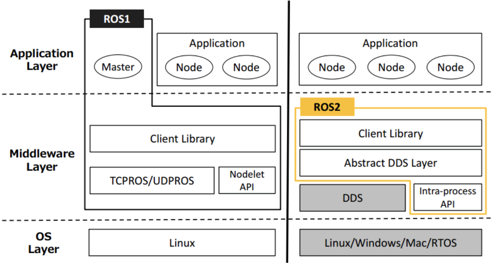

<!-- * 目录
{:toc} -->

之前开发一直上基于ROS的，而针对ROS也写过大量的技术博客[My CSDN Blog](https://blog.csdn.net/gwplovekimi/category_9361572.html?spm=1001.2014.3001.5482)（从学习、debug再到论文复现等等）。

后来，ROS2也发布了，但是由于两个平台的代码不太兼容，为此实验室SLAM团队一直还是使用ROS1，直到最近才慢慢有部分代码是支持ROS2的，为此，本博文在对ROS2做初步了解的同时，再针对ROS/ROS2存在的一些问题进行分析。

本博文仅供本人学习记录用～

<!-- !!!!!!!!!!!!!!!!!!!!!!!!!!!!!!!!!!!!!!!!!!!!!!!!!!!!!!!!!!!!!!!!!!!!!!!!!!!!!!!!!!!!!!!!!!!!!!!!!!!!!!!!!!!!!!!!!!!!!!!!!!! -->
# ROS1与ROS2的区别

ROS1 是2007年诞生的，在活跃的开源社区的支持下，功能不断丰富，代码数量不断庞大，但是其整体设计其实并不太科学，缺乏安全性、实时性、鲁棒性并不太符合工业和具体的行业应用。但是ROS1已经积重难返，一些重要涉及底层的修改，会使ROS1更加不稳定，而且会不可避免遇到大量ROS1 包代码兼容性问题。与其缝缝补补，不如重新创建一个更加科学稳定的ROS2。而目前ROS1 的Noetic 将于2025年停止支持，

其架构对比见下图：

  
<figcaption>  
</figcaption>

## 系统架构
* ROS1：采用中心化架构，依赖roscore或Master节点管理所有节点通信。Master一旦崩溃，整个系统瘫痪。
* ROS2：采用分布式架构，基于DDS（Data Distribution Service） 实现节点自发现通信，无单点故障风险，更适合多机器人协同和工业环境
  
## 通信机制
* ROS1：基于TCP/UDP协议（TCPROS/UDPROS），存在延迟高、丢包率高、无加密机制的问题，且服务调用为同步阻塞模式（客户端需等待响应）。
* ROS2：
    * 通过DDS支持多种QoS策略（如实时性、可靠性配置），适应弱网络环境。
    * 服务调用改为异步模式，支持零拷贝传输，降低CPU负载。
    * 提供端到端加密，满足工业安全需求。

## 跨平台与实时性
* ROS1：主要支持Linux，实时性差（非实时内核），难用于嵌入式或汽车控制等场景。
* ROS2：支持Linux、Windows、MacOS、RTOS（如VxWorks），甚至无操作系统的微控制器。通过DDS实现软/硬实时控制（如1ms级运动学解算）

下面表格对其进行对比：

|对比项	|ROS1	|ROS2|
|:----:|:-----:|:----:|
|架构|	中心化（依赖Master）|	分布式（DDS自发现）|
|实时性|	弱（非实时内核）|	强（支持软/硬实时）|
|通信协议|	TCP/UDP（无QoS）|	DDS（可配置QoS）|
|平台支持|	主要Linux	|Linux, Windows, MacOS, RTOS, MCU|
|默认语言|	Python2 + C++03|	Python3 + C++11/14/17|
|编译系统|	Catkin	|Ament + Colcon|

ROS1代码需重写才能在ROS2运行，主要因API和通信机制重构：
* API差异：如节点初始化、话题订阅、服务定义等接口完全不同（e.g., ros::init() → rclcpp::init()）。
* 消息定义：ROS2消息包需添加命名空间（如std_msgs/msg/String vs ROS1的std_msgs/String）。
* 编译系统：CMakeLists.txt和package.xml格式变更（e.g., catkin → ament_cmake）

通过bridge把ros1的消息类似于repub成ros2的格式，进而实现ros1和ros2节点双向通信。

# 总结性思考
* ros系统虽然称呼为系统，但是它本质上是一个协议（异步的通讯协议）所有的调度都基于这个协议来。因此，真正意义上的机器人操作系统应该把ros或许类似ros的协议都包含到内存中，而并非像现在常规的操作：先安装ubuntu然后安装ros
~~~
为此，真正意义上的基于ROS的操作系统，应该硬件上做到微内核层，仿照Linux。
把通信层植入系统内核，而ros的节点作为内核的进程、线程，在硬件上为传感器提供标准的内核驱动。
~~~
* ros系统本身也很臃肿，真正放到商业上面，有的时候自主开发一个系统比ros还快，因为ros本身主要就是通讯协议，是一个伪系统。
* 两个系统均无开放式大数据——人工智能发展的关键是大数据，而高质量、高效数据基础上降低AI落地门槛。
* ros1和ros2的编译、仿真工具（如Gazebo）仍依赖国际开源社区，国产替代未成熟。而机器人开发中，仿真可以实现降本增效。
~~~
仿真环境（如 Gazebo）允许开发者在虚拟环境中测试算法、运动规划、多机协作等场景，避免实物损坏风险。
物理引擎是仿真的基石：如 NVIDIA PhysX、Bullet 等国际引擎，直接影响碰撞检测、动力学模拟的精度。
Gazebo 是 ROS 默认仿真工具，其物理引擎依赖 ODE/Bullet 等国际开源项目，开发主导权在欧美团队手中。
~~~
* 虽然相比起ros1，ros2有较大的提升，但是ROS2依赖DDS实现（如Fast DDS、Cyclone DDS），多为欧美主导的开源或商业产品

# 参考资料
* [ROS2对比ROS1](https://book.guyuehome.com/ROS2/1.%E7%B3%BB%E7%BB%9F%E6%9E%B6%E6%9E%84/1.2_ROS2%E5%AF%B9%E6%AF%94ROS1/)