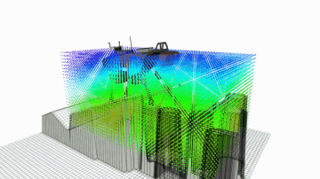
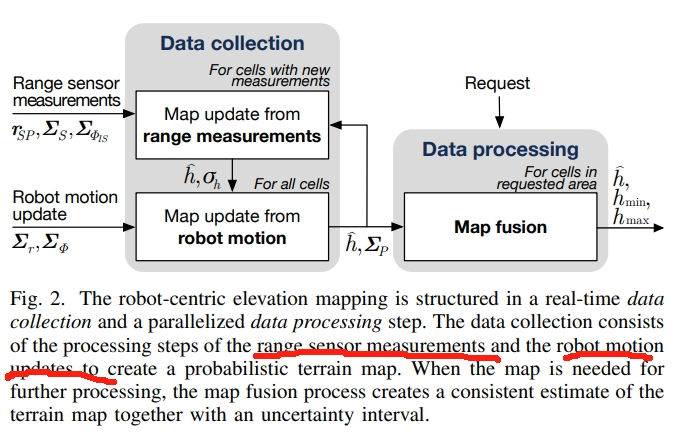
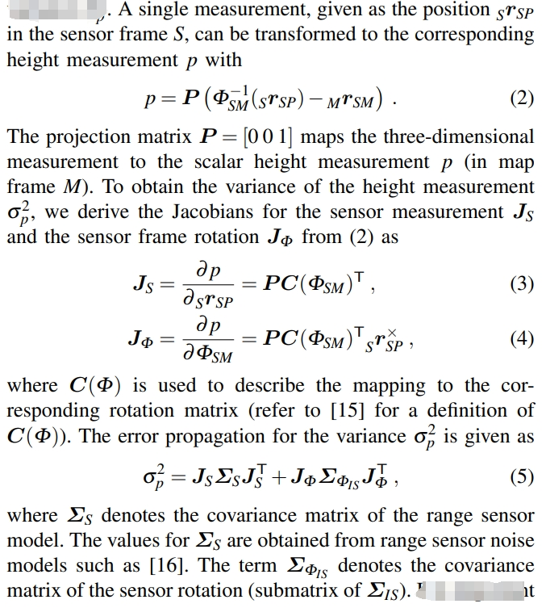
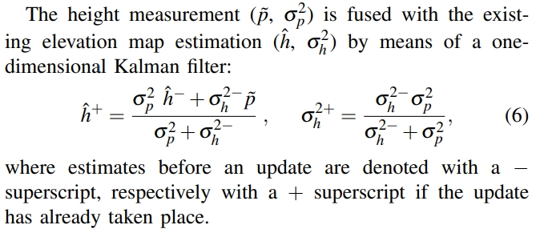

<!-- * 目录
{:toc} -->

之前[博客](https://kwanwaipang.github.io/File/Blogs/Poster/%E8%A7%86%E8%A7%89SLAM.html#slam%E4%B8%AD%E7%9A%84%E5%90%84%E7%A7%8D%E5%9C%B0%E5%9B%BE%E8%A1%A8%E8%BE%BE%E6%96%B9%E5%BC%8F)调研过SLAM的各种地图表征，本博文深入调研一下Elevation Map。

传统导航技术在轮式平台上的应用（如扫地机器人、AGV 和自动驾驶汽车等）已经相当成熟，能够在结构化场景中实现稳定运行。
然而，足式机器人的高动态特性和复杂环境的干扰，使得传统导航方法的表现大打折扣:
* 依赖高精度地图：
  * 传统导航依赖静态高精地图，一旦地图不准，导航效果便大打折扣；
* 规划-控制分离：
  * 多采用“先全局规划，再发送速度指令”的方式，这一套流程在动态变化或复杂地形中容易失效；
* 建图受限：
  * 足式机器人运动过程中的冲击和震动，往往导致感知数据出现噪声和漂移，进一步影响地图质量和导航稳定性；

高程地图（Elevation Map）也称2.5D地图。如果是平坦地面、二维场景，用栅格地图就可以；如果是无人机，需要用到三维场景体素地图；但如果是无人车在非平坦路面运行、或者是四足/轮式机器人在野外的行进，需要对地形进行建模，常用的方式就是高程地图。在栅格地图的基础上增加了一个维度即高度。

  
<figcaption>  
</figcaption>

<!-- !!!!!!!!!!!!!!!!!!!!!!!!!!!!!!!!!!!!!!!!!!!!!!!!!!!!!!!!!!!!!!!!!!!!!!!!!!!!!!!!!!!!!!!!!!!!!!!!!!!!!!!!!!!!!!!!!!!!!!!!!!! -->
# 引言

对于足式机器人来说，相比自动驾驶等所需的全局导航，由于其需要主动选择落足点，因此对于局部高程图来说更加关心.这也就是本博文的重点Elevation Map。

  
<figcaption>  
</figcaption>

目前常用的解决方案是：雷达提供长期可靠的里程计信息，采用深度视觉获取局部深度来建立高程图。

高程地图分为实时和全局高程图：
前者可以直接采用深度信息快速建立高程地图;
后者先建立全局的地图在从其中基于里程计信息提取局部的信息。
前者在实现起来比较容易速度也快甚至可以不需要全局定位数据，但是由于视角和深度图质量问题可能会存在噪声和空洞；
后者需要全局定位信息并需要而外的计算来构建全局地图，但可以通过机器人多个视角下的采集对全局高程地图不断优化修正，最终提取的局部高程图质量更高。

***地形识别***

地形识别是指机器人利用其平台上安装的传感器来识别和分类未知的地形环境的能力。四足机器人与环境之间的交互非常复杂，地形特征对机器人的运动性能有重大影响。因此，机器人需要具备准确的地形感知和分类能力，以便进行适当的路径和轨迹规划，并设计合适的运动控制策略。这确保了机器人能够有效地穿越地形，实现预期的运动轨迹，并保持运动稳定性。

机器人通过携带的硬件设备获取地形信息。可以将其分为传统的地形识别算法和基于深度学习的地形识别算法。

* 基于非视觉特征的地形识别算法：依赖非视觉特征的地形识别算法通常配备有诸如激光雷达（LiDAR）、红外传感器、惯性测量单元和振动传感器等。基于这些传感器的特性，非视觉地形识别算法可以进一步分为两类：基于点云信息的地形识别算法和基于振动的地形识别算法。
   1. 基于点云信息的地形识别算法：这类算法通过使用激光雷达扫描地形环境轮廓来获取点云数据，并构建栅格地图。随后，算法计算栅格地图中点云数据的最大值和最小值，以创建可达性地图。
   2. 基于振动的地形识别算法：利用集成在机器人上的振动传感器收集和分析机器人穿越未知地形环境时产生的振动，从而实现地形识别。
* 自主机器人运动与视觉地形识别：自主机器人的运动依赖于对周围环境的感知和解释。与非视觉方法相比，基于视觉的地形识别方法提供了丰富的信息，并且不受机器人自身影响，因此成为机器人地形识别的首选方案。为了进一步分类基于视觉的地形识别方法，可以将其分为两个子类别：结构化视觉特征和抽象视觉特征。
    1. 结构化视觉特征：如颜色和纹理等结构化视觉特征，可以通过明确的数学或算法定义精确量化。这些特征不仅在计算机视觉任务中提供一致可靠的信息，还主要用于传感器捕捉的具体视觉元素的选择和提取。
    2. 抽象视觉特征：也就是基于learning的~

## 高程地图的一些开源工作
* [Grid Map](https://github.com/ANYbotics/grid_map)
* [Robot-Centric Elevation Mapping](https://github.com/ANYbotics/elevation_mapping): RTAB定位输出Odom，elevation mapping采用深度点云和里程计输出全局高程图
* [Elevation Mapping cupy](https://github.com/leggedrobotics/elevation_mapping_cupy)

## 代表性论文阅读

### Probabilistic Terrain Mapping for Mobile Robots with Uncertain Localization

* [PDF](https://www.research-collection.ethz.ch/bitstream/handle/20.500.11850/272110/fankhauser2018.pdf?sequence=1)
* [Github](https://github.com/anybotics/elevation_mapping)

从range sensor（如laser range, time-of-flight, 或 stereo camera sensors）上获取数据，同时需要结合本体的姿态估计（把姿态估计的uncertainty也考虑进来）。如下图所示：

  
<figcaption>  
</figcaption>

其中地图的更新以及融合部分应该是关键点。

***基于测量值的地图更新***

首先每个range测量点会更新一个单元的高度地图。而高度的测量服从高斯分布。将高度的测量结果从sensor frame转换到map frame下（可以理解为sensor相对于map的高度，那么就获得当前map相对于起初点的高度）。

  
<figcaption>  
此计算过程还考虑了一系列的measurement noise,要实际部署再细看~
</figcaption>

而新测量的高度将会通过一维的卡尔曼滤波跟已有的 elevation map进行融合

  
<figcaption>  
</figcaption>

***基于机器人运动的地图更新***

Elevation map的定义是相对于机器人或者传感器的pos的，因此随着其运动也要实时的更新。
这个更新是要考虑到运动的不确定性的（详细的推导此处略过，见原文）

### Elevation Mapping for Locomotion and Navigation using GPU

* [PDF](https://arxiv.org/pdf/2204.12876)
* [github](https://github.com/leggedrobotics/elevation_mapping_cupy)

# 参考资料
* [四足机器人雷达-视觉导航2：Elevation mapping局部高程图测试](https://zhuanlan.zhihu.com/p/469921393)
* [两万字梳理 四足机器人的结构、控制及运动控制](https://zhuanlan.zhihu.com/p/15527181044)
