<!-- * 目录
{:toc} -->

<!-- !!!!!!!!!!!!!!!!!!!!!!!!!!!!!!!!!!!!!!!!!!!!!!!!!!!!!!!!!!!!!!!!!!!!!!!!!!!!!!!!!!!!!!!!!!!!!!!!!!!!!!!!!!!!!!!!!!!!!!!!!!! -->
# 引言

视觉语言导航（Vision-Language Navigation, VLN）是一个多学科交叉的研究领域，涵盖了自然语言处理、计算机视觉、多模态信息融合以及机器人导航等多个学科。
在该领域，研究人员致力于开发能够理解自然语言指令，并在复杂环境中实现自主导航的智能体。

本博文对VLN进行调研，并对一些经典的工作进行阅读。

本博文仅供本人学习记录用~

* Keep update the paper list in: [Awesome-VLN](https://github.com/KwanWaiPang/Awesome-VLN)

# 基本概述

VLN其实就是视觉与语言的互动。
下图直观的看到VLN在具身智能领域的位置。图来源于[A survey of embodied ai: From simulators to research tasks](https://arxiv.org/pdf/2103.04918)是关于embodied AI的survey，涵盖了各种仿真软件、数据集以及研究方向。可以看到VLN是在给定物体导航以及具有先验信息的导航之间的位置。

  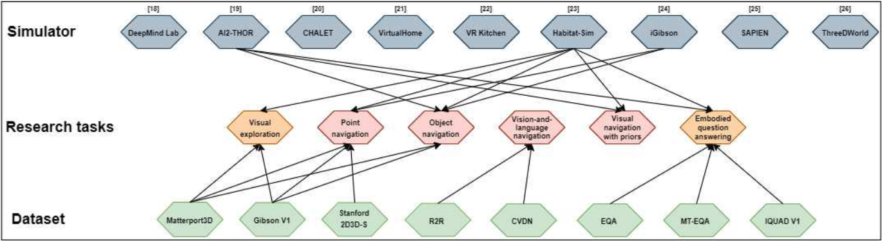
<figcaption>  
</figcaption>

任务起源于2018年，最开始起源是一个名为‘bring me a spoon’的任务。
作者认为命令一个5岁左右的孩子去拿一个勺子是一个很简单的任务，但是如果想通过语言指令去指导机器人去拿一个勺子是非常困难的。
那么作者很快就锁定了用Matterport 3D来作为室内的环境，并选取了90个不同的室内建筑，包括住宅，办公室等。
而关于标注的语言指令（instruction），则是一个room-to-room的任务，就是只导航到目的地房间，并且给出比较详细的instruction，能更好的反应出vision和language的结合。
于是作者就开始搭建simulator，用AMT标定数据，有了第一个VLN的simulator叫Matterport 3D simulator以及第一个VLN的任务和数据，room2room （R2R）。

这个任务的定义是：给定一个natural language instruction，放置在simulator中初始位置的一个agent，需要通过理解instruction，并观察视觉环境，按照instruction给定的路线，移动到目的地。
而从此以后，VLN作为一个重要的任务正式诞生了。

视觉语言导航任务通常依赖于指令以及由环境模拟器（如Matterport3D、Habitat等）构建的交互式环境。
智能体的任务是按照自然语言指令要求，在环境中导航到目标位置。 指令被表示为一个单词序列。
而模拟器为智能体提供了数据交互接口，能够依据智能体的状态（例如坐标和朝向）以及其执行的操作，生成动态的感知信息。
因此，对于一个VLN，有三个重要的因素：
1. oracle（模拟人的作用）发布语言指令；
2. agent（需要被训练和学习的机器人），执行者；agent可以向oracle请求指导，oracle做出回应。然后agent根据收到的指令和观察到的环境与环境交互，并完成具体任务。
3. environment（环境），相当于需要工作的空间.但是考虑到真实场景训练成本比较高昂，所以一般都是采用模拟器，比如R2R就是采用Matterport 3D数据集作为仿真的室内环境。这些模拟器有的是通过相机拍的一些真实场景然后做渲染，有的则是通过合成的方式来生成虚拟的3d环境.

  
<figcaption>  
</figcaption>

与经典的VQA任务相比，VLN其实就是增加了主动视觉（active vision）的观测，在每一步的action的过程中，视觉的输入也总是在变化的。要根据行为来决定下一刻的行动。

  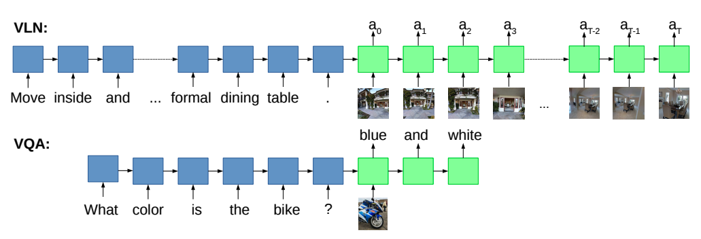
<figcaption>  
VQA vs VLN
</figcaption>

下面图片展示了VLN的Research Timeline，展示的从2018年～2023年的研究概况。
早期可能更多是网络结构如何更好的表征数据，其次就是扩展数据集，然后近期就是大模型的使用。

  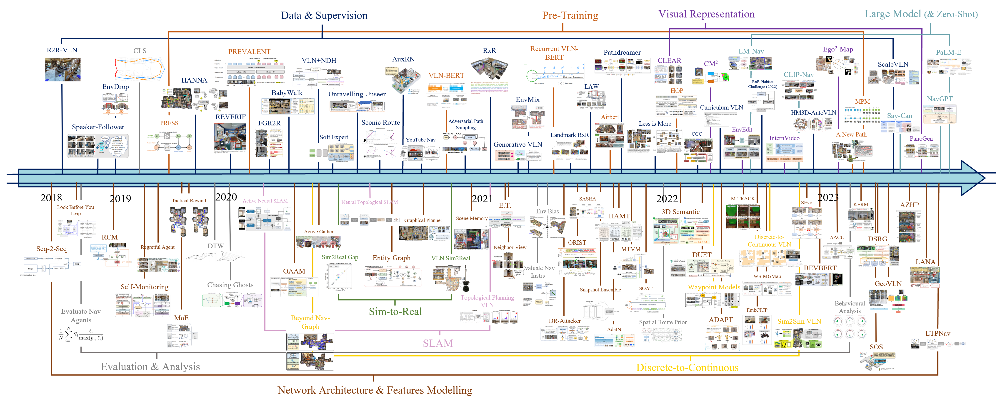
<figcaption>  
 Refer from “Thinking-VLN”
</figcaption>

# 任务类型
从任务类型来看，视觉语言导航任务涵盖了指令导向（如R2R和R4R）、目标导向（如REVERIE和SOON）。需求导向（如DDN），所有这些任务都要求智能体能够利用语言指令和动态视觉观察来做出实时决策。

* 指令导向：指令导向的视觉语言导航任务侧重于智能体严格遵循给定的语言指令进行导航。这种任务要求智能体能够理解复杂的自然语言指令，并将其转化为导航动作。例如，一个指令可能是“往前走到海报附近然后右拐进办公室”，智能体需要理解并执行这些动作以到达指定位置。
* 目标导向：目标导向的视觉语言导航任务要求智能体根据给定的目标进行导航。在这种任务中，智能体需要理解目标的语义信息，并在环境中搜索与目标相匹配的物体。例如，智能体可能会收到指令“找到沙发”，然后需要在环境中识别沙发并导航到那里。
* 需求导向：需求导向的视觉语言导航任务是一种更高级的形式，它要求智能体根据用户的抽象需求进行导航。与前两种任务不同，需求导向导航不依赖于特定的物体或目标，而是需要智能体理解用户的需求并找到满足这些需求的物体或位置。例如，如果用户说“我饿了”，智能体需要找到食物或厨房等可以满足用户需求的地方。
  
依据用户与智能体之间的交互轮数，任务可被细分为单轮指令任务和多轮对话式导航任务。
* 单轮指令任务：在单轮指令任务中，智能体接收到一个自然语言指令，并且需要在没有进一步交互的情况下执行该指令。这种任务要求智能体能够理解指令的含义，并将其转化为导航动作。例如，智能体可能会接收到指令“走出浴室，左转，通过左侧的门离开房间”，然后智能体必须理解并执行这些动作以到达目的地。
* 对话式导航任务：对话式导航任务则涉及到更复杂的交互，智能体可以在导航过程中与用户进行多次对话。在这种任务中，智能体可能无法仅凭初始指令就完全理解用户的意图，需要通过提问来获取更多信息，或者在不确定时请求用户澄清。例如，如果智能体对指令中的某个地标有疑问，它可以询问用户以获得更明确的指导。

# 场景类型
根据应用场景不同，可以将视觉语言导航分为室内、室外、空中三种场景。
* 室内场景：室内视觉语言导航主要关注于家庭或办公环境内的导航。智能体需要理解自然语言指令，并在室内环境中找到正确的路径。室内环境通常较为复杂，包含多个房间和各种家具，因此对智能体的空间理解能力要求较高。例如，Room-to-Room数据集 是专为室内VLN设计的，它提供了大量的自然语言指令和相应的导航路径。

  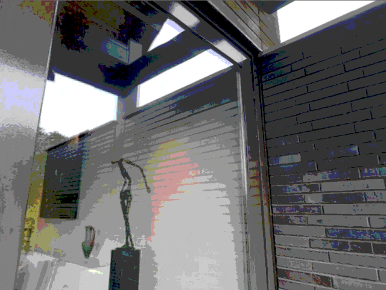
<figcaption>  
</figcaption>

* 室外场景：室外视觉语言导航涉及到更开放的环境，如街道、公园等。在这种场景下，智能体不仅需要理解指令，还需要处理更复杂的空间关系和可能的遮挡物。室外环境的动态性，如行人和车辆的移动，也会增加导航的难度。

  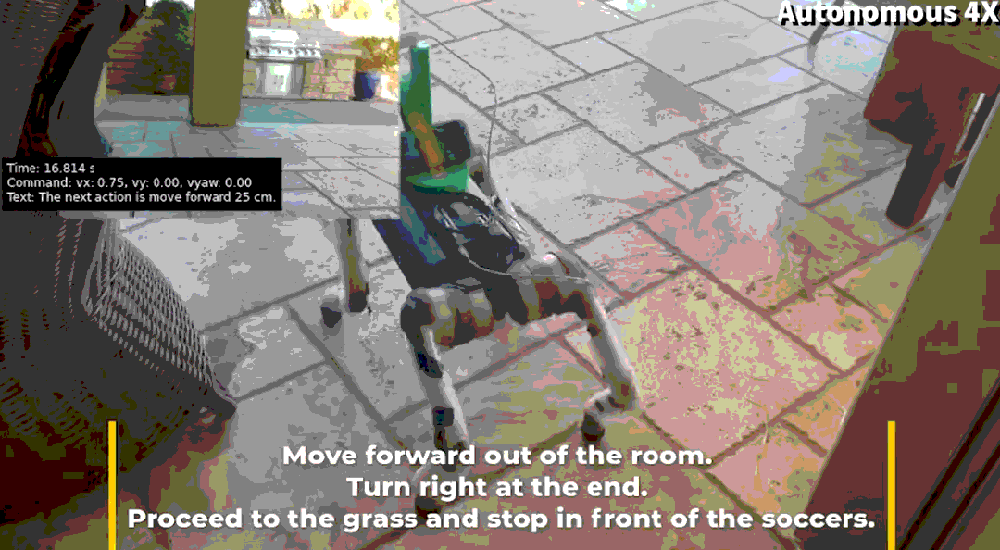
<figcaption>  
</figcaption>

* 空中场景：空中视觉语言导航是一个较新的研究领域，主要针对无人机（UAV）的导航任务。与地面导航不同，空中导航需要考虑飞行高度和更复杂的空间关系。例如，AerialVLN是一个针对无人机的视觉语言导航任务，它要求智能体根据自然语言指令在三维空间中进行导航，这涉及到对城市级场景的理解和操作。

  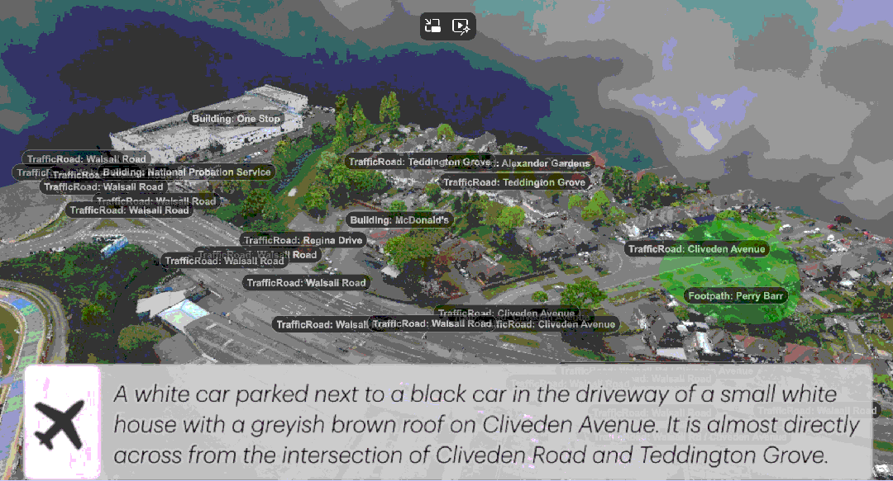
<figcaption>  
</figcaption>

此外，还有离散环境与连续环境
* 离散环境（如下面介绍的R2R）：在离散环境下，模拟器由一个连通图表示，包含：可导航节点集合与节点之间的链接（表示两个节点是否可以通行）。从起始节点出发，在限定的步数内，到达指定的目标节点。
* 连续环境：在连续环境下的视觉语言导航任务中，智能体需依据自然语言指令，在连续的三维环境 内，从起始位置导航至目标位置。

# 主流的数据集与模拟器

视觉语言导航模型旨在构建导航决策模型，在每个时刻，模型能够根据指令，历史轨迹和当前观测来决定下一步的动作。而模拟器则是执行智能体的动作并更新环境与智能体的状态。

当然新的VLN工作，agent跟环境真实的交互而并非仅仅局限于仿真，但是模拟器与仿真数据集仍然可以提供训练用

## 模拟器

| Simulator | Dataset | Link | Note |
|:---------:|:-------:| ---- |:----:|
|VizDooma|---|[website](https://vizdoom.cs.put.edu.pl/)|卡通|
|House3D|SUNCG|[website](https://github.com/facebookresearch/House3D)|三维渲染|
|AI2THOR|---|[website](http://ai2thor.allenai.org)|三维渲染|
|Gibson|2D-3D-S|[website](http://gibsonenv.stanford.edu/)|真实光景|
|iGibson|iGibson|[website](http://gibsonenv.stanford.edu/)|真实光景|
|Matterport3DSimulator|R2R, R4R, REVERIE, SOON|真实光景|
|Habitat|VLN-CE|[website](https://aihabitat.org/)|真实光景|
|AirSim|AerialVLN|[website](https://github.com/microsoft/AirSim)|三维渲染|

## Room-to-Room (R2R)
首次提出了在离散室内环境中遵循指令进行导航的任务。
数据集内会给出相对详细的指令，并且轨迹是离散的，可移动的点。

这个工作基于[Matterport3D](https://niessner.github.io/Matterport/) simulator（全景图）构建的。

  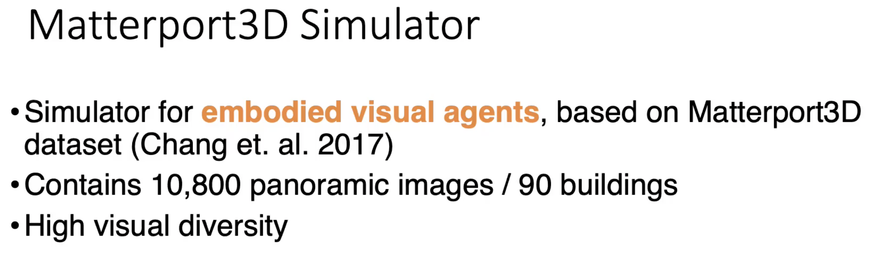
<figcaption>  
</figcaption>

而对于每个建筑物，就构建一个导航图（navigation graph），把导航任务设置为离散的节点。（早期VLN研究也集中在离散导航）
而通过导航图可以确定可运动的轨迹。

  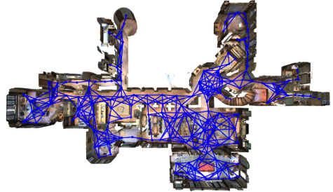
<figcaption>  
</figcaption>

同时对于给定的起点与终点的路径，每个可导航的节点都有对应的全景图。而所谓的语言指令描述则是从一个点到另外一个点的过程。

机器人则是基于指令以及当前节点的全景图就要决定下一个时刻的action应该是什么，该往哪里走，最终要到终点位置。

  <table style="border: none; background-color: transparent;">
    <tr align="center">
      <td style="width: 50%; border: none; padding: 0.01; background-color: transparent; vertical-align: middle;">
        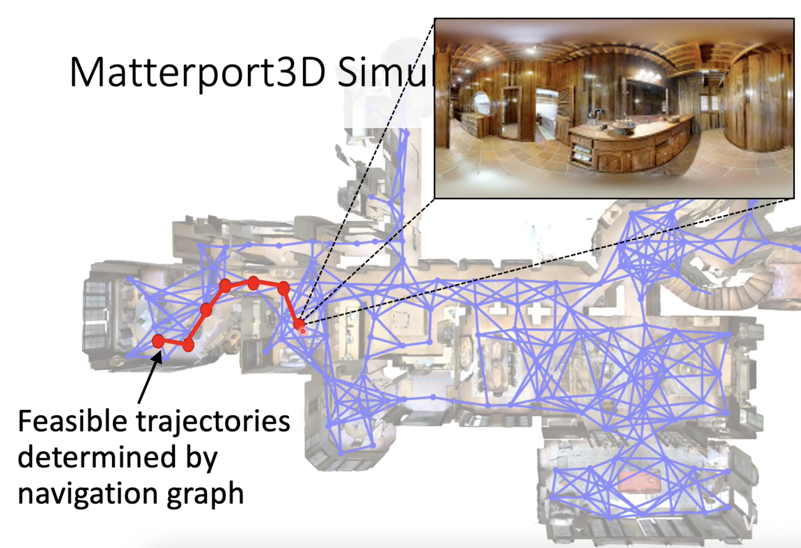
      </td>
      <td style="width: 50%; border: none; padding: 0.01; background-color: transparent; vertical-align: middle;">
        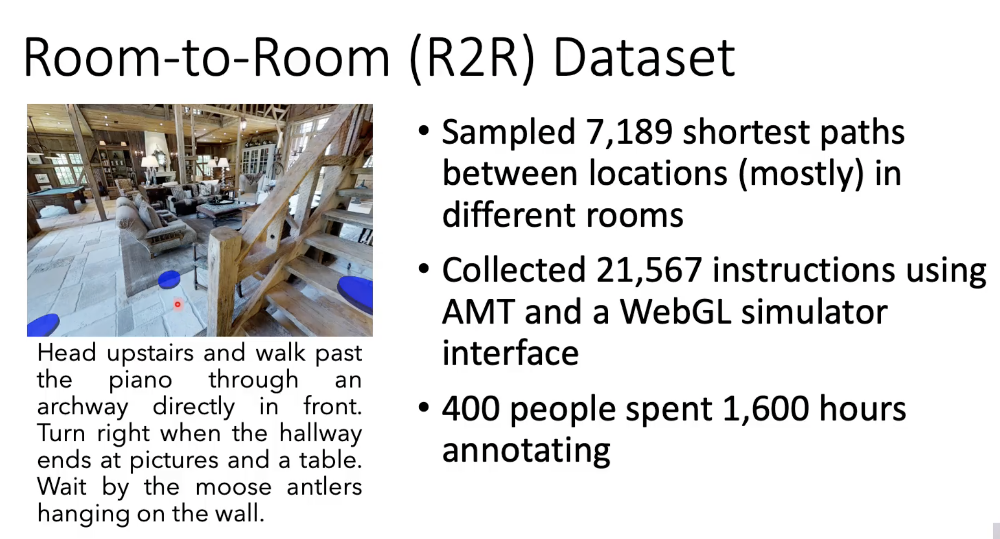
      </td>
    </tr>
  </table>
  <figcaption>
  </figcaption>

R2R数据集包含 90 个房屋的真实照片，共计 10,567 张全景图。这些环境被表示为一系列通过边连接的可导航点。在 R2R 任务中，智能体需根据描述路线的语言指令，从指定的初始位置导航至目标位置。智能体必须遵循指令，执行一系列离散动作（如转弯、前进），以到达目标位置，并在到达后执行“停止”动作以完成任务。

## Room-for-Room（R4R）
通过将两个相邻的轨迹（尾部到头部）连接起来，扩展了 R2R 任务，从而生成更长的指令和轨迹。

## Room-Across-Room (RxR)
在R2R的基础上诞生了RxR，有两个关键点：
1. 指令的标记更细,路径也更长了，有更细粒度的指令信息
2. 多语言，在英语的基础上增加了两张语言（印度语）

## REVERIE
在现实环境下，智能体的导航通常是需求驱动的，经常需要到达指定地点并找到相关物体。因此诞生了REVERIE

REVERIE相比起之前的指令式则是更加high-level的，只会告诉agent想要什么物体，但不会告诉如何具体走到物体跟前。因此让任务更难。
并且物体是位于远处的，也就是起点无法被观测到的，也就是需要机器人有一定的推理能力去找到目标物体。（注意，此时仍然是仿真虚拟环境，无法跟场景进行交互，因此找到即可而不用交互）

此外，找到目的后，还需要定位物体，因此需要对每个物体都有bounding box。这样机器人不仅可以到达想要到的地方，还可以识别物体，下一步可能就是拿物体或者其他作业需求。不过由于仍然是模拟器，没有交互这部分。

## SOON
在实际应用中，人类通常给出高层次的目标导向指令，而非详尽的逐步指导。基于这一特点，SOON数据集提出了一种基于视觉的场景定位目标导航方法，智能体被指示在房屋内寻找详细描述的目标对象。

SOON数据集其实跟REVERIE很像，都是指令在3D环境中找到目标物体，区别在于：
REVERIE的任务指令起始位置是固定的，然后指令是step-by-step的指导agent导航至某个位置；
而SOON不依赖于起始位置，它的指令是针对目标物体的有粗到细的描述，所以可以不依赖于agent起始位置。

## CVDN
在现实世界的导航中，人们通常使用自然语言进行多轮沟通（Vision-and-Dialog Navigation）。
因此，在这个数据集中，给的不再是单一的指令或者需求，给出的是人与机器人的对话。比如人告诉机器人去哪里，期间机器人可能有一些困惑就会问人类，也就是存在中间交流谈话的过程。
这样机器人可能就可以通过交流对话过程中，找到目的地或者找到物体。以此模拟真实家庭环境中人与人之间的对话过程，并定义了基于对话历史进行导航并搜索目标的任务。

  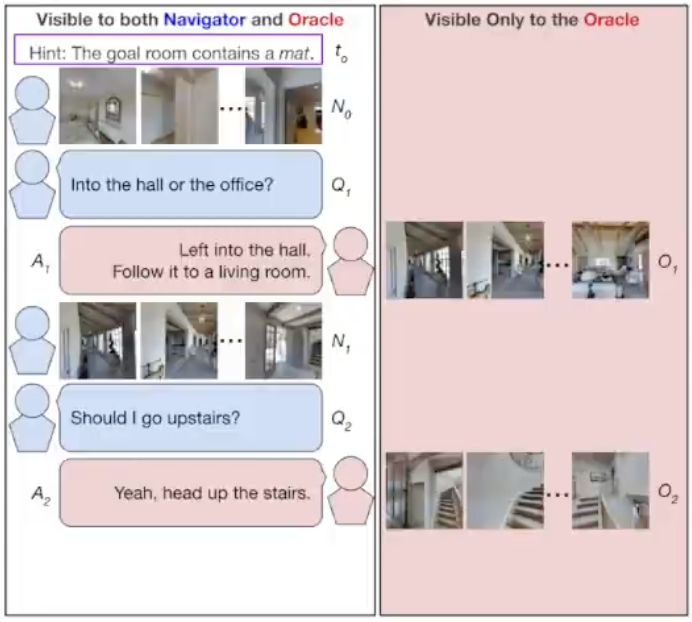
<figcaption>  
</figcaption>

## AerialVLN
为了解决无人机在复杂城市环境中进行导航的问题，AerialVLN 数据集被提出。该数据集包含 10 个城市的 100 个不同的飞行场景，每个场景都由无人机在飞行过程中拍摄的全景图像组成。这些图像被标记为包含多个对象，并且每个对象都与一个自然语言描述相关联。智能体的任务是根据这些描述，在飞行过程中找到并识别相应的对象。

## OpenUAV
OpenUAV开源平台专注于实现真实的无人机VLN任务。该平台集成了多样化的环境、真实的飞行模拟和广泛的算法支持，提供了用于开发和评估复杂的无人机导航系统的基础。

## CityNav
CityNav是城市规模的空中视觉语言导航数据集，包含了32,637个描述和人类标注的轨迹，为基准测试和开发先进的智能空中智能体提供了宝贵的资源。通过实验验证，提出的MGP模型显著提高了导航性能，并在具有挑战的条件下保持了鲁棒性。尽管如此，CityNav任务仍需要更复杂的规划和高级的空间推理能力。

## AeroVerse
AeroVerse基准套件解决了UAV具身世界模型的研究空白，提升了UAV智能体的端到端自主感知、认知和行动能力。构建了第一个大规模的真实世界图像-文本预训练数据集AerialAgent-Ego10k和虚拟图像-文本-姿态对齐数据集CyberAgent-Ego500k。首次明确了五个航天具身下游任务，并构建了相应的指令数据集。开发了基于GPT-4的自动化评估方法SkyAgent-Eval。

# 评估指标
评价指标可以简单分为 三类：导航距离（越小越好），导航成功率和执行远程命令(识别objects)的成功率（都是越大越好）

VLN刚出来的时候，首先是成功率（SR），就是希望机器人走到目的地（如范围内3米）来判断是否成功到达。
其次是导航误差（NE），就是到达目的地的误差。

但如果仅仅根据上述两个指标，机器人可能不会计较花的时间或者走的路径长路。因此还会有SPL（success weighted by path length）
其余的指标基本是基于这三者的一些改进。

* 导航成功率（Success Rate，SR）：预测路径终点和参考路径终点之间的距离不大于3米;
* 导航误差（Navigation Error，NE）：预测路径终点和参考路径终点之间的距离;
* 路径长度（patch length，PL）：从起始位置到终止位置的导航轨迹长度，表示为路径上所有相邻节点之间距离的总和;
* Oracle Success Rate（OSR）：衡量导航路径上任意点到目标点的距离是否在预定义的阈值范围内，如果路径中任意节点到目标点的最小距离小于或等于阈值，则返回1；否则返回0;
* 基于路径加权的成功率（Success weighted by Path Length，SPL）：SPL同时考虑了成功率（SR）和路径长度（PL），并对过长的（即效率低）路径进行惩罚：

  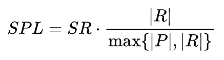
<figcaption>  
</figcaption>

* 长度加权的覆盖分数（CLS）：生成路径和参考路径的一致性问题，包括两个部分：路径覆盖率（Path coverage，PC）和路径长度分数（Length score，LS）。
* 基于动态时间规整加权成功率（nDTW）：通过动态时间弯曲（Dynamic Time Warping， NTW）评估由成功率加权的预测路径和参考路径的时空相似性，对偏离参考路径的行为进行软性惩罚，并考虑路径节点的顺序。

在目标导向的导航任务中，还要评估成功找到目标物体的准确率：
* 远程定位成功率（Remote Grounding Success Rate，RGS）：智能体定位到与目标语义标签相对应的实例时，才视为成功。
* 长度加权的远程定位成功率（RGSPL）：综合考虑远程定位成功的效率与经历的路径长度：

  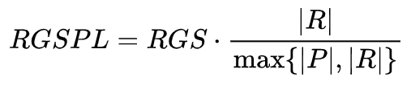
<figcaption>  
</figcaption>

* Goal Progress （GP）： 衡量距离目标的剩余距离的减少（m）
* Shortest-Path Distance（SPD）：测量代理人的最终位置与目标之间的平均距离。
* Success weighted by Edit Distance (SED)：将专家的行动/轨迹与代理人的行动/轨道进行比较，同时平衡SR和PL
* Oracle Navigation Error (ONE)：从路径中的任何节点（而不仅仅是最后一个节点）获取最短距离

此外，有些任务要求代理不仅要找到目标位置，还要遵循特定的路径。比如，指令中要求先去客厅再去厨房，直接去了厨房是不被期待的。

# 模型训练
模型训练是让神经网络学习如何从输入数据中做出正确决策的过程。

## 模仿学习
在VLN中，模仿学习通常涉及让模型观察专家如何在给定指令下导航，然后学习模仿这些行为。这种方法依赖于高质量的示范数据。交叉熵损失（Cross-Entropy Loss）是分类问题中最常用的损失函数之一。在VLN中，它通常用于衡量模型输出的概率分布与目标标签的概率分布之间的差异。对于多类别分类，交叉熵损失可以表示为：

  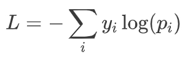
<figcaption>  
</figcaption>

其中 y是目标类别的独热编码， p是模型预测的概率分布。

## 强化学习

强化学习通过与环境的交互来学习最优策略。在VLN中，模型会根据奖励信号来学习如何在给定指令下导航。这种方法允许模型探索不同的策略，并从中学习。在VLN的强化学习设置中，损失函数可能包括策略梯度损失，它基于奖励信号来更新策略网络的权重。

## 跨模态对齐
跨模态对齐将不同模态（如视觉、文本等）的数据映射到同一语义空间。（如：Faster R-CNN的物体检测框与Bi-LSTM文本关键词经动态注意力耦合）

## 辅助监督学习
自监督学习是一种无监督学习方法，它利用数据本身的结构来生成伪标签，从而训练模型。在VLN中，自监督学习可以用来学习视觉和语言的表示，而不需要大量的标注数据，广泛应用于模型的预训练过程。

# 经典论文阅读

### 1. Vision-and-Language Navigation: Interpreting visually-grounded navigation instructions in real environments
这个工作也就是提出R2R数据集的工作。是第一篇提出VLN任务的论文，提出了VLN任务虽然简单只是指令式且离散的，但是为后面复杂VLN任务奠定了基础。
注意，VLN任务应该专注于在以前没见过的真实世界建筑中执行自然语言导航指令；

如前面提到，本文最重要的贡献点就是前面提到的R2R数据集。采用是Matterport3D模拟器，需要先根据3d数据集的图像构建一个模拟器来模拟真实环境；其在R2R数据集，数据量内的就是2万多个导航指令，每条指令对应一条穿过多个房间的轨迹。
任务则是要求机器人按照语音指令导航到以前从没见过的建筑物中的目标位置（比如图中的这些蓝色原点），而机器人只需初始姿态是确定的即可。

  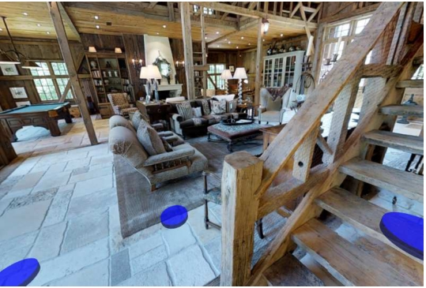
<figcaption>  
</figcaption>

网络结构部分采用的是基于LSTM的seqtoseq 结构和注意机制。
对于输入的自然语音指令以及初始观察图像。先用LSTM编码器对语言指令进行特征提取，注意力机制应用于语言编码器的隐藏状态。
然后解码器则是将上一个状态的action作为输入，并预测下一个，或者当前应该有的action的分布。
而所谓的action则是可以简化为6个基本动作，上、下、左、右、前进、停止。上下左右则是仅30度的变化。
对于图像的输入，采用的是ImageNet上预训练的ResNet-152 CNN 提取的特征。图像特征和动作特征链接一起形成单个向量输入到LSTM解码器。

从实验结果来看，准确率似乎并没有太高，哪怕在已经见过的区域也只有30+%的成功率，而在未见过的区域成功率仅仅只有20%。这里的疑问是怎么人类听着指令走成功率也只有86%，不过作者提到了指令应该是足够好的，只是有些左、右指令容易产生confuse

  
<figcaption>  
</figcaption>

### 2. REVERIE: Remote Embodied Visual Referring Expression in Real Indoor Environments
当你跟一个8岁的小孩说“给我拿个枕头”，他大几率是能完成这样的指令的，即使在一个陌生的环境，比如抱枕通常在沙发上，沙发通常在客厅里。又或者说枕头可能在房间的床上。
那么为了让机器人具有这样的能力，能更加灵活、准确的实现交互，在cvpr20的这篇工作上提出了远程物体定位任务。

机器人被随机放置在一个位置，然后给予一个与远处物体相关的指令，如‘Bring me the bottom picture that is next to the top of stairs on level one’，机器人需要根据该指令和感知的视觉图像，找到该指令所指定的目标物体。

值得注意的是，目标物体在起点是无法被观测到的，这意味着机器人必须具有常识和推理能力以到达目标可能出现的位置。并且在当前阶段，我们仅要求机器人找到目标物体（如给出目标物体在视觉感知图像中的边框，或者在一系列候选物体中选出目标物体），并不需要agent真的将目标物体带回来，因为当前场景还是不可交互的。

REVERIE要求机器人可以利用环境知识推断物体的可能位置，并根据语言指令明确识别物体，并且具有难度的一点是目标对象在初始视图中不可见，需要通过在环境中主动导航来发现。
而其关键的贡献点也是这个任务的定义及数据集、添加标注等等的构建（关于REVERIE更详细的描述上面已经提到过了）。

  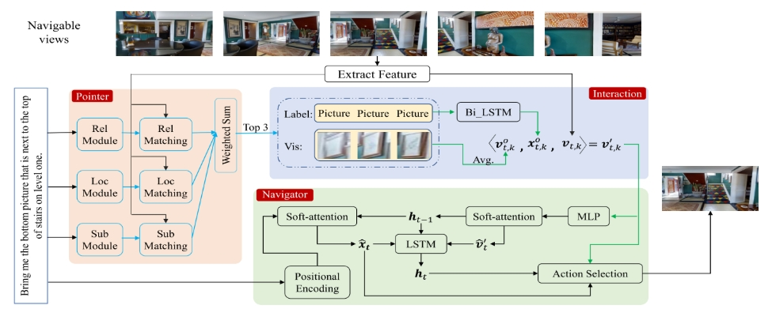
<figcaption>  
</figcaption>

如图所示。系统的架构由三部分组成：
1. 指针模块，试图根据语言指南定位目标对象。给机器人一个高级自然语言指令。注意这里所谓的高级是指更加接近我们的日常用语，而不是上一篇那样要详细的指令。
2. 交互模块，就是为了将语言指针模块跟导航模块相交互，从而提高导航和参考表达式的准确性，比如可以利用视觉信息来决定哪里以及什么时候可以停止；而如果能到达正确的目标位置，Pointer的精度也可以得到提升
3. 导航模块，就是机器人要采取的操作。也就是机器人需要执行的一系列action，最终要达到目标位置。每个动作都选择一个可导航视点或选择当前视点也就是停止。最后机器人认为自己已经找到了目标对象，就会输出一个决策边界。

接下来看看实验结果，单纯看SR还是跟人类有较大差距。

  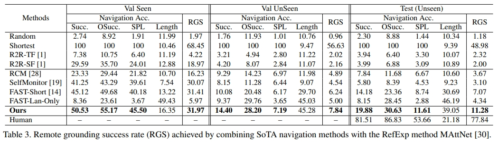
<figcaption>  
</figcaption>

下面是对比的baseline情况：
* Random 利用数据集的特征，随机选择具有随机步长（最多10步）的路径，然后随机选择一个对象作为预测目标。
* Shortest 总是沿着通往目标的最短路径。、
* R2R-TF和R2R-S是VLN的baseline，通过注意机制训练基本LSTM。R2R-TF和R2R-SF之间的区别在于，R2R-TF在每一步都使用地面实况动作进行训练（Teacher Forcing，TF），而R2R-SF采用从其动作空间的预测概率中采样的动作（StudentForcing（SF））
* SelfMonitor 使用视觉文本共同接地模块突出显示下一步行动的指示，并使用进度监视器反映进度。
* RCM 采用强化学习来鼓励指令和轨迹之间的全局匹配，并执行跨模型基础。
* FAST Short将回溯引入SelfMonitor。
* FAST Lan Only 采用上述FAST Short模型，但我们只输入语言指令，没有任何视觉输入。此模型用于检查我们的任务/数据集是否对语言输入有偏见

### 3. SOON: Scenario Oriented Object Navigation with Graph-based Exploration

agent接收由多种描述组成的复杂自然语言指令（如下图左侧）。代理在不同房间之间导航时，首先搜索更大范围的区域，然后根据视觉场景和指令逐渐缩小搜索范围。（由粗到细地查找）。其中关键是`navigate from an arbitrary position in a 3D embodied environment to localize a target following a scene description`也就是任意的起点。

  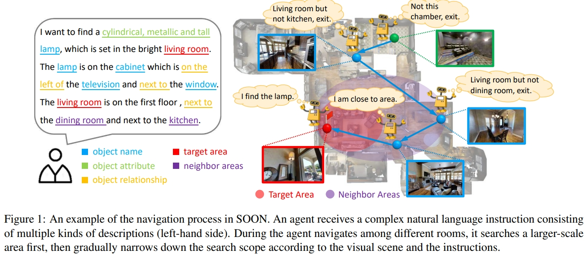
<figcaption>  
</figcaption>

下面列出其与其他数据集的差别：

  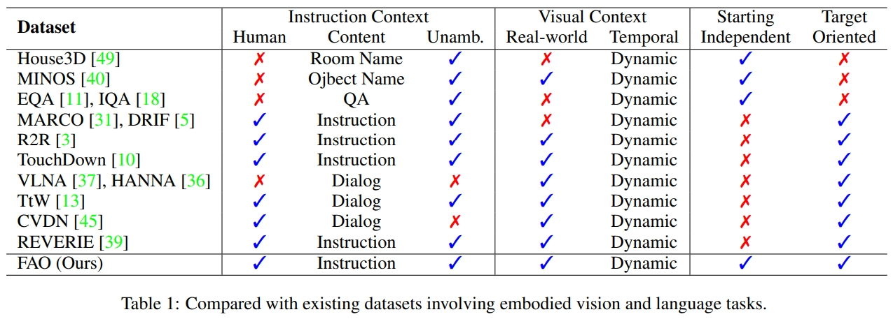
<figcaption>  
</figcaption>

~~~
总体来说，SOON和REVERIE任务相同：根据指令在3D环境中找到目标物体。
区别在于，之前的任务指令起始位置是固定的，然后指令是step-by-step的指导agent导航至某个位置，而SOON不依赖于起始位置，它的指令是针对目标物体的有粗到细的描述，所以可以不依赖于agent起始位置。
~~~

该任务是从任意地方到指定的目标，相对于REVERIE任务，不依赖起始地点。
相比之下，在分步导航任务中，如视觉语言导航或协作视觉和对话导航，任何偏离定向路径的行为都可能被视为错误

论文的贡献点就是SOON任务及基于SOON任务提出的基于图的语义探索（GBE）

* **任务**：SOON Scenario Oriented Object Navigation
在该任务中，agent被指示在房屋内找到一个完全描述的目标对象（thoroughly described target object）。SOON中的导航说明是面向目标的，而不是像以前的基准中那样循序渐进的保姆（ step-by-step babysitter）。该任务的两个特点：target orienting 和 starting independence。
   * target orienting是指：指令是描述的是对象而不是查询步骤。收到指令后，首先搜索更大范围的区域，然后根据视觉场景和指令逐渐缩小搜索范围（由粗到细地查找）。
   * starting independence是指agent不依赖固定的起始位置，而是任意的位置都可以实现导航任务。因为指令包含的是地理区域描述而不是轨迹的描述（如上图所示，描述的是物体大概的位置，非不是基于起点物体的位置）

该任务包括两个子任务：导航和定位（此处定位应该指的是目标物体的定位）：
如果agent导航到靠近目标的位置（<3m），则认为导航是成功的；
如果agent基于导航的成功在全景视图中正确定位目标对象，我们认为定位是成功的。
为了确保无论代理的起点如何都能找到目标对象，该指令由几个部分组成：i）对象属性/object attribute，ii）对象关系/object relationship，iii）区域描述/area description，vi）相邻区域描述/neighbor area descriptions。

下图2展示了各个部分的描述。
记住看过的场景并明确建模导航环境有助于长期导航。因此，作者引入了一个 graph planner 来存储观察到的特征，并将探索的区域建模为特征图。

  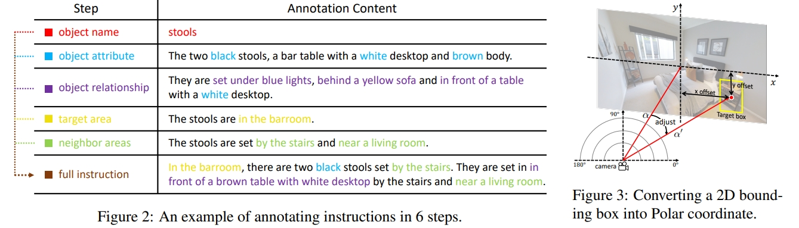
<figcaption>  
</figcaption>

* **方法**：GBE Graph-based Semantic Exploration
将导航的状态建模为图的形式，并且提出了一种新的基于图的语义探索（GBE）方法。从图中学习知识，通过学习次优轨迹来稳定训练。
与以前的导航工作相比，所提出的GBE具有两个优点：
  1. GBE将导航过程建模为一个图（graph），这使导航代理能够获得对观测信息的全面和结构化理解。它采用图动作空间（graph action space），将传统序列到序列（seq2seq）模型中的多个动作显著地合并为一步决策（one-step decision）。合并操作减少了导航过程中的预测数量，这使模型训练更加稳定。
  2. 其次，与使用模仿学习或强化学习导航策略的模型不同，所提出的GBE结合了两种学习方法，并提出了一种新的探索方法（exploration approach），通过从次优轨迹学习来稳定训练。在模仿学习中，agent在真值label的监督下一步一步地学习导航，这会导致严重的过拟合问题，因为标记的轨迹只占大轨迹空间的一小部分；而在强化学习中，agent探索大的轨迹空间，并学习最大化折扣奖励。强化学习利用次优轨迹来提高可概括性。然而，强化学习不是一种端到端的优化方法，这使得agent很难收敛并学习鲁棒的策略。与其他RL探索方法不同，作者提出的探索方法基于语义图（ semantic graph），该语义图是在导航过程中动态构建的。因此，它有助于代理在基于图形导航时学习鲁棒的策略。

  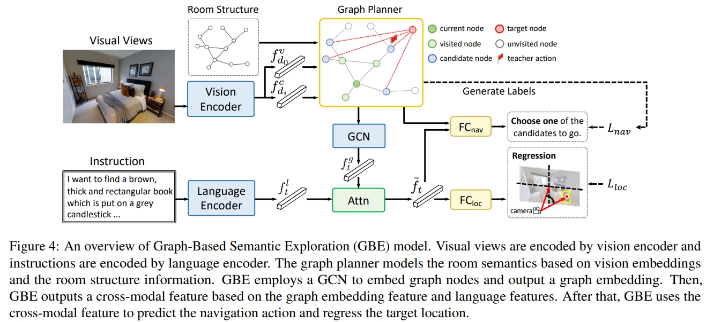
<figcaption>  
</figcaption>

* **benchmark**：此外，作者还提出了From Anywhere to Object (FAO)的基准，该benchmark是基于 Matterport3D，涵盖了90哥不同的室内环境及对应的真实全景图。有4K个指令集合及40K条轨迹。（benchmark可以理解为SOON任务对应的数据集集齐基准）

对于在R2R数据集上，SR可以达到50%了

  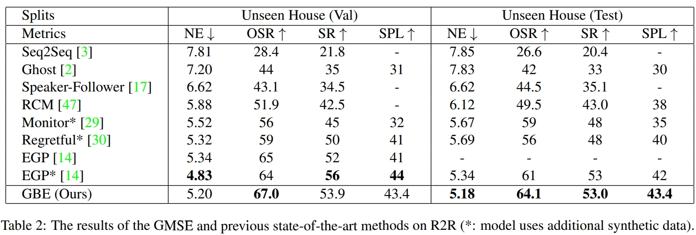
<figcaption>  
</figcaption>

但是在SOON数据集上（也就是所谓的FAO benchmark），见过的SR高达70+%，而对于未见过区域仅有不到20%的成功率

  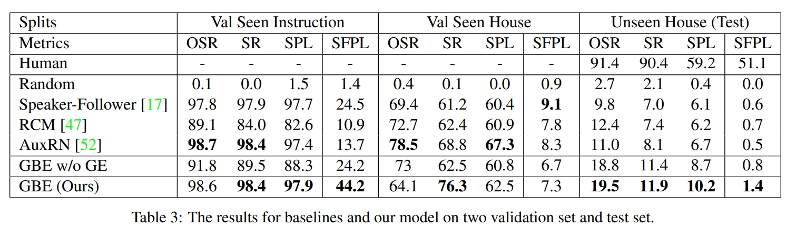
<figcaption>  
</figcaption>

### 4. Vision-and-Dialog Navigation （CVDN）
Cooperative Vision-and-Dialog Navigation（CVDN），本文介绍了一项新任务——视觉对话导航（Navigation from Dialog History）。
Navigator向伙伴Oracle提问，而Oracle有特权访问Navigator应采取的最佳下一步（根据最短路径规划）。
定义了“从对话历史导航”任务：一个agent，给定一个目标物体（目标导向）以及人类的对话历史，最终可以在未知环境中推理出导航动作来找到物体。
同时作者也通过实验证明对话历史对于理解上下文的重要性。
<!-- 旨在训练agent在不确定情况下通过对话进行导航。研究基于MatterPort模拟器，收集了2050个人类导航对话，包含超过7k个导航轨迹。文中还定义了“从对话历史导航”任务，并通过实验证明对话历史对于理解上下文的重要性。 -->

  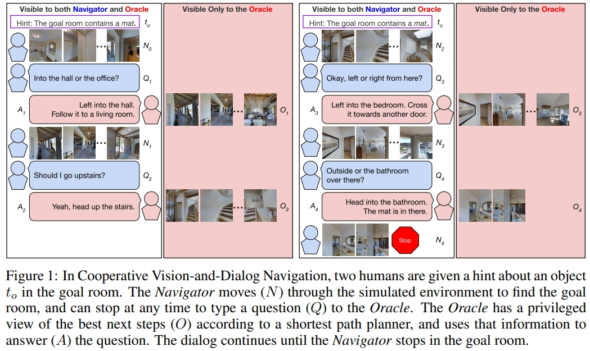
<figcaption>  
</figcaption>

CVDN基于R2R数据集，使用相同的模拟器和API训练导航agent。
此外，CVDN中的对话框包含的单词是R2R指令的三倍左右，而覆盖的平均路径长度比R2R中的路径也长三倍多。
作者收集了2050个人类导航对话，包括83个MatterPort房屋中的超过7k个导航轨迹，其中有问答交流。同时作者采用含糊不清和未明确说明的初始说明进行提示。

~~~
其中，
不明确的导航指令需要澄清，因为它可能涉及多个可能的目标位置。
未指定的导航指令是指没有描述到达目标的路线的指令。
~~~

对于对话数据集，通过Amazon Mechanical Turk收集人类对话，在每个Navigation from Dialog History (NDH) 任务中，工人阅读有关Navigator和Oracle的角色，并可以练习使用导航界面。一对工人通过聊天界面相互连接。
Oracle作指示，Navigator根据对话进行导航。Navigator可以通过输入自然语言来向Oracle询问或者猜想应该怎么做。但猜错了会导致无法继续导航，这就使得Navigator继续向Oracle提问。
其中，Navigator会有一系列的全景观测，而Oracle则是除了有输入的Navigator的全景观测，还会有接下来目标的全景观测（见上图）

下图显示了CVDN数据集中对话框中的路径长度、字数和话语数的分布

  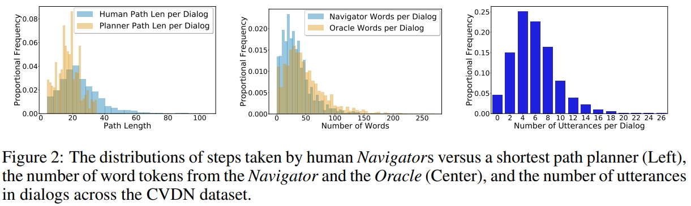
<figcaption>  
</figcaption>

CVDN给agent提供了导航、提问（question asking）和问答（question answering）。
CVDN内的每个对话框都是一系列Navigator提问和Oracle答案交换，每个对话之后都有Navigator的行动步骤。
作者把这一的一个结构重建为o Navigation from Dialog History (NDH)实例。

  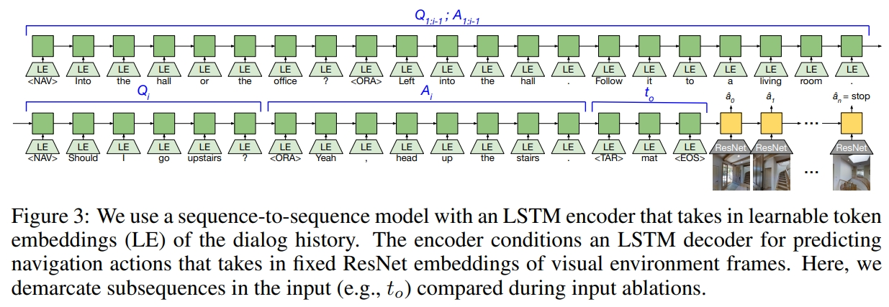
<figcaption>  
</figcaption>

作者采用的网络结构仍然是seq2seq。下面表格展示了实验结果。但是这似乎只是离目标的进度（衡量距离目标的剩余距离的减少），就是前进的情况，并没有成功率等的分析。

  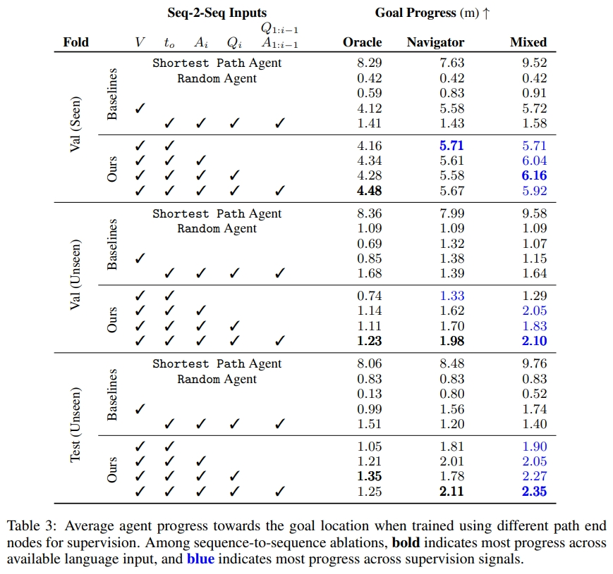
<figcaption>  
</figcaption>

### 5. Vision-and-Language Navigation: A Survey of Tasks, Methods, and Future Directions
本文属于早期的VLN综述，是22年的ACL，主要介绍了室内的VLN任务，如REVERIE,SOON,R2R等。

### 6. Vision-Language Navigation with Random Environmental Mixup

本文提出随机环境混合（Random Environmental Mixup，REM）方法，通过混合环境生成交叉连接的房屋场景，以增强视觉语言导航（VLN）任务的数据。本质上就是通过数据增广，来提升模型泛化能力，。

作者首先根据每个场景的房间连接图选择关键视点（key vertexes）。然后，交叉连接不同场景的关键视图以构建增强场景。最后，在交叉连接的场景中生成增强指令路径对。如下图所示。

  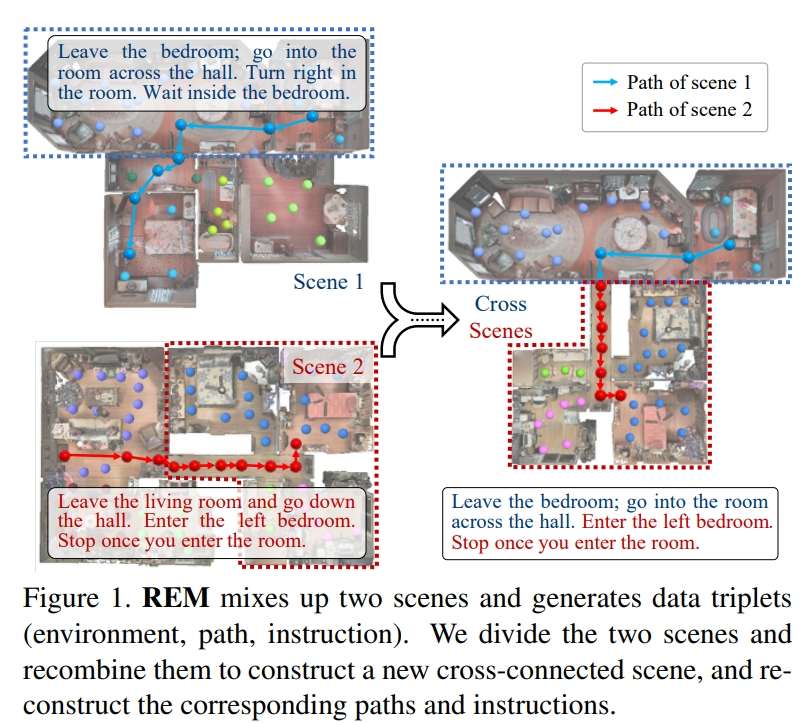
<figcaption>  
</figcaption>

实验效果表明，这样的做法有助于减少其在seen及unseen环境之间的性能差异。从实验效果来看，确实带来几个点的提升，比如在R2R上，seen场景的SR提升约5%，而unseen场景也有2%左右的提升。

  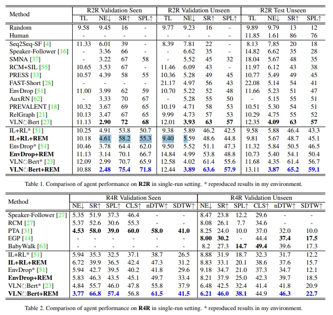
<figcaption>  
</figcaption>

### 7. History Aware Multimodal Transformer for Vision-and-Language Navigation

VLN中，为了记忆之前看过的区域以及采取过的行动，大部分的工作都使用循环状态来实现记忆。而本文，则是提出History Aware Multimodal Transformer (HAMT)，通过transformer将长期历史纳入多模态决策中。

HAMT将以往的全部全景图观测通过分层ViT（Hierarchical ViT）来编码：先采用ViT来编码每张独立的图像，然后将全景观测与每张图像的空间关系建模，最后把不同全景图的时间维度的关联考虑在内。（如下图所示）

  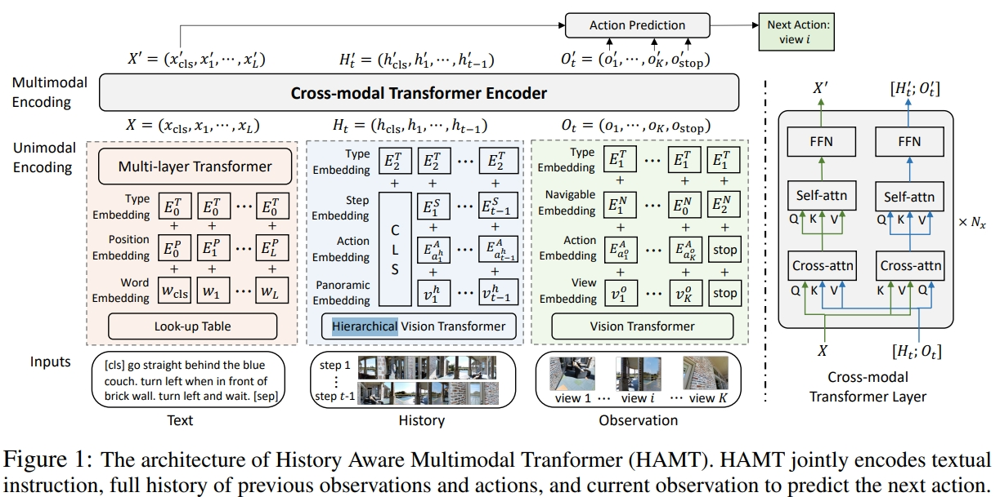
<figcaption>  
</figcaption>

Hierarchical ViT的结构如下图所示：渐进式的学习单个视角、每个视角与全景图的关系，以及历史所有全景的时间关系。

PS：这里所谓的 single view images其实就是从当前的全景观测中分割出来的。

  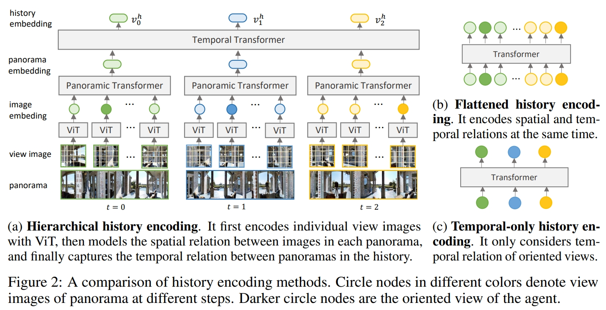
<figcaption>  
</figcaption>

再之后，通过将文本、历史、当前的观测结合起来来预测下一步的action。

而HAMT的训练也是本文另一个创新点。
为了学习更好的视觉表证，则是先采用几个相似的task，通过end-to-end来训练，如基于模仿学习的single step action prediction，自监督的spatial relation prediction，masked language and image predictions and instruction trajectory matching。然后再通过RL来进行fine-tune，进一步提升导航的策略。
* 对于Single-step Action Prediction/Regression的训练，采用的是模仿学习来预测下一个动作（基于指示、专家展示的历史以及当前的观测）。对于Prediction，则是预测每个可导航视角的概率。对于Regression，则是直接预测action的航向角和仰角。
* 对于Spatial Relationship Prediction (SPREL)则是采用self-supervised learning，给visual feature以及对应视觉的相对角度一个噪声干扰，对有无干扰的输入对应输出的action做自监督。
* 训练分为两步：首先对于ImageNet预训练好的ViT先freeze住，只训练其他模块。然后unfreeze，再继续训整个模型，只是第二步的时候ViT的学习率调大些。
* 最后，再通过RL来进行fine-tunning
  

  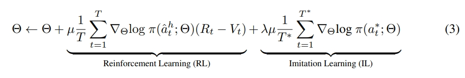
<figcaption>  
</figcaption>

至于实验效果，则是在R2R，RxR，REVERIE和CVDN上都有SOTA的表现

### 8. Improving vision-and-language navigation with image-text pairs from the web
作者提出了VLN-BERT，希望可以利用“无实体”网络抓取的视觉和语言语料库来让模型学会visual groundings，进而提升VLN等具身智能的任务。作者也发现，通过web学习然后再fine-tune可以让模型的成功率提升4个点左右。

VLN-BERT，是一个visiolinguistic（视觉 语言） transformer-based compatibility model，联合对齐指示以及agent沿着轨迹的观测。而VLN-BERT也可以直接从其他的视觉语言表征（visiolinguistic representation）任务中进行迁移学习，进而可以探索结合大规模互联网数据和隐含路径指令对的训练方式。

VLN-BERT分别采用下面的方式训练：
1. language-only data
2. web image-text pairs
3. VLN数据集中的 path-instruction pairs

首先，BERT是一个用于语言建模的大型的基于transformer的结构.而ViLBERT则是进一步把BERT扩展为联合学习视觉语言表征（visiolinguistic representations）.ViLBERT跟BERT类似，一开始，随机的language token的子集以及图像区域都被masked，并且必须由剩余的内容（没有被mask的）来估算。

而本文提出的VLN-BERT（如下图）也是一个类似于ViLBERT的visiolinguistic transformer-based model

  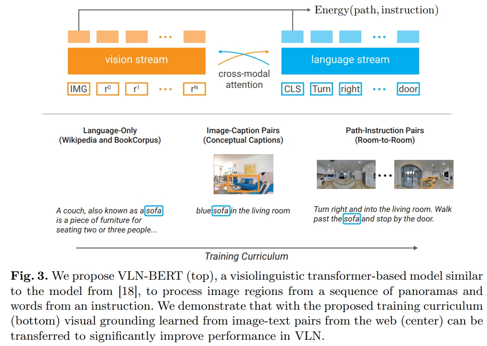
  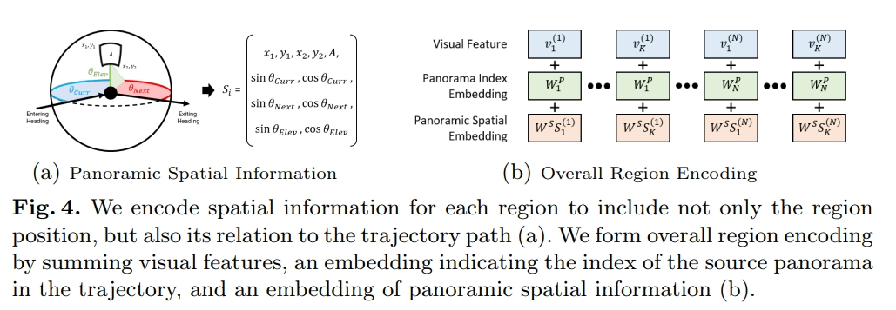
<figcaption>  
</figcaption>

论文花了大篇幅描述如何从全景图中提取一个一个的image view（Extracting Image Regions from Panoramas），然后如上图所示，把对应的视觉feature、索引 embedding以及空间embedding都编码出来。

直观感觉是语言部分写的BERT，视觉部分写的ViLBERT，把两篇论文合在一起，再跟VLN扯点关系，做个action grounding实现VLN任务的语言与视觉数据对应上。22页的论文10+页都是各种拼凑😂也没提到怎么获取web的数据以及web数据怎么用。

不过通过下面的表格可以看到，所谓的web数据，应该就是web数据训练好的语言以及视觉模型，

  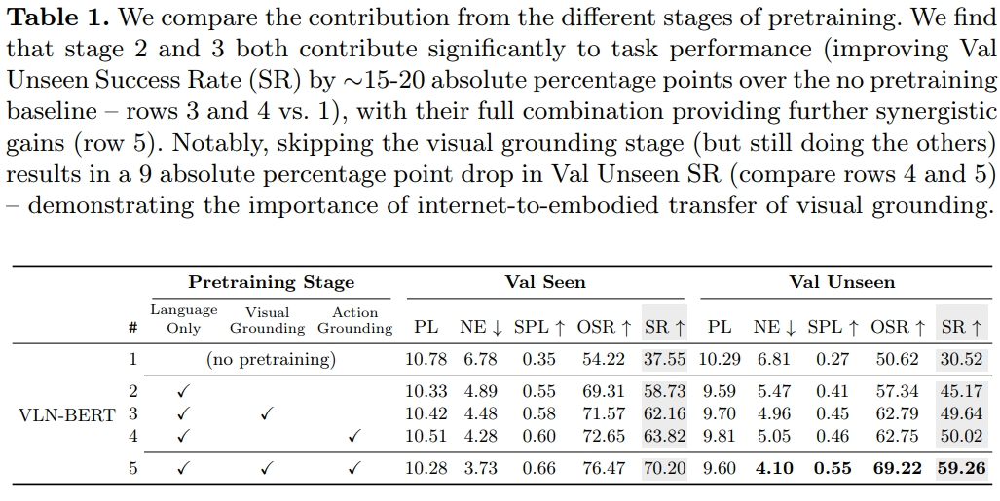
<figcaption>  
</figcaption>

### 9. Towards Learning a Generic Agent for Vision-and-Language Navigation via Pre-training

这篇工作则是首次提出通过预训练以及fine-tuning的范式来实现VLN任务。
通过自监督学习训练大量的image-text-action元组，预训练的模型可以提供视觉环境和语言指令的通用特征表达。可以进一步的用于VLN的task中。

  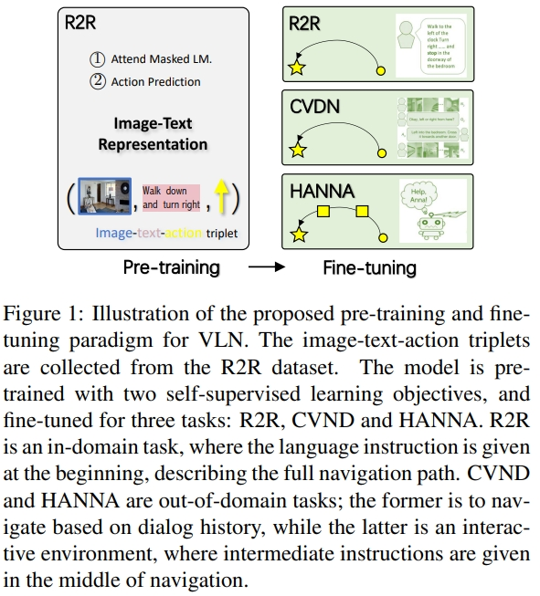
<figcaption>  
</figcaption>

为了通过预训练模型抽象出学习输入的image-text的通用表征，作者设计了visual embedding和text embedding如下：

  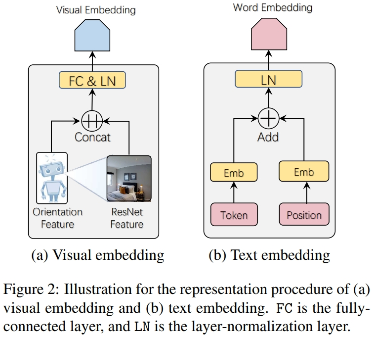
<figcaption>  
</figcaption>

### 10. Vision-Language Navigation with Self-Supervised Auxiliary Reasoning Tasks

本文提出Auxiliary Reasoning Navigation (AuxRN，辅助推理导航),由四个自监督的辅助推理任务来从语义信息中获取额外的训练信号。
所谓的四个task指：
1.  explaining the previous actions。由于过去的action会影响将来的结果，因此需要agent能学习过往的活动。通过一个trajectory retelling任务来实现。
2.  estimating the navigation progress。由于agent不能明确地/显式地按照指示对齐轨迹，因此，不确定视觉-语言的编码能否完全表征当前agent的状态。用setps的百分比来代表整个过程。
3.  predicting the next orientation。针对agent无法精确的评估自己当前的进度。通过二分类确定预测的轨迹是否跟指示相匹配。
4.  evaluating the trajectory consistency。agent的action space是隐式受限的，因此，如果agent可以知道导航图或者明白下一步action的后果，整个导航的过程会更精确及有效。
这些额外的训练信号可以帮助agent来获得语义表征的知识，进而建立对环境的全面感知。设计的loss则是角度的预测。

  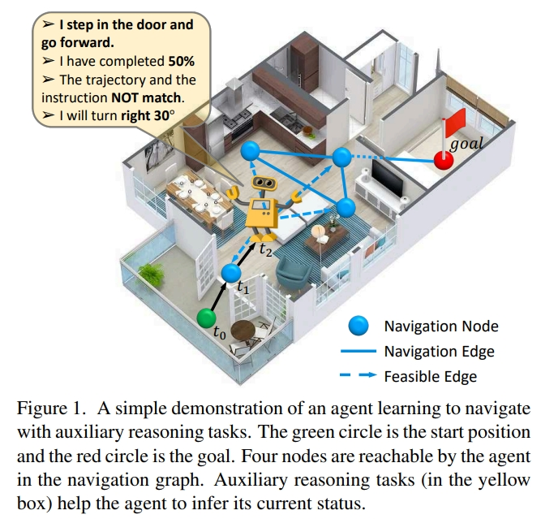
<figcaption>  
</figcaption>

AuxRN的架构如下图所示.对于全景视图，先分为36个image view，然后每个对应的image feature（作者没提怎么获得的，应该是ImageNet训练的网络获得的吧）以及方向的描述（包括方位角和俯仰角，两个角的sin与cos值，一共四个）

  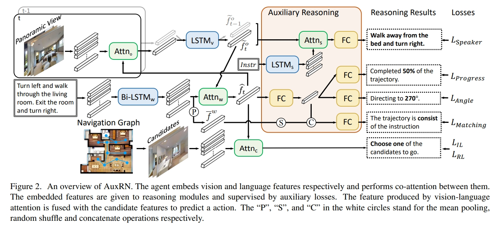
<figcaption>  
</figcaption>

简单来说这个工作就是在VLN的基础上，额外设计了四个loss，期待这些loss能让网络学习到空间的语义。

### 11. Active Visual Information Gathering for Vision-Language Navigation

本文期待解决由于模糊指令和不充足的观测导致的不确定性问题。如下图所示。直观理解就是有歧义发生的时候，应该主动进行探索（active exploration），那么就可以进一步确认（information gathering），而避免歧义。

  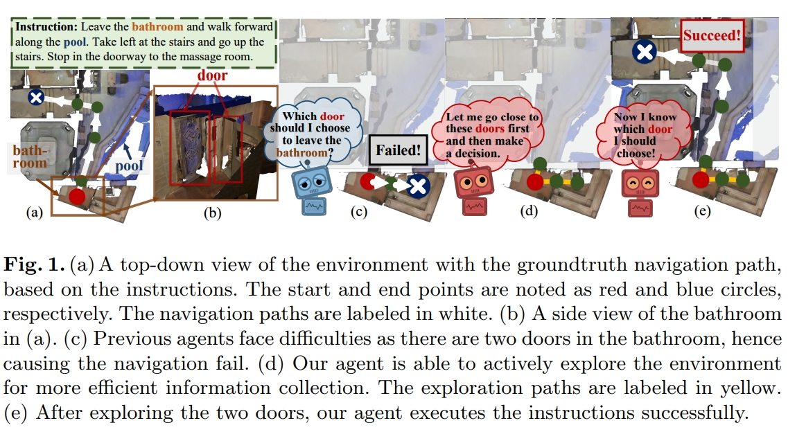
<figcaption>  
</figcaption>

因此，关键点在于设计的active exploration module：
1. 学习决定什么时候的探索是必要的。
2. 识别环境中哪一部分是值得探索的。
3. 从环境中聚集有用的信息来支持鲁棒导航
而在训练过程中，作者也鼓励agent收集相关信息来帮助自身做更好的决策。
而要实现自主收集最直接的方法则是在每个navigation step，agent简单的探索所有可以导航的视角，而每个也只探索“one step”。这样循环把每个视角的都探索完再回到原来的位置来做决策。

当然这种简单的策略会导致步数的增加以及更长的轨迹。因此需要agent学会决定从哪个方向探索以及有STOP action。
因此agent需要基于当前的导航状态、附近视角观测来预测每个探索action的概率分布。如果是STOP action，那么就停止探索，而是转为导航决策。

前面的探测只能够探测当前的位置的相邻导航视图，而大多的必要情况，我们可能需要更深度地多探测几步。因此，作者还提出了`Deeper Exploration`
* agent首先在原点选择一个探索方向.
* 然后沿着这个方向进行深度探索（multi-step）。直到找到足够的信息或者遍历完该方向的所有可导航点后，返回原点，决定是否继续选择一个新的方向探索，如果之前探索的的信息已经足够则不找新的方向了。
* 如果没找到groundtruth导航位置，则换个方向继续（换个方向属于next round)。
* 这样就能更新知识做出next action决策了，然后在下一个导航位置再进行类似的多步多轮探索。
* 当然，这样肯定有些节点信息重复被访问(回起点的时候，交叉节点，t+1步还会访问)， 为此，作者将探索（访问）过的节点放在外部memory graph中，代理不需要真正离开他所在的位置而是根据graph想象是否需要探索，直到必要时访问没探索过的节点。

从某种程度上本文是把exploration的概念引入到VLN中，同时用简单的策略来实现这个过程，但是单纯理论上看，觉得真是的自主决策的效果是存疑的~

训练上同样的是采用模仿学习+强化学习。
对于模仿学习，同时定义了导航的loss以及探索的loss。每一步导航，都会执行对应的S探索步，那么就相当于模仿教师的t到t+S步的导航action。也就是说仍然采用教师的导航行为来指导学习探索行为。

下图比较直观展示了实验的对比效果：

  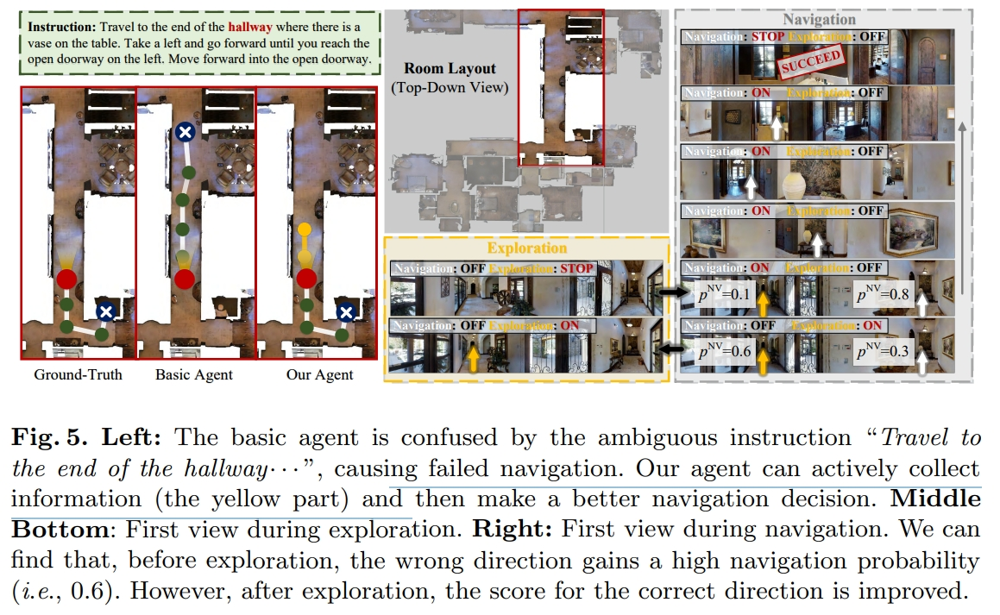
<figcaption>  
</figcaption>

### 12. Aerial Vision-and-Dialog Navigation
这应该就是类似CVDN的基于人类对话的无人机导航。Aerial Vision-andDialog Navigation (AVDN)

  
<figcaption>  
</figcaption>

### 13. Frequency-enhanced Data Augmentation for Vision-and-Language Navigation
将VLN的数据增广问题从spatial domain的探索转移到Fourier domain。
作者首先探索了高频信息对于VLN任务的重要性，证明它有助于加强视觉文本匹配过程。
基于这些发现，提出了基于频域的数据增强，也就是通过对可导航视角进行傅里叶变换，提取RBG的低频与高频部分。

  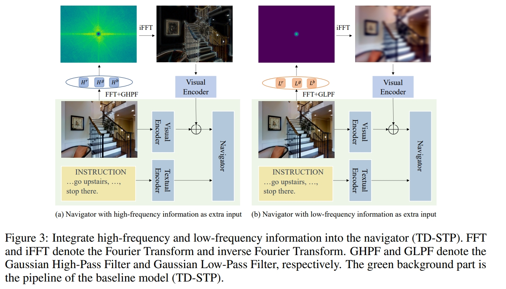
<figcaption>  
</figcaption>

### 14. Navila: Legged robot vision-language-action model for navigation
* [PDF](https://arxiv.org/pdf/2412.04453)
* [website](https://navila-bot.github.io/)
* [github](https://github.com/yang-zj1026/legged-loco)

现有的视觉语言导航（Vision-and-Language Navigation, VLN）系统通常依赖于预计算地图或使用深度传感器和单目RGB相机构建几何地图，但这些方法在复杂和杂乱的环境中表现有限。
本文主要解决腿式机器人（如四足机器狗或类人机器人）的视觉语言导航问题。

`With VLN, a robot is expected to navigate around unseen environments without a provided map following a language instruction`直观而言，VLN有点类似于自动驾驶中无图的概念，并且额外加上了语言指令实现人机交互。

而在VLA领域，更是将语言指令转换为action，机器人需要理解输入语言，进行闭环规划以及low-level control。而目前大部分的工作都是依赖于Large Language Models (LLMs)或者Vision-Language Models (VLMs)

研究难点：
* 如何将人类语言指令转换为低级别的腿部关节动作；
* 在不同机器人之间迁移VLN模型；
* 现有的VLN系统在处理连续环境和低级运动控制方面也存在挑战

NaVILA结合了视觉-语言-动作模型（VLA）与运动控制（locomotion）的两级系统来实现VLN，以提高腿式机器人的导航能力。使用视觉语言模型（VILA）处理单视图图像，生成自然语言形式的中间动作指令（mid-level action）。
本质上应该算是VLA，只不过进一步到导航层面，故此为VLN。

  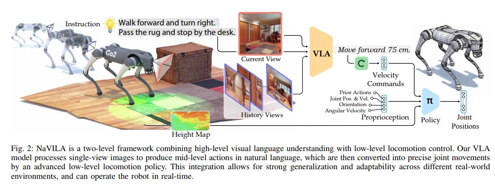
<figcaption>  
</figcaption>

如上图所示，NaVILA采用一个VLM来处理单视角图像，同时生成自然语言航路点指令。再由 locomotion policy翻译为真实机器人运动的精确关节运动。

***Taming VLMs for Vision Language Navigation***

作者采用image-based vision-language models（VILA），而VILA的预训练已被证明对多图像推理特别有效，使其特别适用于理解顺序图像关系至关重要的VLN任务。

  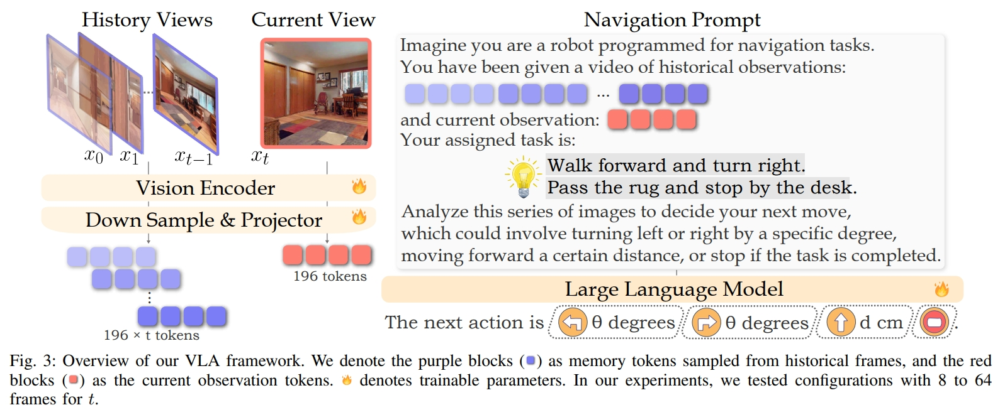
<figcaption>  
</figcaption>

VILA由三个主要组件组成：视觉编码器（vision encoder）、投影器（projector）和大型语言模型（LLM）。
* 视觉编码器将输入图像转换为视觉标记序列（visual tokens）
* 这些标记（tokens）通过多层感知机（MLP）投影器映射到language domain。
* 这些投影后的tokens与text tokens一起被发送到LLM进行自回归生成（auto-regressive
generation）。

VILA采用三阶段训练过程，包括连接器（connector）的预训练、连接器和LLM的联合预训练以及使用指令调整数据的微调。
1. frozen LLM 以及 vision backbones的connector
2. 通过text-image交织语料库来训练connector和LLM
3. 最后fine-tune全部模块s (vision encoder, connector,LLM) 

对于VLN任务中，不同时间的图像具有不同的作用。当前时间的图像用于立即决策，而之前的帧作为记忆库帮助智能体追踪整体进度。
为了更好地处理这两种表示，论文使用导航任务提示（Navigation Prompts）方法，通过区分当前观察和历史帧，并使用文本线索（textual cues）来构建导航任务提示。

~~~
这里的 textual cues 可以理解为给不同的观测加不同的token（如上面图2所示）
“a video of historical observations”: for memory frames
“current observation”: for the latest frame
~~~

对于VLA的训练：
1. 整合VLN中历史的内容与当前的观测到VLM框架中
2. 为VLN任务量身定制的专用导航提示
3. 利用来自YouTube中人类 touring（巡演）的真实环境视频来提高agent在连续空间的导航能力
4. 引入了一个数据集来提升VLN的泛化能力

这些策略将通用的基于image的VLM fine-tune为以导航为目标的agent，同时通过在通用的视觉-语言数据集的训练来保证其强大的泛化能力。`the first work to show that direct training on human videos improves navigation in continuous environments`

对于来自YouTebe的真实数据，首先基于熵的采样来分为20K个代表性的轨迹。通过MASt3R来从视频中估算粗话camera pose，然后提出step-by-step action，并且采用LLM 重新表述与基于VLM的字幕生成来生成自然语言指令。这样就可以实现利用人类的视频来作为连续导航的数据。

  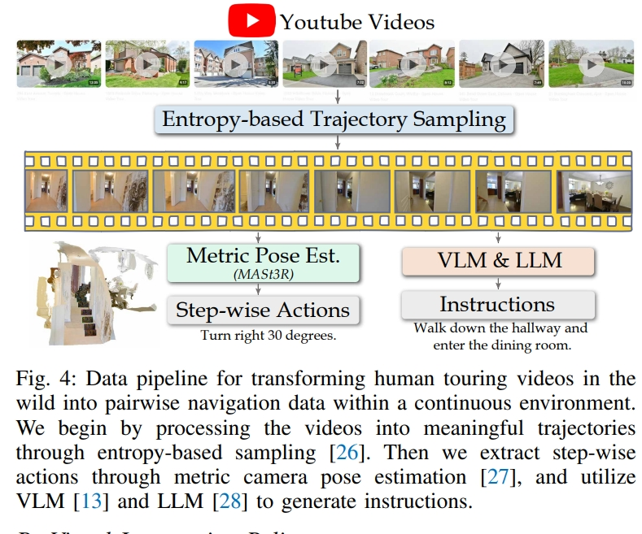
<figcaption>  
</figcaption>

对于locomotion的训练，采用single-stage approach来学习基于视觉的运动控制策略。通过原始的LiDAR点云来构建高度图（height map），同时通过引入一些随机性来减少sim-to-real的gap。
控制器通过VLA模型的输出作为苏杭如，将其转换为速度等控制指令，进而控制关节。

采用VLN-CE-Isaac来端到端训练基于视觉的control policy

而作者更是通过实验发现，所采用的VLA与运动控制（locomotion）的两级系统来实现VLN比起经典的VLN框架要提升17%的成功率。但从结果来看SR也就是50%左右的级别

  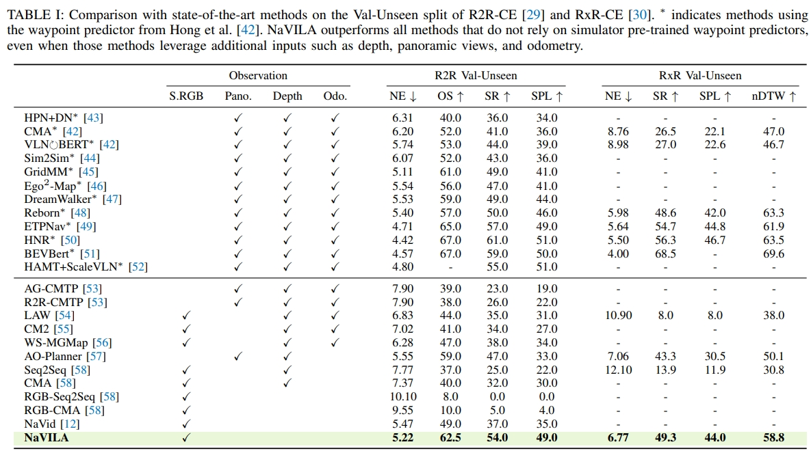
<figcaption>  
</figcaption>

# 参考材料
* [《视觉语言导航》特邀讲师：吴琦副教授（澳大利亚阿德莱德大学）](https://www.bilibili.com/video/BV13g41157yL/?spm_id_from=333.1387.top_right_bar_window_history.content.click&vd_source=a88e426798937812a8ffc1a9be5a3cb7)
* [吴琦：AI研究一路走到“黑”， 从VQA到VLN](https://cloud.tencent.com/developer/article/1806234)
* [Thinking-VLN](https://github.com/YicongHong/Thinking-VLN)
* [“青源Talk”第43期 视觉语言导航](https://www.bilibili.com/video/BV1UV411g7UN/?spm_id_from=333.337.search-card.all.click&vd_source=a88e426798937812a8ffc1a9be5a3cb7)
* [一些VLN论文阅读记录](https://blog.csdn.net/weixin_45347379?type=blog)
* [VLN入门](https://mp.weixin.qq.com/mp/appmsgalbum?action=getalbum&__biz=MzkwMTgxNjk5OA==&scene=1&album_id=3762415814423363584&count=3#wechat_redirect)
