<!-- * 目录
{:toc} -->

<!-- # 引言 -->

2022年OpenAI发布的CLIP模型，大大提升了模型的跨模态理解能力，实习了视觉与语言的统一，也给VLN带来新的突破————零样本学习的能力使得机器人无需依赖人工标注，即可理解自然语言指令并执行高效导航。

本博文针对基于CLIP的VLN几篇论文对其进展进行调研。

本博文仅供本人学习记录用~

* [Paper List](https://github.com/KwanWaiPang/Awesome-VLN)
* [Blog for VLN](https://kwanwaipang.github.io/VLN/)
* [Blog for CLIP](https://kwanwaipang.github.io/CLIP/)
* [论文阅读笔记之《Vision-and-language navigation today and tomorrow: A survey in the era of foundation models》](https://kwanwaipang.github.io/VLNsurvery2024/)

<!-- !!!!!!!!!!!!!!!!!!!!!!!!!!!!!!!!!!!!!!!!!!!!!!!!!!!!!!!!!!!!!!!!!!!!!!!!!!!!!!!!!!!!!!!!!!!!!!!!!!!!!!!!!!!!!!!!!!!!!!!!!!! -->

# 1. Cows on pasture: Baselines and benchmarks for language-driven zero-shot object navigation

* [cvpr2023](https://openaccess.thecvf.com/content/CVPR2023/papers/Gadre_CoWs_on_Pasture_Baselines_and_Benchmarks_for_Language-Driven_Zero-Shot_Object_CVPR_2023_paper.pdf)
* [website](https://cow.cs.columbia.edu/)
* [code](https://github.com/columbia-ai-robotics/cow)

对于一般能用的机器人，他们需要能够寻找人类描述（也就是语言）的任意物体，即使没有对域内数据进行昂贵的导航训练（也就是要实现zero-shot性能）。因此，作者提出language-driven zero-shot object navigation (L-ZSON)。

受到最近图像分类中的开放词汇模型（open-vocabulary models）的启发，作者提出一个直接的框架——CLIP on Wheels (CoW)，也就是将开放词汇模型用到这个任务中（without fine-tuning）。从这个维度上说其实就跟，CLIP用到传统CV的任务是很类似的。

而为了验证L-ZSON，作者提出了PASTURE benchmark，需要考虑到寻找查找不常见的object、由空间和外观属性描述的object，以及相对于可见object描述的隐藏object。
而作者一共验证了90k个导航的集（90k navigation episodes），发现：
1. Cow baseline通常很难利用语言描述，但擅长发现不常见的对象；
2. 基于CLIP的object定义及经典的探索（不需要额外training）

  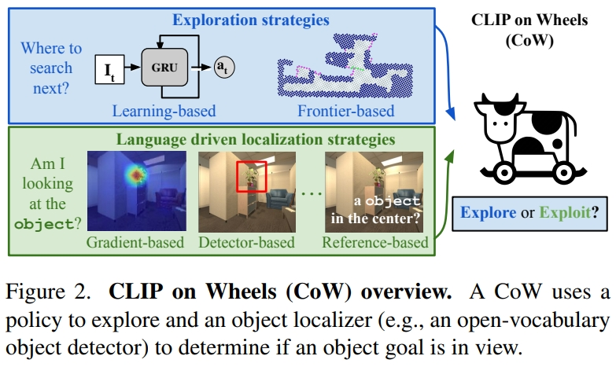
<figcaption>  
</figcaption>

本文主要是for object localization的，但是由于有语言的输入，且属于寻找物体，因此跟目标导向的VLN几乎是一样的。对于探索的方法有基于前沿的探索（Frontier based exploration，FBE，可以理解为用地图的探索 ）也有基于learning的（可以理解为用trainable GRU的hidden state来记录）

而对于采用的开发词汇分类器（open-vocabulary classifiers），通过三种策略来fine-turn CLIP模型为object localizers：
1. 采用CLIP的文本编码器来编码k个引用表达，特别指定目标物体在图像的哪个区域。比如`a plant in the top left of the image`。然后匹配当前观测的语言的embedding与CLIP的视觉embedding。计算图像和文本特征的相似性来决定区域的相关分数。
2. 将图像离散化为k个小的patches，然后或者CLIP的patch embedding。然后将每个patch embedding与CLIP文本embeding进行卷积。如果object在patch中，对这个patch的相关分数就会很高。
3. 修改一个可解析（interpretability）的方法，从ViT中提取物体的相关性。使用一个目标CLIP文本embedding以及CLIP视觉编码器的累积梯度信息，进而可以构建输入pixel的相关性的图，当object在视野中可以定性的分割目标。

对于开放词汇检测器与分割器（open-vocabulary detectors and segmentors）采用了两个额外的开发词汇模型来做object localization
* MDETR segmentation model，输入文本和图像，输出box检测。
* OWL-ViT detector用了一系列预测微调配方来将类似CLIP的方法转为物体检测。

实验测试测试了一系列基于CLIP的baseline的SR和SPL（Success weighted by inverse path length）

# 2. CLIP-NAV: USING CLIP FOR ZERO-SHOT VISIONAND-LANGUAGE NAVIGATION

* [PDF](https://arxiv.org/pdf/2211.16649)

本文与上一篇是同期提出的，开创了CLIP在导航中的另一条技术路径。相较于前者依赖全局热力图的暴力搜索策略，CLIP-NAV采用局部增量规划框架，将导航过程分解为单步决策序列：通过CLIP实时计算视觉场景与子指令（如「找厨房门」）的匹配度，直接预测最优动作（左转/直行）。

VLN要面对的场景都是比较复杂的：如任意的语言指令、多样性的环境。而CLIP等视觉语言模型在zero-shot目标识别等都展示了强大的性能，因此作者在本文中尝试探究这些方法能否实现zero-shot的language grounding。本质上跟上文是有点像的，都是把CLIP用到VLN中（without any dataset-specific finetuning），作为尝试性论文，只是上一篇以object navigation为主题，本篇更细化到VLN上。

此前的VLN方法都是采用监督学习,模型首先在"seen"环境及指令下训练的,然后在"seen"以及"unseen"环境下验证.这类型的方法没见过的环境中通常有明显的性能drop.如下图所示:

  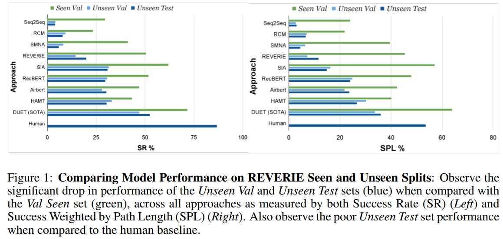
<figcaption>  
</figcaption>

此外,现有的VLN模型也都是dataset specific的,也就是在一个数据集下训练的模型难以泛化到另一个数据集上.比如在REVERIE上训练的,在SOON上可能得不到类似的结果(虽然这两个数据集都是很像的,都是coarse-grained instruction following task).不过这主要是由于训练数据不够导致的。虽然可以通过一些数据增强来改善，但是提升还是有限的。

作者所提出的方法包含三步：
1. 指令分解-将粗粒度（coarse-grained）指令分解为关键短语。
2. 视觉语言定位（Vision-Language Grounding）-使用CLIP在环境中找到keyphrase
3. 采用CLIP的分数来做导航决策

下面也对用作者提出的指令分解方法与GPT-3做指令分解的区别

  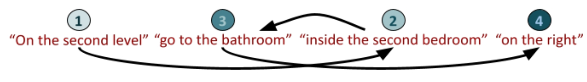
  
<figcaption>  
作者将指令分解的时候会分为：Navigational components (NC) and Activity components (AC)
</figcaption>

将指令分解为keyphrases后，作者就用于在Matterport3D的导航中，而Matterport3D的每个节点但都是agent的360度的全景图像，而为了选择全景图中的导航方向，作者将其分为4个分开的image，每张图包含了agent大概90度的空间。然后图片分别与语言指令通过CLIP进行匹配，选择匹配最大的为方向。其中AC指令如果超过一定的阈值或满足停止的条件时就会执行`stop`

  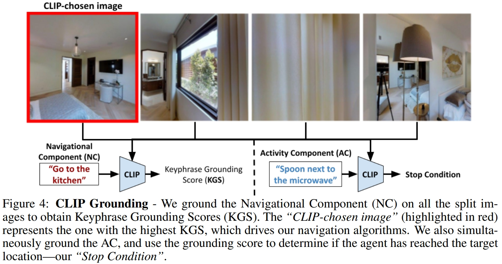
<figcaption> 
上图的红色就是选定的图像 
</figcaption>

下图则是为整个CLIP-Nav的框架。每一步将全景图分为4张图像。通过CLIP选择一张图像。进而可以获得该图片对应的可以导航邻近节点，然后选择最近的节点。
此外，NC grouding score也会决定什么时候选择下一个keyphrase。比如，`Go to the kitchen`如果 grounding score一直高于一定的阈值，我们就假设agent可以成功导航到kitchen，并且可以执行next keyphrase。因此CLIP不仅仅是选择导航的方向，还是决定agent什么时候到达中间的目标位置。

  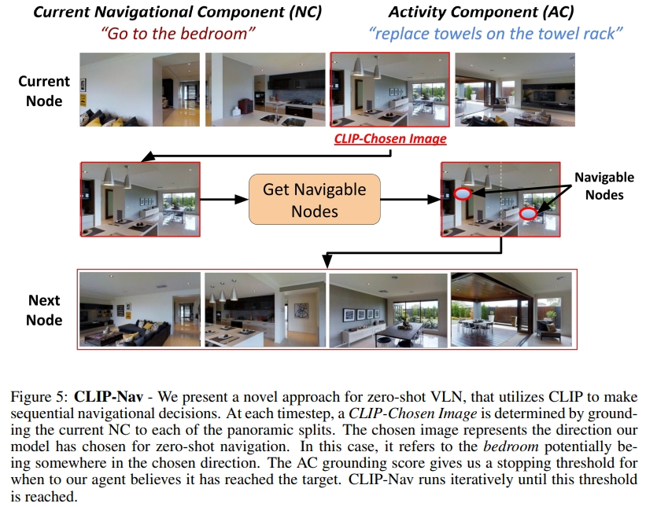
<figcaption> 
</figcaption>

同时由于选择节点的时候采用的是最近的节点，因此作者额外提出了一个 backtracking mechanism，如下图所示。用来决定agent是否需要回溯一些节点。

  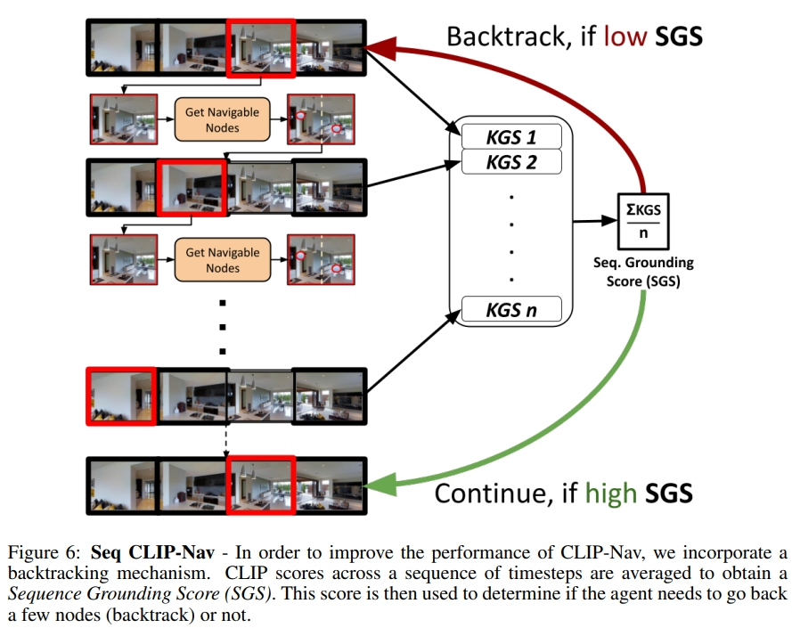
<figcaption> 
</figcaption>

不过从实验的表格上来看，似乎并没有作者所宣称的效果，只是额外定义了Relative Change in Success (RCS)指标来证明效果更好，但是成功率这些是远不如supervised learning的

  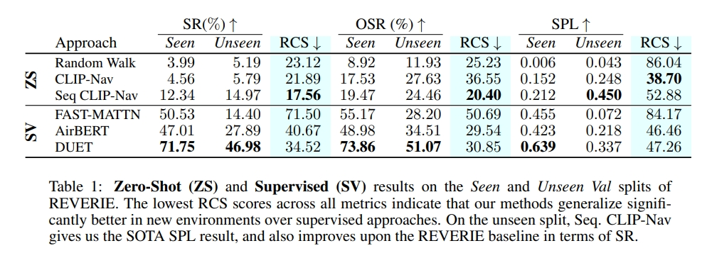
<figcaption> 
</figcaption>

# 3. ESC: Exploration with Soft Commonsense Constraints for Zero-shot Object Navigation

* [PDF](https://proceedings.mlr.press/v202/zhou23r/zhou23r.pdf)

本文提出了一种新的zero-shot的目标导航方法。软常识约束下的探索（Exploration with Soft Commonsense constraints，ESC)。通过预训练模型引入常识推理机制，而不需要导航经验或者其他的视觉环境的训练。
1. ESC利用预训练视觉语言模型（GLIP）来做open-world prompt-based grounding（开放世界提示定位）以及采用预训练的commonsense 语言模型来做房间和物体的推理（这部分属于场景理解/scene understanding）。
2. ESC通过把导航动作建模为用于高效探索的软逻辑词（soft logic predicates），实现将commonsense知识转换为导航action，这部分（Frontier-based Exploration 和Probabilistic Soft Logic，PSL）就是将大语言模型（LLM）推理的commonsense知识转换为执行action。

而本文验证也是以object goal navigation的benchmark来评估的。

ESC框架如下图所示。首先将输入的图像转换为场景的语言理解，然后将其投影为语义地图（semantic map），然后利用LLM来进行常识推理，进而获取目标物体与其他物体、房间的空间关系。最后通过结合Frontier-based Exploration与场景语义理解，还有通过Probabilistic Soft Logic实现commonsense的推理。

  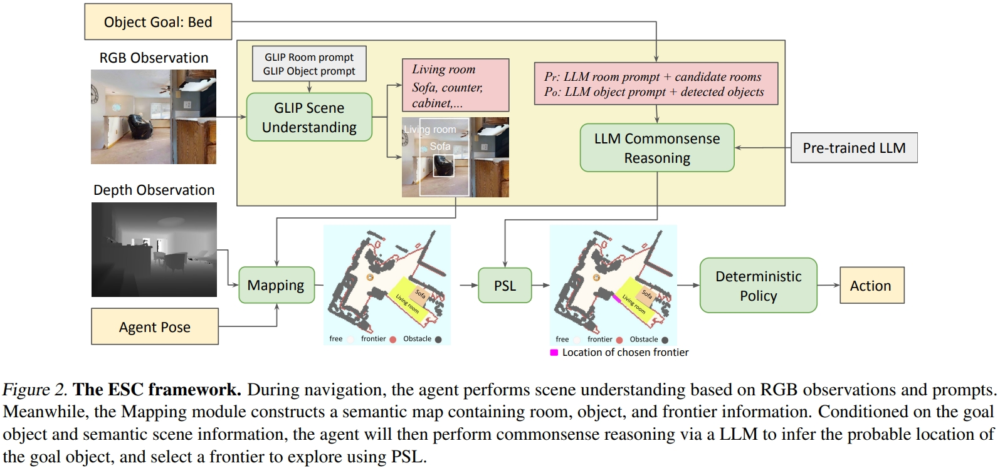
<figcaption> 
</figcaption>

* 开放世界语义理解：为了利用LLM来做导航推理，需要将输入的RGB图像转换为语言形式的语言内容。这部分的实现是采用GLIP
* 语言地图的构建（Semantic Map Construction）：基于输入的depth，agent的位置，相机的参数，可以实现2D图像pixel转换到3D空间，并且存储为3D voxel的形式，然后再将其沿着高度维度进行投影即可获得2D导航地图（其实也就是栅格地图）

对于探索采用的是一种启发式探索方法，基于边界的探索（Frontier-based Exploration，FBE）

至于性能效果则是比前面的CoW要好不少。

  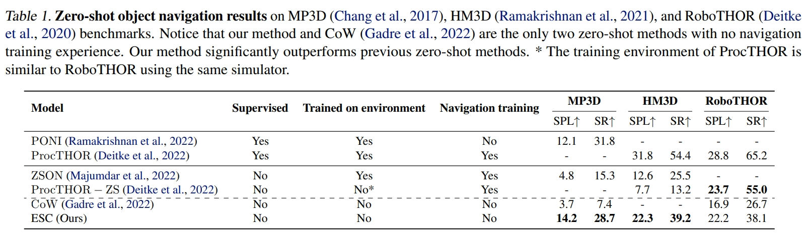
<figcaption> 
</figcaption>

最后值得一提的是，写这篇博文的初衷其实是参考了这篇文献推文的[10年VLN之路：详解具身智能「视觉-语言-导航」三大技术拐点！](https://mp.weixin.qq.com/s/FvPMMnaHNovsU28xC-agRg)当时觉得这篇推文写得很差，每个字都懂连起来既没有逻辑性，又没有连贯性，所以打算针对性的把里面提到VLN的四个CLIP工作阅读一下，结果读了3个发现两个都不是直接跟VLN有关系的😂并且也没有一个明显的技术发展的脉络。。。。。。

~~~
补充，下面的也不是😂
不过勉强也是可以跟VLN扯上关系的，只是这是以探索或者说物体/目标导航为主的，或者可以理解为目标导向的VLN
~~~

# 4. VLFM: Vision-Language Frontier Maps for Zero-Shot Semantic Navigation

* [PDF](https://arxiv.org/pdf/2312.03275)

所谓的Vision-Language Frontier Maps（VLFM）是受到了人类推理的启发，旨在在新环境中导航到unseen的语义object。
VLFM通过输入的深度观测构建栅格地图（occupancy map）。利用RGB观测以及预训练的视觉-语言模型来生成language-grounded value map。
VLFM利用这张map来识别最promising frontier（最有前途的前沿）来探索给定的物体类型。
VLFM通过预训练的VLM来选择哪个frontiers是最可能到达语义目标区域。与此前的工作不一样，不再依赖于目标检测或者语义模型进行文本推理，而是采用视觉-语言模型，直接从RGB中提取语义值，然后通过与文本构建cosine similarity score来定位目标。
并且其zero-shot的特性也使得它可以移植到波士顿动力移动操作平台上。

如下图所示，框架可以分为三部分：
1. 初始化/initialization：机器人原地旋转一整圈，以建立其边界（frontier）和language-grounded value map。
2. 探索/exploration：机器人持续更新边界（frontier）和value map，以创建frontier waypoints，并选择最有价值的航路点来定位指定的目标对象类别并导航到它。一旦找到目标object类别，就会导航过去。
3. 目标导航/goal navigation：机器人简答的导航到最靠近所检测的目标物体的地方，然后触发`STOP`.

  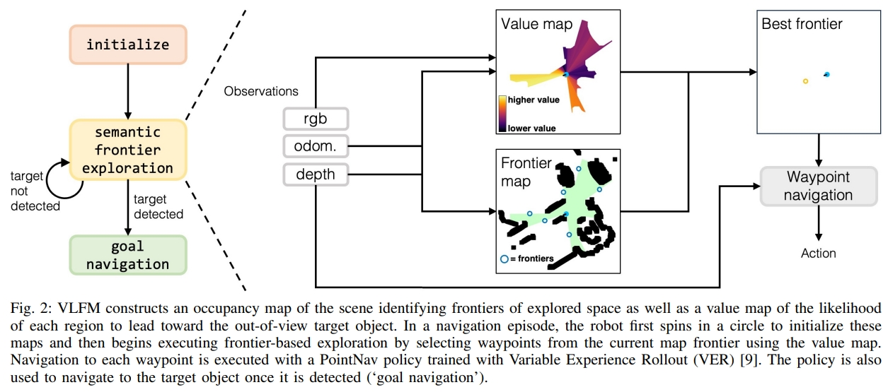
<figcaption> 
</figcaption>

* 对于Frontier waypoint generation：采用depth以及里程计观测来构建障碍物的top-down 2D地图。基于机器人的位置会更新可探索的区域。对于障碍物的位置，通过把depth image转换为point cloud，然后投影到2D栅格上。进一步的，识别区分探索与未探索区域的边界，用其midpoint作为潜在的frontier waypoint。随着机器人探索区域，frontier的数量和位置都会变化，直到整个环境都被探索了且没有frontier。
* 对于Value map generation：作者采用预训练好的视觉语言模型，BLIP-2（CLIP的图像到文本检索），来直接从机器人当前的RGB观测以及包含目标物体的txet prompt来计算cosine similarity score。而这个score会进一步的投影成value map。这个值是用作confidence value来辅助frontiers的选择以及目标的定位的。

  
<figcaption> 
</figcaption>

至于最终的物体检测采用的是Grounding-DINO。

从实验结果来看，虽然比起其他方法都有一定的提升，但是在不同数据集下的差异还是比较大的~

  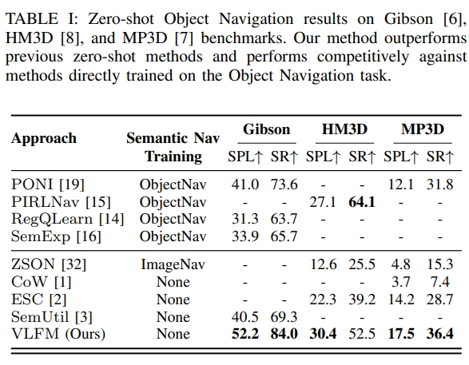
<figcaption> 
</figcaption>

论文[网站](http://naoki.io/vlfm)上有对应的实验demo。

# 参考资料
* [10年VLN之路：详解具身智能「视觉-语言-导航」三大技术拐点！](https://mp.weixin.qq.com/s/FvPMMnaHNovsU28xC-agRg)
