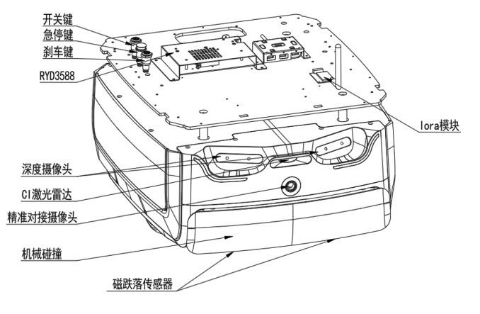
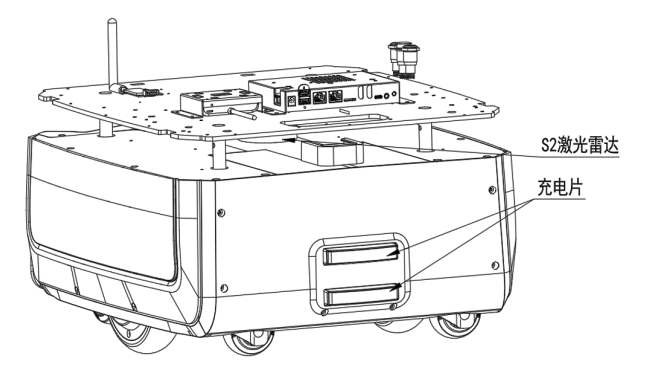

<!-- * 目录
{:toc} -->

<!-- # 引言 -->

本博文基于思岚的赫尔墨斯 Hermes PRO MAX移动底盘的技术文档做个基本的了解。
本博文仅供本人学习记录用~


# 地盘硬件部分

底盘采用的主控方案为RK3588（8核，4 * Cortex A76+4 * Cortex A55。主频2.4G），4G内存
（此前，了解过的RK3576是：8核A72+A53，2.2G主频+4G内存，两者差距不大）

地盘的整体结构如下所示。注意地盘后侧由于有走线的遮挡，因此激光雷达有一小部分被block了（实测的时候大概30度左右～）

<div align="center">
  <table style="border: none; background-color: transparent;">
    <tr align="center">
      <td style="width: 50%; border: none; padding: 0.01; background-color: transparent; vertical-align: middle;">
        
      </td>
      <td style="width: 50%; border: none; padding: 0.01; background-color: transparent; vertical-align: middle;">
        
      </td>
    </tr>
  </table>
  <figcaption>
  </figcaption>
</div>


最大的负载为80KG，相当于一个成年人。

有自动回充功能，但是Hermes PRO MAX 底盘单独运行时，自动回充功能无法触发，需要开启配送或消毒插件才能使用。定制机型和搭配整机使用则有自动回充功能。

<div align="center">
  
<figcaption>  
</figcaption>
</div>


传感器方面是有两个激光雷达+两个深度相机：

* S2 2D激光雷达（RPLIDAR S2P）
需要留一个S2 2D激光雷达的净空区：底盘本体和上位机之间有激光雷达，其需要一定的净空区以避免被遮蔽或者干扰

<div align="center">
  
<figcaption>  
</figcaption>
</div>

* 深度相机及C1雷达
深度相机为两个。C1雷达应该就是参数表中的低矮障碍物识别传感器？不过机器人本身似乎也有带碰撞条。
<div align="center">
  
<figcaption>  
</figcaption>
</div>


# windows系统

对于建图定位等功能，windows下开放API可以调用（如机器人的位姿、获取当前的地图等等），但是不能直接访问到数据data的。而在说明文档中有详细的建图流程及软件下载安装说明~

<div align="center">
  
<figcaption>  
</figcaption>
</div>

对于建图的api存在禁区和虚拟墙两个概念：
* 禁区：当人为不小心把 Hermes 推进禁区时，在 RoboStudio 中随意给一个定点，Hermes 机器能够自动从禁区中脱困出来。
* 虚拟墙：当人为不小心把 Hermes 推进虚拟墙时，在 RoboStudio 中随意给一个定点，Hermes 机器不能自动从虚拟墙中脱困出来，需要人将其推出来。

本人也曾经对思岚地板进行测试，根据测试结果总结分析如下：
1. 避障部分：
   * 障碍物检测：激光雷达平面的上方采用的两个倾斜向上的`深度摄像头`；激光雷达平面下方应该采用的`c1激光雷达`作为低矮障碍物识别传感器；此外还有`物理碰撞传感器`,碰撞检测后，机器人会往后退一点；至于`物理磁传感器`应该是用于检测是否离开地面（这对于有楼梯无栏杆平台是一个很好的保护措施）
2. 路径规划部分：从界面来看，路径变更的频率不高，遇到建图中没出现的障碍物会首先急停，然后重新规划轨迹。从这个角度来看，全局路径规划应该只是急停后才做，局部路径规划只规划轨迹不做臂障处理（但也存在如果开启slam地图实时更新的时候有躲避障碍物而非急停的情况）
3. 对于SLAM，有建图与基于地图的纯定位模式。但是没有重定位（也就意味着开机状态应该位于起点）。而对于大场景会自动触发回环。从回环的效果来看除了scan-to-map匹配外应该还有基于临近法的回环检测。

# ubuntu系统

对于ubuntu系统用户，支持ros1/ros2功能包接口，请见[link](https://wiki.slamtec.com/display/SD/ROS+SDK)

开放的topic为scan、odometry、gridmap。只能订阅这三个topic。
*  `ros2 topic echo /slamware_ros_sdk_server_node/scan`
*  `ros2 topic echo /slamware_ros_sdk_server_node/odom`
*  `ros2 topic echo /slamware_ros_sdk_server_node/map`

其余实用功能跟window版本的控制或者turtlebot3类似～

## 编译及开启系统

首先通过[链接](https://www.slamtec.com/cn/Support#apollo)下载对应的ROS代码（注意是x86还是aarch架构的）。

解压后编译（基于ROS2）

```bash
cd ~/slamtec_ws
colcon build

# 编译后记得source一下
source install/setup.bash
```

启动节点：

```bash
# 启动SDK的launch
ros2 launch slamware_ros_sdk slamware_ros_sdk_server_node.xml ip_address:=10.160.129.38 port:=1448
# 通常可以看到底盘的SN号以及固件版本即表示启动成功了。

#开启topic订阅及发布节点
ros2 launch slamware_ros_sdk view_slamware_ros_sdk_server_node.xml
```

## 控制测试

```bash

#向前移动控制指令
ros2 topic pub /cmd_vel geometry_msgs/msg/Twist "linear:
  x: 2.0
  y: 0.0
  z: 0.0
angular:
  x: 0.0
  y: 0.0
  z: 0.0"

#回桩控制指令
ros2 topic pub --once /slamware_ros_sdk_server_node/go_home slamware_ros_sdk/msg/GoHomeRequest "{}"

#前进指令
ros2 topic pub /slamware_ros_sdk_server_node/move_by_direction slamware_ros_sdk/msg/MoveByDirectionRequest "{direction: {direction: 0}}"


# 设置速度
ros2 topic pub /slamware_ros_sdk_server_node/move_by_direction slamware_ros_sdk/msg/MoveByDirectionRequest "{direction: {direction: 0}, options: {speed_ratio: {is_valid: true, value: 0.5}}}"

# 移动到点
ros2 topic pub /slamware_ros_sdk_server_node/move_to slamware_ros_sdk/msg/MoveToRequest "{location: {x: 2.0, y: 0.0, z: 0.0}, yaw: 0.0}"

```


# 参考资料
* [思岚地盘用户说明](https://www.slamtec.com/cn/Support#apollo)
* [基于 WSL Ubuntu22.04 使用 ROS2 SDK控制思岚科技底盘的详细指南](https://jz39ptubzt.feishu.cn/docx/KVRPdNHcgo8szNxTcLsctEP3nLe)
* [Hermes PRO MAX用户说明文档](https://bucket-download.slamtec.com/4a462a9a0b2a8400f7f2bf99755756b3a113f655/CN%20SLAMTEC_Hermes%20PRO%20MAX_usermanual_v1.8_240717.pdf)
* [Rockchip RK3576 核心板](https://www.talowe.com/modules/rk3576.html?sdclkid=ALos152zxrDiA5qpA5e&bd_vid=11201175762682855041)