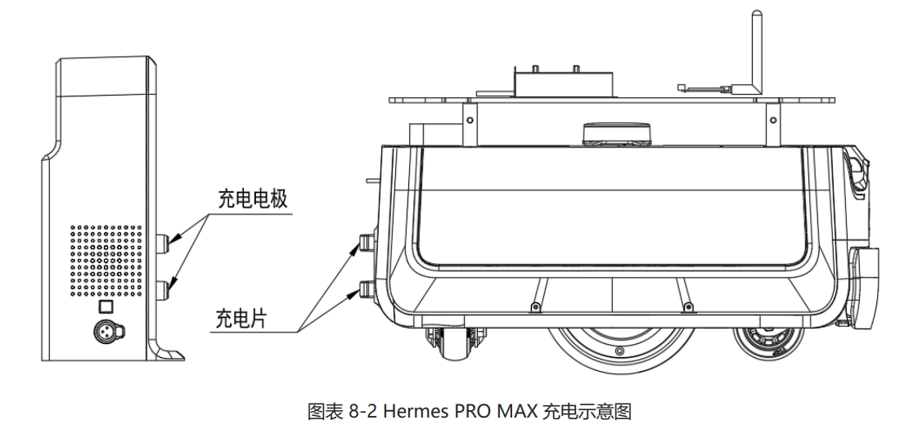
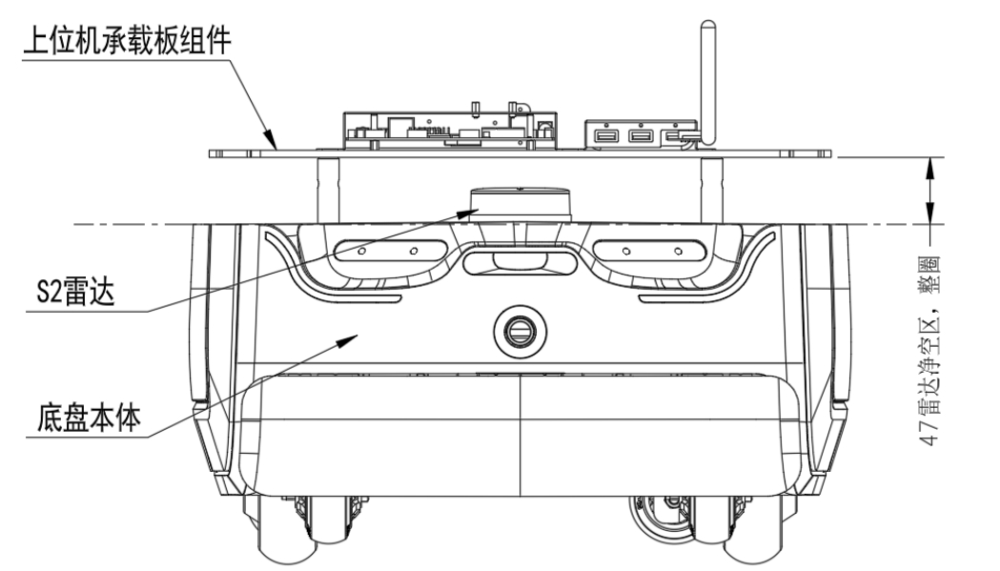
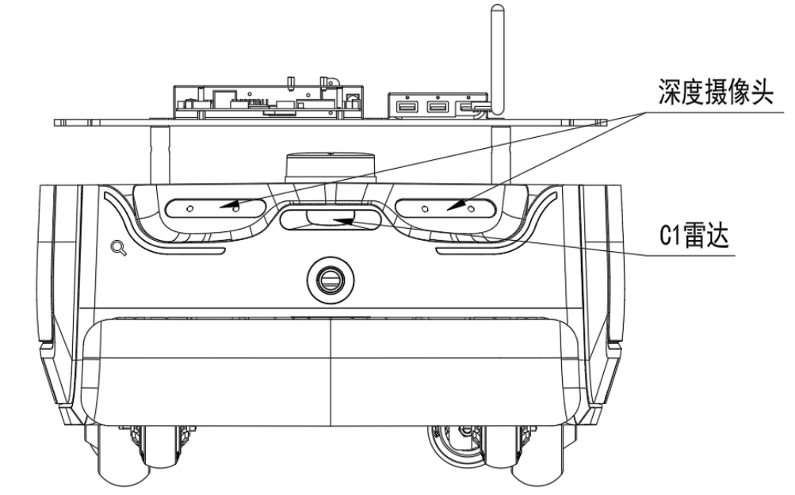
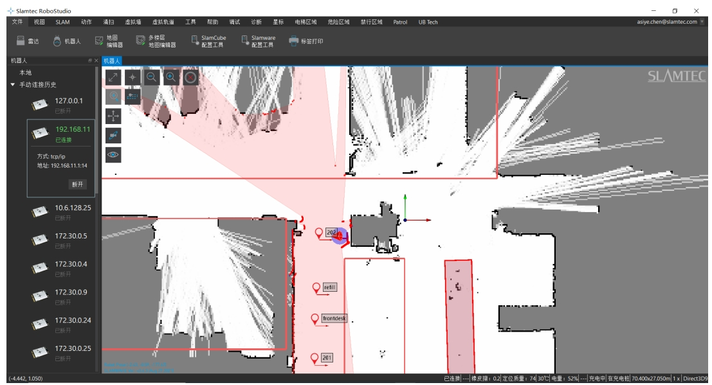

<!-- * 目录
{:toc} -->

<!-- # 引言 -->

本博文基于思岚的赫尔墨斯 Hermes PRO MAX移动底盘的技术文档做个基本的了解。

本博文仅供本人学习记录用~

<!-- !!!!!!!!!!!!!!!!!!!!!!!!!!!!!!!!!!!!!!!!!!!!!!!!!!!!!!!!!!!!!!!!!!!!!!!!!!!!!!!!!!!!!!!!!!!!!!!!!!!!!!!!!!!!!!!!!!!!!!!!!!! -->

<!-- # 地盘硬件部分 -->

底盘采用的主控方案为RK3588（8核，4 * Cortex A76+4 * Cortex A55。主频2.4G），4G内存
（此前，了解过的RK3576是：8核A72+A53，2.2G主频+4G内存，两者差距不大）

最大的负载为80KG，相当于一个成年人。

有自动回充功能，但是Hermes PRO MAX 底盘单独运行时，自动回充功能无法触发，需要开启配送或消毒插件才能使用。定制机型和搭配整机使用则有自动回充功能。

  
<figcaption>  
</figcaption>

传感器方面是有两个激光雷达+两个深度相机：

* S2 2D激光雷达（RPLIDAR S2P）
需要留一个S2 2D激光雷达的净空区：底盘本体和上位机之间有激光雷达，其需要一定的净空区以避免被遮蔽或者干扰

  
<figcaption>  
</figcaption>

* 深度相机及C1雷达
深度相机为两个。C1雷达应该就是参数表中的低矮障碍物识别传感器？不过机器人本身似乎也有带碰撞条。

  
<figcaption>  
</figcaption>

对于建图定位等功能，应该是开放API可以调用（如机器人的位姿、获取当前的地图等等），但是不能直接访问到数据data的。而在说明文档中有详细的建图流程及软件下载安装说明~

  
<figcaption>  
</figcaption>

对于建图的api存在禁区和虚拟墙两个概念：
* 禁区：当人为不小心把 Hermes 推进禁区时，在 RoboStudio 中随意给一个定点，Hermes 机器能够自动从禁区中脱困出来。
* 虚拟墙：当人为不小心把 Hermes 推进虚拟墙时，在 RoboStudio 中随意给一个定点，Hermes 机器不能自动从虚拟墙中脱困出来，需要人将其推出来。

# 参考资料
* [Hermes PRO MAX用户说明文档](https://bucket-download.slamtec.com/4a462a9a0b2a8400f7f2bf99755756b3a113f655/CN%20SLAMTEC_Hermes%20PRO%20MAX_usermanual_v1.8_240717.pdf)
* [Rockchip RK3576 核心板](https://www.talowe.com/modules/rk3576.html?sdclkid=ALos152zxrDiA5qpA5e&bd_vid=11201175762682855041)