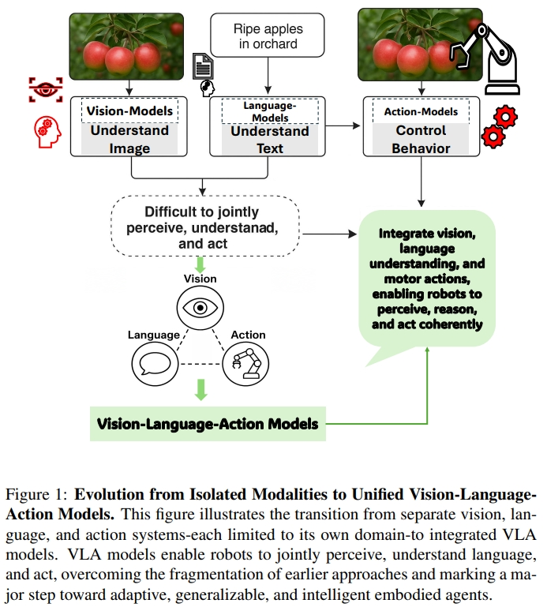
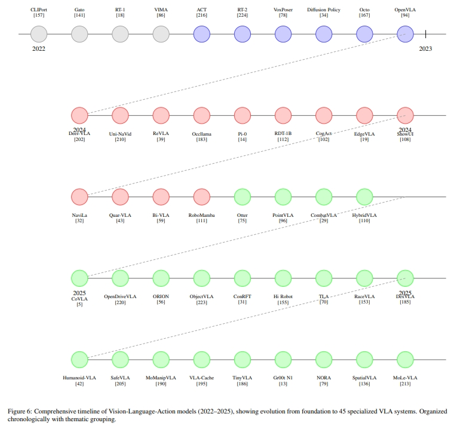
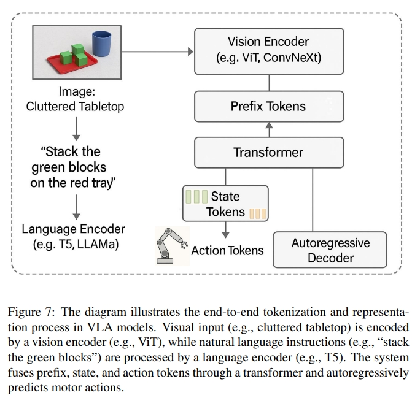
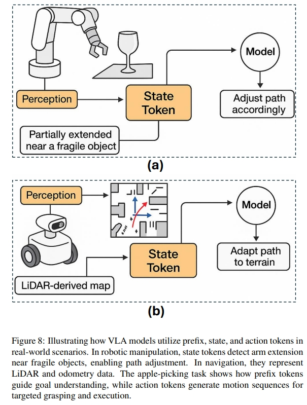
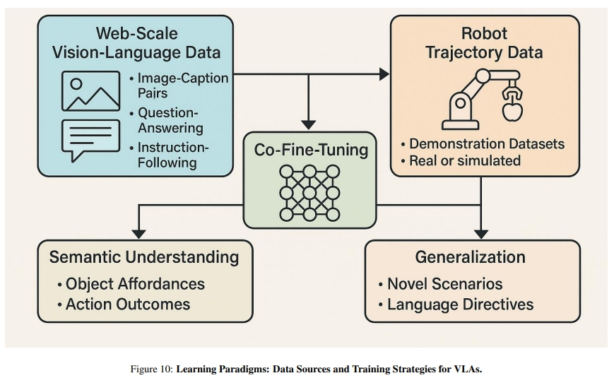

<!-- * 目录
{:toc} -->

之前博客对VLN及基于VLN的相关survey进行了调研学习。
VLA，Vision-Language-Action其跟VLN有很多共通之处，甚至本质上讲，两者只是数据集、任务类型不一样。或者说VLN是VLA的更一步。但是从网络发展、底层逻辑都是非常相似的。更有甚者，有些基于VLN的工作则是直接把VLN任务分为：VLA+locomotion policy相结合。

本博文对VLA综述论文`《Vision-language-action models: Concepts, progress, applications and challenges》`进行阅读整理。本博文仅共本人学习记录用~

* [PDF](https://arxiv.org/pdf/2505.04769?)
* [Paper List](https://github.com/KwanWaiPang/Awesome-VLN)
* [Blog for VLN](https://kwanwaipang.github.io/VLN/)
* [Blog for CLIP](https://kwanwaipang.github.io/CLIP/)
* [论文阅读笔记之《Vision-and-language navigation today and tomorrow: A survey in the era of foundation models》](https://kwanwaipang.github.io/VLNsurvery2024/)

~~~
从本文的画图可以感觉到，论文的质量应该是一般的~
~~~

<!-- !!!!!!!!!!!!!!!!!!!!!!!!!!!!!!!!!!!!!!!!!!!!!!!!!!!!!!!!!!!!!!!!!!!!!!!!!!!!!!!!!!!!!!!!!!!!!!!!!!!!!!!!!!!!!!!!!!!!!!!!!!! -->
# 引言

论文系统综述视觉-语言-动作（VLA）模型，从概念基础、发展进展、应用场景到挑战展开分析。
梳理 VLA 模型从跨模态学习架构到融合视觉语言模型（VLMs）、动作规划器和分层控制器的通用智能体的演化历程，涵盖 80 多个近三年发布的 VLA 模型，详述其架构创新、参数高效训练、实时推理加速等关键进展，探讨在类人机器人、自动驾驶、医疗与工业机器人、精准农业、增强现实导航等领域的应用，分析实时控制、多模态动作表示、系统可扩展性等核心挑战，并提出智能体 AI 自适应、跨实体泛化等针对性解决方案，最后展望 VLA 与 VLMs、智能体 AI 融合的未来路线图。

在视觉-语言-动作（Vision-Language-Action，VLA）模型出现之前，机器人技术和人工智能主要分布在彼此割裂的几个子领域：视觉系统能够“看”并识别图像；语言系统能够理解和生成文本；动作系统则能够控制物体运动。
如下图1所示。
传统的CV可以通过CNN来识别物体或者进行分类，但是并不能理解语言、也没有将视觉转换为action的能力。
而语言模型，特别是基于LLM的虽然可以革新了文本的理解以及生成，但是他们仍然只能处理语言文本，而不能感知或者推理物理世界。
与此同时，机器人中基于action的系统一般都是依赖于传统控制策略（hand-crafted policies）或者强化学习来实现例如目标抓取等等，但是这需要艰苦的工程设计。

  
<figcaption>  
</figcaption>

近年来，视觉语言模型（VLM， 如CLIP）等已经实现了通过融合视觉与语言的多模态感知，但是仍然无法基于输入的多模态信息生成或执行连贯的动作（coherent action）。
而VLA则是把视觉、语言、动作三者结合到一起。这也是具身智能的一个关键问题:如果系统无法同时感知、理解并采取行动，真正的智能自主行为将无从谈起.(`without systems that could jointly perceive, understand, and act, intelligent autonomous behavior remained an elusive goal`)

VLA 模型构想于 2021-2022 年，并在 Google DeepMind 的 Robotic Transformer 2（RT-2）等研究工作中得到率先实践，提出了一种将感知、推理与控制统一于单一架构的变革性方法。
VLA 模型整合了视觉输入、语言理解与运动控制能力，使具身智能体能够感知环境、理解复杂指令并动态地执行相应动作。

早期的 VLA 方法通过在视觉-语言模型中引入action tokens——即用于表示机器人动作指令的数值或符号形式（numerical or symbolic representations），实现了这种三模态融合。
模型可借助配对的图像、语言与轨迹数据进行训练，大幅提升了机器人对未见物体的泛化能力、对新颖语言指令的解释能力，以及在非结构化环境中的多步推理能力。
进一步地，VLA还可以借助大规模互联网数据集（g internet-scale datasets），这些数据集整合了图像、文本与行为信息，VLA 模型不仅能够识别与描述环境，还可以进行语境推理并在复杂、动态的场景中执行合适的动作。

# VLA 模型的核心概念

从技术层面，VLA结合了视觉编码器（比如CNNs，ViTs），语言模型（比如LLMs，transformers），实现任务条件控制的策略模块或规划器。
这些模块一般都选用多模态融合的方式，比如cross-attention，concatenated embeddings或者统一token，来将感官观察与文本指令对齐。

典型的VLA模型通过相机或者传感器数据来观测环境，解读用语言表达的目标，然后输出low-level或者high-level运动序列。
而目前常用的方法都是整合模仿学习、强化学习，或者检索增强模块（retrieval-augmented modules）来提高采样的效率以及泛化能力。

从22年到25年主要有三个关键的发展历程：
1. Foundational Integration（基础集成）。早期的VLA通过多模态融合架构来构建基本的视觉运动协调。如将CLIP的embeddings与运动属性（ motion primitives）相结合
2. Specialization and Embodied Reasoning（专业化与具体化推理）。第二代的VLA则是结合特定领域的归纳偏差（domain-specific inductive biases）。比如通过检索增强训练
3. Generalization and Safety-Critical Deployment（通用化和安全关键部署）。最新的VLN会以鲁棒性以及与人类对齐为前提。

下图演示了47个VLA模型的发展时间线。

  
<figcaption>  
</figcaption>

## VLA编码世界的方式——Tokenization and Representation

VLA跟其他传统的视觉-语言架构不一样的地方在于他们的基于token的表征framework，这使得它能够对感知、语言和物理行为空间进行整体推理。
当前的VLA都是将视觉、语言、砖头、action等模态编码成离散token的形式。这使得模型不仅可以明确需要做什么，还可以知道怎么做（前后基本无逻辑关系😂编码成token就可以啦？这论文怕是连LLM都写不出这么没有逻辑性的）

* Prefix （前缀）Tokens：编码了上下文与指令。如下图7所示ViT与Language将视觉以及语言指令都转换为前缀的token，这相当于对环境的初步理解。
* 状态Tokens：编码了机器人的设置（比如物理状态，关节位置等等）如图8(a)所示,机械臂非常靠近玻璃杯，这种情况下，状态的token对于安全性及实时本体感觉信息起到了重要作用。此外如8（b）所示，state token也可以包含里程计或者激光scan甚至是IMU等信息，这个时候就起到用于运动轨迹或者避障的作用了。
* action Tokens:就是用于控制指令的生成（Autoregressive Control Generation）

  <table style="border: none; background-color: transparent;">
    <tr align="center">
      <td style="width: 55%; border: none; padding: 0.01; background-color: transparent; vertical-align: middle;">
        
      </td>
      <td style="width: 45%; border: none; padding: 0.01; background-color: transparent; vertical-align: middle;">
        
      </td>
    </tr>
  </table>
  <figcaption>
  </figcaption>

感觉这部分作者是不停的重复用不同的描述讲解摘苹果这个事，然后人为的给定每个Token的含义，但实际上就完完全全只是“saying”

## VLA的训练
对于VLA的训练一般都是结合来自于网络以及机器人数据集的语义知识。如下图所示。

  
<figcaption>  
</figcaption>

首先来自于网络的数据可以给模型做个预训练，给模型赋予一些语义或者commonsense知识来更好的提取视觉或者语言表征。比如基于CLIP对比学习的系列架构，其实就是通过图像文本对的预训练来让网络可以实现视觉、语言在特征空间的对齐（embedding space）。而其强大的泛化能力，也被认为是让模型学会了理解世界的能力。

对于任务执行而言，单纯对世界的语义理解是不够的。因此还需要一些基于机器人的数据集，如：高保真的仿真或者从真实环境采集的数据。这些数据提供 video-action pairs、关节轨迹、在语言指令下的环境交互等等。
基于这些数据集再采用模仿学习或者强化学习来训练模型进而预测action。

因此，一般做法是先用视觉-语言数据集进行训练，然后在机器人演示数据上进行fine-tune。

# VLA技术进展与训练效率

VLA模型的发展得益于基于transformer的LLM的发展。从2022年的ChatGPT，到2023年的GPT-4（引入了多模态的能力，可以同时处理文本于图片）。
同样的视觉语言模型（VLM）比如像CLIP和Flamingo通过对比学习构建了鲁棒的视觉-文本对齐。

此外，像RT-1数据集有130,000个演示样例，这也提供了视觉、语言、action部分联合训练的基础。
而谷歌于2023年的RT-2更是VLA中一个标志性工作。再之后UC Berkeley的Octo model更是进一步拓宽研究视野

# VLA应用场景
以下为VLA的一些典型案例： 
1. 人形机器人。Helix 机器人通过 VLA 模型实现全身体动控制，能根据“递水杯”指令协调手臂、躯干和手指动作，在厨房场景中成功率达 92%；RoboNurse-VLA 在手术室中通过语音指令精准传递手术器械，对新型工具的泛化成功率超 85%。
2. 自动驾驶。OpenDriveVLA 融合多视角视觉与语言指令，实现“避开施工路段”的动态路径规划，在城市道路测试中决策准确率达 91%；ORION 模型通过 QT-Former 保留长时视觉上下文，解决“红灯停、绿灯行”的时序推理问题，复杂路口通过率提升 30%。
3. 工业与农业。CogACT 模型在工厂流水线中完成多步骤装配任务，对未见过的零件泛化成功率达 89%，比传统机器人提升 59%； VLA 机器人通过多光谱视觉识别“Grade A 苹果”，结合机械臂完成无损采摘，效率比人工提升 4 倍，损伤率低于 5%。
4. 增强现实（AR）导航.在机场场景中，VLA 模型解析“无台阶通往 22 号登机口”的指令，实时叠加导航箭头，对动态障碍物的规避成功率达 95%； 结合 SLAM 与语言 grounding，支持“向左转第二个路口”等自然语言导航，用户满意度提升 40%。

# VLA存在的挑战

1. 实时推理瓶颈.无法满足机器人实时控制需求（如无人机避障需 100Hz）;
2. 多模态动作表征.离散 token 无法精细控制机械臂力度（如抓取鸡蛋需 0.1N 级精度），连续模型易陷入模式崩溃；
3. 泛化能力.比如未见过的工具操作，对训练外物体的泛化成功率。
4. 安全与伦理。这部分个人人为关键应该是安全性、碰撞的预测率，急停的延迟等。
5. 系统集成。视觉-语言-动作模块耦合性高，更换硬件需重新训练；

# 其他经典工作的解读

## 1. RT-1: ROBOTICS TRANSFORMER FOR REAL-WORLD CONTROL AT SCALE

## 2. RT-2: Vision-Language-Action Models Transfer Web Knowledge to Robotic Control

## 3. Octo: An Open-Source Generalist Robot Policy

# 参考资料
* [从感知到行动：VLA 模型【近80多个VLA 模型】重塑机器人智能？—— 最新综述的深度解析](https://mp.weixin.qq.com/s/0jWt1BRh5Rvfd5jku2K5RA)