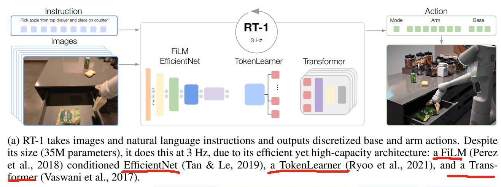
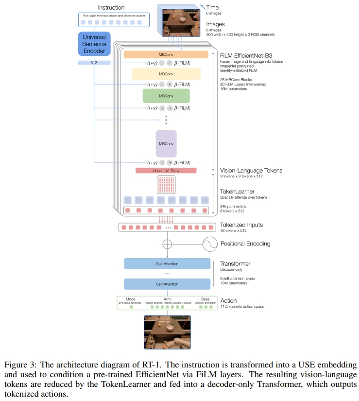
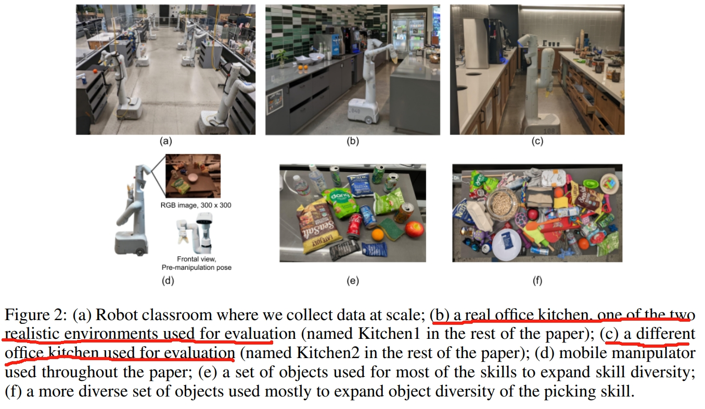
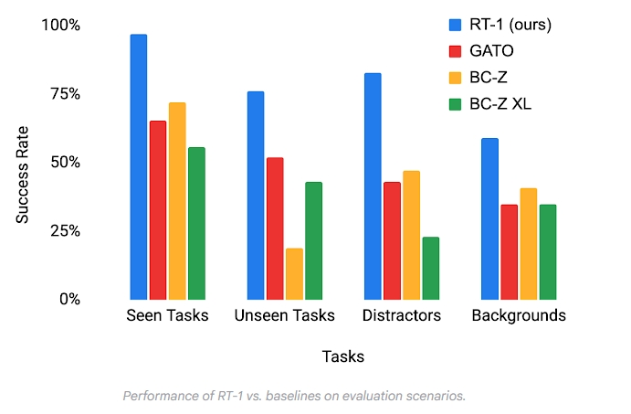

<!-- * 目录
{:toc} -->

2023年谷歌机器人团队等在机器人领域构建了一个多任务 transformer 模型，显著改进了对新任务、环境和对象的零样本泛化。

该论文属于VLA领域经典论文~
本博文为论文阅读笔记，仅供本人学习记录用~

* [PDF](https://arxiv.org/pdf/2212.06817)
* [blog](https://research.google/blog/rt-1-robotics-transformer-for-real-world-control-at-scale/)
* [Website](https://robotics-transformer1.github.io/)
* [Github](https://github.com/google-research/robotics_transformer)

<!-- !!!!!!!!!!!!!!!!!!!!!!!!!!!!!!!!!!!!!!!!!!!!!!!!!!!!!!!!!!!!!!!!!!!!!!!!!!!!!!!!!!!!!!!!!!!!!!!!!!!!!!!!!!!!!!!!!!!!!!!!!!! -->

# 引言

通过从大型、多样化、任务无关的数据集进行迁移学习，当前的机器学习模型可以解决特定的下游任务，无论是零样本（zero-shot），还是使用小的特定任务数据集，都可以获得高水平的性能。
这一特性在CV、NLP或者语音识别等领域都被很好的验证的，就差在机器人领域了。并且用于机器人领域的模型的泛化能力还是格外的重要，因为真实机器人的数据集采集一般难度都较大。
作者认为，通用机器人模型成功的关键之一在于开放式任务无关的训练(open-ended task-agnostic training)，结合能够吸收所有不同机器人数据的高容量架构。因此本文提出Robotics transformer（一个model class）
因此，作者想通过训练一个大型的包含不同机器人任务的模型，来让模型学到一个general knowledge进而可以实现zero-shot 泛化到其他机器人任务。

两个主要的挑战：
1. 数据收集和管理往往是许多大型机器学习项目的“无名英雄”，在机器人领域更是了，要获得好的泛化能力往往需要数据集能结合规模和广度，涵盖各种任务和设置。同时数据集中的任务应该足够好的连接以实现泛化，这样模型就可以发现结构相似任务之间的模式，并执行以新颖方式组合这些模式的新任务。
2. 设计模型本身。对于高效的基于机器人的多任务学习，Transformer模型就很合适。但同时，机器人的控制器也需要能实时运行，这对Transformer来说是很难的。因此作者设计了一个新的架构名为RT-1 (Robotics Transformer 1)，通过将高维输入和输出（包括相机图像、指令和电机命令）编码为紧凑的token表示，以供Transformer使用。可以在运行时进行有效的推理，实现实时控制。

~~~
说实话，CV或者AI领域的论文，哪怕像本文这种Google这样级别的团队，被引量1k多论文，其逻辑性真的远不如机器人领域一篇RAL😂读下来总感觉是没话找话说，硬凑字数的感觉。。。。。。

就比如说上面讲的“The two main challenges lie in assembling the right dataset and designing the right model.”原文用了两段话（原文比这里翻译的要长些）读下来后，好像是说了不少话，但又好像屁话都没说😂
不过也可能是这个原因，这篇论文只是arvix吧~
~~~

# RT1网络架构

RT-1的架构如下图所示。参数量为35M，输出的频率为3HZ。训练策略采用模仿学习。
图像和文本通过ImageNet预训练卷积网络进行处理，该网络以通过FiLM预训练嵌入指令（pretrained embedding of the instruction）为条件。接下来是一个Token Learner来计算一系列压缩的tokens，接下来通过一个Transformer来进行attention等处理最后输出离散的action token。

对于image的输入，通过ImageNet预训练好的EfficientNet-B3模型来tokenizes图片。输入为6张图片（分辨率为300*300），最后一个卷积层输出为9 $\times$ 9 $\times$ 512。然后将此输出的feature map flatten为81个视觉tokens

对于语言指令，以预训练语言嵌入（ pretrained language embedding）的形式将图像标记器置于自然语言指令上，允许在早期提取与任务相关的图像特征，并提高RT-1的性能。
语言指令先通过Universal Sentence Encoder来进行embedding，然后输入到FiLM layers加到预训练的EfficientNet的image encoder上。

  
  
<figcaption>  
</figcaption>

对于TokenLearner，直观理解则是将前面获得的token做一系列的attention操作,将前面获得的大量的tokens映射为小量的token(将iLM-EfficientNet 输出的81个视觉token转换为8个最终的token)，然后输入到Transformer中。

对于Transformer，每张图是8个Token，最终是6*8=48个。将这些token一起放到Transformer中

输出的action包含了手臂的七个自由度的运动：xyz，rpy，双指夹持器开合。此外，action还需要包括移动地盘的xy和航向角（yaw）。并且还需控制手臂、控制底盘、终止，三个模块的切换。

# 数据集

所采用的机器人平台为下图d所示的移动机械臂，是一个七自由度的双指夹持器机械臂。作者采用了三个厨房环境：两个真实的办公室厨房和一个模仿这些真实厨房的培训环境。
训练数据由人类提供的演示组成，作者用机器人刚刚执行的指令的文本描述来注释每一段数据（each episode）。

  
<figcaption>  
</figcaption>

# 实验

作者团队对模型和训练集中的许多设计选择进行了仔细评估和消融实验，分析了 tokenization、动作表示和数据集组合的影响。与现有技术相比，RT-1 可以显著改进对新任务、环境和对象的零样本泛化。RT-1 可以以 97% 的成功率执行 700 多个训练指令，并且可以泛化到新的任务、干扰因素和背景。

  
<figcaption>  
</figcaption>

如上图所示，有四类型的benchmark：
1. Seen tasks:训练中见过的任务
2. Unseen tasks：skill与object在训练中都见过，但是合在一起没有。
3. 鲁棒性：包含了干扰物/distractors（最多9个干扰物和遮挡物），并且背景会改变（如新的厨房环境、光照、背景场景）
4. Long-horizon scenarios（长期的场景）如下图所示

  
<figcaption>  
</figcaption>

