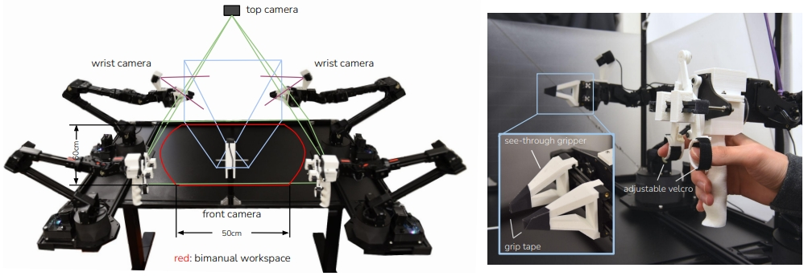
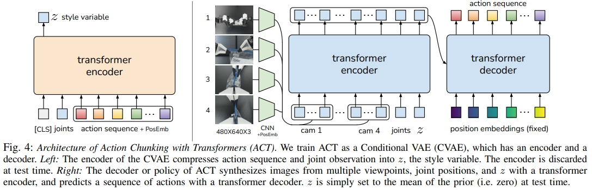
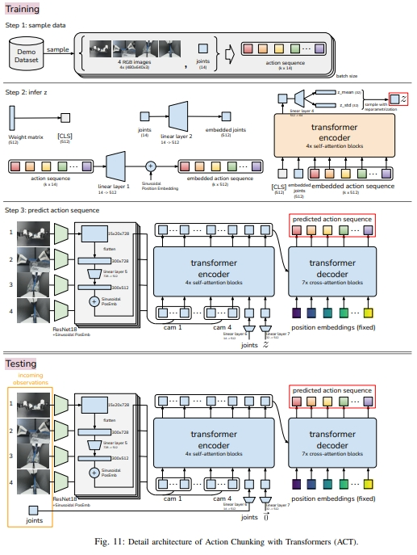
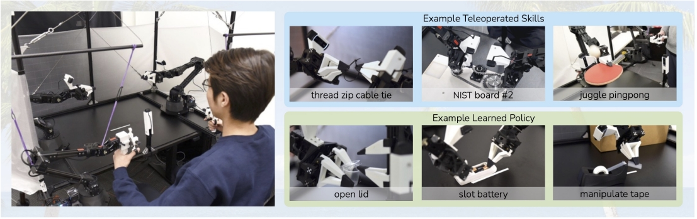
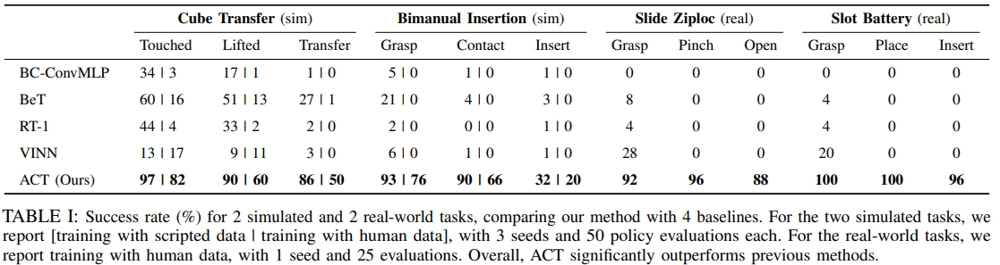
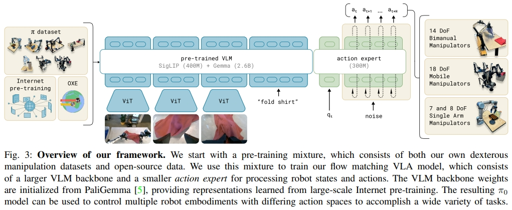
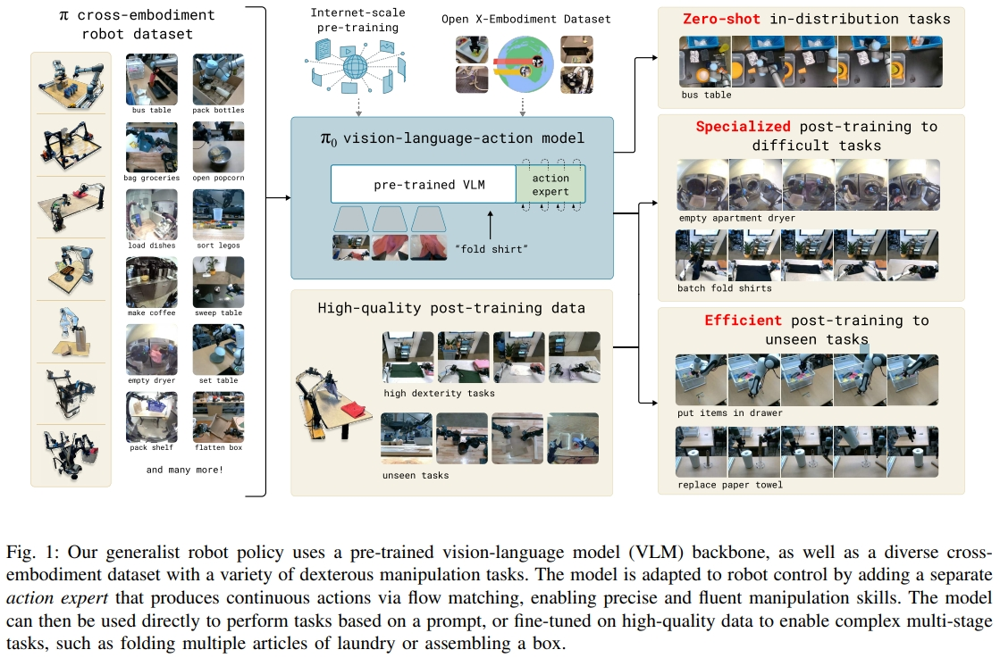
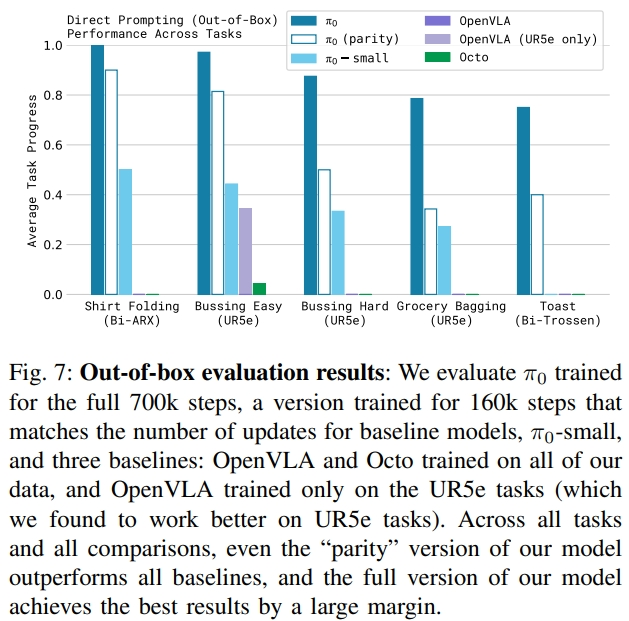
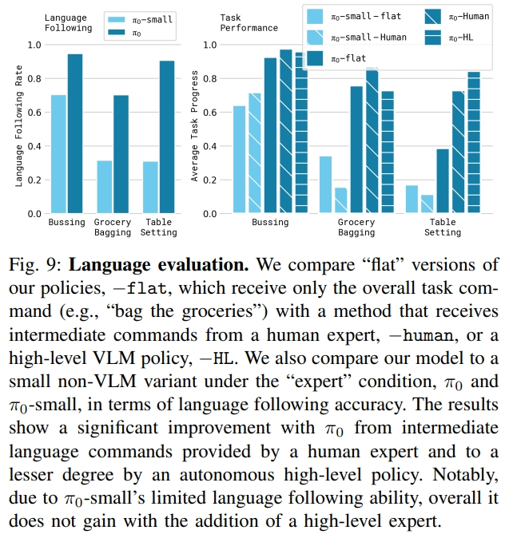
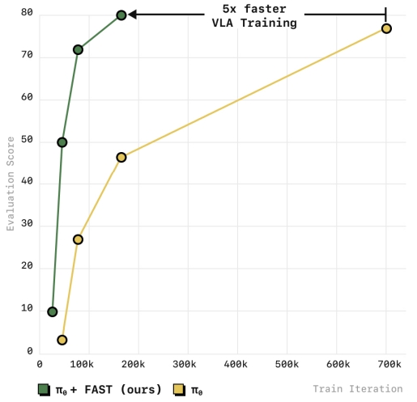

<!-- * 目录
{:toc} -->


本博客对VLA(Vision-Language-Action)进行调研整理。

在VLA模型出现之前，机器人技术和人工智能主要分布在彼此割裂的几个子领域：
* 视觉系统能够“看”并识别图像。传统的CV可以通过CNN来识别物体或者进行分类，但是并不能理解语言、也没有将视觉转换为action的能力。
* 语言系统能够理解和生成文本。语言模型，特别是基于LLM的虽然可以革新了文本的理解以及生成，但是他们仍然只能处理语言文本，而不能感知或者推理物理世界。
* 动作系统则能够控制物体运动。机器人中基于action的系统一般都是依赖于传统控制策略（hand-crafted policies）或者强化学习来实现例如目标抓取等等，但是这需要复杂的工程实现。

VLA即视觉-语言-动作，是一种将视觉感知与语言理解结合，实现自主操作决策的多模态任务。

* [Paper List](https://github.com/KwanWaiPang/Awesome-VLN#VLA)


<!-- !!!!!!!!!!!!!!!!!!!!!!!!!!!!!!!!!!!!!!!!!!!!!!!!!!!!!!!!!!!!!!!!!!!!!!!!!!!!!!!!!!!!!!!!!!!!!!!!!!!!!!!!!!!!!!!!!!!!!!!!!!! -->

# VLA概述
在传统的自动化场景中，我们常常看到这样的景象：机器人高效、精准地重复着预设动作，但一旦遇到未经编程的细微变化——比如流水线上一个零件被意外放歪——整个系统就可能陷入停滞或错误。这背后的根本原因在于，传统机器人更像一个“照本宣科的演员”，其行为完全依赖于工程师事无巨细的代码编写，缺乏对动态环境的理解和自主决策能力。
为了突破这一瓶颈，人工智能领域正涌现出一种革命性的架构：视觉-语言-动作模型（Vision-Language-Action）。VLA模型旨在为机器人构建一个能够像人一样“观察、思考、行动”的统一大脑。它通过将视觉感知、语言理解与物理动作控制深度融合，使机器人能够直接理解人类的自然语言指令，感知周围的三维世界，并自主生成与之对应的复杂动作序列。

一个典型的VLA模型由几个核心部分组成：视觉与语言编码器负责分别处理图像信息和文本指令；跨模态融合机制（通常基于强大的Transformer架构）是模型的核心，它能将视觉特征与语言语义进行深度对齐，理解例如“请把桌子上的那个红色杯子拿给我”这类指令中“桌子上的”、“红色杯子”所指代的具体视觉实体；最后，动作解码器会将这种融合后的高级理解转化为具体的、可执行的电机控制指令（如关节角度、末端位姿等）。部分先进的模型还引入了反馈模块，通过实时视觉信息对动作进行闭环修正，进一步提升操作的鲁棒性。

VLA模型的巨大潜力主要体现在以下三大优势上：
1. 端到端的统一框架：它彻底打破了传统机器人技术中“感知-规划-控制”三个模块相互割裂的架构。通过一个模型实现从原始信号（图像像素和语言文字）到最终动作（机器人末端控制指令）的直接映射，极大地简化了系统设计和部署流程，降低了整体的复杂性。
2. 卓越的语义泛化能力：得益于背后的大语言模型（LLM、VLM）与大规模视觉-语言预训练，VLA模型具备出色的推理和泛化能力。它不仅能理解指令的字面意思，更能捕捉其背后的隐含逻辑。例如，当被要求“让房间更整洁”时，模型可以推理出需要将散落的玩具放入收纳箱、将书本放回书架等一系列具体动作，而无需对每一种物品和场景进行单独编程。
3. 广泛的跨平台通用性：一个在大量多样化数据集上预训练好的VLA模型，可以相对容易地部署到不同的机器人硬件平台上。由于其已经具备了通用的世界知识和任务理解（common sense），针对特定场景或新机器人的适配只需进行少量数据的微调，极大地降低了迁移成本，为实现“一个模型控制万千机器人”的愿景奠定了基础。

综上所述，VLA模型不仅仅是一项技术改进，它更代表着机器人智能化研究的一次范式转移。它将机器人的能力边界从预设的、结构化的环境，拓展到了开放的、动态的真实世界，为开发能够真正理解人类意图、灵活适应未知环境的通用型机器人，照亮了前行的道路。


# VLA经典方法阅读

在深入看各种方法之前，先通过下面表格来总览VLA的发展脉络

<!-- []() -->

|  年份 |  单位  | 模型  |  方法  | 说明 |
|:-----:|:-----:|:-----:|:-----:|:-----:|
|2025|Figure AI |[Helix](https://www.figure.ai/news/helix)| VLM+Transformer  | 首个能让两台机器人同时协同工作的VLA 模型；控制人形上半身|
|2025|Russia|[AnywhereVLA](https://arxiv.org/pdf/2509.21006)|SmolVLA+传统SLAM导航(Fast-LIVO2)+frontier-based探索|消费级硬件上实时运行VLA；移动机械臂|
|  --- |  Physical Intelligence  | [PI0.5]()  |  ---  | --- |
|  2025 |  Physical Intelligence  | [PI0-Fast/π₀-FAST](https://arxiv.org/pdf/2501.09747)  |  自回归 | 探索VLA训练的action representation；通过频域对动作序列的Token化，将训练时间减少5倍 |
|  2024 |  Physical Intelligence  | [π0/PI0](https://arxiv.org/pdf/2410.24164?)  |  VLM+action expert（diffusion）  | 通才模型（generalist model）；预训练+task-specific微调策略 |
|2023|Stanford|[ALOHA/ACT](https://arxiv.org/pdf/2304.13705)|CVAE+Transformer|动作分块；用低成本平台实现精细操作,如线扎带、乒乓球|
|2023|Google|[RT-1](https://arxiv.org/pdf/2212.06817)|EfficientNet+Transformer|VLA任务首次用到实际机械臂|


## RT-1
* 详细请见博客：[VLA论文阅读笔记之——《Rt-1: Robotics transformer for real-world control at scale》](https://kwanwaipang.github.io/VLA-RT1/)

其架构如下图所示：
1. 输入处理：图像和文本首先通过一个基于ImageNet预训练的EfficientNet进行处理。在FiLM层嵌入预训练的指令（将指令转换为嵌入向量），进而提取与任务相关的视觉特征。
2. Token Learner：将提取的视觉特征转换为Token的形式；
3. Transformer对获取的Token做一系列的attention操作生成action token；
4. 最终输出的action包括：手臂的七个自由度的运动：xyz，rpy，双指夹持器开合。此外，action还需要包括移动地盘的xy和航向角（yaw）。并且还需控制手臂、控制底盘、终止，三个模块的切换。

<div align="center">
  
<figcaption>  
</figcaption>
</div>

而其关键的contribution应该是数据集部分：17个月，13个机器人，13万此示范，700多个任务。

<div align="center">
  
  
<figcaption>  
</figcaption>
</div>


RT-1 在真实机器人平台上进行了大量实验，展示了其在多任务、多目标环境中的鲁棒性与泛化能力，在定量准确率和演示视频中均表现良好。

<div align="center">
  <table style="border: none; background-color: transparent;">
    <tr align="center">
      <td style="width: 50%; border: none; padding: 0.01; background-color: transparent; vertical-align: middle;">
        
        RT-1 和baseline在seen任务上的整体性能、对unseen任务的泛化能力以及对干扰物和背景的鲁棒性
      </td>
      <td style="width: 50%; border: none; padding: 0.01; background-color: transparent; vertical-align: middle;">
        
        RT-1在各种指令下的轨迹
      </td>
    </tr>
  </table>
  <figcaption>
  </figcaption>
</div>

RT-1 在真实机器人平台上进行了大量实验，展示了其在多任务、多目标环境中的鲁棒性与泛化能力，在定量准确率和演示视频中均表现良好。下面是其demo视频

<div align="center">
<video playsinline autoplay loop muted src="https://robotics-transformer1.github.io/img/saycan_rt1_demo1_comp.mp4" poster="https://kwanwaipang.github.io/File/Representative_works/loading-icon.gif" alt="sym" width="80%" style="padding-top:0px;padding-bottom:0px;border-radius:15px;"></video>
</div>


## ACT

本研究中，作者致力于开发一种低成本、易获取且可复现的精细操作系统。为了实现这个目标引入了学习的机制。
人类并不具备工业级的本体感知能力，却能够通过从闭环视觉反馈中学习，并主动补偿误差，来完成精细任务。受此启发，作者在系统中训练了一个端到端策略，能够直接将普通摄像头拍摄的RGB图像映射为机器人动作。
而为了训练这个端到端的策略，作者构建了一个低成本（20K美金😂）但灵巧的数据采集遥操作系统

ACT(Action Chunking with Transformers)通过模仿学习，从真人演示（遥操作）中掌握精细操作任务（Fine manipulation tasks）。
为应对模仿学习存在的固有局限——例如策略误差随时间累积、人类示范行为不稳定等问题，研究者提出了基于Transformer的动作分块模型（ACT）。

该方法创新地引入动作分块与时间集成机制，构建了一个动作序列的生成模型。实验证明，仅通过10分钟的示范数据，机器人就能学会6项复杂操作，如打开半透明调料杯、精准插装电池等，成功率高达80%–90%。

<div align="center">
  
<figcaption>  
</figcaption>
</div>

本文的主要贡献是一种低成本的精细操作学习系统，包括遥操作系统（如上图所示）和新型模仿学习（imitation learning）算法。所谓的新型模仿学习算法就是ACT引入动作分块机制。
动作分块由Transformer 架构实现，然后将其训练成条件变分自编码器（conditional VAE，CVAE）来捕获人类数据，进而实现高效平滑的动作预测。
ACT架构如下图所示。

<div align="center">
  
<figcaption>  
将ACT训练为条件VAE，包含一个编码器和解码器。
左侧：CVAE的编码器将动作序列和关节观测压缩为风格变量（style variable）z；
右侧：ACT的解码器使用Transformer编码器从多视角图像、关节位置和z中合成信息，并使用Transformer解码器预测动作
</figcaption>
</div>

对于CVAE分为两部分：编码器（上图4的左边）与解码器（上图4的右边）。
编码器只有在训练解码器的时候用到，而推理/测试的时候是不用的。
而CVAE编码器（BERT-like transformer encoder）预测风格变量（style variable）z分布的均值和方差（参数化为对角高斯分布）。
而CVAE解码器（ResNet image encoders+transformer encoder+ transformer decoder），也就是policy，基于编码器给的z和当前观测（图像和关节位置）来预测动作序列。
而在测试的时候，z被设定为先验分布的平均值，即零到确定性解码（ i.e.
zero to deterministically decode）

结构流程：
1. 采用ALOHA采样数据；记录leader robots（也就是人类操作者的输入）的关节位置。注意，记录的关节数据是leader的，而不是follower的。
2. 训练AVT来推理z，以获得CVAE解码器输入中的风格变量（style variable）z；
3. CVAE解码器预测动作序列。此处每个action对应着两只机械臂下一刻的目标关节位置。而目标关节的位置则是由PID控制器实现的。
<div align="center">
  
<figcaption>  
</figcaption>
</div>


ACT在ALOHA系统（A Low-cost Open-source Hardware System for Bimanual Teleoperation, 一种低成本的开源硬件系统，用于双臂遥操作）上实现了对多种任务的学习与泛化，尤其在人类示范数据下表现出显著优于现有方法的性能和鲁棒性。

<div align="center">
  <table style="border: none; background-color: transparent;">
    <tr align="center">
      <td style="width: 68%; border: none; padding: 0.01; background-color: transparent; vertical-align: middle;">
        
        
      </td>
      <td style="width: 32%; border: none; padding: 0.01; background-color: transparent; vertical-align: middle;">
        
      </td>
    </tr>
  </table>
  <figcaption>
  </figcaption>
</div>


## π0/PI0
Pi0（还有后面的pi0.5/pi0-fast）。都是Physical Intelligence的经典工作。
这类的方案具有多任务的泛化性与实时推理能力，也被称之为“Generalist Policy”（通才策略）

<!-- 对于通才模型（generalist model）需要考虑三个部分：
1. 必须在非常大规模数据上进行，因为大规模预训练的效果在较小规模上并不存在（涌现问题）。
2. 需要正确的模型架构，这种架构可以有效地利用不同的数据源，同时能够表示与复杂的物理场景交互所需的行为
3. 需要正确的训练策略（可能是最重要的因素），通常 NLP 和CV的大模型在pre-training 和 post-training都需要比较合适的训练策略。（比如InstructGPT中的一些训练策略、用强化学习等） -->

<!-- 而PI0则是解决这三个瓶颈的学习框架: -->

PI0是要实现通才模型（generalist model）的学习框架:
利用在互联网数据训练的VLM+action expert 组成一个VLA模型，这里结合开源+内部的机器人数据训练得到异构本体foundation model，然后可以在不同的本体/特定的任务上post-training，以完成多任务的泛化或某种复杂任务的灵巧操作（以高达50HZ频率控制机器人）。

* 对于VLM，PI0中采用PaliGemma（使用大量互联网文本图像数据预训练的VLM）。通过。预训练的大模型实现从大量网络数据种获取`common sense`/general knowledge;
PaliGemma是在2024 年 Google I/O 活动上发布的。它是一种基于两个模型的组合多模态模型：视觉模型 SigLIP 和大型语言模型 Gemma，这意味着该模型是 Transformer 解码器和 Vision Transformer 图像编码器的组合。它将图像和文本作为输入，并生成文本作为输出，支持多种语言。
* 对于Action Expert：用于接受VLM输出，专门输出action的网络。为了能够执行高度灵巧和复杂的物理任务，作者使用了action chunking architecture架构和flow matching来表示复杂的连续动作分布。
  * action chunking architecture：预测动作序列，核心思想是将动作分块（Chunking）与时间集成（Temporal Ensemble）结合，提升动作执行的平滑性和鲁棒性
  * flow matching：diffusion的一种变体，flow match是噪声等于零的特解，更简单直接。

<div align="center">
  
<figcaption>  
PI0架构网络
</figcaption>
</div>

训练阶段：Pre-training ->post-training。百万兆级别的MLLM中常见操作也是分两个阶段，首先在一个非常大和diverse的语料库上进行预训练，然后在更具体、更特别的数据上进行微调：
* Pre-training：这里有面向于具身智能的专用数据集，如open x-embodiment dataset和 pi cross-embodiment robot datasets，这些数据中已经包含了大量场景的机器人操作数据。训练后可以得到foundation model，也就是一个可以统一所有任务/本体的基础模型，这样的模型具备初步的泛化性，但不一定在专项操作任务上有好的性能。
* Post-training（也可以题解为fine-tuning）：根据上一个阶段的foundation model，进行fine-tuning, 这里分为两类任务的post-traing数据，以提高模型在某种任务表现的专门数据，包含unseen tasks（未见任务）、high dexterity task （高灵巧任务），一共包括20多项任务；

关于数据集的补充：
~~~
Open X-Embodiment dataset:是一个由 DeepMind 创建并开源的超大规模机器人数据集，汇集了来自 22 种不同机器人类型的数据. RT-2也这个数据集上训练的，简称OXE dataset。

Pi cross-embodiment robot datasets：pi0公司内部采集的本体数据集（灵巧操作数据集），共有7种不同机器人的配置，和68个不同任务的数据，长度为1w个小时。cross-embodiment robot 也可以理解为异构本体，不同的机器人类型具有不同的配置空间和动作表示，包括固定基座的单臂和双臂系统，以及移动机械手。
~~~


PI0可以完成的任务类型：
1. Zero-shot in-distribution任务: Zero-shot 但是强调了任务的 in-distribution（这里不是场景的in-distribution）。通俗讲就是任务类型是见过的（比如清理桌台），但是具体到某种数据没见过，这样也可以一定程度泛化。
2. 用特定任务数据微调后的困难任务：这里重点提及的是柔性操作的任务，如叠衣服（不同类型/颜色/材质的衣服在以各样的形状散落在场景中）
3. 高效fine-tuning后的未见任务：训练阶段、后训练阶段都没有见过的任务，但是最终训完的模型却具备的能力

<div align="center">
  
<figcaption>  
PI整体架构：数据--->网络结构--->任务
</figcaption>
</div>

试验阶段。通过5种测评任务来进行对比验证：
1. 衬衫折叠：机器人必须折叠T恤，T 恤开始时是压平的。
2. 简单清理餐桌：机器人必须清洁桌子，将垃圾放入垃圾桶，将盘子放入洗碗机。该分数表示放置在正确容器中的对象数。
3. 困难清理：具有更多目标和更具挑战性的配置，例如故意放置在垃圾目标上的器皿、相互阻碍的目标以及一些不在预训练数据集中的目标。
4. 杂货装袋：机器人必须将所有杂货装袋，例如薯片、棉花糖和猫粮。
5. 从烤面包机中取出吐司

结果如下图7所示。π0 遥遥领先，在衬衫折叠和更轻松的餐桌整理上有近乎完美的成功率(接近100%)。

图9则是指令跟随能力（但此处对比只是不同参数量的PI0）。每个任务的文本说明包括要选取的对象和放置这些对象的位置，以及长度约为 2 秒的语言标记段。
<div align="center">
  <table style="border: none; background-color: transparent;">
    <tr align="center">
      <td style="width: 50%; border: none; padding: 0.001; background-color: transparent; vertical-align: middle;">
        
      </td>
      <td style="width: 50%; border: none; padding: 0.001; background-color: transparent; vertical-align: middle;">
        
      </td>
    </tr>
  </table>
  <figcaption>
  </figcaption>
</div>


## PI0-Fast/π₀-FAST

本文探索VLA训练的action representation；通过频域对动作序列的Token化，将训练时间减少5倍

* 动作信号需要在训练前进行压缩，以减少连续token之间的相关性。采用基于离散余弦变换discrete cosine transform (DCT) encoding；
* 提出名为频率空间动作序列Token化（Frequency-space Action Sequence Tokenization，FAST）。能够通过简单的下一个token预测来训练自回归 VLA policy；


实验证明，该方法和pi0结合时，能够扩展到处理10k小时的机器人数据，性能上媲美当前diffusion VLA模型，同时训练时间减少了多达5倍。
<div align="center">
  
<figcaption>  
PI整体架构：数据--->网络结构--->任务
</figcaption>
</div>


## Hi robot 

## PI0.5


## AnywhereVLA

本文通过将微调的VLA操纵，与探索、SLAM等传统任务结合，实现了移动机械臂（Mobile manipulation）的VLA任务。
系统架构如下图所示。
<div align="center">
  
<figcaption>  
</figcaption>
</div>

workflow通过语言指令作为输入，然后同时执行VLA模块实现基于task的操纵以及自主探索。主要分为三个部分：
1. 3D语义建图。通过雷达-惯性-视觉SLAM（Fast-LIVO2）构建3D点云地图，而语义部分来自于目标检测模块。
2. 主导环境探索(Active Environment Exploration,AEE)，基于语言指令推导出的目标物体类来执行frontier-based exploration。一旦检测到目标对象并在语义图中定位，探索就会停止。而探索部分则是将LiDAR点云投影成2D栅格地图。
3. VLA操作，采用的为fine-tune（在SO-101机械臂上训练）的SmolVLA模型。

主体推理框架仍然采用预训练的VLM（对机器人轨迹数据和互联网规模的视觉语言任务进行联合微调）。
而为了保证可移动性，利用了传统的navigation stacks。
既利用了传统SLAM导航的鲁棒性，同时也利用了VLA模型对环境的泛化理解能力。
属于传统方法跟VLA的结合版本。但个人认为只是让其可移动（Mobile manipulation），对于VLA任务本身，SLAM与导航似乎是不起任何帮助的😂

其他补充：
* 感知及VLA部分运行在Jetson Orin NX上，而SLAM，探索以及控制则是运行在Intel NUC上；
* 任务成功率：46%
* 目前项目还没开源，但后续应该是有开源的打算吧[Website](https://selfai-research.github.io/AnywhereVLA/), [Github](https://github.com/SelfAI-research/AnywhereVLA)


## Helix
Helix是 Figure的专有视觉-语言-动作系统。
* 多机器人协作 (Multi-robot collaboration)：首个能让两台机器人同时协同工作的VLA 模型；
* 全上身控制 (Full-upper-body control)：Helix 是第一个能够高频率、连续地控制机器人整个上半身的 VLA 模型，包括手腕、躯干、头部，甚至独立的每根手指。
* 拾取任何物品 (Pick up anything)：解决了机器人“抓取泛化”的巨大挑战，大大提高了机器人的通用性和适应性，不再需要为每种新物品都进行特定训练。
* 单一神经网络 (One neural network)：与以往需要针对不同任务训练不同 AI 模型的方法不同，Helix 使用一套神经网络权重就能学习并执行所有行为——无论是抓取放置、使用抽屉冰箱，还是机器人间的协作，无需针对特定任务进行微调。

本质上就是利用了大模型LLM或VLM实现`即时泛化`，将VLM中抽象的“常识性知识”（比如“拿起物体需要张开手”）转化为“可泛化的机器人控制”（即具体的机械臂运动指令，并能适用于各种不同形状的物体）。将 VLM 的高级语义理解转化为机器人能够执行的低级物理动作，并且能够将这种理解泛化到新颖的环境和物体中。

系统结构由两部分组成（快慢双系统，类似自动驾驶领域的 DirveVLM），S2与S1串联，异步推理：
* 上层模型 S2：VLM，构建在开源的7B参数量的VLM模型上。处理单个机器人的图像以及机器人的状态信息（包括手腕姿势和手指位置），然后投影到视觉语言的embedding space。结合语言命令对应的目标动作，S2将所有语义任务相关的信息提炼为latent vector，然后传到S1来执行low-level action；
* 下层模型 S1：latent-conditional visuomotor transformer，是一个80M参数的cross-attention encoder-decoder transformer用于实现底层控制。输入为跟S2一样的视觉与状态输入。对于视觉的输入采用全卷积以及多尺度的骨架。对于来自S2的latent vector投影到S1的token space上，然后跟视觉特征concatenated到一起。
<div align="center">
  
<figcaption>  
</figcaption>
</div>

数据采集部分：采用自标签（auto-labeling）的VLM来生成指令，根据机器人机载camera获取的视频来生成指令。

Helix以200HZ频率控制着35个自由度的动作空间，


<!-- !!!!!!!!!!!!!!!!!!!!!!!!!!!!!!!!!!!!!!!!!!!!!!!!!!!!!!!!!!!!!!!!!!!!!!!!!!!!!!!!!!!!!!!!!!!!!!!!!!!!!!!!!!!!!!!!!!!!!!!!!!! -->
<br><br><br>

```bash
下面是待更新的论文：

# DexVLA
DexVLA: Vision-Language Model with Plug-In Diffusion Expert for General Robot Control

# DiVLA
Diffusion-VLA: Scaling Robot Foundation Models via Unified Diffusion and Autoregression

# Go-1
AgiBot World Colosseo: Large-scale Manipulation Platform for Scalable and Intelligent Embodied Systems

# GR-1
UNLEASHING LARGE-SCALE VIDEO GENERATIVE PRE-TRAINING FOR VISUAL ROBOT MANIPULATION

# GR-2
GR-2: A Generative Video-Language-Action Model with Web-Scale Knowledge for Robot Manipulation

# HiRT
HiRT: Enhancing Robotic Control with Hierarchical Robot Transformers

# LAPA
LATENT ACTION PRETRAINING FROM VIDEOS

# Moto
Moto: Latent Motion Token as the Bridging Language for Learning Robot Manipulation from Videos

# Octo
Octo: An Open-Source Generalist Robot Policy

# OpenVLA
OpenVLA: An Open-Source Vision-Language-Action Model

# OpenVLA-OFT
Fine-Tuning Vision-Language-Action Models: Optimizing Speed and Success

# ReKep
ReKep: Spatio-Temporal Reasoning of Relational Keypoint Constraints for Robotic Manipulation

# RoboDual
TOWARDS SYNERGISTIC, GENERALIZED AND EFFICIENT DUAL-SYSTEM FOR ROBOTIC MANIPULATION

# RoboFlamingo
VISION-LANGUAGE FOUNDATION MODELS AS EFFECTIVE ROBOT IMITATORS

# RT-2
RT-2: Vision-Language-Action Models Transfer Web Knowledge to Robotic Control

# saycan
Do As I Can, Not As I Say: Grounding Language in Robotic Affordances

# TinyVLA
TinyVLA: Towards Fast, Data-Efficient Vision-Language-Action Models for Robotic Manipulation

# VoxPoser
VoxPoser: Composable 3D Value Maps for Robotic Manipulation with Language Models

```


# 参考资料
* [Vision-language-action models: Concepts, progress, applications and challenges](https://arxiv.org/pdf/2505.04769?)
* [Vision Language Action Models in Robotic Manipulation: A Systematic Review](https://arxiv.org/pdf/2507.10672)
* [Large VLM-based Vision-Language-Action Models for Robotic Manipulation: A Survey](https://arxiv.org/pdf/2508.13073?)
* [Exploring Embodied Multimodal Large Models:Development, Datasets, and Future Directions](https://arxiv.org/pdf/2502.15336?)
* [A Survey on Vision-Language-Action Models: An Action Tokenization Perspective](https://arxiv.org/pdf/2507.01925)
* [Blog for VLN](https://kwanwaipang.github.io/VLN/)
* [论文阅读笔记之——《Vision-language-action models: Concepts, progress, applications and challenges》](https://kwanwaipang.github.io/VLA-survey-2025/)
* [Helix 系列报告解读，Figure团队快慢双系统层级化范式](https://zhuanlan.zhihu.com/p/1921356994486472894)
* [【VLA系列】 万字深度解析PI-0](https://zhuanlan.zhihu.com/p/1907535034941965833)


