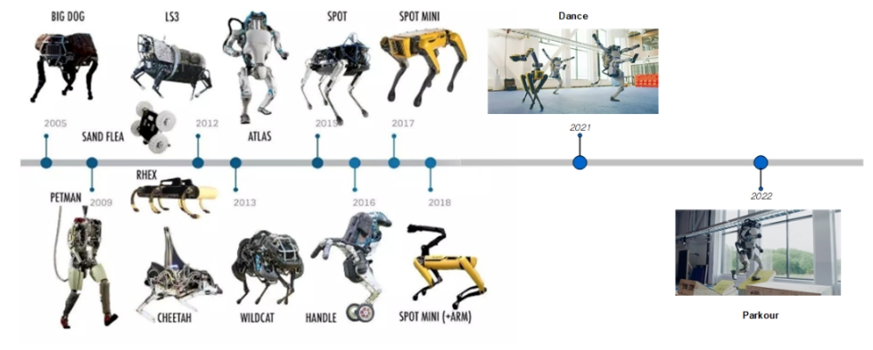
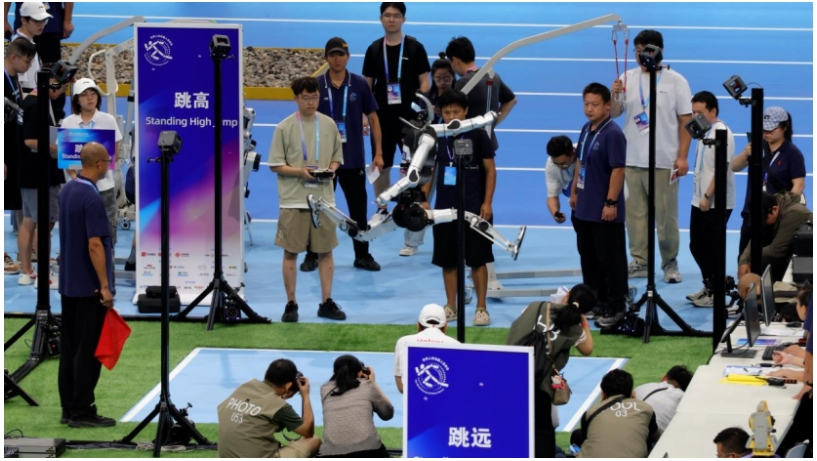
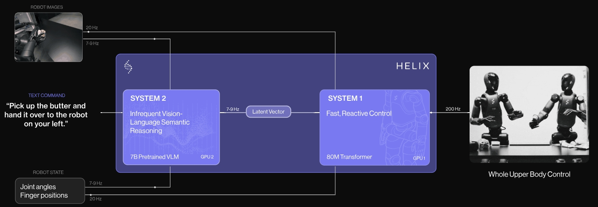
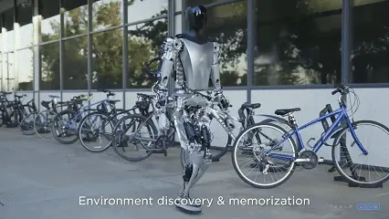
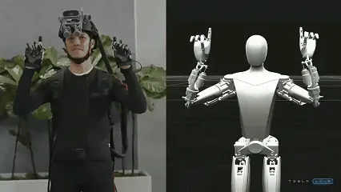
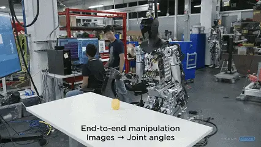
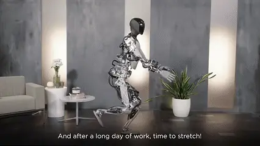

<!-- * 目录
{:toc} -->

本博文对业内主流机器人上下肢运动控制方案进行调研。
上下肢分开控制/全身控制，强化学习/传统运动/VLA。

主流的机器人公司有：智元机器人、银河通用、星动纪元、埃斯顿、宇树科技、优必选、特斯拉 Optimus、Figure AI、Apptronik、Agility Robotics、小鹏IRON、小米 CyberOne、广汽 GoMate、奇瑞 Mornine、乐聚机器人、逐际动力、 智平方、自变量机器人等。

本博文仅供本人学习记录用~

<!-- !!!!!!!!!!!!!!!!!!!!!!!!!!!!!!!!!!!!!!!!!!!!!!!!!!!!!!!!!!!!!!!!!!!!!!!!!!!!!!!!!!!!!!!!!!!!!!!!!!!!!!!!!!!!!!!!!!!!!!!!!!! -->
# 引言
本博文从以下维度进行切入。
* 控制架构：上下肢独立控制、全身协同控制、分层控制策略
* 算法范式：传统控制方法（PID、力控、MPC、WBC）、强化学习（DRL）、VLA大模型
* 应用与实现：工业机器人、外骨骼、四足机器人、人形机器人、自动驾驶

# 控制架构

## 上下肢分开控制 (Decoupled Control)
* 特点：上下肢视为独立系统，分别设计控制器。通常下肢负责移动与平衡（如步行、奔跑），上肢负责操作与交互（如抓取、放置）。
* 优势：设计相对简单，稳定性分析更易进行。
* 挑战：难以实现复杂的全身协同任务，可能缺乏能量效率最优。
* 典型应用：工业机械臂（上肢）、步行助力外骨骼（下肢）。

## 全身协同控制 (Whole-Body Control， WBC)
* 特点：将机器人视为一个多刚体系统，统一优化所有关节的控制输入，以完成全局任务目标（如同时行走和抬手拿东西）。
* 优势：能实现更复杂、拟人的行为，理论上的性能更优。
* 挑战：计算复杂，模型精度要求高，实时性挑战大。
* 典型应用：人形机器人（如特斯拉Optimus、小米CyberOne）

# 主流机器人公司运动方案概览

<!-- |---|---|---|---| -->
<!--  -->

* 注意，此处大部分都是“宣称”

| 机器人型号/公司 | 控制模式 | 核心算法/架构 | 补充说明 |
|:-----:|:-----:|:-----:|:-----:|
|智元机器人(远征)|下肢：结合Model-based与Learning-based方式优化行走稳定性和自然度   上肢：不明|强化学习|“预研”基于自然语言指令集驱动的AgentOS,适配不同的机器人本体，并通过强化学习实现机器人技能的精准编排与高效执行|
|智元机器人(灵犀)|下肢：强化学习   上肢：不明|强化学习|[训练代码](https://github.com/AgibotTech/agibot_x1_train/blob/main/README.zh_CN.md)   [推理代码](https://github.com/AgibotTech/agibot_x1_infer/blob/main/README.zh_CN.md) |
|Figure AI|上肢控制|VLA|通用VLA模型端到端控制、语言指令理解后生成动作 [Figure AI发布Helix](https://www.figure.ai/news/helix)|
|银河通用（Galbot）|下肢：可折叠腿部+轮式底盘   上肢：端到端VLA|VLA+VLN|端到端视觉输入输出末端执行器抓取；端到端导航大模型|
|星动纪元（星动L7）|运动控制：端到端强化学习实现运动平衡|全身控制|端到端 VLA 大模型 ERA-42实现观看操作视频直接学技能|
|宇树科技（H1）|---|强化学习|---|
|优必选（Walker X）|下肢：实时步态规划，基于ZMP（零力矩点） 等传统控制算法保障稳定性   上肢：视觉伺服，手眼协调，能完成一些交互任务|传统控制|21年左右的产品，下肢是传统控制，上肢为遥操作，人手动作映射到机器人动作[Walker X产品说明](https://hippo-robot.com/product/163/)|
|特斯拉 Optimus|下肢：基于学习的方法（模仿学习、强化学习），强调整体运动柔顺性与效率   上肢：基于学习的方法，致力于实现精细操作（如精准抓取）|导航部分与FSD融合|特斯拉虽然提及了Optimus 在运动控制上采用了仿生人体低频率运动的设计理念，但并未披露更细节的设计方案,但鉴于特斯拉在端到端自动驾驶的成就，大几率也是端到端的|
|逐际动力|---|强化学习|TRON 1仅支持足式；LIMXOli为通用人形；从开源的文档来看主要是科研级|
|1X Technologies(NEO Gamma)|行走：强化学习+WBC   视觉操作模型实现拾取操作   语言大模型实现语音交互及肢体互动|全身控制|拥有柔软纺织物皮肤以及流畅的人机交互及行走姿态,通过强化学习和对海量人体动作数据的训练，NEO Gamma能够以100Hz的频率模拟人类自然行走、摆动手臂，甚至蹲下捡拾物品。|

## 智元机器人

远征A2：
* 下肢控制主要特点:结合了Model-based与Learning-based两种算法，进一步提升了机器人的运动控制与适应能力。
* 上肢控制主要特点: 7自由度双臂，内置六维力传感器；19自由度灵巧手（12个主动关节），具备视觉和触觉感知，能执行拧螺丝、穿针等精细操作	

预研了基于自然语言指令集驱动的AgentOS，这一创新技术可以适配不同的机器人本体，并通过强化学习实现机器人技能的精准编排与高效执行。这部分应该是类似VLA，但是只是处于预研阶段

灵犀X1:
* 官方明确其软件系统采用了强化学习（Reinforcement Learning） 方法进行运动控制（例如行走），并提供了相应的训练和推理代码。这证实了其下肢控制采用了数据驱动的思路。
* 其上肢采用了串并联混合构型手臂和差分驱动双肩关节设计，但开源资料中并未详细说明其上肢操作是否以及如何与高级大模型（如VLA）结合。

## 波士顿动力足机器人
波士顿动力应该都是最早的了，当时用的还是传统控制等。

  
<figcaption>  
</figcaption>

## 银河通用
银河通用（Galbot）：
* 下肢控制特点：采用“可折叠腿部+轮式底盘” 结构，注重稳定性与升降能力，以适应零售等场景的实地应用
* 强调手眼脑协调，依靠视觉反馈闭环自主完成商品抓取和打包

核心算法架构是端到端VLA大模型（如GraspVLA），合成数据驱动+多模态大模型。2025年初，银河通用以10亿级合成大数据，端到端训练了一个VLA大模型，以视觉作为输入，模型实时输出当前机器人末端执行器应当如何移动，是一个闭环反馈模型，能够实现对不同场景中移动物体的抓取。6月，又推出了端到端导航大模型，使机器人能够拥有“听—看—懂—走”闭环运动能力

## 星动纪元
星动纪元（星动L7）：
* 下肢：端到端强化学习算法控制55个自由度，实现高动态动作（如360°旋转跳）和实时平衡
* 上肢：十轴手腕，全直驱五指灵巧手（12个主动自由度），7轴仿生机械臂，协同负重20kg，并能使用工具
  
算法的核心是：端到端VLA大模型ERA-42，支持通过观看人类视频学习技能。从其运动上来看应该属于全身控制。

通过端到端强化学习破解「运动平衡」：
55 个自由度与端到端强化学习算法构建「超灵活 +自适应」控制体系：全身 55 个自由度形成协同网络，通过算法实现毫秒级关节联动——旋转跳时，腰部调整躯干角度、手臂摆动抵消离心力、腿部精准控制落地位置，多维度姿态修正确保重心稳定；端到端强化学习基于运动数据训练，建立「传感器数据 -关节动作」直接映射：无需人工设计平衡规则，动态调整 55 个关节的输出力度与角度，在 360°旋转跳、街舞 Breaking 等高动态动作中，通过持续与环境交互优化动作策略，实现「失衡即修正」的实时平衡姿态控制。

  
<figcaption>  
</figcaption>

## Figure AI

2025年2月，Figure AI发布Helix通用具身智能模型(VLA模型)。Helix可以在人形机器人上协同运行，使得两台机器人可以协作解决一个共享的、长期的操作任务。在发布会演示的视频中，Figure AI的机器人在摆放水果的操作中展现出流畅的协作模式：左边的机器人把果盆拉过来，右边的机器人顺手把水果放进去，然后左边的机器人再把果盆放回原位。

  
<figcaption>  
</figcaption>

<video playsinline autoplay loop muted src="https://videos.ctfassets.net/qx5k8y1u9drj/5uOKAGkEqDISJXys5zl28i/f354a6ca801cd28966de775be3dfd919/APPLE_VIDEO.mp4" poster="https://kwanwaipang.github.io/File/Representative_works/loading-icon.gif" alt="sym" width="80%" style="padding-top:0px;padding-bottom:0px;border-radius:15px;"></video>

## 特斯拉Optimus

* 环境感知与记忆：第二代的Optimus 集成的感知与定位传感器（包括摄像头、IMU 等）与特斯拉FSD 视觉神经网络深度融合，实现了实时环境建图与路径记忆。视频中机器人在室外行走时，能自主识别障碍物并规划避障路径，同时通过视觉特征点匹配技术完成环境记忆，二次行走时可直接调用历史路径数据。

  
<figcaption>  
</figcaption>

* 动作捕捉与技能迁移：第二代的Optimus 通过多模态动作捕捉与端到端神经网络的无缝协同，实现了人类技能的快速迁移：工程人员佩戴 VR 头显与动作捕捉服进行操作，其动作序列被多传感器系统实时采集，经基于 Transformer 的端到端模型解析后，直接生成机器人关节控制参数。

  
<figcaption>  
</figcaption>

* 端到端操作：在端到端操作中，系统仅需视觉输入即可完成复杂任务 —— 例如通过摄像头识别物体后，直接输出关节角度指令驱动灵巧手完成抓取，全程无需预设代码

  
<figcaption>  
</figcaption>

* 身体平衡控制：视频中Optimus 不仅能稳定完成单脚平衡动作，还能做出瑜伽级的肢体拉伸姿态，展现出远超以往的身体控制精度与动作协调性。这一进展标志着特斯拉在机器人多关节协同控制、重心动态调整等核心领域实现了重大突破。这个应该是实现了全身控制的。

  
<figcaption>  
</figcaption>

## 逐际动力 (TRON 1)

* 下肢：模块化足端（双点足、双足、双轮足），支持多形态算法研发，开箱即用，内置高性能运控算法。
* 上肢：主要关注下肢移动能力，上肢操作能力信息未突出

# 其他

## 机器人“大小脑”

机器人“大小脑”融合是指机器人感知、决策系统（大脑）与运动控制系统（小脑）的协同工作架构，旨在模拟人类神经系统中高级认知（大脑）与运动协调（小脑）的分工协作机制，通过软硬件协同实现“感知-决策-执行”闭环。融合后的系统能够增强长程操作任务的能力。

* 大脑：负责感知、规划、决策、交互与学习等功能，具体包含处理海量的多模态感官信息（如视觉、力觉、语言），理解任务目标，进行复杂的逻辑推理和长期行为规划，此过程伴随着与环境自然交互并持续学习，这一部分主要依赖于强大的AI算法和计算能力。
* 小脑：负责运动控制、协调、反馈调节以及稳定性，即接收来自大脑的决策指令并转化为具体的动作指令，并以极高的频率和精度控制电机关节，确保动作的平滑、稳定和安全，这一部分对确定性和低延迟有极高的要求。

# 参考资料
* [VLA应用研究：VLA成为无人驾驶、AI机器人和无人工厂的技术基石](https://zhuanlan.zhihu.com/p/1933118996774888850)
* [(智元机器人)稚晖君人形机器人全家桶发布](https://zhidx.com/p/438230.html)
* [数据：99%+1%，能实现“从0到10000”——银河通用王鹤：让机器人甩掉遥控器，“睁开眼”干活](http://www.bj.xinhuanet.com/20250916/e5d34b87ef39480ab8d2b4219dac4c59/c.html)
* [性能比肩特斯拉 Optimus，清华系具身智能企业星动纪元发布星动 L7](https://www.geekpark.net/news/351767)
* [2021~2025：特斯拉人形机器人Optimus发展进程详解](https://zhuanlan.zhihu.com/p/1908561554837868813)

