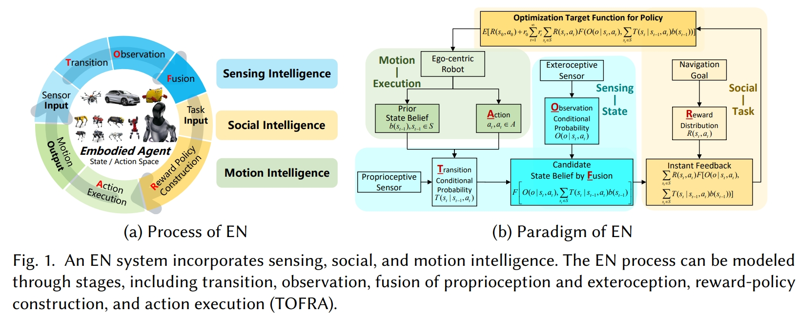
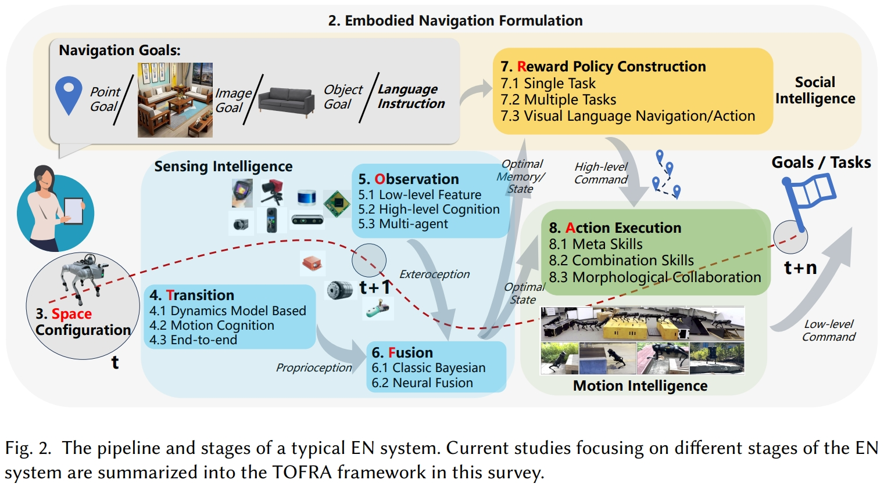
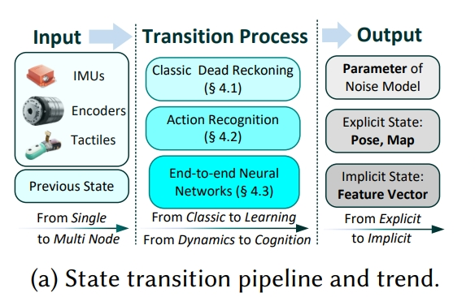
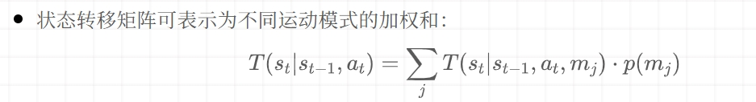
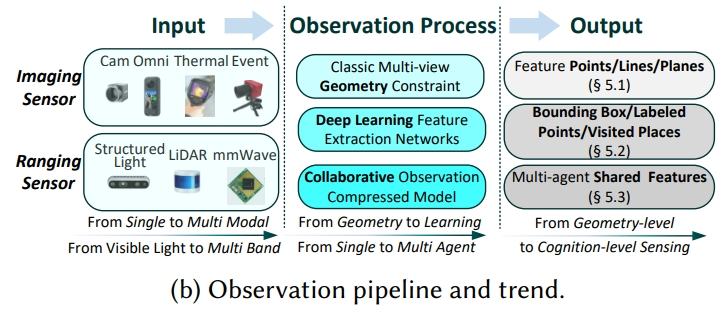
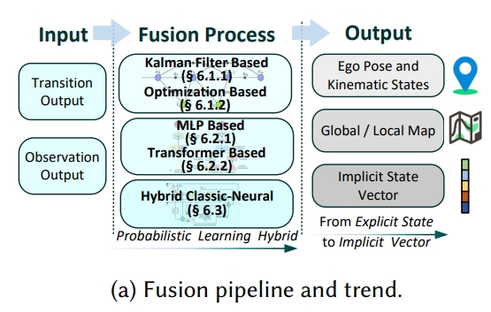
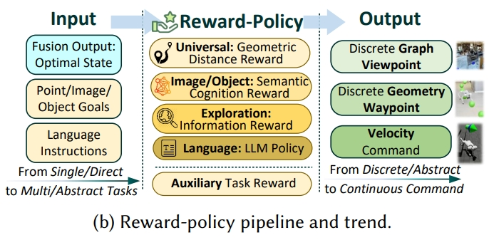

<!-- * 目录
{:toc} -->

本博文对综述论文《Sensing, Social, and Motion Intelligence in Embodied Navigation: A Comprehensive Survey》阅读记录。
该论文对具身导航（Embodied Navigation (EN)）中的感知智能、社会智能和运动智能全面综述。
将具身导航过程分解为五个关键阶段——状态转移（Transition）、环境观测（Observation）、信息融合（Fusion）、奖励策略构建（Reward-policy construction）和动作执行（Action），为具身导航研究提供了统一的结构化分析框架。

* [PDF](https://arxiv.org/pdf/2508.15354)
* [Github](https://github.com/Franky-X/Awesome-Embodied-Navigation)
* [上海交大具身导航中的感知智能、社会智能和运动智能全面综述](https://mp.weixin.qq.com/s/_2Gm9fHhJ43T_2q0hespyg)

<!-- !!!!!!!!!!!!!!!!!!!!!!!!!!!!!!!!!!!!!!!!!!!!!!!!!!!!!!!!!!!!!!!!!!!!!!!!!!!!!!!!!!!!!!!!!!!!!!!!!!!!!!!!!!!!!!!!!!!!!!!!!!! -->
# 引言

在机器人导航中，具身性体现在以自我为中心的感知方式（egocentric perception）和分布式计算能力，区别于传统基于全局地图或外部定位的方式。传统导航研究聚焦于状态估计、点到点路径规划与最优控制，而人工智能的进步推动导航从“路径驱动”向“智能驱动”转变，形成了 具身导航（Embodied Navigation, EN） 的新范式。

相比起依赖预定义地图和GNSS/SLAM 的经典导航，具身导航具备三类智能：
1. 感知智能
   * 通过多模态自我中心感知（proprioceptive + exteroceptive）获取空间认知；
   * 不再完全依赖预构建的全局地图，而是利用主动感知完成环境理解。也就是轻地图、重感知、重理解的思维模式。
   * Robotics领域（或自动驾驶）主要做的，聚焦感知智能，如主动exploration、point-goal navigation、active SLAM等等，但在高级语义理解和复杂任务执行上有所欠缺。
2. 社会智能：
   * 能够理解人类的高层语义指令（如自然语言任务描述、语义环境的理解）；
   * 支持超越预设路径点的复杂任务执行。
   * CV跟NLP领域主要做的，比如VLN等等。往往假设状态信息完备，忽视真实感知和运动的不确定性。
3. 运动智能
   * 具备高度自由度的运动技能，能够在复杂环境中进行灵活、适应性的物理交互；
   * 不局限于固定路径，而是动态适应不同任务与环境。
   * 主要是神经形态/生物启发(bio-inspired mechanisms)做的。尝试模仿生物导航机制，但同样存在社会智能和运动智能的覆盖不足。

  
<figcaption>  
</figcaption>

# 具身导航问题定义

在未知环境中，具身导航（EN）的目标是让智能体通过自我感知和交互，高效完成复杂导航任务。

具身导航的决策过程可建模为 部分可观测马尔可夫决策过程（POMDP）：
* 状态：包含机器人本体状态和环境状态，由于传感器噪声与不确定性，表示为概率分布（belief state）。
* 动作：机器人在时刻t执行的动作，使得状态发生转移。
* 状态转移模型：描述在执行动作后状态分布的变化。
* 观测模型：描述智能体在状态 $s_{t}$ 下通过传感器获得的观测。
* 奖励函数：评估当前状态与动作对任务目标的贡献。
* 最优策略：通过优化累计期望奖励，得到策略函数，生成动作序列 $[a_{0},a_{1},a_{2},...]$。
  

  
<figcaption>  
</figcaption>

## TOFRA框架：EN问题的五个状态
本文采用：状态转移（Transition）、环境观测（Observation）、信息融合（Fusion）、奖励策略构建（Reward-policy construction）和动作执行（Action）为具身导航研究提供了统一的结构化分析框架。

* Transition（T，状态转移）
  * 通过动力学模型、运动认知（如步态识别）、端到端神经网络等方式，利用本体传感器（IMU、编码器）推算下一个状态。
* Observation（O，观测）
  * 借助外部传感器（RGB、深度、LiDAR、毫米波雷达等）感知环境；
  * 包括低层几何特征提取、高层语义认知（目标检测、语义分割、场景识别）、以及多智能体协同感知。
* Fusion（F，感知融合）
  * 将本体状态预测与外部感知进行融合，获得最优状态估计；
  * 方法包括经典 贝叶斯滤波（如卡尔曼滤波、优化法），以及 神经网络隐式融合（如Transformer、多层网络），或二者结合的混合方法。
* Reward-policy construction（R，奖励与策略构建）
  * 将任务目标转化为奖励函数，例如点目标、图像目标、物体目标、探索覆盖率；
  * 策略学习可扩展到多任务与视觉语言导航（VLN），结合大语言模型实现自然语言指令解析。
* Action execution（A，动作执行）
  * 智能体利用运动技能完成策略生成的动作序列；
  * 包括基础元技能（行走、避障）、复合技能（技能组合、运动+操作协同）、以及形态协同（轮腿混合、空地一体、空水一体）。

# 状态及动作空间

* 状态空间：由机器人本体（位置、速度、姿态）与环境特征构成，既可采用`显式表示`（如向量、李群、四元数）保持几何一致性，也可采用`隐式表示`（如深度学习特征向量、神经元格表示），兼顾可解释性与泛化性。
* 动作空间：由机器人平台的物理能力决定，典型分类包括：
  * 低层控制：轮式机器人（3DoF）、无人机/水下机器人（6DoF）、足式机器人（12–25DoF）、轮腿混合机器人（高维控制）。
  * 高层指令：抽象化的语义动作或控制接口，提升交互性。

## 状态空间
状态空间用于表示机器人本体状态与环境状态，是后续转移、观测和融合算法的核心基础。

* 显式表示：通过三维的位置、旋转、环境的特征等来描述agent的状态
  * 向量拼接（Concatenate Vector）：直接将位置、速度、姿态与环境特征拼接成一个大向量，简单易扩展，但存在坐标不一致引发的估计误差。（`estimation inconsistencies because sub-state errors are computed in non-uniform coordinate systems`）
  * 李群（Lie Group）表示：利用群仿射性质，使雅可比计算与当前状态估计无关，提高几何一致性，常用于滤波估计。
  * 四元数(Quaternion-Based Representation)：以四元数表示旋转，双四元数进一步引入平移，Trident quaternion结合位置、速度、姿态，统一误差坐标系，保证估计一致性。

* 隐式表示:通过抽象的、不可解释的特征向量来表征
  * 深度学习特征向量：通过神经网络，从观测中学习状态表示，适用于复杂、非结构化环境。
  * 生物启发的细胞表示（bio-inspired cell-based methods）：采用神经形态计算方法，利用神经元格编码状态，具有高效性，适合低功耗实现。

## 动作空间
动作空间由机器人物理平台的运动系统与自由度（DoFs）决定，决定了导航中智能体能执行的操作范围。

* 底层控制
  * 轮式机器人（Ground Wheeled）：典型 3 DoFs，易于实现，但地形适应性差。
  * 无人机/水下机器人（UAVs/AUVs）：6 DoFs，具备空间机动性，但受载荷和能量限制。
  * 足式机器人（Legged Robots）：高自由度（12+DoFs），适应复杂地形，但控制难度高。
  * 轮腿混合机器人（Wheel-Legged Robots）：结合两者优势，兼具高效与适应性，通常需 16 维动作控制（12 关节+4 轮子）。

* 高层指令(类似VLA或VLN)
  * 通过抽象化命令（如“前进/转向”或语义化指令）来简化交互，适用于上层规划与任务驱动；

# 状态转移

Transition 是具身导航中本体感知智能（Proprioceptive Intelligence）的体现。通过利用智能体的内部传感器（如 IMU、编码器、触觉传感器等）推测在执行动作后的下一状态。当前状态--->下一状态，就是状态转移。
Transition 是具身导航系统中从“动作”到“状态”的映射环节。论文将状态转移方法分为三类：`动力学建模方法（dynamics-based models）`、`运动认知增强方法（motion cognition-enhanced approaches）`、`端到端学习方法（end-to-end learning）`。

  
<figcaption>  
</figcaption>

## 动力学模型驱动的状态转移
经典的惯性导航/推算（Dead Reckoning）思路依赖于物理动力学方程：
* IMU预积分（Pre-integration）。预积分分为：梯形法（Trapezoidal Rule）、Runge-Kutta 法、多项式积分/切比雪夫多项式；
* 不同平台动力学建模：
  * 轮式机器人：常用二维滑移模型，适合平地导航。
  * UAV/AUV：需处理三维空间和外部扰动。
  * 足式机器人：高自由度，动力学复杂，难以精确建模。此外，在人体行人定位、足式机器人中，通过多节点IMU（Multi-node IMU）协同提高估计精度。
  * 轮腿机器人：需混合动力学模型，控制稳定性是关键挑战。

## 运动认知增强的状态转移
引入高层运动认知（如零速状态、行走步态、人类活动模式）提升状态估计精度：
* 零速检测（ZUPT, Zero Velocity Update）。可识别静止状态，修正状态漂移。也就是当速度为0的时候，用于作为约束。广泛应用于行人定位和机器人运动约束。
* 活动识别（Activity Recognition）。基于 IMU 或 多模态传感器（视觉+IMU） 识别运动模式；对高自由度的足式机器人尤为重要，能够区分不同步态，提升状态预测精度。
* 认知化转移模型（如下公式所示）

  
<figcaption>  
</figcaption>

## 端到端学习的状态转移
利用深度学习直接学习复杂动力学，突破传统物理建模的限制，属于隐式建模。
* IMU 去噪（Neural Denoising）。CNN/LSTM/TCN 用于实时去除 IMU 噪声与偏差，提高输入精度。（但根据之前learning-based IO调研的效果来看，泛化能力应该是有限的）
* 端到端神经建模（Neural Transition）。神经网络直接学习状态转移函数，无需显式动力学模型；特别适合多节点 IMU 或复杂机器人系统，可隐式捕获非线性和环境干扰。

# 感知
机器人通过外部传感器（exteroceptive sensors）来感知环境，从而形成对外部世界的认知。本section介绍了从低层次特征提取到高层次认知理解，再到多智能体协作感知的观察方法。

  
<figcaption>  
</figcaption>

## 低层次特征观察：经典SLAM前端

低层次特征提取是经典SLAM前端的核心，主要通过识别几何基元（如点、线、面）来构建对环境的基础理解。此处所谓的低层次特征提取其实也就是传统的特征提取方式，仅仅能获取点、线、面等手工特征。
* 点特征：是最基础的几何元素，通过在不同帧之间提取和匹配这些点来实现环境感知（数据关联）。传统的基于梯度的提取器（如SIFT）在纹理缺失的场景中表现不佳，但基于learning的（如superpoint、Transformer等）提高了其鲁棒性。
* 结构特征（线与面）。在纹理缺失的环境中尤为重要。传统方法依赖于几何原理，特别是“曼哈顿世界假设（Manhattan world assumption）”来检测线特征。近年来，端到端的深度学习方法也用于线特征的稳健提取和匹配。此外，从深度信息中提取的平面特征作为有效的补充几何基元，有助于环境感知。

## 高层次认知观察：空间认知
除了低层次的特征提取，高层次的认知观察侧重于通过语义理解来感知环境，这包括目标检测、语义分割和位置识别等技术。这些技术通过深度学习方法实现，能够提供更精确和丰富的环境信息。

* 目标检测：通过在2D图像和3D点云中定位和分类目标来提供关键的语义信息。2D目标检测领域从实时CNN发展到具有更强上下文推理能力的Transformer，同时增强了对恶劣天气等环境挑战的鲁棒性。3D检测方法通过融合多模态数据或直接利用点几何来解决点云稀疏性问题。这种认知能力通过动态特征移除（直接或概率性）提高了SLAM的鲁棒性，并通过关注特定目标或在目标级SLAM系统中将目标作为持久地标来增强映射。
* 语义分割：通过为每个像素或点分配类别标签来提供对环境的密集理解。2D方法从基础的全卷积网络（FCN）和上下文感知架构发展到基于Transformer的方法。对于3D点云，技术范围从点级MLP和专用卷积到Transformer，包括基础模型的进步和多模态融合。这种语义能力通过动态目标移除、强化几何特征描述以实现稳健映射，以及通过概率数据关联使SLAM系统能够利用语义目标作为可靠地标来增强环境观察。此外，语义特征可以隐式地集成到端到端的神经映射网络中，以进一步提高观察质量。
* 位置识别（Place Recognition）：导航系统中用于闭环检测和重定位的关键组件。2D应用中，方法从基于CNN的描述子发展到基于Transformer架构和通用基础模型（universal foundation models，大模型）。对于3D环境，LiDAR方法从经典描述符发展到有效利用时间信息或鸟瞰图投影的深度学习方法。为了增强在不同条件下的鲁棒性，多模态融合技术通过隐式或显式机制整合2D和3D数据。这些方法的实际应用需要解决系统级挑战，包括在线校准和确保机器人平台上实时性能。

## 多智能体观察：协作感知

除了单智能体感知，多智能体协作感知作为一种有效的策略，通过整合来自多个智能体的观测数据来扩大感知覆盖范围并增强观察的鲁棒性。不同类型的智能体（如地面和空中智能体）提供互补的环境信息，可以克服单个传感器的局限性和遮挡问题。这种协作方法在多智能体感知领域得到了广泛研究，并在导航任务中表现出显著优势。

* 地面-地面协作：
  * 多个机器人之间的地面-地面协作显著增强了导航任务中的感知覆盖范围。这些系统采用动态Voronoi划分（Voronoi partitioning ）或分布式势场等技术，有效合并子地图并消除冗余工作。
  * 为了克服通信带宽限制，智能体交换轻量级的拓扑地图或压缩描述符，而不是传输密集的地图数据（dense map data）。
  * 对于鲁棒的去中心化定位（decentralized localization），这些协作系统可以通过变分贝叶斯方法联合学习和适应非平稳传感器噪声特性，从而提高整个系统的准确性和可靠性。
* 空中-空中协作：
  * 无人机（UAV）的卓越感知范围和机动性使其在协作观察任务中特别有效。空中多智能体系统的研究涉及多个操作领域的关键挑战。在协作制图和探索方面，多UAV系统利用协作SLAM技术提高模型精度，同时共享子地图以实现快速环境覆盖。
  * 在高级感知能力方面，研究人员开发了协作3D目标检测框架，将多视图2D图像融合成一致的3D表示。此外，为了应对有限通信带宽这一关键瓶颈，实施了空间置信图（spatial confidence maps）等技术，以智能地压缩和优先共享空中智能体之间的数据。
* 地面-空中协作：
  * 地面-空中协作感知整合了空中和地面传感视角，以克服单一平台观察的局限性。空中智能体通常执行快速、粗略的制图，而地面智能体捕获局部区域的详细特征，通过全局位姿图优化技术融合异构传感器数据。通过引入语义特征来弥合视角差异，进一步增强了这种传感器融合过程的可靠性。
  * 除了通用制图，这些协作系统还可以针对特定目标进行优化，例如高效的目标定位任务。为了促进这一领域的系统评估和进步，为这些异构感知系统建立了标准化的基准数据集。

# 感知的融合
将来自本体感知（proprioception）和外部感知（exteroception）的信息进行融合，以形成最优的状态估计。主要是两种融合范式：经典贝叶斯方法（classic Bayesian methods）和隐式神经技术（implicit neural techniques）。

  
<figcaption>  
</figcaption>

## 经典贝叶斯方法
经典融合方法基于贝叶斯原理，通过将先验状态信念与观测条件概率相结合来推导最优状态。
主要分为两种方法：卡尔曼滤波器和基于优化的方法。

### 卡尔曼滤波

卡尔曼滤波器是融合本体感知和外部感知数据的常用方法。在视觉-惯性融合中，多状态约束卡尔曼滤波器（MSCKF）是处理传统相机和异步事件相机的经典框架。在测距-惯性融合中，卡尔曼滤波器也广泛应用于基于激光雷达的系统和测量噪声较大的雷达系统。

然而，所有传感器模态都面临非高斯和非平稳噪声分布的挑战，这通过特殊的滤波技术来解决。现代系统通过紧密耦合多种互补模态（如视觉、激光雷达和惯性数据）来提高鲁棒性。

### 基于图优化的方法

基于优化的融合方法通过构建统一的成本函数来最小化，该函数通常包括先验成本、传播成本、观测成本和正则化项。对于基于视觉的系统，特征参数直接纳入优化过程。
类似地，事件相机的特征也被纳入相同的优化框架。激光雷达或毫米波雷达的范围传感器数据为成本函数提供结构特征。这种方法的优势在于能够将视觉和范围观测与本体感知测量结合，使用基于协方差的加权方案，从而产生稳健的多模态融合解决方案。

## 基于learning的融合

除了基于贝叶斯的经典融合方法，深度神经网络也可以用于隐式地融合状态转换和观测信息。

* 基于多层网络的融合：通过连接状态转换和观测特征来实现。VINet是这一领域的先驱工作，后来扩展到自监督框架。然而，简单的连接方法对损坏或未对齐的传感器数据不够鲁棒。为了解决这个问题，开发了选择性融合技术，通过识别和优先考虑来自各种传感器模态的可靠特征来提高鲁棒性，从而减少传感器退化的影响。
* 基于Transformer的融合：通过其注意力机制提供了一种复杂的传感器融合方法，能够建立时间序列之间的上下文感知关系。与简单的多层方法不同，Transformer可以对异构传感器数据的空间和时间维度的复杂依赖关系进行建模。自注意力机制自动为测量分配适当的权重，基于其可靠性，有效地减少噪声或损坏输入的影响，同时保留有价值的信息。

## 传统方法-learning的融合
结合了经典卡尔曼滤波技术和神经网络，以有效地学习融合过程中的非线性动态。
（如DBA-Fusion，DEIO等）这些混合方法旨在结合经典方法的可解释性和理论保证以及神经网络的灵活性和学习能力。

# 奖励策略的构建（Reward-Policy Construction）
本section探讨在具身导航中，如何构建奖励函数和策略，以使机器人能够理解和执行高级任务指令。
通过将高层任务（high-level tasks）转换为奖励函数来指导策略学习。

  
<figcaption>  
</figcaption>

## 单任务导航

单任务导航（single-task navigation）是具身导航的基础，它对应的奖励函数直接将可观察状态转化为行动指导。
对于单任务导航主要分为以下四种类型：

* 点目标导航（ point-goal navigation）：机器人需要导航到目标坐标（target coordinates）。早期方法依赖于GPS/指南针数据，但最近的研究通过集成学习的自我中心定位（learned egocentric localization）模块，使机器人能够在只有视觉观察的情况下进行导航。
* 图像目标导航（image-goal navigation）：机器人需要到达参考图像被拍摄的位置，通过学习将当前视图与目标相关联的策略。目前的研究探索了各种策略架构，包括用于长视野任务的记忆增强网络（memory-augmented networks for long-horizon tasks）、用于提高泛化能力和可解释性（improved generalizability and explainability）的模块化设计，以及能够同时处理观察序列、行动和目标的Transformer模型，以更好地捕捉时间依赖性。
* 物体目标导航（object-goal navigation）：机器人需要找到指定类别的物体，这依赖于对场景的语义理解。一种常见的方法是构建显式的语义地图以指导探索策略，尽管研究人员也开发了更有效的无地图方法以减少计算开销。通过引入3D物体几何形状，可以提供更精确的空间理解，从而在复杂环境中提高性能。最近的先进方法扩展到不仅简单地检测物体，还模拟物体之间的常识关系，使用结构化的图卷积网络或更灵活的Transformer架构来优化搜索效率。这些方法最终旨在开发高级的、抽象的场景表示，以促进更智能的导航行为。
* 探索（exploration）：探索任务关注于高效覆盖和重建未知环境。奖励的制定因不同的环境表示和探索区域而异。基于覆盖的方法提供了一种直接的奖励机制，基于机器人已成功探索的区域百分比。补充这种策略的是内在好奇心驱动的奖励，它激励机器人寻找新信息，通过优先考虑与之前遇到的区域差异显著的观察结果，从而促进对环境的全面探索。

## 多任务导航

在多任务导航（ multi-task navigation）中，研究表明训练机器人完成一种目标类型的导航可以增强其在其他导航目标上的性能。为了有效处理长期视野任务，策略通常会整合持久记忆机制，以减少重复探索。
* 这些机制可以是显式的全局语义地图，也可以是隐式的学到的表示。此外，通过辅助学习目标，如空间推理或预测深度和逆动力学，同时训练机器人，可以得到更稳健的状态表示。
* 尽管端到端的深度学习方法在最近的研究中占主导地位，但经典的模块化架构，将制图与目标定位分开，仍然显示出显著的有效性。

## 语言指导任务：视觉语言导航（VLN）

除了机器人自我指导的策略学习外，人类语言指令可以促进学习过程，以完成复杂任务。这种方法被称为视觉语言导航（VLN）。
关于VLN的更多介绍请见[博客](https://kwanwaipang.github.io/VLN/)

# 动作执行（Action Execution）
基础动作技能是机器人进行基本移动和交互的能力。这些技能是所有复杂动作的基础。
* 序列技能分解（Sequential Skill Composition）：显式的采用分层架构，利用high-level规划器来将技能进行序列化，提供可解析性，但把技能这样分解会导致缺少平滑的状态转移。相反，隐式的方法，基于端到端来创建一个统一的策略来实现无缝的技能状态转换
* 手腿操作（Leg-Arm Manipulation）：处理运动规划，目前的研究也开始探索腿部运动的同时执行手部的操纵

## Meta Skills Development（元技能）

* 轮式机器人：
  * 动作空间：轮式机器人通常具有3个自由度（DoF），其动作空间可以简化为离散命令，如前进、后退、左转和右转。
  * 学习方法：由于其动力学相对简单，通常可以通过无监督学习方法来学习这些基础动作技能。
* 足式机器人：
  * 动作空间：足式机器人具有更高的自由度（如四足机器人通常有12个DoF，人形机器人有25个以上DoF），这使得它们能够进行更复杂的动作，如跳跃和爬坡。
  * 学习方法：研究集中在基于模型的控制方法，如精确的跳跃控制，以及使用强化学习（常结合课程学习）来发现通过与环境交互的稳定步态。

## 组合技能（Combination Skills）

组合技能涉及将多个基础动作技能组合成更复杂的、高层次的能力。这代表了运动智能的一个关键进步。

* 顺序技能组合
  * 显式方法：使用高层次的规划器来按顺序组合技能，这种方法具有可解释性，但可能缺乏平滑的过渡。
  * 隐式方法：通过端到端的学习方法创建统一的策略，实现无缝的技能转换，尽管这需要大量的训练数据，但可以实现令人印象深刻的敏捷性。
* 腿臂协同操作
  * 腿基操作：足式机器人可以利用腿部进行物体操作，而无需专门的末端执行器。
  * 集成臂腿系统：一些机器人设计了集成的臂腿系统，支持复杂的全身协调运动。这些系统需要复杂的运动规划算法来管理运动学和动力学之间的耦合。

## Morphological Collaboration（形态协作）

形态协作是运动智能的前沿领域，机器人通过可调整的物理配置来优化在多样化环境中的性能。

* 轮腿混合机器人（Wheel-Legged Hybrids）：
  * 动作空间：轮腿机器人结合了轮式机器人的地面效率和足式机器人的地形适应性。
  * 控制框架：这些混合平台需要特殊的控制框架，根据地形动态分配轮子和腿部的控制权。
* 陆空机器人（Terrestrial-Aerial）:
  * 动作空间：陆空机器人可以在地面行走和空中飞行。
  * 控制算法：这些机器人需要复杂的状态估计算法来保持在不同动态模式下的定位一致性，同时需要专门的运动规划器来管理复杂的转换阶段。能量优化对于这些系统至关重要，研究集中在最小化模式转换过程中的能耗。
* 空陆水机器人（Aerial-Aquatic）:
  * 动作空间：这些多领域机器人可以在空中、陆地和水下环境中操作。
  * 控制架构：它们实现了分布式控制架构，每个领域的专用控制器通过元控制层进行协调。尽管这些系统具有很大的潜力，但在可靠性、能效和控制方面仍面临重大挑战。

 

~~~
总的来说本综述是通过思路构建了一个体系，但是感觉还是没有特别深入的看到技术发展的进程的。
~~~
