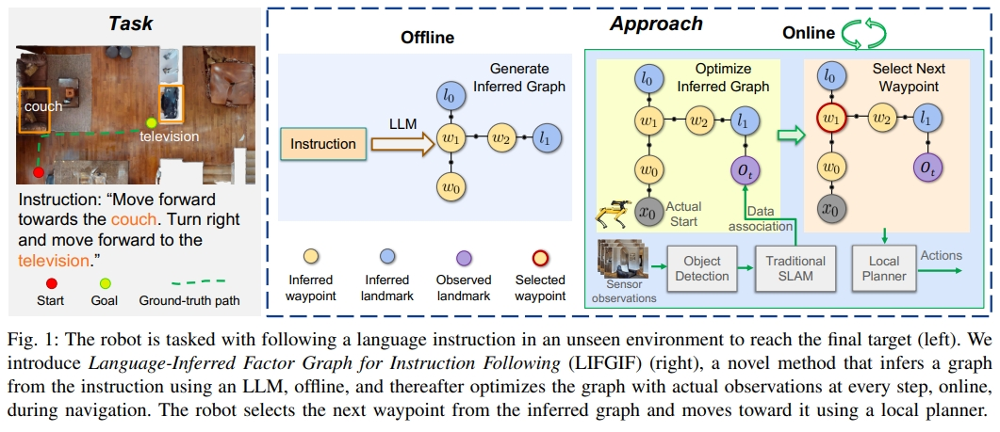

<!-- * 目录
{:toc} -->

本文是波士顿动力24年arvix的工作，关注Instruction Following，通过LLM大模型与传统的SLAM导航相结合的方式让具身导航智能体学会指令跟随。
本博文为论文阅读笔记，仅供本人学习记录用~

相关博客/资源list：
* [PDF](https://arxiv.org/pdf/2411.07848)
* [Paper List for VLN](https://github.com/KwanWaiPang/Awesome-VLN)
* [Blog for VLN](https://kwanwaipang.github.io/VLN/)
* [具身导航智能体学会找对象！NL-SLAM：自然语言与SLAM结合的对象引导视觉语言导航](https://mp.weixin.qq.com/s/sMoHe2_dlPaSatwIWKRU8A)

<!-- !!!!!!!!!!!!!!!!!!!!!!!!!!!!!!!!!!!!!!!!!!!!!!!!!!!!!!!!!!!!!!!!!!!!!!!!!!!!!!!!!!!!!!!!!!!!!!!!!!!!!!!!!!!!!!!!!!!!!!!!!!! -->
# 引言

本文主要是实现自然语言指令与机器人中广泛使用的基于地标的地图之间的对齐，以及自然语言导航指令。

对于大规模场景，如多层住宅，可以通过因子图中与机器人姿态联合优化，实现3D landmark或者地图的估计，这对传统SLAM技术而言基本是solved problem了。
因此本文希望能做到的是如何将基于语义指令的导航与Landmark-based mapping and navigation systems相结合，也就是`grounding natural language instructions to landmarks and robot poses in a factor graph`。

论文的主要contributions如下：
1. 本文提出了一个用于指令跟随的语言推理因子图（LanguageInferred Factor Graph for Instruction Following，LIFGIF），实现基于构建好的三维下，基于语言指令的导航。
2. 以目标为主的语言导航指令数据集：Object-Centric VLN (OC-VLN)
3. 实现在真实波士顿狗子上的zero-shot指令跟随

但注意，本框架是`in a novel environment while the map is constructed`以及`unseen unexplored environments`
应该就是首先是针对unseen-environment的，其次通过在探索的同时，通过传统的SLAM/导航来构建因子图与估算姿态，通过将自然语言指令与因子图中的地标和机器人姿态联系起来，实现VLN任务。
这样就可以利用成熟的SLAM框架，避免了其他VLN方法在真实物理环境下泛化能力差的问题。
此外，所采用的视觉与语言基础模型也不需要task-specific training。

目前代码还没开源，但[网站](https://sonia-raychaudhuri.github.io/nlslam/)上给出了链接及一些dmeo样例。

# OC-VLN数据集
数据集仅仅包含以对象为地标的指令（`object-centric instructions`）,要求机器人根据对象中心的指令导航至目标位置。
比如：“向前走到沙发上，然后走到你面前的长椅上，停在地毯上”也就是都是以物体的描述为主的。

使用来自HM3DSem的真实世界3D扫描在Habitat模拟器中生成episode。使用GPT-4生成细粒度的对象中心指令。

利用HM3DSem和Goat-Bench数据集，通过两阶段方法生成OC-VLN任务的导航指令：
* 利用HM3D Sem数据集中的3D扫描在Habitat模拟器中创建虚拟环境，生成episode，保存RGB图像。
* 利用GPT-4模型结合图像和轨迹信息来生成指令。首先提取关键对象，然后生成基于对象的详细导航指令。

OC-VLN包含多个episode，平均路径长度约7米，支持连续环境和2DoF动作空间，指令为开放词汇，平均包含29个单词、8个子指令和8个对象。
与VLN-CE相比，OC-VLN的路径较短，但指令更长，反映了更丰富的对象中心信息。

# 理论方法

语言指令不仅仅可以指导机器人导航，还编码了重要的空间信息（关于环境的布局的）。
即使在还没任何感知之前，指令都可以给机器人提供关于环境地图的初步了解（尽管会有一定的不确定性）。
比如`move forward until you see a chair`这就意味着在机器人当前的位置的前方（X轴）会有一张椅子，尽管不知道具体的距离。那么通过将这一空间的信息编码成一个因子图，那么这一先验就可以植入到传统的基于因子图的SLAM系统中。
那么当机器人观察到指令中提到的地标时，这些地标对应的不确定性就大大降低，从而帮助机器人在导航过程中，根据指令的上下文中来定位。
这个过程就很好的将语言的引导（linguistic guidance）及空间的感知（spatial awareness）相结合：

  
<figcaption>  
</figcaption>

~~~
未完待续
~~~
