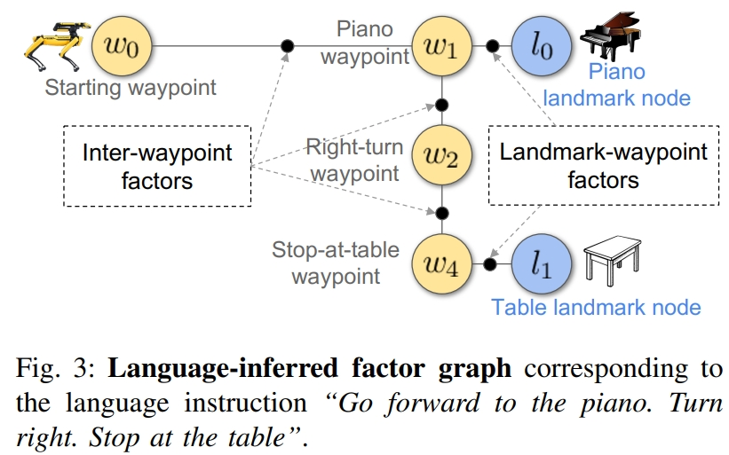

<!-- * 目录
{:toc} -->

之前博客对VLN进行调研。但VLN领域工作实在太多了，NLP、CV、Robotics领域的学者们纷纷加入，只能介绍小量代表性工作。
本博文针对VLN领域带有机器人实操的几篇工作进行调研，跟之前博客为了了解整个领域不同的是：本博文希望调研业内（学术界）VLN落地的方案及做法。

* [Paper List for VLN](https://github.com/KwanWaiPang/Awesome-VLN)
* [Blog for VLN](https://kwanwaipang.github.io/VLN/)
* [论文阅读笔记之——《Vision-and-language navigation today and tomorrow: A survey in the era of foundation models》](https://kwanwaipang.github.io/VLNsurvery2024/)
* [Paper Survey——CLIP on VLN](https://kwanwaipang.github.io/CLIP-on-VLN/)

# Zero-shot Object-Centric Instruction Following: Integrating Foundation Models with Traditional Navigation
本文是波士顿动力24年arvix的工作，关注Instruction Following，通过LLM大模型与传统的SLAM导航相结合的方式让具身导航智能体学会指令跟随。

  
<figcaption>  
</figcaption>

* 详细请见[博客](https://kwanwaipang.github.io/nl-slam/)
* 演示[网页](https://sonia-raychaudhuri.github.io/nlslam/)

# SLAM-Free Visual Navigation with Hierarchical Vision-Language Perception and Coarse-to-Fine Semantic Topological Planning

本文提出了一个纯视觉，切不依赖于SLAM的导航框架。通过轻量的拓扑地图（topological representations）来代替稠密几何的语义推理。
通过分层视觉语言感知模块将场景级上下文（scene-level context）与对象级线索（object-level cues）融合在一起，以实现鲁棒的语义推理。
这部分是通过VLM来实现场景以及物体级别的语义推理的，进而构建`semantic-probabilistic topological map`。
接下来，基于大语言模型（LLM）的全局推理实现子目标的选择，而基于视觉的局部规划实现障碍物躲避。
最后再通过强化学习来实现腿式机器人的运动控制。

之所以要强调`SLAM-free`是因为机器人不仅需要定位自身，还需要理解环境哪里是值得下一步去探索的、哪个目标是跟任务相关的，还有就是在不确定的情况下，如何去规划。用传统的架构难以handle，其实这也是用VLN代替传统定位导航pipeline主要的motivation。

~~~
PS个人观点：对于VLN任务而言。language输入重要性略低，只是为了交互。更重要或者说更难的是“轻地图，重感知”的实现。
此外，得益于DeepSeek，ChatGPT等基础通用大模型的强大，LLM或者VLM具备一定的common sense，往往只需要fine-tune，甚至zero-shot也可以。所以这也“language”这个词的主要作用。但本质整个感知的pipeline，似乎“language”的位置越高的工作往往只能仿真，而“视觉感知”、“控制policy”等比重越大的工作往往可部署于实际机器人中
~~~