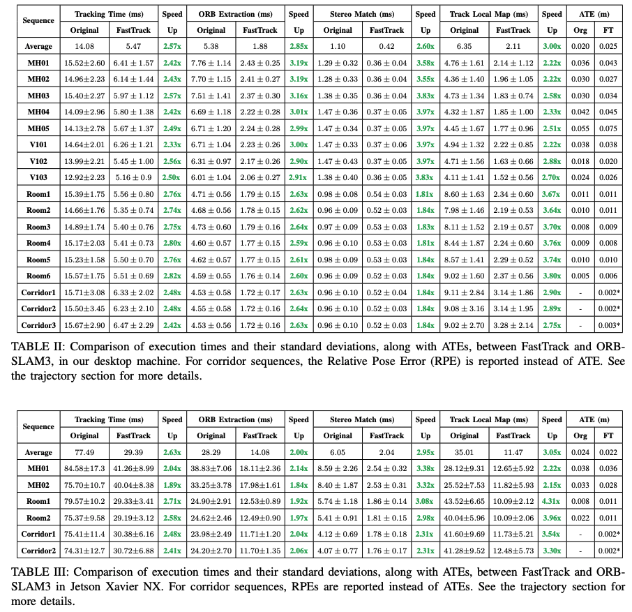

<!-- * 目录
{:toc} -->

<!-- !!!!!!!!!!!!!!!!!!!!!!!!!!!!!!!!!!!!!!!!!!!!!!!!!!!!!!!!!!!!!!!!!!!!!!!!!!!!!!!!!!!!!!!!!!!!!!!!!!!!!!!!!!!!!!!!!!!!!!!!!!! -->
# 引言

传统SLAM算法一般都是运行在CPU上的（除了基于Learning的或者部分dense SLAM需要GPU）。
最近有一些工作基于CUDA实现SLAM的加速进而提升实时性。
本博文对相关工作进行调研与整理.

~~~
PS:对于CUDA加速SLAM从两个层面来看待：
1. 最大化SLAM系统的实时性。
2. 最大化利用硬件资源。将SLAM一部分算子（如特征提取、数据关联等）迁移到GPU上运行，既减轻CPU的压力，又可以把GPU的资源利用上，不至于浪费～
~~~

# 经典论文阅读

下面是整理的相关paper list：

<!-- |---|`arXiv`|---|---|---| -->
<!--  -->

| Year | Venue | Paper Title | Repository | Note |
|:----:|:-----:| ----------- |:----------:|:----:|
|2025|`arXiv`|[FastTrack: GPU-Accelerated Tracking for Visual SLAM](https://arxiv.org/pdf/2509.10757)||---|
|2025|`CoRR`|[cuVSLAM: CUDA accelerated visual odometry and mapping](https://arxiv.org/pdf/2506.04359)||NVIDIA|

## 1. FastTrack: GPU-Accelerated Tracking for Visual SLAM
该论文通过利用GPU来加速ORB-SLAM3中的双目特征匹配及局部地图tracking两个部分。速度提升达2.8倍。同时性能精度保持相似水平。

如下图所示，分别是在desktop（表格2）和Jetson Xavier NX（表格3）上的实时性及精度对比：

  
<figcaption>  
</figcaption>

