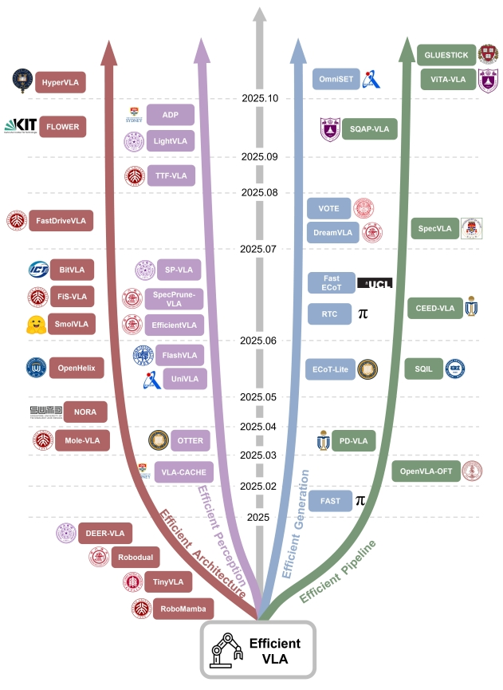

<!-- * 目录
{:toc} -->

<!-- !!!!!!!!!!!!!!!!!!!!!!!!!!!!!!!!!!!!!!!!!!!!!!!!!!!!!!!!!!!!!!!!!!!!!!!!!!!!!!!!!!!!!!!!!!!!!!!!!!!!!!!!!!!!!!!!!!!!!!!!!!! -->
# 引言

动作视觉语言（Vision-Language-Action，VLA）模型正成为机器人理解环境与执行任务的核心框架。
然而，主流VLA系统通常依赖体量庞大的视觉与语言模型。
这些模型普遍依赖大规模的视觉编码器和语言模型，导致推理过程计算复杂度高、延迟大、内存占用高。同时，动作输出的连续性与平滑性问题也直接影响任务执行的可靠性。这些瓶颈严重制约了VLA模型在实时、资源受限场景下的应用。
因此，本博文，对survey paper——[Efficient Vision-Language-Action Models for Embodied Manipulation: A Systematic Survey](https://arxiv.org/pdf/2510.17111)进行阅读，并记录阅读过程的一些心得想法。

本博文仅供本人学习记录用，其他与VLA相关的调研请见博客：
* [Paper Survey之——Awesome Vision-Language-Action (VLA)](https://kwanwaipang.github.io/Awesome-VLA/)
* [论文阅读笔记之——《Vision-language-action models: Concepts, progress, applications and challenges》](https://kwanwaipang.github.io/VLA-survey-2025/)

对于高效的VLA架构，代表性工作的发展时间节点如下图所示：

  
<figcaption>  
</figcaption>

对于提升VLA"效率"，该论文从下几个维度展开：
1. 高效模型架构设计: 在维持模型性能上限的同时，最小化平均推理开销
   * 压缩骨干模型（Static Backbone Selection）：使用参数量更小的预训练模型，或设计轻量化的序列模型来替代超大规模的骨干网络。此类策略直接减少了参数量与内存占用，实现简单，但存在压缩模型性能上限的风险。
     * ​​RoboMamba​​：引入Mamba状态空间模型架构作为序列模型，参数量约为2.7B，相比基于Transformer的LLM，能更高效地进行时间建模和并行推理，从而减少延迟。
     * ​Tiny VLA​​：使用Pythia-1.3B等小型LLM，在保持核心任务能力的同时压缩整体模型，使边缘部署更可行。
     * ​​SmolVLA​​：采用SmolVLM-2（参数量为0.24B、0.45B、2.25B），并通过剪枝最终的Transformer层进一步减少计算。
     * NORA​​：将骨干网络替换为Qwen-2.5-VL-3B，以实现更小的占用空间和强大的性能。
   * 动态计算路径（Dynamic Computation Pathways）：在训练阶段保留大型骨干网络，但在推理阶段引入动态路径选择，以在不完全牺牲能力的情况下提高效率。模型保留大型架构的表达能力，同时在特定任务上下文中丢弃冗余计算。此类方法能在保障复杂样本处理能力的同时，显著降低平均计算成本，但代价是增加了路由机制和训练的复杂度。
     * ​​SmolVLA​​：采用简单的层剪枝策略，永久移除语言模型中固定数量的最终层。
     * ​​FLOWER​​：基于LLM的可解释性发现，剪枝冗余的顶层（如编码器-解码器VLM中的解码器或仅解码器模型中的最后几层），以平衡上下文表达能力和计算效率。
     * DEER-VLA​​：引入早期退出机制，在语言模型不同中间层放置轻量级策略头，通过输出相似性指标决定是否提前退出。退出阈值通过平衡平均/峰值FLOPs和GPU内存使用的约束目标进行优化。
     * ​​MoLE-VLA​​：将语言模型的每一层视为潜在专家，采用Mixture-of-Experts (MoE) 框架，通过门控机制动态选择参与计算的层。为稳定训练，还应用了自蒸馏。
     * ​Efficient-VLA​​：通过测量层输入和输出特征向量之间的余弦相似度来评估每层的贡献，如果相似度超过阈值，则在推理时跳过该层。
   * 双系统架构设计(Dual-System Design)​：受认知科学双系统理论启发，将模型分为一个用于复杂推理和长期规划的“慢系统”和一个用于快速、直观响应的“快系统”。两个子系统协同工作，处理复杂的、高层次任务，同时确保简单场景下的低延迟推理。通常采用异构模型架构：慢系统依赖大型多模态语言模型(MMLM)进行语义理解和推理，快系统采用轻量级模型快速响应感知输入。两个系统通过潜在Token或嵌入交换信息。
     * ​LCB​​：使用LLaVA作为慢系统生成语言描述和动作提示，然后指导3D Diffuser Actor作为快系统通过可学习的`<ACT>`Token生成最终动作。
     * ​​HiRT​​：采用InstructBLIP作为慢系统生成表示，然后由EfficientNet-B3作为快系统通过MAP池化进行高效控制。
     * ​RoboDual​​：结合OpenVLA作为慢系统和DiT作为快系统。慢系统输出潜在表示，快系统通过Perceiver Resampler进行细化以重建简化的动作输出。
     * ​OpenHelix​​：提供主流双系统框架的系统回顾和评估，并提出了优化的模块化配置。具体来说，LLaVA-7B作为慢系统，3D Diffuser Actor作为快系统，通过可学习的`<ACT>`Token进行通信。

2. 感知特征压缩：视觉模态输入通常构成最长的Token序列，是VLA模型最主要的计算开销来源。
   * 单帧特征选择性处理：通过基于注意力分数或特征相似度等指标，筛选并保留任务相关的视觉token，或通过token压缩机制将可变长度的长序列映射为固定长度的紧凑表示。
   * 跨时序特征复用：利用机器人观测数据在时间上的高度连续性，复用帧间不变或缓变的特征。时序复用能显著降低连续帧之间的重复计算，但必须引入有效的缓存刷新机制来判断复用的安全性，以避免信息漂移或性能退化。

3. 动作生成加速：动作是连接感知与执行的关键环节，其表示方法和生成策略直接影响任务精度与系统延迟。
   * 直接输出低维连续动作向量以实现最低延迟，但逐步预测在长时序任务中会产生累积误差。改进手段包括动作块化（一次生成多步并做时间平滑）和动作序列压缩（频域变换与量化编码）。这些方法兼顾吞吐量与平滑性，但需处理块边界一致性问题。
   * 在动作前引入显式推理，包括语言层面的任务分解和视觉层面的子目标预测。此类方法提升可解释性与跨场景泛化，但显著增加序列长度与推理延迟。实践中常采用选择性推理或对高层推理结果实施缓存以减少频繁调用成本。

4. 训练推理优化：
   * 训练端的重点在于降低模型在新任务和新环境下的适配成本。常用策略包括参数高效微调、知识蒸馏、结构化剪枝与量化感知训练。前两者通过少量可学习参数或教师–学生迁移实现快速适配，后两者则在压缩模型规模的同时保持控制精度，整体提升了模型的部署效率与可扩展性。
   *  推理端聚焦于突破自回归瓶颈，实现并行化或混合解码。典型路径包括采用并行草案与一次验证的投机式解码、使用双向或部分并行注意力结构以增强吞吐，以及通过一致性蒸馏缩小训练与并行推理间的分布差，从而确保稳定性与收敛速度。

* 补充说明：
  
~~~
对于Efficient VLA的设计有四个维度：
1. 高效的模型架构设计。
* 压缩网络/模型，但同时带来性能压缩的风险。那进一步的，采用大模型（教师模型）的特征进行知识蒸馏，或许可以改善和提升压缩后的小模型（学生模型）的性能（这部分其实在第四点有体现）。
* 训练时保留模型的全部能力，推理时根据输入复杂度动态选择计算路径。
* 快慢双系统的设计本身就属于解耦模型的推理与反应功能。“慢系统”负责理解和规划，“快系统”负责以较高频率生成动作以及部分动作可能可以复用。

2. 感知特征压缩————保留必要空间与时间信息的同时，显著降低计算负担，实现高效决策
* 通过注意力分数或特征相似度等指标，筛选有效token，或者对token进行压缩等紧凑表示。
* 复用帧间不变或缓变的特征

3. 动作生成的加速
* 一次性输出多步动作块（并做时间平滑），或者对动作序列进行token化或频域变换

4. 训练与推理的优化
* 训练部分包括：参数微调、知识蒸馏、结构化剪枝与量化感知训练。
* 推理部分包括：并行化或混合解码。
~~~

# 参考资料
* [你的VLA太慢了！？算力不够也能提速：这篇综述教你打造高效VLA新范式](https://mp.weixin.qq.com/s/JW6RHuSBPEbBWirK_Wk23A)