<!-- * 目录
{:toc} -->


<!-- !!!!!!!!!!!!!!!!!!!!!!!!!!!!!!!!!!!!!!!!!!!!!!!!!!!!!!!!!!!!!!!!!!!!!!!!!!!!!!!!!!!!!!!!!!!!!!!!!!!!!!!!!!!!!!!!!!!!!!!!!!! -->
# 引言

产品说明文档：[http://support.noitom.com.cn/](http://support.noitom.com.cn/)

github上整理的开发的全流程：从动捕软件到ROS数据驱动宇树机器人，可以参考一下其中的api数据调用和URDF映射：[https://github.com/pnmocap](https://github.com/pnmocap)

软件的使用：[http://support.noitom.com.cn/1bc6/bd06/b866](http://support.noitom.com.cn/1bc6/bd06/b866)

（IP地址设置为：10.62.0.101）

# 校准动作

每次穿戴后需要标定

A-pose：手臂竖直朝下，勿弯曲，双脚平行与肩同宽，脚尖超前，勿外八或内八

V-pose: 双手并拢，四指与地面保持平行，大拇指与四指呈45°

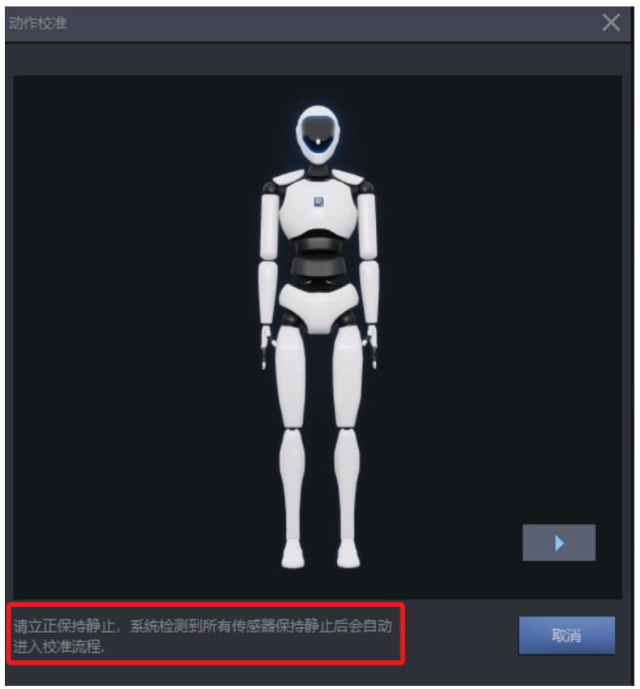

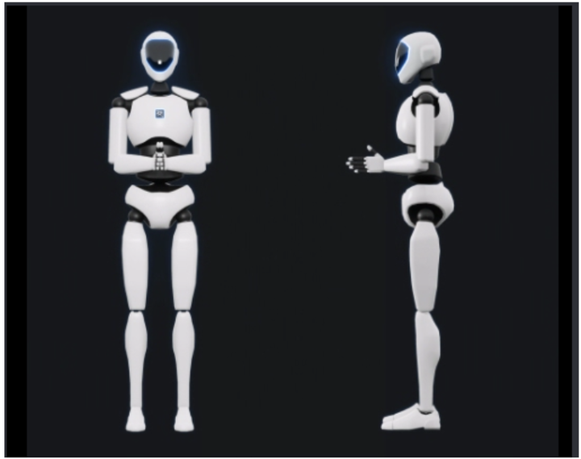

B-pose：双手保持并拢状态，向上抬起约45°

.PNG)

P-pose: 双手比出OK手势，大拇指与食指轻轻触碰，不要用力

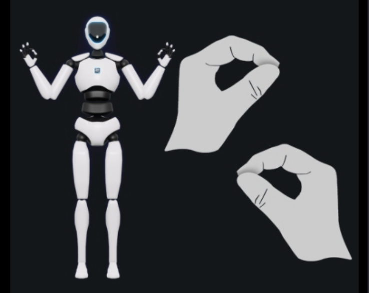

T-pose: 手臂平举，掌心向下

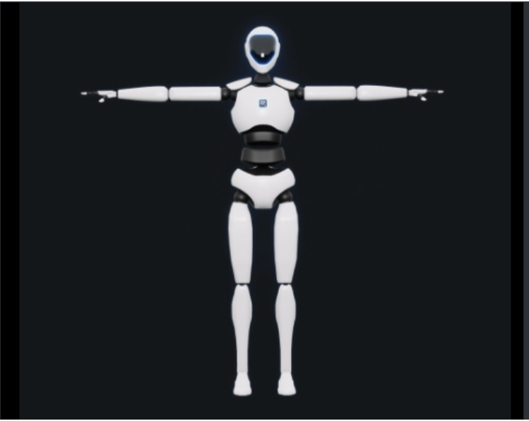

F-pose: 向前自然走出2-3步，转身返回起点A-Pose 站立，直到软件提示“正在计算校准结果”后可自由活动。此动作对于走路姿势没有严格要求，轻松自然走路即可，不要使劲跺脚、跳跃或快速奔跑。

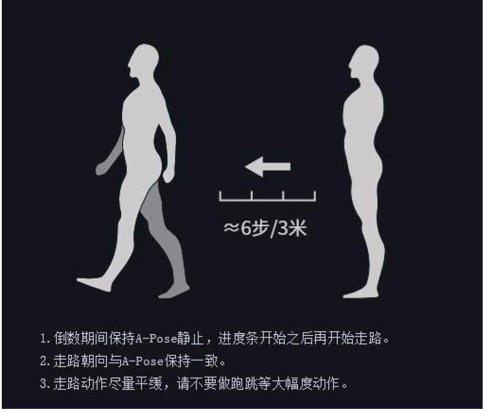

# 数据录制与播放

下图的1\~3分别为：数据录制按钮、数据名称、数据备注信息

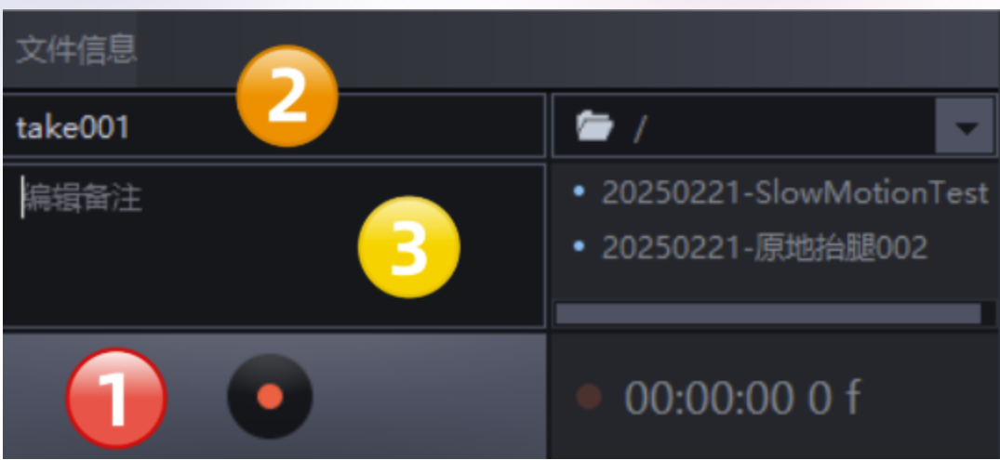

选择了工程里相关的文件后，软件会自动切换到正上方的”编辑“ Tab里，进行数据的3D回放。软件底部有一个数据回放的播放按钮功能条，具体功能如下：

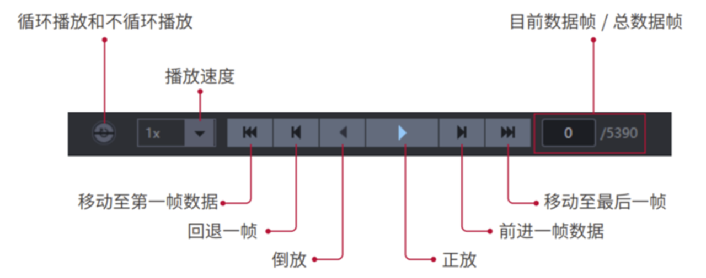

数据导出则是用下面的按钮

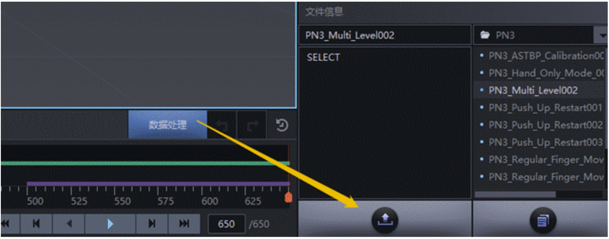

推荐导出的数据格式为 .bvh 文件

# ROS插件

* ROS/ROS2的数据解析node（C++)：
  * [https://github.com/pnmocap/mocap\_ros\_cpp](https://github.com/pnmocap/mocap_ros_cpp)
* ROS/ROS2的数据解析node（Python)：
  * [https://github.com/pnmocap/mocap\_ros\_py](https://github.com/pnmocap/mocap_ros_py)
* ROS/ROS2 URDF映射与渲染node（以Unitree H1构型为样例）：
  * [https://github.com/pnmocap/mocap\_ros\_urdf](https://github.com/pnmocap/mocap_ros_urdf)

看介绍分为三步：

* 从Mocap软件中捕获BVH格式数据（机器人穿戴着动捕设备）；
* 将BVH数据跟机器人的关节模型进行映射。比如上面的mocap\_ros\_py与mocap\_ros\_cpp，实现的ROS节点程序。它从Noitom Mocap软件中检索数据。重定向后，它将数据发送到模拟器以驱动机器人模型。或者，它可以直接发送BVH数据来驱动TF模型（stickman）。
* 将转换后的数据发送到仿真仿真器节点以驱动机器人模型。而mocap\_ros\_urdf则是机器人仿真仿真器监听来自mocap\_ros\_py或mocap\_ros \_cpp的数据，并驱动机器人。

首先，在设置中，切换在线捕捉数据与离线数据采集：

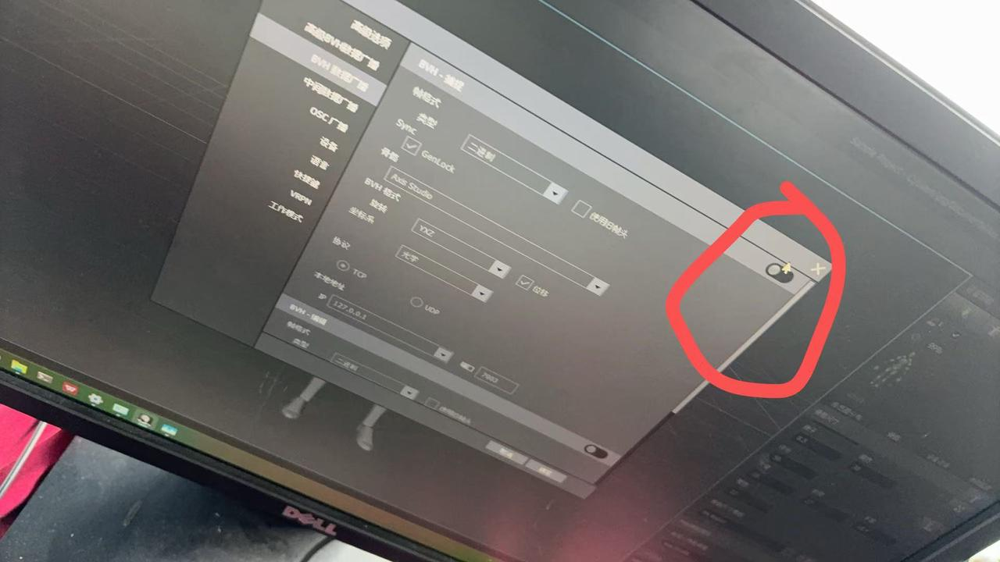

对应要设置ROS节点IP

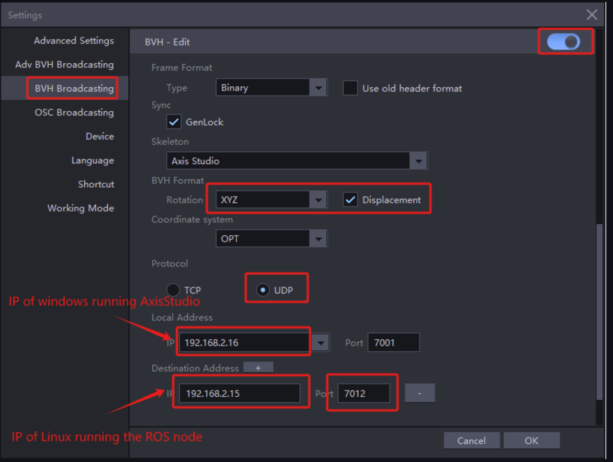

然后需要启动ROS节点

## ROS节点安装（基于CPP）

此处是基于CPP的，py部分请参考：[https://github.com/pnmocap/mocap\_ros\_py](https://github.com/pnmocap/mocap_ros_py)

* 安装nlohmann\_json

```bash
sudo apt-get update
sudo apt-get install nlohmann-json3-dev
```

### ROS1

```bash
# 编译
mkdir -p ~/catkin_noitom/src   
cd ~/catkin_noitom/             
catkin_make                 
cd src                                         
catkin_create_pkg noitom_ros1_cpp
mv  noitom_ros1_cpp  ~/catkin_noitom/src/
 
#复制相应文件到工作空间
cp -r unitree_h1/retarget.json ~/catkin_noitom/src/noitom_ros1_cpp/retarget.json
 
cp -r librobotapi_x86-64.so  ~/catkin_noitom/src/noitom_ros1_cpp/libMocapApi.so
or 
cp -r librobotapi_arm64.so  ~/catkin_noitom/src/noitom_ros1_cpp/libMocapApi.so
```

然后CMake编译一下

```bash
cd  ~/catkin_noitom
catkin_make
source devel/setup.bash
```

开启节点

```bash
cd  ~/catkin_noitom/src/noitom_ros1_cpp/
chmod +x launch.sh 
./launch.sh
```

### ROS2

首先也是copy文件

```bash
cp -r unitree_h1/retarget.json noitom_ros2_cpp/retarget.json
 
cp -r librobotapi_x86-64.so noitom_ros2_cpp/libMocapApi.so
or 
cp -r librobotapi_arm64.so noitom_ros2_cpp/libMocapApi.so
```

然后colcon build

```bash
cd noitom_ros2_cpp
colcon build
source install/setup.bash
```

开启节点

```bash
cd noitom_ros2_cpp
chmod +x launch.sh 
./launch.sh
```

仿真模拟器中的机器人模型将跟随Axis Studio中的模型移动。

# 基于ROS2的Launch Steps

* Windows PC安装前面提到的AXIS Studio及配置；
* Linux PC带ROS1或ROS2环境；


## 启动ros发布者（捕获信息）节点

安装部分请见上面的ros2节点安装。

运行执行文件“./build/noitom\_ros2\_cpp/noitom\_ros2\_cpp”也就是对应的“src/robot\_api\_demo.cpp”，从代码来看应该就是将动捕服的信息通过ros topic的形式发布出去，而对应的属于发布到那个关节其实就是所谓的关节映射。

代码解读请见：[https://github.com/R-C-Group/mocap\_ros\_cpp](https://github.com/R-C-Group/mocap_ros_cpp)

## 启动urdf仿真节点

请见github：[https://github.com/pnmocap/mocap\_ros\_urdf](https://github.com/pnmocap/mocap_ros_urdf)

该项目是一个机器人仿真仿真器（RViz）节点，用于监听数据并驱动模型。目前，它支持Unitree Technology的H1机器人模型，也就是目前开源的之映射了宇树的机器人。

然后创建工作空间，将文件cp过去并且编译

```bash
mkdir -p ~/catkin_noitom
cp -r unitree_h1_ros2  ~/catkin_noitom
 
# 安装节点
cd  ~/catkin_noitom/unitree_h1_ros2
colcon build
source install/setup.bash
 
# 开启节点
ros2 launch unitree_h1_ros2 display.launch.py
```

TF（stickman/火柴人）是根据真实人体骨架映射的模型。它不需要重新定位，可以由BVH数据驱动。运行此模型通常用于验证原始人体数据的正确性。

机器人是基于URDF文件的模型（该项目目前支持Unitree Technology的H1模型）。数据需要经过重映射（retargeting）才能用于驱动。

在节点开启后，先通过下面图示来添加模型（"RobotModel" for the robot model or "TF" for the stickman model）

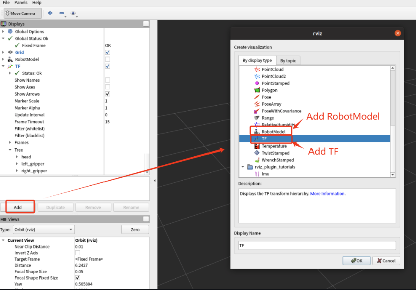

通过切换显示

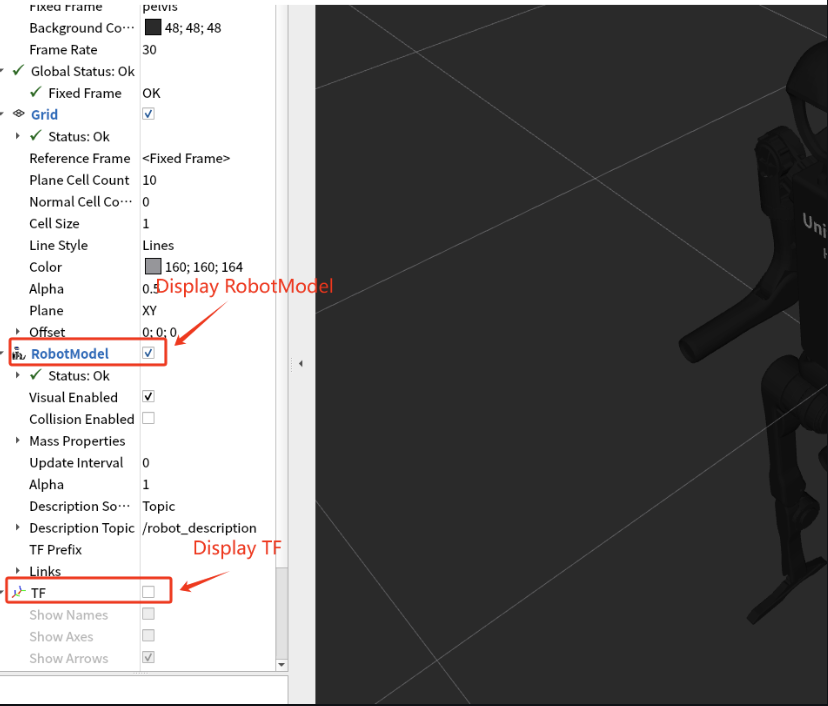

对于unitree\_h1\_ros2中的urdf模型如下（包含了19个关节）：

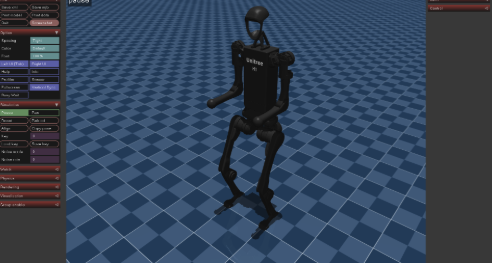

# 其他使用事项

传感器为27个，其中绿色代表能以较高信号强度接收传感器数据。红色与黄色为有无线频段干扰；灰色则是未开机或故障。

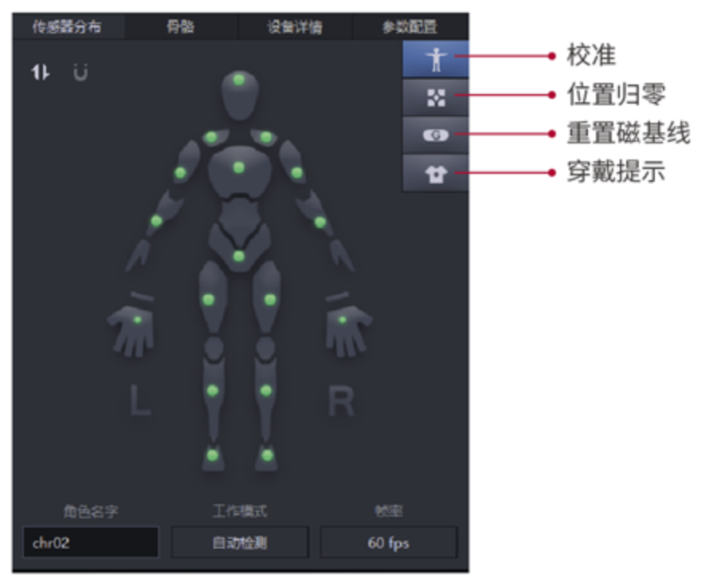
