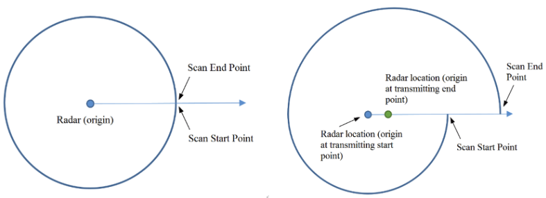
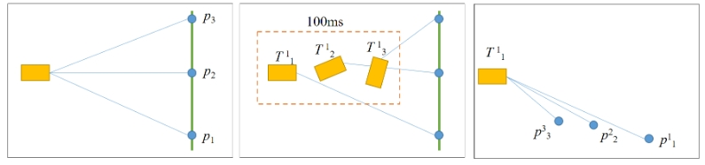
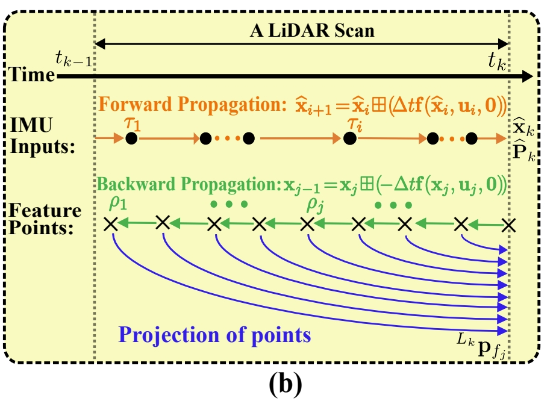
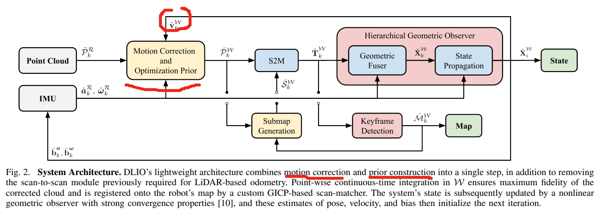

<!-- * 目录
{:toc} -->

<!-- !!!!!!!!!!!!!!!!!!!!!!!!!!!!!!!!!!!!!!!!!!!!!!!!!!!!!!!!!!!!!!!!!!!!!!!!!!!!!!!!!!!!!!!!!!!!!!!!!!!!!!!!!!!!!!!!!!!!!!!!!!! -->

对于大多数激光雷达而言，尽管激光的发射和接收速度很快，但构成点云的每个点并非在同一时刻生成。
例如，我们将100ms内（对应于10HZ频率）累积的数据作为一个点云帧输出。
如果在这100毫秒内，激光雷达本体或安装激光雷达的载具的绝对位置发生变化，则该帧点云中每个点的坐标系都将不同（如下右图所示）。
直观地说，这一帧点云数据将会“畸变/distorted”，无法真实反映所探测到的环境信息。
这就像拍照时，如果手抖，照片就会模糊一样。这就是激光雷达的自运动畸变。

  
<figcaption>  
</figcaption>

雷达运动畸变的本质就是对于一帧点云，其不同的点的坐标系是不一样的。如下左图所示，点P1~P3是LiDAR扫到的三个点，它们在世界坐标系下是共线的。此时，假如雷达剧烈的运动（如下中图所示），最终获得的点将不在共线（如下右图所示）

  
<figcaption>  
</figcaption>

那么一般如何做运动补偿呢？
设 $p^{1}_{i}$ 为雷达第一个点 $p_{i}$的坐标系，$T^{j}_{i}$ 表示从i到j的位置变化。而对于一帧点云而言，每个点到第一个点的坐标变换为：$T^{1}_{2}$，$T^{1}_{3}$，$T^{1}_{4}$ ...因此，每个点都可以转换到第一个点对应的坐标系：

$p^{1}_{i}=T^{1}_{i} \cdot p^{i}_{i}$

实际上，一般都是通过测量LiDAR的运动信息，然后通过线性插值获得 $T^{1}_{i}$ 。
其中，由于IMU可以提供高频运动，因此可以很好的被用作帧间点云的去失真。利用IMU做点云去失真有几种做法：
* 仅仅对角度进行补偿，如LIO-SAM，并且这类工作都是假设在scan获取的过程速度是恒定的。
* 除了IMU以外，还需要基于已有的传感器的pose以及速度进行运动补偿。
  * LOAM基于估算的sensor pose，再采用与IMU松融合，并且假设帧间运动速度是不变的。
  * 比如Fast-LIO则是back-propagation technique（用已校正的IMU来去除运动失真）.
  * 对于这部分的工作，去失真的精度依赖于上一步定位精度（` the undistortion accuracy is tied to the accuracy of the previous scan-matching steps`）。因此会存在`accumulating integration error over time`
* 基于连续时间的运动校正

对LiDAR的运动补偿除了可以进行去失真以外还可以进行动态物体检测，下面介绍一些经典的工作

## Fast-lio: A fast, robust lidar-inertial odometry package by tightly-coupled iterated kalman filter
* [RAL2021 PDF](https://arxiv.org/pdf/2010.08196)

Fast-LIO提出了反向传播的方法来进行点云的运动去失真`a formal back-propagation process to compensate for the motion distortion`
它并不是直接用于点云的去畸变，而是其优化框架中的一个关键组成部分，通过联合优化IMU测量和LiDAR点云来估计传感器在连续时间内的运动状态，从而间接实现点云的去畸变。

  
<figcaption>  
</figcaption>

“反向传播”的思想体现在每次迭代中，系统会计算损失函数（例如点到面距离误差）相对于状态变量（包括位姿、速度、IMU偏差等）的梯度，并沿着负梯度方向更新这些状态变量。这种梯度下降或高斯牛顿法等优化算法的迭代更新过程，类似于神经网络中的反向传播，旨在找到最优的传感器轨迹和去畸变后的点云。每次状态更新都会导致点云在全局坐标系中的位置发生调整，从而有效地去除运动畸变。

## Real-Time Truly-Coupled Lidar-Inertial Motion Correction and Spatiotemporal Dynamic Object Detection

* [IROS2024 PDF](https://arxiv.org/pdf/2410.05152)
* [website](https://uts-ri.github.io/lidar_inertial_motion_correction/)
* [Github](https://github.com/UTS-RI/2fast2lamaa)

本文的重点是`map-free dynamic object detection based on lidar`,通过连续IMU的预积分（continuous preintegrated measurements ）来实现lidar的去失真。
而去失真包含了点-线与点-面残差的最小距离计算，这个几何信息结合时间可以进一步计算每个点法向量，进而推导出每个点的速度，而根据点的速度可以用作动态物体识别。

此外，大多数的点云运动去失真都是作为预处理来做的，是依赖于上一步scan-matching的精度，并不是真正意义上的tightly-couple，而本文则是真正做到紧融合。

## Direct LiDAR-Inertial Odometry: Lightweight LIO with Continuous-Time Motion Correction
* [ICRA2023 PDF](https://arxiv.org/pdf/2203.03749)
DLIO这篇工作则是通过恢复continuous-time trajectories

  
<figcaption>  
</figcaption>

首先通过IMU测量的数值积分计算一组离散的姿态，随后通过分析的连续时间方程建立测量样本之间的平滑轨迹，以查询每个唯一的每点去偏变换。

# 参考资料
* Catkin package that provides lidar motion undistortion based on an external 6DoF pose estimation input, from [ETHZ ASL](https://github.com/ethz-asl/lidar_undistortion)
* [livox_cloud_undistortion](https://github.com/Livox-SDK/livox_cloud_undistortion)
* 利用IMU数据对2D激光雷达数据进行运动畸变校正（仅限于旋转校正）:[2d_lidar_undistortion](https://github.com/elewu/2d_lidar_undistortion)
* [Livox Open Source Sharing: About LiDAR Distortion Removal](https://www.livoxtech.com/showcase/211220)