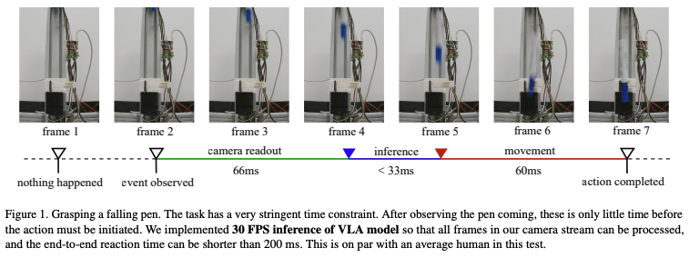
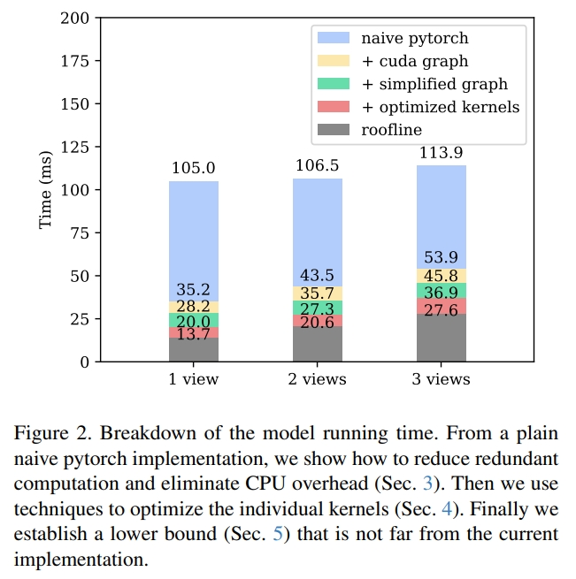
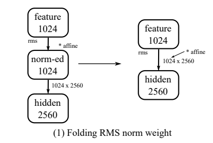
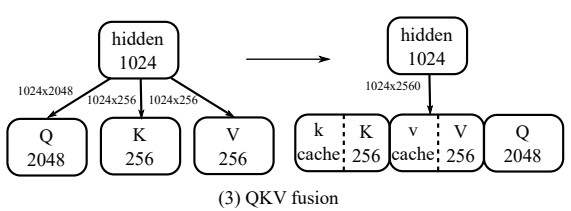
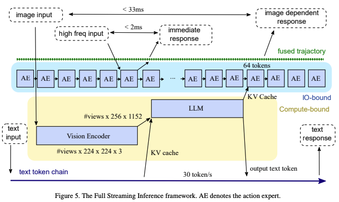

<!-- * 目录
{:toc} -->

当前基于learning的机器人控制算法中，十亿参数级别的视觉-语言-动作（VLA）模型虽具备出色的泛化能力，但推理延迟过高成为瓶颈——传统VLA模型，无法满足动态任务（如抓取运动物体）的实时性需求。

此前，博客也曾对高效VLA做过调研，包括[Efficient-VLA](https://kwanwaipang.github.io/Efficient-VLA/)对一篇高效VLA的survey paper进行阅读，而[NanoVLA](https://kwanwaipang.github.io/Awesome-VLA/#nanovla)也对基于orin上的高效VLA做分析。

本博文对Dexmal发布的实时VLA模型进行解读，该工作在消费级显卡（RTX4090）上完成pi0模型：30HZ推理与480HZ动作生成。并且在抓落笔任务（grasping a falling pen task）成功率达到100%

  
<figcaption>  
</figcaption>

~~~
PS: 捉取落笔任务确实比较难，甚至连人类都难以做到😂
~~~

<!-- !!!!!!!!!!!!!!!!!!!!!!!!!!!!!!!!!!!!!!!!!!!!!!!!!!!!!!!!!!!!!!!!!!!!!!!!!!!!!!!!!!!!!!!!!!!!!!!!!!!!!!!!!!!!!!!!!!!!!!!!!!! -->
# 引言

实时运行的关键阈值是33ms以内的推理时间：这一指标能确保处理30 FPS的RGB视频流时不丢帧；若超过34ms，连续运行中必然出现帧丢失，若关键事件恰好发生在丢失帧，延迟会额外增加一帧时间（约33ms）。

来自Dexmal和StepFun的研究团队提出了实时运行的VLA方案，在单块消费级RTX 4090 GPU上，实现π₀级多视图VLA模型的实时推理——30Hz帧率（图像处理）与最高480Hz轨迹频率（动作生成），并通过真实世界实验验证其有效性（如抓取下落的笔）。

为了实现实时推理，本文的核心优化策略为：从消除开销到内核深度调优。
主要包含四步：

  
<figcaption>  
</figcaption>

## 1. 消除基础开销：

初始基于PyTorch的朴素实现（naive torch）推理时间超100ms，首要优化是消除CPU与计算图的冗余开销。如上图2（2 views）所示，CUDA Graph将推理时间直接减半，naive pytorch的106.5ms降低到43.5ms。
   
* 【CUDA Graph】采用CUDA Graph来去除CPU内核启动开销：VLA模型（如π₀）单次推理需启动上千个CUDA内核，而Python代码驱动内核时会产生显著开销。通过CUDA Graph机制，先记录一次推理过程中的所有内核流，后续推理直接重放该流——此时内核由GPU和驱动直接启动，完全消除Python执行开销。

* 【简化计算图】通过等价变换重构计算图，去除冗余计算。如上图2（2 views）所示，将推理时间从53.9ms降低到45.8ms。包含三类变换：
  * RMS归一化权重折叠：RMS归一化的 affine 参数与后续线性层均为线性操作，利用结合律修改线性层权重，将两步合并为一步；
  * 动作-时间嵌入层折叠：动作值分支的两个连续线性层（无非线性）合并为一个内核；时间分支因推理时仅10个时间步，预计算线性层结果并融合至SiLU前的偏置向量，减少算子与MAC；
  * QKV投影融合：将注意力机制中Q、K、V的三个独立矩阵，合并为一个大矩阵，计算后通过张量切片拆分结果，减少内核启动次数并提升并行度；同时将RoPE操作融合进矩阵乘法，预计算RoPE权重。

  <table style="border: none; background-color: transparent;">
    <tr align="center">
      <td style="width: 30%; border: none; padding: 0; background-color: transparent; vertical-align: middle;">
        
        Absorbing RMS affine parameters to the next linear layer
      </td>
      <td style="width: 30%; border: none; padding: 0; background-color: transparent; vertical-align: middle;">
        
        Folding linear layers in action-time embedding
      </td>
      <td style="width: 30%; border: none; padding: 0; background-color: transparent; vertical-align: middle;">
        
        Fusing QKV as one weight matrix.
      </td>
    </tr>
  </table>
  <figcaption>
  </figcaption>

* 其他系统级开销优化
  * 图像缩放：选择与模型输入（224×224）接近的相机输出分辨率（如240×320），避免过度缩放；手动实现缩放代码（JAX默认实现非最优），将缩放时间压至60μs以下（x86 CPU），且不计入推理时间；
  * 内存与数据传输：使用固定内存（pinned memory）优化CPU-GPU数据传输；静态化CPU缓冲区减少抖动；采用零拷贝（zero-copy）处理相机帧，降低延迟。

## 2. 内核深度优化
在第一步的消除基础开销后，针对模型中24个GEMM类操作及关联标量算子，进行底层优化。

* GEMM Tile参数调优：默认PyTorch的matmul依赖cuBLAS，但部分尺寸的GEMM未获得最优配置。通过Triton框架手动调整tile大小，匹配RTX 4090的硬件特性（128个SM）。
  * 27次512×1152×3456的GEMM操作：cuBLAS耗时0.984ms，Triton（64,64,32 tile）优化至0.870ms；
  * 整体通过Triton调优，累计减少1.5ms推理时间。

* 门控线性层融合：模型Transformer的FFN采用门控上投影结构。优化思路是：
  * 并行执行两个FC层的计算，加载一次输入tile后，同步加载两个权重tile；
  * 计算完成后仅写入合并结果，减少全局内存的读写操作，进一步降低延迟。这一步优化额外减少1.7ms。

* Partial Split-k优化：针对特殊尺寸GEMM（512×1152×1152）：若使用64×64 tile，会生成144个块（非RTX 4090的128个SM的整数倍），导致负载不均。优化方案是：
  * 将GEMM拆分为两部分：512×1152×1024（64×64 tile，适配128 SM）与512×1152×128（32×32 tile + K维度split-2）；
  * 两部分在单个内核中执行（无依赖），虽仅减少0.1ms，但为非对称GEMM优化提供了思路。

* 标量操作融合：将偏置（bias）、残差连接（residual）、激活函数（如GELU、SiLU）等标量操作，直接融合进GEMM内核：
  * 对RMS归一化：先计算token级统计量存入独立缓冲区，在GEMM完成后统一应用归一化因子，避免中间内存读写；
  * 这一步优化减少内存占用，累计降低约4ms推理时间（Figure 2中“roofline + optimized kernels”阶段）。

## 3. 计算性能下界

为判断当前实现是否接近理论最优，通过“roofline模型”与“同步开销”计算性能下界：

* Roofline模型计算理论最低时间：Roofline模型通过内存带宽（RTX 4090为1.01 TB/s）和计算能力（BF16精度91.4 TMAC/s），取“内存操作时间”与“计算操作时间”的最大值作为单算子下界。
  * 对2视图输入，所有算子的Roofline时间总和为19.7ms（Table 2中“sum roofline”值）。

* 同步开销估算：模型包含1378个matmul算子，内核间同步会产生额外开销。通过对比实验（Table 3）
  * 朴素PyTorch同步开销12.92ms；
  * CUDA Graph同步开销1.72ms；
  * 软件屏障（software barrier）同步开销0.86ms（需匹配网格大小，但代码复杂度高）。

* 最终下界与实际性能差距：叠加Roofline时间与同步开销（取0.86ms），2视图的理论下界为20.6ms，而论文实现的推理时间为27.3ms，差距仅30%，说明优化已接近硬件理论极限。

## 4. 全流推理框架（Full Streaming Inference）
为满足更高频率的机器人控制需求，研究提出全流推理框架（Full Streaming Inference） ，核心是通过“内核重叠执行”与“AE角色重构”，实现多频率反馈环(如下图所示)。

  
<figcaption>  
</figcaption>

* VLM与AE的并发执行：VLM（视觉-语言模型）是计算密集型模块，AE（动作专家）是IO密集型模块，二者并发执行可最大化GPU资源利用率。
  * 实验数据（Table）：顺序执行VLM + 10个AE需27.3ms，并发执行仅需26.3ms；
  * 扩展潜力：1秒内可并行运行30个VLM（30Hz）与480个AE（480Hz），实现480Hz的轨迹生成频率；
* AE角色重构：从“批量输出”到“逐步生成”。传统AE需完成10步去噪流程才输出完整动作序列，无法满足高频控制。优化后：
  * 借鉴实时分块（RTC）算法思路，将AE改为“逐步生成”模式：每一步生成部分动作，类似自回归解码；
  * 高频传感器（力传感器2KHz+、电机电流1KHz+）数据通过独立CUDA流实时更新GPU内存，AE读取最新数据后立即调整动作，无需等待完整去噪流程；
  * 输出端维护480Hz轨迹缓冲区，AE仅更新“未提交”的动作节点，“已提交”节点异步发送至执行器，确保低延迟。
* 三层反馈环设计：框架实现三个频率梯度的反馈环，覆盖不同控制需求
  * 480Hz力环：AE处理高频传感器信号，响应时间低至2ms，用于紧急停止、力控制等快速反应场景；
  * 30Hz视觉环：VLM每33ms处理一帧图像，生成KV缓存供AE使用，实现图像驱动的动作调整；
  * <1Hz文本环：VLM加载权重时“顺带”执行LLM文本推理（30 token/s，远超人类说话速度3.3 token/s），用于任务规划、人机交互等低速智能场景。

# 参考资料
* [Dexmal原力灵机发布实时VLA模型！消费级显卡上完成pi0模型30Hz以上推理](https://mp.weixin.qq.com/s/TNLmuukbsL2PiNtWoWLj_A)

