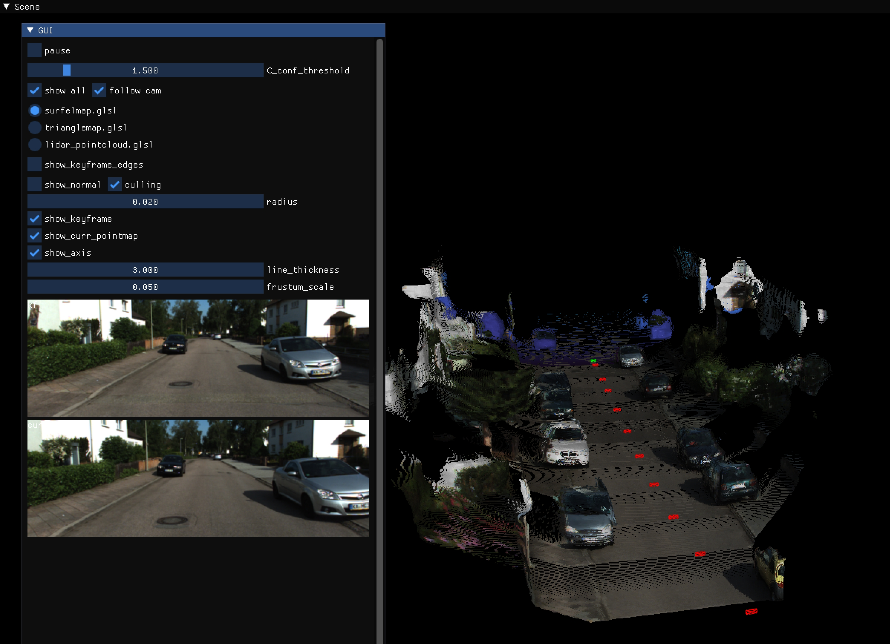
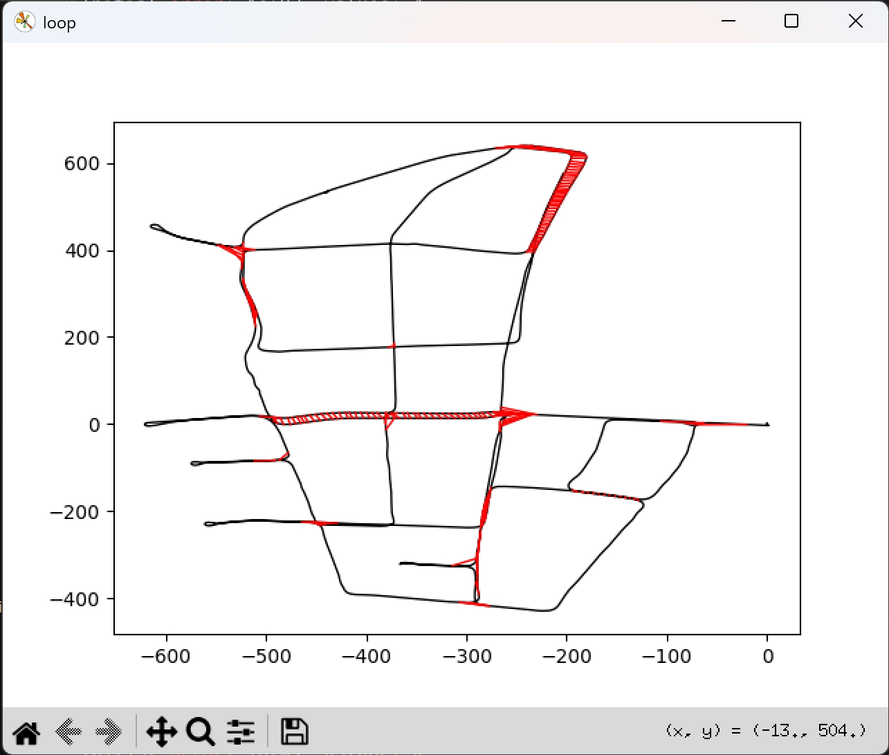
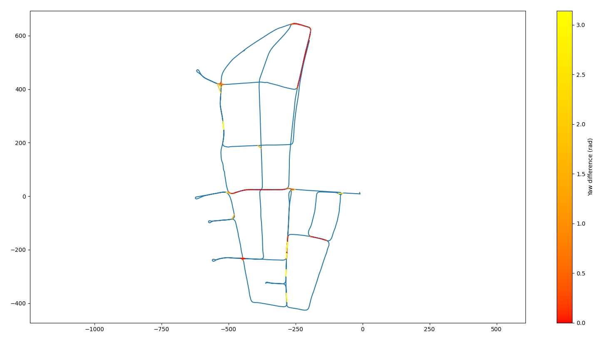
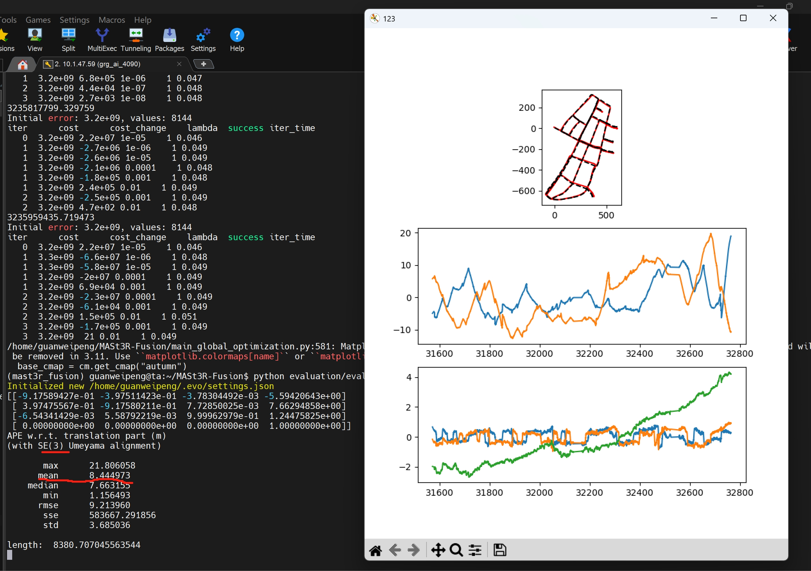

<!-- * 目录
{:toc} -->


<!-- !!!!!!!!!!!!!!!!!!!!!!!!!!!!!!!!!!!!!!!!!!!!!!!!!!!!!!!!!!!!!!!!!!!!!!!!!!!!!!!!!!!!!!!!!!!!!!!!!!!!!!!!!!!!!!!!!!!!!!!!!!! -->
# 引言


* 本博文复现过程采用的代码及代码注释（如有）：[My github repository](https://github.com/R-C-Group/MASt3R-Fusion-comment)


## 理论解读


## 实验配置

* 环境配置

```bash
# rm -rf .git
git clone https://github.com/R-C-Group/MASt3R-Fusion-comment.git --recursive

conda create -n mast3r_fusion python=3.11.9
conda activate mast3r_fusion
# conda remove --name mast3r_fusion --all
pip install torch==2.5.1 torchvision==0.20.1 torchaudio==2.5.1 --index-url https://download.pytorch.org/whl/cu124
pip install opencv-python==4.10.0.84 opencv-contrib-python==4.10.0.84
pip install h5py pyparsing
```

* 安装GTSAM，这是作者修改版本的，包含了边缘化以及Sim(3)视觉约束

```bash
conda activate mast3r_fusion

# git clone https://github.com/yuxuanzhou97/gtsam.git
git clone git@github.com:yuxuanzhou97/gtsam.git
cd gtsam
# cd .. && rm -rf build/
mkdir build && cd build
cmake .. -DGTSAM_BUILD_PYTHON=1 -DGTSAM_PYTHON_VERSION=3.11.9 -DPYTHON_EXECUTABLE=`which python` -Dpybind11_INCLUDE_DIR=$PYBIND11_INCLUDE_DIR
make python-install -j12
```

* 可能会出现调用`/usr/include/pybind11/`等问题，需要安装最新版的pybind11，并精准CMake配置

```bash
pip install --upgrade pybind11

cd gtsam
rm -rf build

# 获取详细的 pybind11 信息
PYBIND11_INCLUDE_DIR=$(python -c "import pybind11; print(pybind11.get_include())")
PYBIND11_CMAKE_DIR=$(python -c "import pybind11; import os; print(os.path.join(pybind11.__path__[0], 'share', 'cmake', 'pybind11'))")

echo "Pybind11 include: $PYBIND11_INCLUDE_DIR"
echo "Pybind11 cmake: $PYBIND11_CMAKE_DIR"

mkdir build && cd build
cmake .. \
  -DGTSAM_BUILD_PYTHON=1 \
  -DGTSAM_PYTHON_VERSION=3.11.9 \
  -DPYTHON_EXECUTABLE=$(which python) \
  -Dpybind11_DIR=$PYBIND11_CMAKE_DIR \
  -DCMAKE_PREFIX_PATH=$CONDA_PREFIX \
  -DCMAKE_INCLUDE_PATH=$PYBIND11_INCLUDE_DIR

make python-install -j12
```

<div align="center">
  
<figcaption>  
</figcaption>
</div>


* 工程安装：

```bash
cd MASt3R-Fusion/
# pip install -e thirdparty/mast3r
pip install --no-build-isolation -e thirdparty/mast3r

pip install -e thirdparty/in3d
pip install --no-build-isolation -e .
```

* 对于`pip install --no-build-isolation -e .`涉及到lietorch的安装可能出现超时的问题，做出改进如下：

~~~
"lietorch @ git+https://github.com/princeton-vl/lietorch.git",
或者替换为：
"lietorch @ git+ssh://git@github.com/princeton-vl/lietorch.git",
~~~

* 下载权重文件

```bash
mkdir -p checkpoints/
wget https://download.europe.naverlabs.com/ComputerVision/MASt3R/MASt3R_ViTLarge_BaseDecoder_512_catmlpdpt_metric.pth -P checkpoints/
wget https://download.europe.naverlabs.com/ComputerVision/MASt3R/MASt3R_ViTLarge_BaseDecoder_512_catmlpdpt_metric_retrieval_trainingfree.pth -P checkpoints/
wget https://download.europe.naverlabs.com/ComputerVision/MASt3R/MASt3R_ViTLarge_BaseDecoder_512_catmlpdpt_metric_retrieval_codebook.pkl -P checkpoints/
```

* 下载KITTI-360数据集：
  * 首先，需要下载KITTI的`Perspective Images for Train & Val (128G)`。运行`bash download_2d_perspective_unrectified.sh`来下载；
  * 其次，还需下载预备的IMU及GT数据：[Google Drive](https://drive.google.com/file/d/1BO8zGvoey7IdwbWXmAdlhGPr6hiCFJ6Y/view?usp=drive_link)

* 对于KITTI数据集下载，可能链接不上，采用如下方式：

```bash
# 为kitti数据所存放的亚马逊网站指定IP地址
echo '52.219.169.53    s3.eu-central-1.amazonaws.com' | sudo tee -a /etc/hosts
```

* 若出现报错`start of libtorchcodec loading traceback,系统找不到 libavutil.so.59、libavutil.so.58、libavutil.so.57 等文件。`

```bash
sudo apt install ffmpeg libavcodec-extra

#检查安装的结果
ffmpeg -version
ldconfig -p | grep libavutil

#注意支持的FFmpeg版本，建议安装6.0
#conda install ffmpeg=6.0 -c conda-forge
```


运行下面测试：

```bash
conda activate mast3r_fusion

bash batch_kitti360_vi.sh # for real-time SLAM

#此外也可以选择下面的全指令方式 
python main.py \
        --dataset "${base_dataset_path}/2013_05_28_drive_0000_sync/image_00/data_rgb" \
        --config "config/base_kitti360.yaml" \
        --calib "config/intrinsics_kitti360.yaml" \
        --imu_path "${base_dataset_path}/2013_05_28_drive_0000_sync/imu.txt" \
        --imu_dt -0.04 \ # constant V-I time offset for KITTI-360  
        --stamp_path "${base_dataset_path}/2013_05_28_drive_0000_sync/camstamp.txt" \
        --result_path "result.txt" \
        --save_h5 \
        --no-viz # for realtime visualization, comment this line 

# real-time SLAM没有回环
python main.py \
        --dataset "${base_dataset_path}/2013_05_28_drive_0000_sync/image_00/data_rgb" \
        --config "config/base_kitti360.yaml" \
        --calib "config/intrinsics_kitti360.yaml" \
        --imu_path "${base_dataset_path}/2013_05_28_drive_0000_sync/imu.txt" \
        --imu_dt -0.04 \ # constant V-I time offset for KITTI-360  
        --stamp_path "${base_dataset_path}/2013_05_28_drive_0000_sync/camstamp.txt" \
        --result_path "result.txt" \
        --save_h5 \
        --no-viz # for realtime visualization, comment this line 
```

实验效果如下所示：

<div align="center">
  
<figcaption>  
</figcaption>
</div>

* 接下来开启带回环的：

```bash
bash batch_kitti360_loop.sh # for global optimization
```

下面是带回环的轨迹：

<div align="center">
  
  
<figcaption>  
</figcaption>
</div>

接下来验证估算的轨迹效果：

```bash
python evaluation/evaluate_kitti360.py
```

<div align="center">
  
<figcaption>  
</figcaption>
</div>

可视化三维重建的效果：

```bash
python evaluation/check_h5.py --config config/base_kitti360.yaml \
         --h5 data_0000.h5 \
         --calib config/intrinsics_kitti360.yaml # using real-time poses
         
python evaluation/check_h5.py --config config/base_kitti360.yaml \
         --h5 data_0000.h5 \
         --calib config/intrinsics_kitti360.yaml \
         --pose_file result_post_0000.txt  # using globally optimized poses
         
CUDA_VISIBLE_DEVICES=0,1 python evaluation/check_h5.py --config config/base_kitti360.yaml   --h5 data_0000.h5 --calib config/intrinsics_kitti360.yaml   --pose_file result_post_0000.txt 
# 注意源码中需要在“keyframes = SharedKeyframes(manager, h, w,buffer=1024) ”前添加 h = 176 以及   w = 512
```