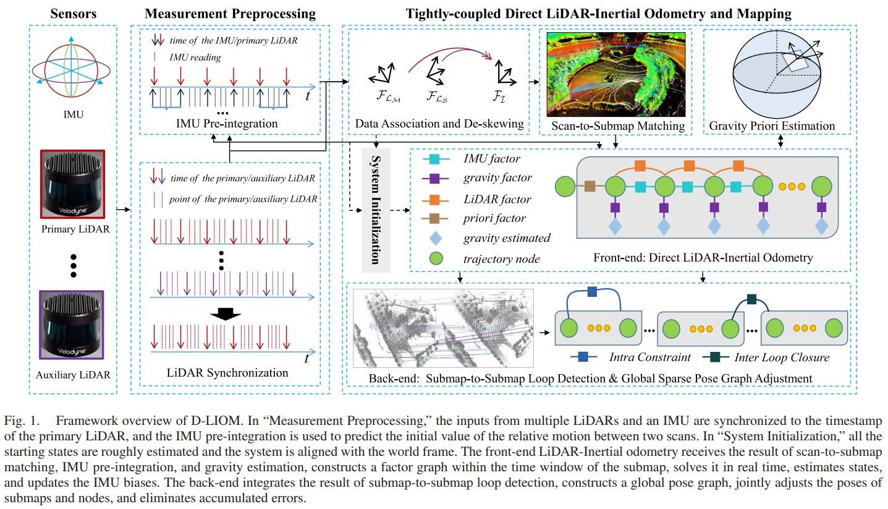
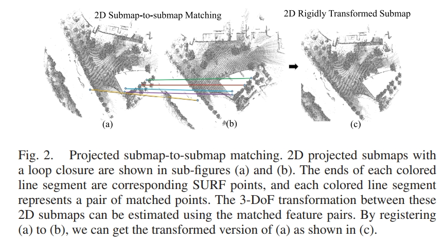
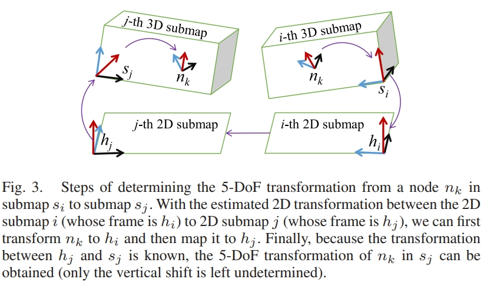

<!-- * 目录
{:toc} -->

D-LIOM是22年的Transactions on Multimedia,采用的是cartographer+IMU预积分紧耦合的形式。

* [PDF](https://www.fst.um.edu.mo/personal/wp-content/uploads/2023/09/DLIOM.pdf)
* [github](https://github.com/peterWon/D-LIOM)


# 原理解读
D-LIOM的主要特点如下：
* 直接法，雷达原始的扫描点与probability submap进行register
* lidar odometry、IMU预积分、重力约束整合一起构建局部因子图（submap’s time window），同时矫正IMU的biases，online gravity估计（限制roll与pitch的漂移，也可以较好的实现将3D submap投影到2D平面实现回环）；
* 通过2D submaps（用的cartographer的回环检测）的相互匹配实现回环检测
* 支持多个雷达输入、雷达与6轴IMU的初始。
* 对于点云去失真，用的是上一时刻优化后的状态以及biases，然后通过IMU预积分进行去畸变。


<div align="center">
  
<figcaption>  
</figcaption>
</div>

* 对于lidar odometry采用的是occupied voxel map；
* 回环检测采用的提取3D submap投影的2D image，对2D image进行特征点匹配

<div align="center">
  
<figcaption>  
</figcaption>
</div>


<div align="center">
  
<figcaption>  
</figcaption>
</div>

# 代码阅读

## 类概述

这是 Cartographer 3D SLAM 的核心组件，特点：
* 3D 环境建图：处理三维点云数据
* IMU 融合：紧耦合 IMU-激光雷达
* 多分辨率优化：使用高分辨率和低分辨率栅格
* 在线重力估计：动态估计重力方向


## 构造函数详细分析

```cpp
LocalTrajectoryBuilder3D::LocalTrajectoryBuilder3D(
    const mapping::proto::LocalTrajectoryBuilderOptions3D& options,
    const std::vector<std::string>& expected_range_sensor_ids)
    : options_(options),
      active_submaps_(options.submaps_options()),  // 3D 子图管理器
      motion_filter_(options.motion_filter_options()),  // 运动滤波器
      real_time_correlative_scan_matcher_(
          common::make_unique<scan_matching::RealTimeCorrelativeScanMatcher3D>(
              options_.real_time_correlative_scan_matcher_options())),  // 3D 实时扫描匹配器
      ceres_scan_matcher_(
          common::make_unique<scan_matching::CeresScanMatcher3D>(
              options_.ceres_scan_matcher_options())),  // 3D Ceres 扫描匹配器
      accumulated_range_data_{Eigen::Vector3f::Zero(), {}, {}},  // 累积点云数据
      range_data_synchronizer_(expected_range_sensor_ids)  // 数据同步器
{
    // 从配置中读取参数
    scan_period_ = options_.scan_period();  // 扫描周期
    eable_mannually_discrew_ = options_.eable_mannually_discrew();  // 是否手动去螺钉
    frames_for_static_initialization_ = options_.frames_for_static_initialization();  // 静态初始化帧数
    frames_for_dynamic_initialization_ = options_.frames_for_dynamic_initialization();  // 动态初始化帧数
    g_est_win_size_ = options_.frames_for_online_gravity_estimate();  // 在线重力估计窗口大小
    
    // IMU 参数（从配置文件中读取，比 2D 版本更灵活）
    const float imuAccNoise = options_.imu_options().acc_noise();
    const float imuGyrNoise = options_.imu_options().gyr_noise();
    const float imuAccBiasN = options_.imu_options().acc_bias_noise();
    const float imuGyrBiasN = options_.imu_options().gyr_bias_noise();
    const float imuGravity  = options_.imu_options().gravity();
    const float prior_pose_n = options_.imu_options().prior_pose_noise();
    const float prior_gravity_noise = options_.imu_options().prior_gravity_noise();
    const float ceres_pose_n_t = options_.imu_options().ceres_pose_noise_t();
    const float ceres_pose_n_r = options_.imu_options().ceres_pose_noise_r();
    const float ceres_pose_n_t_1 = options_.imu_options().ceres_pose_noise_t_drift();
    const float ceres_pose_n_r_1 = options_.imu_options().ceres_pose_noise_r_drift();
    
    // GTSAM 预积分参数设置（与 2D 版本类似但为 3D）
    preint_param_ = gtsam::PreintegrationParams::MakeSharedU(imuGravity);
    preint_param_->accelerometerCovariance = gtsam::Matrix33::Identity(3,3) * pow(imuAccNoise, 2);
    preint_param_->gyroscopeCovariance = gtsam::Matrix33::Identity(3,3) * pow(imuGyrNoise, 2);
    preint_param_->integrationCovariance = gtsam::Matrix33::Identity(3,3) * pow(1e-4, 2);
    
    // 噪声模型初始化
    prior_pose_noise_ = gtsam::noiseModel::Diagonal::Sigmas(
        (gtsam::Vector(6) << prior_pose_n, prior_pose_n, prior_pose_n,
         prior_pose_n, prior_pose_n, prior_pose_n).finished());
    prior_vel_noise_ = gtsam::noiseModel::Isotropic::Sigma(3, 1e4);
    prior_bias_noise_ = gtsam::noiseModel::Isotropic::Sigma(6, 1e-2);
    prior_gravity_noise_ = gtsam::noiseModel::Diagonal::Sigmas(
        (gtsam::Vector(2) << prior_gravity_noise, prior_gravity_noise).finished());
    
    // 修正噪声模型（两种级别）
    correction_noise_ = gtsam::noiseModel::Diagonal::Sigmas(
        (gtsam::Vector(6) << ceres_pose_n_t, ceres_pose_n_t, ceres_pose_n_t,
         ceres_pose_n_r, ceres_pose_n_r, ceres_pose_n_r).finished());
    correction_noise_2_ = gtsam::noiseModel::Diagonal::Sigmas(
        (gtsam::Vector(6) << ceres_pose_n_t_1, ceres_pose_n_t_1, ceres_pose_n_t_1,
         ceres_pose_n_r_1, ceres_pose_n_r_1, ceres_pose_n_r_1).finished());
    
    // 偏置噪声模型
    noise_model_between_bias_ = (gtsam::Vector(6) << 
        imuAccBiasN, imuAccBiasN, imuAccBiasN,
        imuGyrBiasN, imuGyrBiasN, imuGyrBiasN).finished();
    
    // VINS 风格积分器初始化（用于动态初始化）
    imu_noise_.ACC_N = imuAccNoise;
    imu_noise_.ACC_W = imuAccBiasN;
    imu_noise_.GYR_N = imuGyrNoise;
    imu_noise_.GYR_W = imuGyrBiasN;
    init_integrator_.reset(new IntegrationBase(INIT_BA, INIT_BW, imu_noise_));
    
    // 初始化环形缓冲区（用于动态初始化）
    InitCircularBuffers();
}
```

## 核心功能详细分析

1. 点云处理流程 (AddRangeData)

```cpp
std::unique_ptr<TightTrajectoryBuilder2D::MatchingResult>
TightTrajectoryBuilder2D::AddRangeData(const std::string &sensor_id,
                                             const sensor::TimedPointCloudData &unsynchronized_data) {
    // Step 1: 多传感器时间同步
    // 将不同传感器的数据对齐到同一时间戳
    auto synchronized_data =
            m_range_data_collator_.AddRangeData(sensor_id, unsynchronized_data);
    
    // 如果同步后数据为空，直接返回
    if (synchronized_data.ranges.empty()) {
        return nullptr;
    }

    // 保存当前点云的时间戳
    const common::Time& time = synchronized_data.time;
    time_point_cloud_ = time;  // 保存用于后续优化

    // 检查IMU是否完成初始化
    if (!imu_initialized_)
    {
        // 如果静态初始化需要的帧数已够，开始初始化
        if (accumulated_frame_num++ > frames_for_static_initialization_)
        {
            InitializeStatic();  // 调用静态初始化
        }
        return nullptr;  // 初始化期间不处理点云
    }

    // 检查点云数据的有效性
    CHECK(!synchronized_data.ranges.empty());  // 确保非空
    CHECK_LE(synchronized_data.ranges.back().point_time.time, 0.f);  // 最后一点时间应<=0（相对时间）
    
    // 计算第一个点的时间
    const common::Time time_first_point =
            time +
            common::FromSeconds(synchronized_data.ranges.front().point_time.time);

    // 如果是本批次的第一帧，记录开始时间
    if (mi_num_accumulated_ == 0)
    {
        accumulation_started_ = std::chrono::steady_clock::now();
    }

    // Step 2: 点云体素滤波，减少数据量
    std::vector<sensor::TimedPointCloudOriginData::RangeMeasurement> hits =
            sensor::VoxelFilter(synchronized_data.ranges, m_options_.voxel_filter_size());

    // Step 3: 准备用于运动畸变去除的位姿
    std::vector<transform::Rigid3f> range_data_poses;
    range_data_poses.reserve(hits.size());  // 预分配空间
    transform::Rigid3d tmp_pose;  // 临时位姿变量

    // 获取当前预测状态和上一状态，计算相对变换
    transform::Rigid3d cur_state_pre, rel_trans;
    if (predicted_states_.empty()) return nullptr;  // 无预测状态，返回

    // 从GTSAM状态中提取位姿
    cur_state_pre = PoseFromGtsamNavState(predicted_states_.back().second);
    rel_trans = PoseFromGtsamNavState(prev_state_).inverse() * cur_state_pre;

    SLAM_INFO("cur_state_pre : [%f, %f], rel_trans : [%f, %f]",
              cur_state_pre.translation().x(), cur_state_pre.translation().y(),
              rel_trans.translation().x(), rel_trans.translation().y());

    // Step 4: 为每个激光点计算对应的位姿
    if (std::abs(hits.front().point_time.time) < 1e-3)
    {
        // 如果第一个点的时间接近0，认为所有点是同一时刻采集的
        SLAM_INFO("hit point time : [%f]", hits.front().point_time.time);
        range_data_poses = std::vector<transform::Rigid3f>(
                hits.size(), cur_state_pre.cast<float>());  // 所有点用同一位姿
    }
    else
    {
        // 需要为每个点插值位姿
        const double sample_period = scan_period_;  // 0.1秒
        for (const auto& hit : hits)
        {
            // 计算每个点的绝对时间
            common::Time time_point = time + common::FromSeconds(hit.point_time.time);
            
            // 计算插值比例 s = (周期 + 点时间) / 周期
            // 假设点云在扫描周期内均匀采集
            double s = (sample_period + hit.point_time.time) / sample_period;

            // 插值得到该点时刻的位姿
            InterpolatePose(s, rel_trans, tmp_pose);

            // 转换到世界坐标系
            auto pose = (PoseFromGtsamNavState(prev_state_) * tmp_pose).cast<float>();

            SLAM_INFO("pose : [%f, %f], s : [%f]",
                      pose.translation().x(), pose.translation().y(), s);

            range_data_poses.push_back(pose);
        }
    }

    // Step 5: 清理过时的状态缓存
    TrimStatesCache(time);

    // Step 6: 累积点云处理
    if (mi_num_accumulated_ == 0) {
        m_accumulated_range_data_ = sensor::RangeData{{}, {}, {}};  // 重置累积点云
    }

    // 遍历所有点，去除运动畸变
    for (size_t i = 0; i < hits.size(); ++i)
    {
        const sensor::TimedRangefinderPoint& hit = hits[i].point_time;
        
        // 将激光原点转换到local坐标系
        const Eigen::Vector3f origin_in_local =
                range_data_poses[i] *
                synchronized_data.origins.at(synchronized_data.ranges[i].origin_index);
        
        // 将激光点转换到local坐标系
        sensor::RangefinderPoint hit_in_local =
                range_data_poses[i] * sensor::ToRangefinderPoint(hit);
        
        // 计算激光射线向量
        const Eigen::Vector3f delta = hit_in_local.position - origin_in_local;
        const float range = delta.norm();  // 距离

        // 根据距离分类处理
        if (range >= m_options_.min_range())  // 超过最小距离
        {
            if (range <= m_options_.max_range())  // 在最大距离内
            {
                m_accumulated_range_data_.returns.push_back(hit_in_local);  // 有效点
            }
            else  // 超过最大距离
            {
                // 将点截断到最大距离（或missing_data_ray_length）
                hit_in_local.position =
                        origin_in_local + m_options_.missing_data_ray_length() / range * delta;

                m_accumulated_range_data_.misses.push_back(hit_in_local);  // 无效点
            }
        }
    }

    // Step 7: 累积帧数加1
    ++mi_num_accumulated_;

    // Step 8: 如果累积了足够的帧数，进行扫描匹配
    // m_options_.num_accumulated_range_data() 是可配置的参数
    if (mi_num_accumulated_ >= m_options_.num_accumulated_range_data()) {
        mi_num_accumulated_ = 0;  // 重置计数器
        
        // 获取当前位姿（最后一个点的位姿）
        transform::Rigid3f current_pose = range_data_poses.back();
        
        // 设置累积点云的原点
        m_accumulated_range_data_.origin = current_pose.translation();
        
        // 调用处理累积点云的函数
        return AddAccumulatedRangeData(time,
                                       TransfromToGravityAlignedFrameAndFilter(
                                               current_pose.inverse(),  // 转换到重力对齐坐标系
                                               m_accumulated_range_data_),
                                       current_pose.cast<double>());  // 预测位姿
    }

    return nullptr;  // 还未累积够帧数，返回空
}
```

2. 运动畸变去除

```cpp
// 位姿插值函数：根据时间比例插值相对位姿
void TightTrajectoryBuilder2D::InterpolatePose(const double timestamp_ratio,
                                               const transform::Rigid3d &relative_transform,
                                               transform::Rigid3d &pose_t) {
    // 使用球面线性插值（Slerp）进行旋转插值
    Eigen::Quaterniond q = Eigen::Quaterniond::Identity().slerp(
            timestamp_ratio, relative_transform.rotation());
    
    // 线性插值平移
    Eigen::Vector3d t = timestamp_ratio * relative_transform.translation();
    
    // 组合成完整的位姿
    pose_t = transform::Rigid3d(t, q);
}
```

3. 两种初始化方式
3.1 静态初始化函数详解

```cpp
void TightTrajectoryBuilder2D::InitializeStatic()
{
    Eigen::Vector3d accel_accum;  // 加速度累积
    Eigen::Vector3d gyro_accum;   // 角速度累积
    int num_readings = 0;

    accel_accum.setZero();
    gyro_accum.setZero();

    // 计算平均值
    for(const auto& entry : init_imu_buffer_opt_){
        accel_accum += entry.linear_acceleration;
        gyro_accum += entry.angular_velocity;
        num_readings++;
    }

    Eigen::Vector3d accel_mean = accel_accum / num_readings;
    Eigen::Vector3d gyro_mean = gyro_accum / num_readings;

    // 重力向量（世界坐标系）
    g_vec_ << 0.0, 0.0, -9.8;
    
    // 初始状态
    P_.setZero();  // 位置为零
    V_.setZero();  // 速度为零
    
    // 通过重力方向计算初始姿态
    // FromTwoVectors: 从accel_mean到-g_vec_的旋转
    R_ = Eigen::Quaternion<double>::FromTwoVectors(accel_mean, -g_vec_);

    // 计算偏置
    // 加速度偏置 = 旋转后的重力 + 测量的加速度均值
    Ba_ = R_.transpose() * g_vec_ + accel_mean;
    Bg_ = gyro_mean;  // 陀螺仪偏置直接取均值
    
    // 完成IMU初始化
    InitializeIMU();
}
```

3.2 NDT 动态初始化 (InitilizeByNDT)

```cpp
void LocalTrajectoryBuilder3D::InitilizeByNDT(
    const common::Time& time,
    const sensor::TimedPointCloudOriginData& synchronized_data){
    
    // 步骤 1: 如果是第一帧，初始化 NDT 参数
    if(!last_scan_){
        // 设置 NDT 参数
        ndt_.setTransformationEpsilon(0.01);  // 变换收敛阈值
        ndt_.setStepSize(0.1);  // 步长
        ndt_.setResolution(1.0);  // 体素分辨率
        ndt_.setMaximumIterations(35);  // 最大迭代次数
        // ... 其他初始化
    }else{
        // 步骤 2: 使用 IMU 预积分作为初始猜测
        Eigen::Quaternionf init_q = init_integrator_->deltaQij().cast<float>();
        Eigen::Matrix3f init_R(init_q);
        Eigen::Vector3f init_t(linear_velocity_ * dt_);
        Eigen::Matrix4f init_guess = Eigen::Matrix4f::Identity();
        init_guess.block(0,0,3,3) = init_R;
        init_guess.block(0,3,3,1) = init_t;
        
        // 步骤 3: 进行 NDT 匹配
        MatchByNDT(last_scan_, cur_scan, init_guess, R, t);
        
        // 步骤 4: 保存变换和预积分
        plt.transform = transform::Rigid3d(t.cast<double>(),
            Eigen::Quaterniond(all_laser_transforms_[buffered_scan_count_ - 1]
                .transform.rotation().toRotationMatrix() * R.cast<double>()));
        plt.pre_integration = imu_int_init_pt;
        
        // 步骤 5: 更新速度估计
        linear_velocity_ = t / dt_;
        angular_velocity_ = transform::RotationQuaternionToAngleAxisVector(
            Eigen::Quaternionf(R)) / dt_;
    }
    
    // 步骤 6: 当收集足够帧数后，与世界坐标系对齐
    if(buffered_scan_count_ == frames_for_dynamic_initialization_ + 1){
        if(!AlignWithWorld()){
            LOG(ERROR)<<"Initialization failed!";
        }else{
            // 初始化成功，设置状态
            InitializeIMU();
        }
    }
}
```

4. 与世界坐标系对齐 (AlignWithWorld)

```cpp
bool LocalTrajectoryBuilder3D::AlignWithWorld() {
    // 步骤 1: 检查 IMU 可观性（类似 VINS-Mono）
    // 计算加速度方差，确保 IMU 数据有足够的运动
    
    // 步骤 2: 使用 VINS 风格的初始化器
    bool init_result = Initializer::Initialization(
        all_laser_transforms_, transform_lb_, 
        options_.imu_options().gravity(), 
        Vs_, Bgs_, g_vec_in_laser);
    
    // 步骤 3: 重力对齐
    // 激光坐标系下的重力向量
    g_vec_in_base = -g_vec_in_laser;  // 取反（根据 VINS 公式）
    
    // 计算从 IMU 坐标系到世界坐标系的旋转
    R_ = Eigen::Quaternion<double>::FromTwoVectors(
        g_vec_in_base.normalized(), g_vec_.normalized());
    
    // 步骤 4: 将所有状态转换到世界坐标系
    for (int i = 0; i < frames_for_dynamic_initialization_ + 1; i++) {
        Ps_[i] = (R_ * Ps_[i]).eval();
        Rs_[i] = (R_ * Rs_[i]).eval();
        Vs_[i] = (R_ * Vs_[i]).eval();
    }
    
    return true;
}
```

5. 在线重力估计 (EstimateGravity)

```cpp
bool LocalTrajectoryBuilder3D::EstimateGravity(){
    // 步骤 1: 收集当前状态到滑动窗口
    Eigen::Quaterniond rot = prev_pose_.rotation().quaternion();
    Eigen::Vector3d pos = Eigen::Vector3d(prev_pose_.x(), prev_pose_.y(), prev_pose_.z());
    transform::Rigid3d tsf(pos, rot);
    
    std::shared_ptr<gtsam::PreintegratedImuMeasurements> cur_intgrator;
    cur_intgrator.reset(new gtsam::PreintegratedImuMeasurements(*imu_integrator_opt_));
    
    Rigid3dWithPreintegrator tsf_pre_int(cur_intgrator, tsf);
    g_est_transforms_.push_back(tsf_pre_int);
    g_est_Vs_.push_back(Eigen::Vector3d(prev_vel_.x(), prev_vel_.y(), prev_vel_.z()));
    
    // 步骤 2: 维护滑动窗口
    if(g_est_transforms_.size() > g_est_win_size_ + 1){
        g_est_transforms_.pop_front();
        g_est_Vs_.pop_front();
        
        // 步骤 3: 转换到窗口的第一帧
        const auto& T_w_inv = g_est_transforms_.front().transform.inverse();
        for(int i = 0; i < g_est_transforms_.size(); ++i){
            auto& tsf = g_est_transforms_tmp_[i];
            tsf.transform = T_w_inv * tsf.transform;  // 变换到窗口起始帧
            const auto& R_w_inv = g_est_transforms_[i].transform.rotation().inverse();
            g_est_Vs_[i] = R_w_inv * g_est_Vs_[i];  // 速度转换到当前帧
        }
        
        // 步骤 4: 使用重力估计器
        if(g_estimator_.Estimate(
            g_est_transforms_tmp_, transform_lb_, g_est_Vs_, 
            options_.imu_options().gravity(), g_vec_est_B_)){
            
            // 步骤 5: 转换到世界坐标系
            g_vec_est_G_ = g_est_transforms_.front().transform
                .rotation().toRotationMatrix() * (-g_vec_est_B_);
            
            // 步骤 6: 检查重力估计的合理性
            if(g_vec_est_G_[2] + options_.imu_options().gravity() < 0.5){
                return true;
            }
        }
    }
    return false;
}
```

6. AddAccumulatedRangeData 函数详解
这个函数处理累积的多帧点云：

```cpp
std::unique_ptr<TightTrajectoryBuilder2D::MatchingResult>
TightTrajectoryBuilder2D::AddAccumulatedRangeData(common::Time time,
                                                        const sensor::RangeData &filtered_range_data_in_tracking,
                                                        const transform::Rigid3d &pose_prediction) {
    // 检查点云是否有效
    if (filtered_range_data_in_tracking.returns.empty()) {
        SLAM_WARN("Dropped empty horizontal range data. ");
        return nullptr;
    }

    if (filtered_range_data_in_tracking.returns.size() < 50) {
        SLAM_WARN("Miss lots of horizontal range data. ");
        return nullptr;
    }

    transform::Rigid3d pose_estimate;  // 估计的位姿

    // Step 1: 自适应体素滤波
    const sensor::PointCloud& filtered_gravity_aligned_point_cloud =
            sensor::AdaptiveVoxelFilter(filtered_range_data_in_tracking.returns,
                                        m_options_.adaptive_voxel_filter_options());

    // Step 2: 如果有子图，进行扫描匹配
    if (!m_active_submaps_.submaps().empty())
    {
        // 获取当前子图
        std::shared_ptr<const mapping::Submap2D> matching_submap =
                m_active_submaps_.submaps().front();
        
        // 将预测位姿转换到子图坐标系
        transform::Rigid2d initial_ceres_pose =
                transform::Project2D(matching_submap->local_pose().inverse() * pose_prediction);
        
        if (filtered_gravity_aligned_point_cloud.empty()) {
            SLAM_WARN("filtered_gravity_aligned_point_cloud is empty. ");
            return nullptr;
        }

        // Step 3: 可选的相关性扫描匹配（提高初始位姿精度）
        if (m_options_.use_online_correlative_scan_matching())
        {
            const transform::Rigid2d initial_pose = initial_ceres_pose;
            double score = m_real_time_correlative_scan_matcher_.Match(
                initial_pose, 
                filtered_gravity_aligned_point_cloud,
                *matching_submap->grid(), 
                &initial_ceres_pose);
            current_match_score_ = score;  // 保存匹配分数
        }
        
        // Step 4: Ceres扫描匹配
        transform::Rigid2d pose_observation_in_submap;
        ceres::Solver::Summary summary;
        
        m_ceres_scan_matcher_.Match(
                initial_ceres_pose.translation(),  // 初始平移
                initial_ceres_pose,               // 初始位姿
                filtered_gravity_aligned_point_cloud,  // 点云
                *matching_submap->grid(),          // 子图栅格
                &pose_observation_in_submap,       // 输出：子图坐标系下的位姿
                &summary);                         // 优化摘要

        // 转换回世界坐标系
        pose_estimate = matching_submap->local_pose() * transform::Embed3D(pose_observation_in_submap);
    }
    else  // 没有子图，使用预测值
    {
        SLAM_INFO("m_active_submaps_.submaps() is empty. ");
        pose_estimate = pose_prediction;
    }

    // Step 5: 紧耦合优化
    WindowOptimize(pose_estimate, false);

    // 获取优化后的位姿
    auto opt_pose = PoseFromGtsamNavState(prev_state_);

    // Step 6: 重力对齐
    const Eigen::Quaterniond gravity_alignment = opt_pose.rotation();

    // 将点云转换到local坐标系
    sensor::RangeData range_data_in_local =
            sensor::TransformRangeData(filtered_range_data_in_tracking, opt_pose.cast<float>());

    // Step 7: 插入子图
    std::unique_ptr<InsertionResult> insert_result = InsertIntoSubmap(
            time, range_data_in_local, filtered_gravity_aligned_point_cloud,
            opt_pose, gravity_alignment);

    // Step 8: 返回匹配结果
    return absl::make_unique<MatchingResult>(MatchingResult{
            time, opt_pose,
            std::move(range_data_in_local), std::move(insert_result),
            mi_current_match_state, current_match_score_});
}
```

7. 核心优化函数 WindowOptimize 详解

```cpp
void TightTrajectoryBuilder2D::WindowOptimize(
        const transform::Rigid3d &matched_pose, bool is_drift)
{
    // Step 1: 获取当前时间戳
    double currentCorrenntionTime = common::ToSecondsStamp(time_point_cloud_);

    // Step 2: 从匹配位姿提取位置和四元数
    float p_x = matched_pose.translation().x();
    float p_y = matched_pose.translation().y();
    float p_z = matched_pose.translation().z();
    float r_x = matched_pose.rotation().x();
    float r_y = matched_pose.rotation().y();
    float r_z = matched_pose.rotation().z();
    float r_w = matched_pose.rotation().w();

    bool degenerate = is_drift;  // 是否处于漂移状态

    // 转换为GTSAM的位姿格式
    gtsam::Pose3 lidarPose = gtsam::Pose3(gtsam::Rot3::Quaternion(r_w, r_x, r_y, r_z),
                                          gtsam::Point3(p_x, p_y, p_z));

    // Step 3: GTSAM初始化
    if (!gtsam_initialized_)
    {
        SLAM_INFO("gtsam is not initialize. ");

        ResetGTSAM();  // 重置GTSAM优化器

        TrimOldImuData(time_point_cloud_);  // 清理旧数据

        prev_pose_ = prev_state_.pose();  // 获取当前位姿
        
        // 添加位姿先验因子
        gtsam::PriorFactor<gtsam::Pose3> priorPose(X(0), prev_pose_, prior_pose_noise_);
        graph_factors_.add(priorPose);

        // 添加速度先验因子
        prev_vel_ = prev_state_.velocity();
        gtsam::PriorFactor<gtsam::Vector3> priorVel(V(0), prev_vel_, prior_vel_noise_);
        graph_factors_.add(priorVel);

        // 添加偏置先验因子
        gtsam::PriorFactor<gtsam::imuBias::ConstantBias> priorBias(B(0), prev_bias_, prior_bias_noise_);
        graph_factors_.add(priorBias);

        // 插入初始值
        graph_values_.insert(X(0), prev_pose_);
        graph_values_.insert(V(0), prev_vel_);
        graph_values_.insert(B(0), prev_bias_);

        // 进行一次优化
        optimizer_.update(graph_factors_, graph_values_);
        graph_factors_.resize(0);  // 清空因子
        graph_values_.clear();     // 清空值

        // 重置IMU积分器
        imu_integrator_opt_->resetIntegrationAndSetBias(prev_bias_);

        key_ = 1;  // 关键帧ID从1开始
        gtsam_initialized_ = true;  // 标记已初始化
        return;
    }

    // Step 4: 检查是否需要重置优化窗口
    // 当关键帧数量达到子图的数据数量时，重置优化器
    if (key_ == m_options_.submaps_options().num_range_data())
    {
        SLAM_INFO("key_ == m_options_.submaps_options().num_range_data(), Reset graph.  ");
        
        // 获取当前状态的协方差作为新的噪声模型
        gtsam::noiseModel::Gaussian::shared_ptr updatedPoseNoise =
                gtsam::noiseModel::Gaussian::Covariance(
                        optimizer_.marginalCovariance(X(key_-1)));
        gtsam::noiseModel::Gaussian::shared_ptr updatedVelNoise  =
                gtsam::noiseModel::Gaussian::Covariance(
                        optimizer_.marginalCovariance(V(key_-1)));
        gtsam::noiseModel::Gaussian::shared_ptr updatedBiasNoise =
                gtsam::noiseModel::Gaussian::Covariance(
                        optimizer_.marginalCovariance(B(key_-1)));
        
        // 重置图
        ResetGTSAM();
        
        // 使用新的噪声模型添加先验因子
        gtsam::PriorFactor<gtsam::Pose3> priorPose(
                X(0), prev_pose_, updatedPoseNoise);
        graph_factors_.add(priorPose);
        
        gtsam::PriorFactor<gtsam::Vector3> priorVel(
                V(0), prev_vel_, updatedVelNoise);
        graph_factors_.add(priorVel);
        
        gtsam::PriorFactor<gtsam::imuBias::ConstantBias> priorBias(
                B(0), prev_bias_, updatedBiasNoise);
        graph_factors_.add(priorBias);

        // 插入值
        graph_values_.insert(X(0), prev_pose_);
        graph_values_.insert(V(0), prev_vel_);
        graph_values_.insert(B(0), prev_bias_);
        
        // 优化一次
        optimizer_.update(graph_factors_, graph_values_);
        graph_factors_.resize(0);
        graph_values_.clear();

        key_ = 1;  // 重置关键帧计数
    }

    // Step 5: 添加IMU因子
    const gtsam::PreintegratedImuMeasurements& preint_imu =
            dynamic_cast<const gtsam::PreintegratedImuMeasurements&>(*imu_integrator_opt_);
    
    // IMU因子连接前一关键帧和当前关键帧
    gtsam::ImuFactor imu_factor(X(key_ - 1), V(key_ - 1), X(key_), V(key_), B(key_ - 1), preint_imu);
    graph_factors_.add(imu_factor);

    // Step 6: 添加偏置随机游走因子
    graph_factors_.add(gtsam::BetweenFactor<gtsam::imuBias::ConstantBias>(
            B(key_ - 1), B(key_), gtsam::imuBias::ConstantBias(),
            gtsam::noiseModel::Diagonal::Sigmas(
                    sqrt(imu_integrator_opt_->deltaTij()) * noise_model_between_bias_)));

    // Step 7: 添加激光雷达位姿因子
    gtsam::Pose3 curPose = lidarPose;
    gtsam::PriorFactor<gtsam::Pose3> pose_factor(X(key_), curPose,
                                                 degenerate ? correction_noise_2_ : correction_noise_);
    graph_factors_.add(pose_factor);

    // Step 8: 插入预测的状态作为初始值
    gtsam::NavState propState_ = imu_integrator_opt_->predict(prev_state_, prev_bias_);
    graph_values_.insert(X(key_), propState_.pose());
    graph_values_.insert(V(key_), propState_.v());
    graph_values_.insert(B(key_), prev_bias_);

    // Step 9: 执行优化
    optimizer_.update(graph_factors_, graph_values_);
    optimizer_.update();  // 再次更新
    graph_factors_.resize(0);  // 清空因子
    graph_values_.clear();     // 清空值

    // Step 10: 提取优化结果
    gtsam::Values result = optimizer_.calculateEstimate();
    prev_pose_ = result.at<gtsam::Pose3>(X(key_));
    prev_vel_ = result.at<gtsam::Vector3>(V(key_));
    prev_state_ = gtsam::NavState(prev_pose_, prev_vel_);
    prev_bias_ = result.at<gtsam::imuBias::ConstantBias>(B(key_));

    // Step 11: 重置IMU积分器，使用新的偏置
    imu_integrator_opt_->resetIntegrationAndSetBias(prev_bias_);
    
    // 清理旧的IMU数据
    TrimOldImuData(time_point_cloud_);

    // Step 12: 故障检测
    if (FailureDetection(prev_vel_, prev_bias_))
    {
        ResetParams();  // 检测到故障，重置参数
        return;
    }

    // Step 13: 更新关键帧计数
    ++key_;
    done_first_opt_ = true;  // 标记已完成第一次优化
}
```

8. IMU数据处理函数详解

```cpp
void TightTrajectoryBuilder2D::AddImuData(const sensor::ImuData &imu_data) {
    // 如果未初始化，保存数据用于初始化
    if (!imu_initialized_)
    {
        init_imu_buffer_opt_.push_back(imu_data);
    }

    // 如果已初始化且积分器有效，进行预积分
    if (imu_initialized_ && imu_integrator_opt_)
    {
        // 计算时间差
        double imu_time = common::ToSecondsStamp(imu_data.time);
        double dt = (last_imu_time_opt_ < 0) ?
                    (1.0 / 200.0) : (imu_time - last_imu_time_opt_);  // 默认200Hz
        last_imu_time_opt_ = imu_time;

        // 积分IMU测量值
        imu_integrator_opt_->integrateMeasurement(
                gtsam::Vector3(imu_data.linear_acceleration.x(),
                               imu_data.linear_acceleration.y(),
                               imu_data.linear_acceleration.z()),
                gtsam::Vector3(imu_data.angular_velocity.x(),
                               imu_data.angular_velocity.y(),
                               imu_data.angular_velocity.z()), dt);

        // 预测当前状态
        gtsam::NavState current_state =
                imu_integrator_opt_->predict(prev_state_, prev_bias_);
        
        // 存储预测状态，用于后续点云处理
        predicted_states_.push_back({imu_data.time, current_state});
    }
}
```

9. 故障检测函数详解

```cpp
bool TightTrajectoryBuilder2D::FailureDetection(const gtsam::Vector3 &velCur,
                                                const gtsam::imuBias::ConstantBias &biasCur) {
    // 检查速度是否过大
    Eigen::Vector3f vel(velCur.x(), velCur.y(), velCur.z());
    if (vel.norm() > 30){  // 速度超过30m/s认为异常
        SLAM_WARN("Large velocity, reset IMU-preintegration!");
        return true;
    }

    // 检查偏置是否过大
    Eigen::Vector3f ba(biasCur.accelerometer().x(),
                       biasCur.accelerometer().y(), biasCur.accelerometer().z());
    Eigen::Vector3f bg(biasCur.gyroscope().x(),
                       biasCur.gyroscope().y(), biasCur.gyroscope().z());
    
    // 加速度偏置超过1m/s² 或 角速度偏置超过1rad/s 认为异常
    if (ba.norm() > 1.0 || bg.norm() > 1.0){
        SLAM_WARN("Large bias, reset IMU-preintegration!");
        return true;
    }
    
    return false;  // 正常
}
```


# 总结

* 优点：
  * 紧耦合设计：相比原版 Cartographer 简单的 PoseExtrapolator，这种基于 GTSAM 的设计能更好地处理剧烈运动，因为 IMU 被更严谨地建模了（包括 Bias 的在线估计）。
  * 鲁棒性：包含 FailureDetection，当速度或 Bias 异常时会重置，防止系统发散。
  * 滑动窗口：通过重置图并传递协方差，保证了计算资源的恒定消耗。
  
* 注意点：
  * "伪"紧耦合：严格意义上，这段代码是 松耦合（Loose Coupling） 的变体。因为它将 Ceres 匹配的结果直接作为观测值放入因子图，而不是将雷达的点云残差直接放入因子图。真正的紧耦合通常指 Point-to-Plane 因子直接进入因子图优化。但这种 "Scan Matching Pose + IMU Factor" 的方式在工程上非常有效且稳定。
  * 边缘化处理：代码中的 ResetGTSAM 是一种简化的边缘化策略，可能会丢失部分信息，但在 2D 建图中通常足够。