<!-- * 目录
{:toc} -->

本博文对基于移动机器人的全向轮进行调研，特别地关注感知导航算法，探索全向轮的优缺点、商业应用情况、学术难点等等。

# 什么是全向轮

全方位运动平台通常装有全向轮：omniwheels（全向轮）或 mecanum wheels（麦克纳姆轮）。借助于横向移动和原地回旋的特性，全方位运动平台可方便的穿梭于狭窄拥挤空间中，灵活完成各种任务，相比传统移动平台有明显优势。  

  
<figcaption>  
</figcaption>

* 麦克纳姆轮式：每个轮子由一系列小滚子组成，这些小滚子与车轮轴线呈45度角。通过控制不同轮子的转速和方向，可以实现前后、左右、斜向以及原地旋转等全向移动。这种灵活性在狭窄空间中非常有用，但对地面平整度有要求，成本也相对较高。常见于高端服务机器人、仓储机器人。
* 全向轮式：与麦克纳姆轮类似，但通常是主轮外围安装一圈被动轮，也支持全向移动，但在承载、速度和复杂环境适应性上通常不如麦克纳姆轮。

~~~
全方位运动系统中，Mecanum轮应用最广泛。Mecanum轮(又称瑞典轮)是瑞典Mecanum AB公司工程师Bengt Ilron提出的特殊轮系，其特点为沿轮毅圆周排布着与轮子成一定角度且可绕自身轴线进行旋转的辊子。
由三个或以上Mecanum 轮按照一定方式排列组成的移动平台具有平面内三个自由度，可同时独立的前后、左右和原地旋转运动，可在不改变自身姿态的情况下向任意方向移动。
~~~

其运动学本质是：轮毂外围安装一周与轮毂轴线呈一定角度的无动力辊子作为轮胎，该辊子不仅可绕轮毂轴公转，也能在地面摩擦力作用下绕各自的支撑芯轴自转，两种运动的合成使得接触地面的辊子中心合速度与轮毂轴有一定的夹角，通过调节轮毂速度可改变辊子中心合速度的大小和方向。
由同样结构的若干Mecanum 轮按一定规则组成的轮组系统，通过改变各轮毂速度的线性组合，进而控制运动系统中心合速度大小和方向，使机器人实现平面3自由度全方位运动。由于其外观上与斜齿轮相似，麦克纳姆轮也有齿轮啮合时相类似的问题：为了保证运动的平稳性，当前一个辊子与地面即将分离时，后一个辊子必须与地面接触。 

## 全向轮运动学推导

在展开具体的运动学推导之前，先给出记录笔记吧。详细的推导请见下方（主要参考[博客](https://www.cnblogs.com/21207-iHome/p/7911748.html)）

  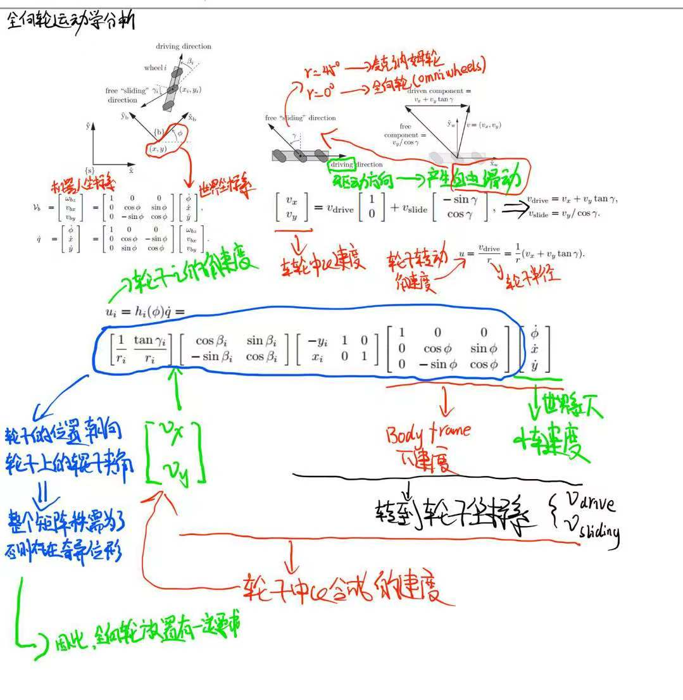
<figcaption>  
</figcaption>

Mecanum轮的动力学模型如下图所示：

  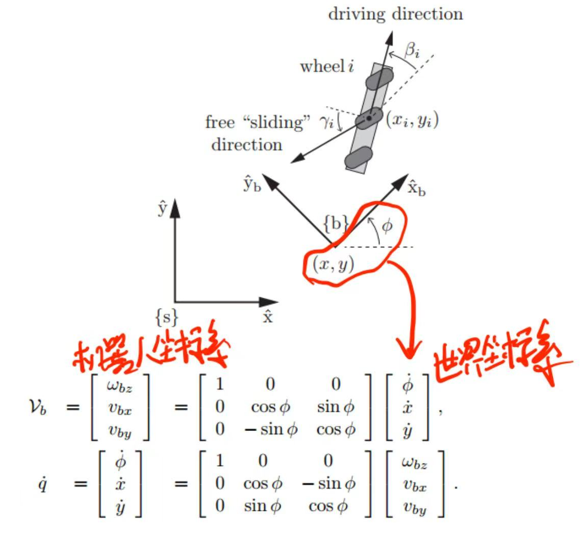
<figcaption>  
机器人坐标系与世界坐标系的速度转换公式
</figcaption>

全方位移动机器人必须安装至少3个全向轮，才能实现以任意（机器人坐标系下）三维速度 $\dot{q}=(\dot{\phi},\dot{x},\dot{y})$ 进行运动。
  

  
<figcaption>  
左图为3个全向轮，右图为4个麦克纳姆轮
</figcaption>

为了控制全向移动机器人，我们需要知道给每个轮子多大的角速度才能使机器人达到目标速度 $\dot{q}=(\dot{\phi},\dot{x},\dot{y})$ 。

为了实现这一点。对单个轮子进行运动学分析：

  
<figcaption>  
</figcaption>

坐标系 $\hat{X_w}-\hat{y_w}$ 建立在轮子中心，根据速度合成定理车轮中心的速度 $v=(v_x,v_y)$ 满足下面的公式：

  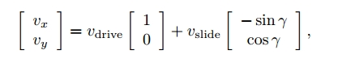
<figcaption>  
</figcaption>

其中 $\gamma$ 为小辊子滚动方向与驱动轮平面的夹角（通常全向轮为0°，麦克纳姆轮为±45°）

当电机发出驱动速度 $v_{drive}$, 必然会产生$v_{slide}$, 就是自由滑动的速度。这两个速度的合成即可获得全向轮前进的方位。

~~~
PS:注意此处是针对“麦克纳姆轮”
~~~

解上述方程可得：

  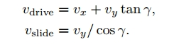
<figcaption>  
</figcaption>

假设轮子半径为$r$，轮子转动的角速度为$u$，那么根据上式可得：

  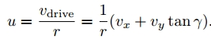
<figcaption>  
</figcaption>

为了推导出从小车速度 $\dot{q}=(\dot{\phi},\dot{x},\dot{y})$ 到轮子$i$的角速度$u_i$的转换关系，参考最上面的坐标系布置图。轮子坐标系在小车坐标系 {b} 中的位置和姿态可以用向量 $(\beta_i,x_i,y_i)$ 来表达，其中轮子半径为$r_i$，辊子滑动角度为$\gamma_i$。那么从$\dot{q}=(\dot{\phi},\dot{x},\dot{y})$到$u_i$的转换关系如下：

  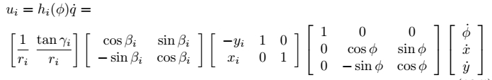
<figcaption>  
</figcaption>

从右到左进行解读：第一个变换矩阵将静止坐标系下的$\dot{q}$变换为小车局部坐标系{b}中的$\upsilon _b$；第二个变换矩阵将小车的局部速度转换为坐标系{b}中的轮子线速度；第三个变换矩阵将坐标系{b}中的轮子线速度转换为轮子坐标系$\hat{X_w}-\hat{Y_w}$中的线速度；最后一个变换矩阵将依据再对上一个公式计算轮子角速度。

将这几个矩阵合并，可以得到对单个轮子的变换矩阵$h_i(\phi)$如下：

  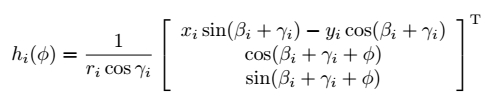
<figcaption>  
</figcaption>

对于一个全向移动机器人来说，轮子数量$m \geqslant 3 $，矩阵 $H(\phi) \in R^{m \times 3}$ 将静止参考系中的机器人速度 $\dot{q} \in R^3$ 转换为轮子驱动角速度 $u \in R^m$ ，将m行 $h_i(\phi)$ 向量堆叠到一起组成矩阵 $H(\phi)$ ，有如下公式：

  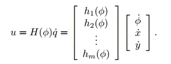
<figcaption>  
</figcaption>

根据上式我们也可以直接计算出小车局部坐标系下的速度和驱动轮角速度之间的关系，这时转换矩阵将不依赖小车在静止参考坐标系中的朝向角 $\phi$ ：

  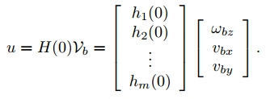
<figcaption>  
</figcaption>

小车上轮子的位置和朝向 $(\beta_i,x_i,y_i)$，以及辊子夹角 $\gamma_i$ 的选择必须使得矩阵 $H(0)$ 的秩为3。如果矩阵的秩小于3，系统中存在奇异位形，反映在运动学上就是失去部分自由度，即小车不能实现全方位运动。

因此，并不是任一种轮组排列结构形式都可实现全方位运动，多轮构成的系统运动能力和运动控制性能及其驱动性能均与轮组的结构形式密切相关。下面是两种典型的布局。

  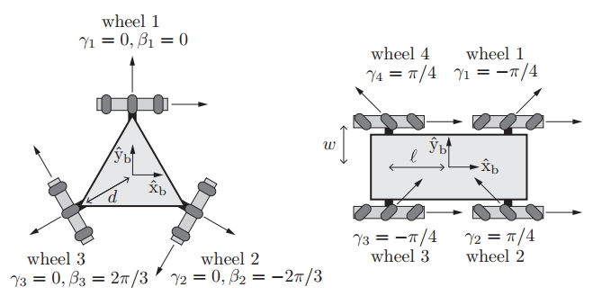
<figcaption>  
</figcaption>

对麦克纳姆轮型移动机器人来说，为向前移动，所有轮子要以相同的速度向前转动；为了侧向移动，1、3轮向前转，2、4轮向后转，转速要相同，如下图所示（这部分其实跟无人机是比较像的）

  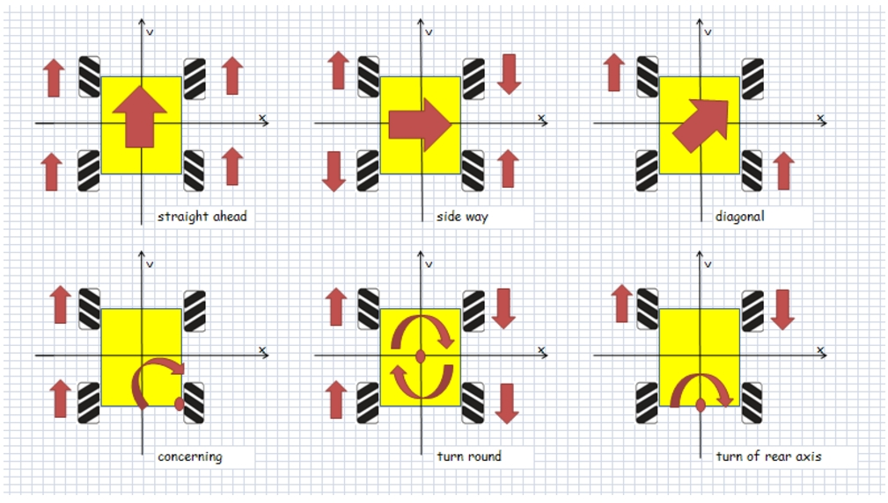
<figcaption>  
</figcaption>

# 从差分轮到全向轮

* 核心差异：从“转弯”到“平移”

特性维度|差速驱动系统 (Differential Drive)|	全向移动系统 (Omnidirectional Drive) |
|:---------:|:-------:|:----:|
运动自由度 |	非完整约束。只能在车轮平面方向移动，改变朝向需通过前后移动的组合实现。|	完整约束。拥有平面三个自由度（X轴平移、Y轴平移、绕Z轴旋转），可独立控制，实现任意方向的瞬时平移。
转向方式	|弧线转向：通过左右轮速差实现转弯，有最小转弯半径限制。原地转向：左右轮反向等速转动。|	无需转向：通过多个轮子速度的矢量合成，可直接向任意方向平移，无需先改变车身朝向。
运动学模型|	较简单，由两个驱动轮的速度直接决定机器人的线速度和角速度。|	较复杂，需要一个变换矩阵，将期望的机器人速度矢量（Vx， Vy， ω）映射到每个轮子的驱动速度上。
控制复杂度	|低。控制接口通常为（线速度， 角速度）。|	高。需要精确解算和同步控制所有驱动轮的速度。
典型布局 |	两主动轮+若干从动支撑轮（如万向轮）。|	至少需要3个全向轮，常见3轮（夹角120°）或4轮（如麦克纳姆轮）布局。

## 优缺点对比

* 优势：
  * 极致灵活性：在狭窄、拥挤的空间（如工厂过道、货架间）内穿梭能力极强，可侧移、斜向移动，大幅提升空间利用率和作业效率。
  * 路径与姿态解耦：机器人可以沿复杂轨迹运动的同时，独立保持负载或传感器的朝向不变，这对执行装配、检测等任务至关重要。

* 挑战与成本：
  * 对地面要求高：全向轮（尤其是Omni轮）的小滚轮在不平整、有沟槽或软质地面上表现不佳，易卡住、产生振动和额外磨损。麦克纳姆轮在复杂路面上适应性稍好。
  * 控制更复杂，成本更高：需要更多电机、更精密的编码器以及更强大的运动控制器。其算法开发和调试门槛也更高。
  * 能耗与摩擦：由于存在横向滑动摩擦，其直线驱动效率通常低于普通轮胎。有观点指出，在某些情况下，全向轮的效率可能只有传统轮的一半

# 参考资料
* [Get Rolling with Omni-Directional Wheels](https://www.servomagazine.com/magazine/article/get-rolling-with-omni-directional-wheels)
* [全向轮及其运动仿真](https://www.cnblogs.com/21207-iHome/p/7911748.html)
* [Github：Four-wheel-Omni-directional-Robot-](https://github.com/Yasvanth-S/Four-wheel-Omni-directional-Robot-)
