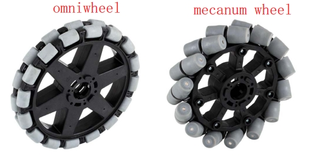
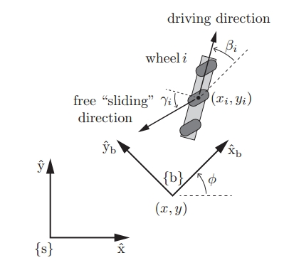
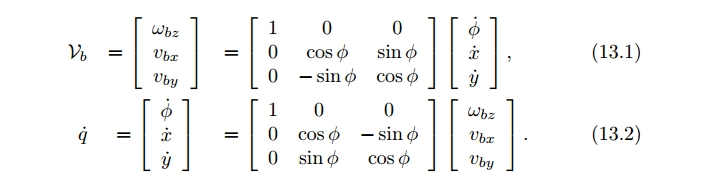
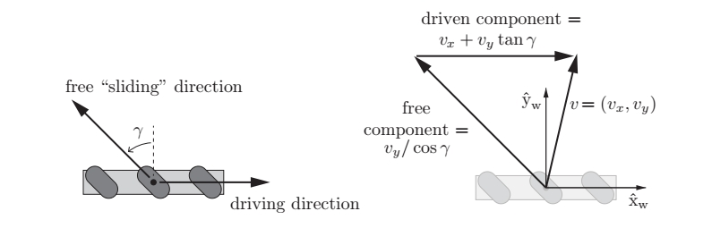

<!-- * 目录
{:toc} -->

本博文对基于移动机器人的全向轮进行调研，特别地关注感知导航算法，探索全向轮的优缺点、商业应用情况、学术难点等等。

# 什么是全向轮

全方位运动平台通常装有全向轮：omniwheels（全向轮）或 mecanum wheels（麦克纳姆轮）。借助于横向移动和原地回旋的特性，全方位运动平台可方便的穿梭于狭窄拥挤空间中，灵活完成各种任务，相比传统移动平台有明显优势。  

  
<figcaption>  
</figcaption>

~~~
全方位运动系统中，Mecanum轮应用最广泛。Mecanum轮(又称瑞典轮)是瑞典Mecanum AB公司工程师Bengt Ilron提出的特殊轮系，其特点为沿轮毅圆周排布着与轮子成一定角度且可绕自身轴线进行旋转的辊子。
由三个或以上Mecanum 轮按照一定方式排列组成的移动平台具有平面内三个自由度，可同时独立的前后、左右和原地旋转运动，可在不改变自身姿态的情况下向任意方向移动。
~~~

其运动学本质是：轮毂外围安装一周与轮毂轴线呈一定角度的无动力辊子作为轮胎，该辊子不仅可绕轮毂轴公转，也能在地面摩擦力作用下绕各自的支撑芯轴自转，两种运动的合成使得接触地面的辊子中心合速度与轮毂轴有一定的夹角，通过调节轮毂速度可改变辊子中心合速度的大小和方向。
由同样结构的若干Mecanum 轮按一定规则组成的轮组系统，通过改变各轮毂速度的线性组合，进而控制运动系统中心合速度大小和方向，使机器人实现平面3自由度全方位运动。由于其外观上与斜齿轮相似，麦克纳姆轮也有齿轮啮合时相类似的问题：为了保证运动的平稳性，当前一个辊子与地面即将分离时，后一个辊子必须与地面接触。 

Mecanum轮的动力学模型如下图所示：

  
  
<figcaption>  
机器人坐标系与世界坐标系的速度转换公式
</figcaption>

全方位移动机器人必须安装至少3个全向轮，才能实现以任意（机器人坐标系下）三维速度 $\dot{q}=(\dot{\phi},\dot{x},\dot{y})$ 进行运动。
  

  
<figcaption>  
左图为3个全向轮，右图为4个麦克纳姆轮
</figcaption>

为了控制全向移动机器人，我们需要知道给每个轮子多大的角速度才能使机器人达到目标速度 $\dot{q}=(\dot{\phi},\dot{x},\dot{y})$ 。

为了实现这一点。对单个轮子进行运动学分析：

  
<figcaption>  
</figcaption>

坐标系 $\hat{X_w}-\hat{y_w}$ 建立在轮子中心，根据速度合成定理车轮中心的速度 $v=(v_x,v_y)$ 满足下面的公式：

# 从差分轮到全向轮

* 核心差异：从“转弯”到“平移”

# 参考资料
* [全向轮及其运动仿真](https://www.cnblogs.com/21207-iHome/p/7911748.html)
* [Github：Four-wheel-Omni-directional-Robot-](https://github.com/Yasvanth-S/Four-wheel-Omni-directional-Robot-)
