<!-- * 目录
{:toc} -->


# 引言

安装双系统后如果发现ubuntu存储不够用，从windows上迁移过来是很常见的做法了。但是如果反过来，发现windows不够用，想从ubuntu分一些存储空间过来应该怎么做呢？本博文尝试解决这个问题~

# 配置过程

首先安装`GParted`

```bash
sudo apt-get install gparted
```

然后通过下面命令打开

```bash
sudo gparted
```

可以通过`df -h` 查看磁盘空间，然后删掉无用的资料，留出200+G空间（其中`df -h --max-depth=1`查看当前目录下文件大小）

<div align="center">
  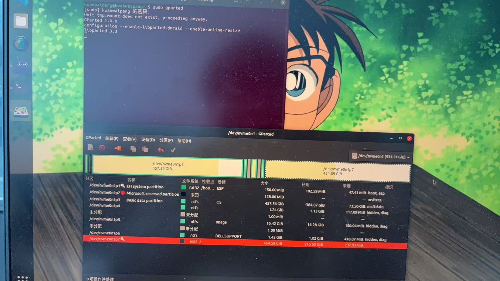
<figcaption>  
</figcaption>
</div>

注意，此时有小钥匙，代表不可编辑，因此需要使用系统盘U盘启动。

既然下来看看如何用Ubuntu制作系统盘

# 查看ubuntu系统版本

首先确认系统的版本为ubuntu 20.04.3 LTS，查看方法如下：

<div align="center">
  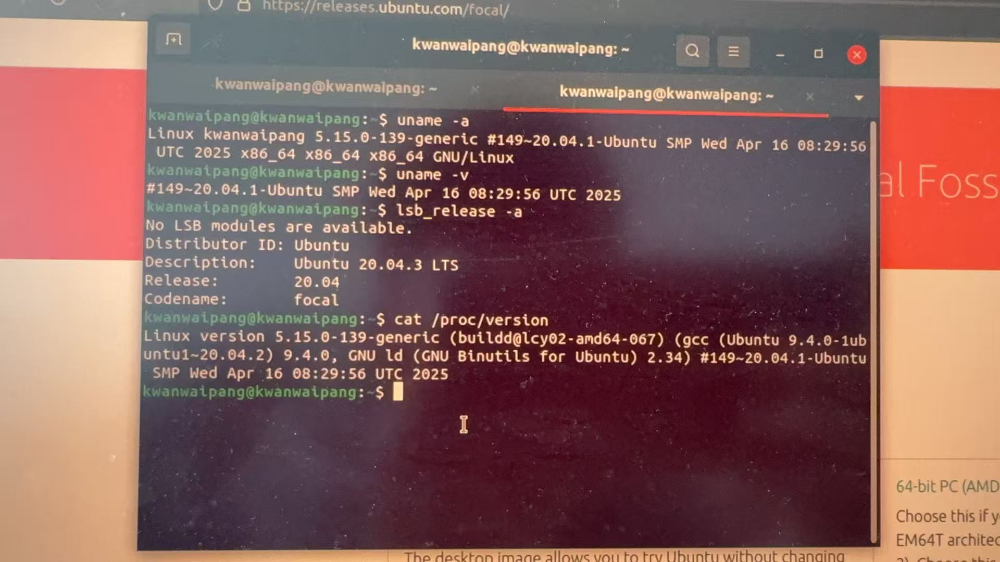
<figcaption>  
</figcaption>
</div>

然后到ubuntu官网去下载对应的iso：`ubuntu-20.04.3-desktop-amd64.iso`

下载成功后，制作驱动盘。

# Linux中制作ubuntu驱动盘

```bash
lsblk
```

<div align="center">
  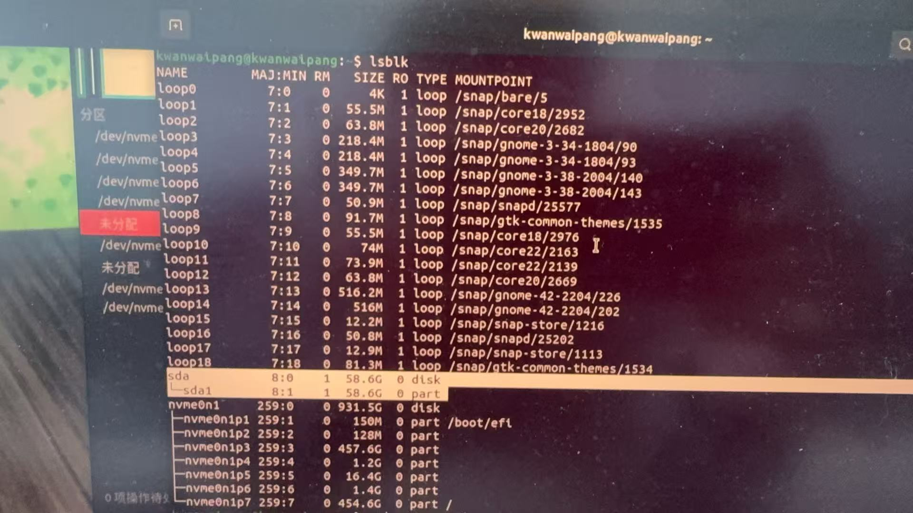
<figcaption>  
</figcaption>
</div>

进行卸载与格式化

```bash
# 卸载 sda 
sudo umount /dev/sda*

# 格式化成功后，再次查看磁盘信息时，sda下的分区就不存在了
sudo mkfs.vfat /dev/sda -I
```


# 采用启动盘启动

借到朋友的20.04启动盘了，那就不再下载，直接测吧~

* 戴尔开机通过F12 键：用于打开“Boot Menu（启动菜单）”，可以直接选择U盘启动
* 记得选择是试用Ubuntu
* 在GParted中找到Ubuntu的根分区（最简单的方法是根据空间大小），右键选择"Resize/Move"。
* 缩小分区：将分区大小减少200GB（200×1024=204800MB）。确保缩小后的空间足够Ubuntu系统正常运行（至少保留100-150GB）。
* 应用更改：点击绿色对勾图标确认操作，等待完成。

<div align="center">
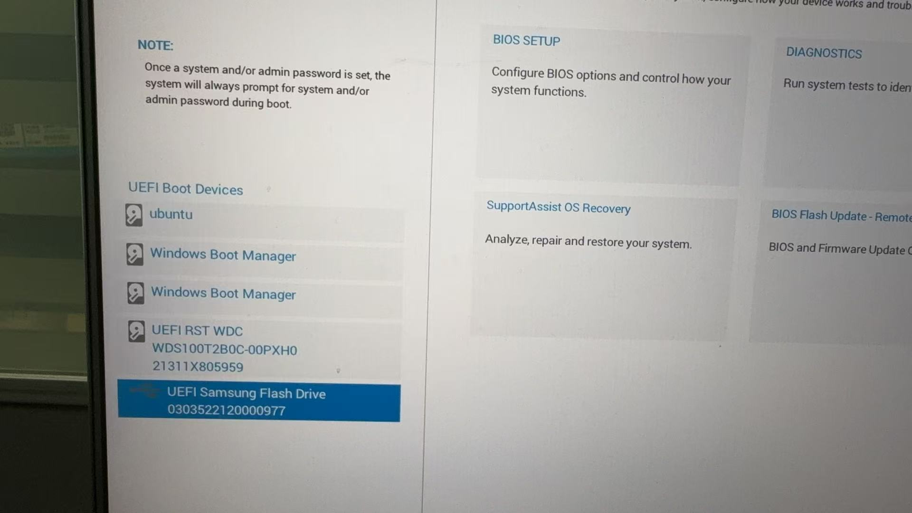
  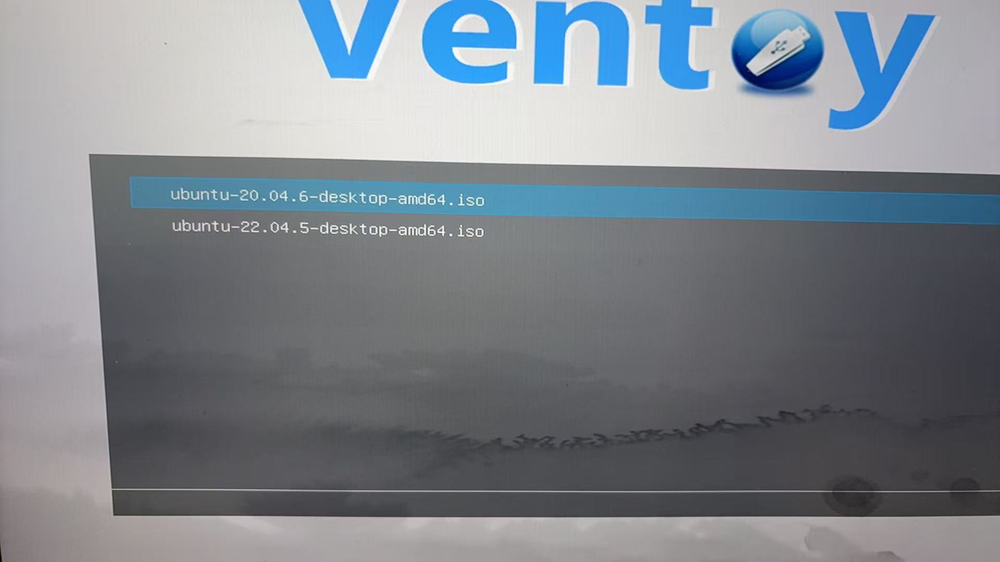
  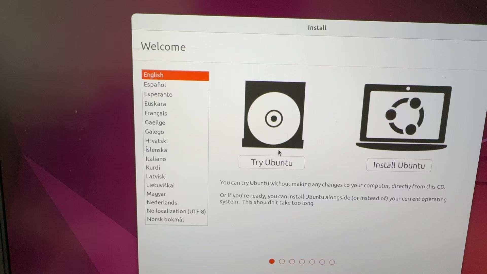
  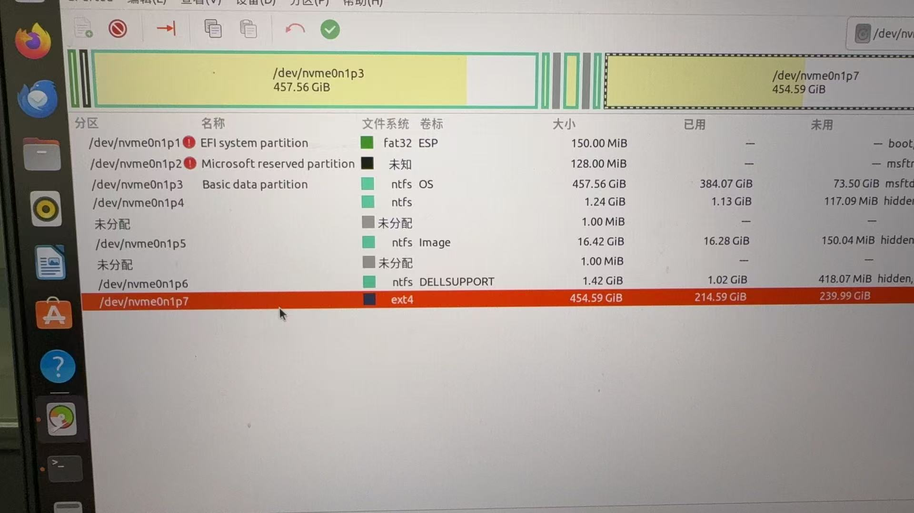
  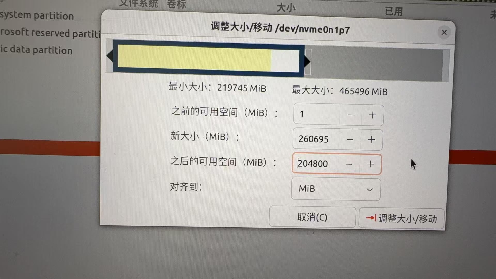
  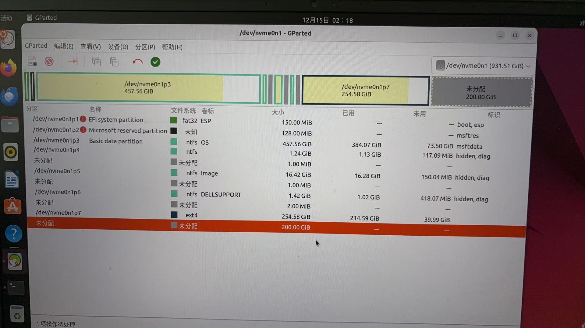
  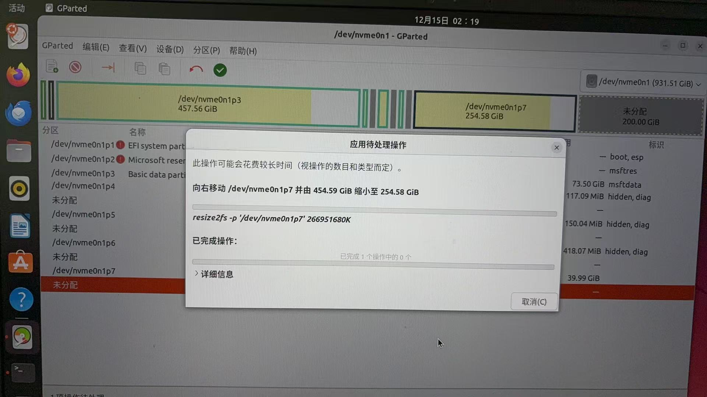
<figcaption>  
</figcaption>
</div>

最后记得按绿色的小勾确认才会开始处理~


<div align="center">
  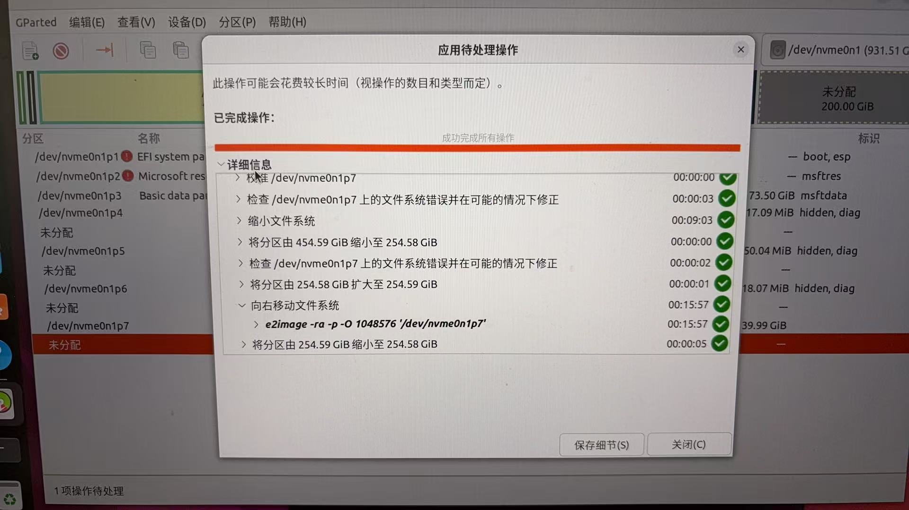
<figcaption>  
</figcaption>
</div>

完成！然后打开ubuntu系统发现已经从400+G变为200+了，接下来进入windows系统进行分区合并


# 参考资料
* [在 Linux 系统上制作 Ubuntu 系统启动盘](https://blog.csdn.net/u012815136/article/details/121715591)
* [Ubuntu用gparted重新分配空间](https://blog.csdn.net/Zeus1125/article/details/135702447)