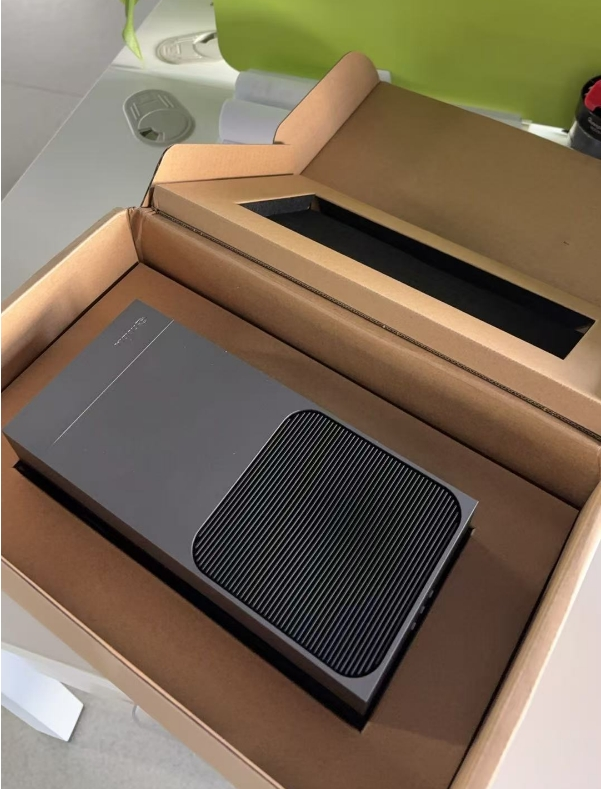
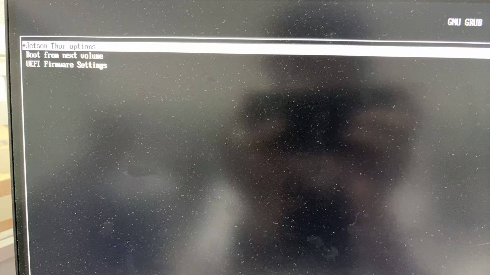
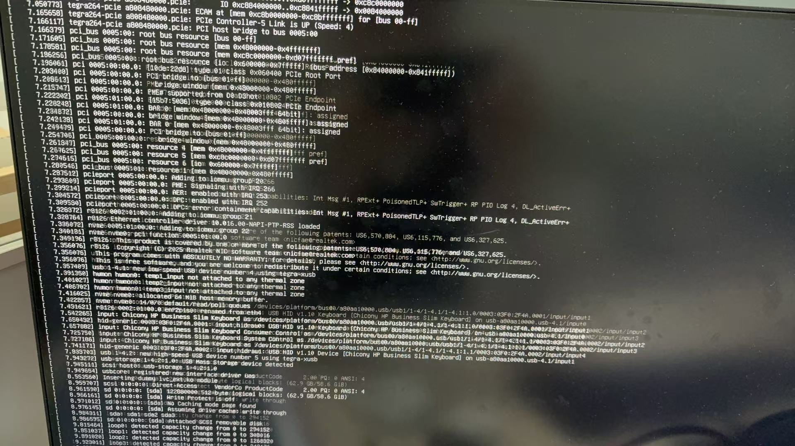

<!-- * 目录
{:toc} -->

# 引言

NVIDIA® Jetson Thor™ 系列模组为物理 AI 和机器人开发提供出色的平台，可提供高达 2070 FP4 TFLOPS 的 AI 计算性能和 128 GB 显存，功率可配置在 40 W 到 130 W 之间。与 NVIDIA AGX Orin™ 相比，Jetson Thor 系列模组的 AI 计算性能提高至 7.5 倍以上，能效提高至 3.5 倍。

本博文对Thor做初步配置与测评。

# 性能分析

首先先来看看其参数指标

  
<figcaption>  
</figcaption>

Thor是14 核 Arm® Neoverse®-V3AE 64 位 CPU，主频2.6G，内存128G.

下面以常用的[RK3588](https://www.rock-chips.com/a/cn/product/RK35xilie/2022/0926/1656.html)为例，RK3588用的是4* Cortex-A76 + 4*Cortex-A55，主频2.4G，内存8G

* [Neoverse V3AE CPU](https://www.arm.com/zh-cn/products/silicon-ip-cpu/neoverse/neoverse-v3ae)是专为高性能汽车设计的Armv9架构的
* [Cortex-A76](https://www.arm.com/zh-tw/products/silicon-ip-cpu/cortex-a/cortex-a76)，其架构应该是Armv8
* 与Arm的Cortex-A78AE相比，Neoverse V3AE每核性能可提升50%，而Cortex-A78AE相比Cortex-A76提升约20%

# 测评

  
<figcaption>  
</figcaption>

首先启动盘是同事帮忙安装的，直接插入即可识别。
基本直接按`Enter`就可以一路安装：`选择“Jetson Thor options”`---> `Flash Jetson Thor AGX Developer Kit on NVMe`--->`按 Enter 开始安装`

  
  
<figcaption>  
</figcaption>

安装过程约 15 分钟，期间会有命令行输出，一直等待。
安装完成后设备会自动重启，并可能进行 UEFI 固件更新。更新后会再次重启，进入 Ubuntu 初始配置界面（oem-config）。
接下来就是普通的ubuntu初始化了（安装的是24.04.02LTS）

# 参考资料
* [NVIDIA Jetson Thor](https://www.nvidia.cn/autonomous-machines/embedded-systems/jetson-thor/)
* [全网首发! Nvidia Jetson Thor 128GB DK 刷机与测评（一）刷机与 OpenCV-CUDA、pytorch CUDA13.0+ 使用](https://blog.csdn.net/nenchoumi3119/article/details/151148194?spm=1001.2014.3001.5502)
* [全网首发! Nvidia Jetson Thor 128GB DK 刷机与测评（二）常用功能测评 Ollama、ChatTTS、Yolov13](https://blog.csdn.net/nenchoumi3119/article/details/151317227)
* Thor部署GR00TN 1.5 3B[NVIDIA Isaac GR00T](https://developer.nvidia.cn/isaac/gr00t)
* [零主机安装！NVIDIA Jetson AGX Thor 系统安装指南](https://zhuanlan.zhihu.com/p/1966423826368828716)
