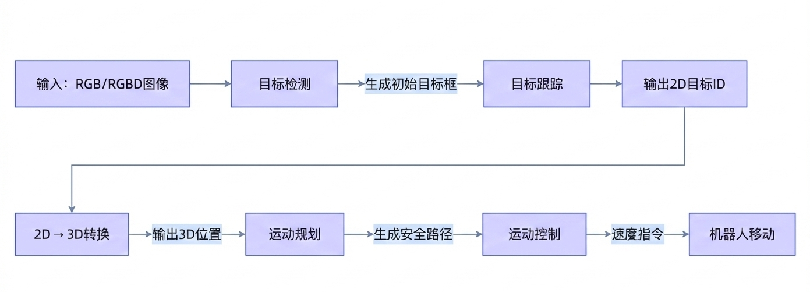

<!-- * 目录
{:toc} -->

# 引言

很久之前做过[基于深度学习的分类网络](https://blog.csdn.net/gwplovekimi/article/details/82928072?spm=1001.2014.3001.5502)和[基于深度学习的目标检测算法](https://blog.csdn.net/gwplovekimi/article/details/82915395)
本博文对目标跟踪算法进行调研及部分工作解读。

与目标检测不同，跟踪需**跨帧关联**目标ID，面临遮挡、尺度变化、外观漂移等挑战。主流方案采用 **Tracking-by-Detection** 策略（先检测目标，再关联轨迹），但机器人场景（如人员跟随）需额外解决**实时性**、**动态环境适应性**与**运动规划**问题。

**关键区分**：视频目标跟踪（VOT）关注**单视频序列**的轨迹生成；机器人人员跟随（Person Following）是VOT在**机器人控制闭环**中的应用，需集成运动控制、多传感器融合及场景理解。

# 经典工作解读

<!--   -->

|  年份 |  单位  | 模型  |  网站  | 说明 |
|:-----:|:-----:|:-----:|:-----:| ----------- |
|  2025 |  南京大学  | [MOTIP](https://arxiv.org/pdf/2403.16848)  |    | 基于transformer的端到端多目标跟踪；基于Transformer的全局交互建模，无需后处理（如匈牙利匹配）。核心创新：【跨帧关联】通过自注意力机制建模目标间长期依赖；|
|  2025 |  KTH Royal Institute of Technology  | [HiM2SAM](https://arxiv.org/pdf/2507.07603)  |  | 基于sam2（视频目标分割）和CoTracker（视频点追踪），无需任何任务微调。基于transformer结构。1.分层运动估计：粗粒度（卡尔曼滤波）+ 精细粒度（CoTracker点追踪）；2.长/短时记忆库：短时记忆（高置信度帧）防噪声干扰，长时记忆（非目标物体）避免轨迹漂移。 |
|  2020 |  MMLab  | MMTracking: OpenMMLab  |    | 工业级MOT工具箱：基于PyTorch的统一框架，支持SiamRPN++、DeepSORT等10+算法 |
|  2019 |  商汤  | [SiamRPN++](https://openaccess.thecvf.com/content_CVPR_2019/papers/Li_SiamRPN_Evolution_of_Siamese_Visual_Tracking_With_Very_Deep_Networks_CVPR_2019_paper.pdf)  |    | 引入更深的网络实现孪生网络目标跟踪算法：将骨干网络从ResNet-50扩展到ResNet-152 |
|  2018 |  University of Chinese Academy of Science  | [DaSiamRPN](https://openaccess.thecvf.com/content_ECCV_2018/papers/Zheng_Zhu_Distractor-aware_Siamese_Networks_ECCV_2018_paper.pdf)  |    | 对检测数据集进行数据增广，使得其也可以用于训练跟踪模型；构造有语意的负样本对来增强跟踪器的判别能力，让网络学习判别能力，去寻找搜索区域中和模版更相似的物体；提高重跟踪上丢失目标的能力 |
|  2018 |  商汤  | [SiamRPN](https://openaccess.thecvf.com/content_cvpr_2018/papers/Li_High_Performance_Visual_CVPR_2018_paper.pdf)  |    | 将检测引入跟踪；孪生+区域推荐：结合了跟踪中的孪生网络和检测中的区域推荐网络：孪生网络实现对跟踪目标的适应，让算法可以利用被跟踪目标的信息，完成检测器的初始化；区域推荐网络可以让算法可以对目标位置进行更精准的预测 |
|  2017 |  University of Koblenz-Landau  | [Deep SORT](https://arxiv.org/pdf/1703.07402)  |    | 结合卡尔曼滤波（运动预测）+ 匈牙利匹配（轨迹关联），通过Re-ID特征提升遮挡恢复能力；先通过检测器得到bounding box（生成detections），然后使用卡尔曼滤波预测，再使用匈牙利算法将预测后的tracks和当前帧中的detecions进行匹配（级联匹配和IOU匹配），而匹配的结果则是可以进行卡尔曼滤波更新 |
|  2017 |  CMU  | [BACF](https://openaccess.thecvf.com/content_ICCV_2017/papers/Galoogahi_Learning_Background-Aware_Correlation_ICCV_2017_paper.pdf)  |  [website](http://www.hamedkiani.com/bacf.html)  | 解决了相关滤波类跟踪算法中的边界效应问题。 |

# 机器人目标/人员跟随算法

* 核心误区澄清：
目标跟踪算法（如DeepSORT）仅解决“2D目标ID关联”问题，不等于机器人可以实现人员跟随。
机器人跟随是多模块协同系统，需依次完成：检测 → 跟踪 → 3D定位 → 运动规划 → 机器人控制。
以下将逐层拆解每个模块的必要性与技术挑战。

1. 目标检测（人员跟随的起点）：人员跟随的第一步必须是目标检测。跟踪算法（如DeepSORT）本身无法生成初始目标框——它只能处理已知目标的ID关联。机器人启动时，必须先通过目标检测模型（如YOLOv8）在单帧图像中定位出“人”的位置，才能为后续跟踪提供起点。若跳过检测环节，机器人将完全“找不到人”。例如，当一个人从角落走出时，检测器需先框出目标，跟踪器才能开始关联ID。没有检测，跟踪就是无源之水。
2. 跟踪（解决ID连续性问题）：检测器每帧独立运行，易因遮挡、姿态变化导致目标ID跳变（如检测框在遮挡后突然移到新位置）。目标跟踪的核心价值正是解决这一问题：通过跨帧关联维持同一目标的ID连续性。例如，当人被家具短暂遮挡时，跟踪算法能利用卡尔曼滤波预测目标位置，避免ID丢失，使机器人保持平滑跟随。但需明确：跟踪算法仅输出2D目标框（图像坐标），不提供距离信息，这是后续环节的关键门槛。
3. 2D→3D转换：机器人需要3D空间坐标 $（x, y, z）$ 才能规划路径，但跟踪算法仅输出2D坐标 $（x, y, w, h）$ 。必须通过深度信息将2D框转换为3D点。若使用RGBD相机（如Intel RealSense），深度图可直接获取目标中心点的Z坐标。若仅用纯单目RGB，则需额外部署深度估计模型。深度估计的错误会导致机器人误判距离，引发碰撞风险。
4. 运动规划（从坐标到安全路径）：获得3D位置后，需通过运动规划模块生成安全路径。机器人不能简单“朝目标移动”——必须考虑动态障碍物（如突然走过的路人）、安全距离（通常保持0.5～1.5米）及路径平滑性。比如ROS1和ROS2的Navigation Stack（基于A*/DWA算法）是标配：它接收3D目标位置，结合实时点云地图，生成避障路径，并输出安全速度指令。若缺失此环节，机器人可能直冲障碍物，或因路径突变导致急停急转。
5. 运动控制（闭环执行）：最后，运动控制模块将规划路径转化为机器人动作指令（线速度linear_x、角速度angular_z）。通过PID控制器+轨迹平滑（如卡尔曼滤波），确保机器人移动平稳。例如，当目标突然向左移动时，控制模块会平滑调整转向角，而非瞬间急转。若无此环节，机器人将频繁抖动，体验极差。

  
<figcaption>  
</figcaption>

