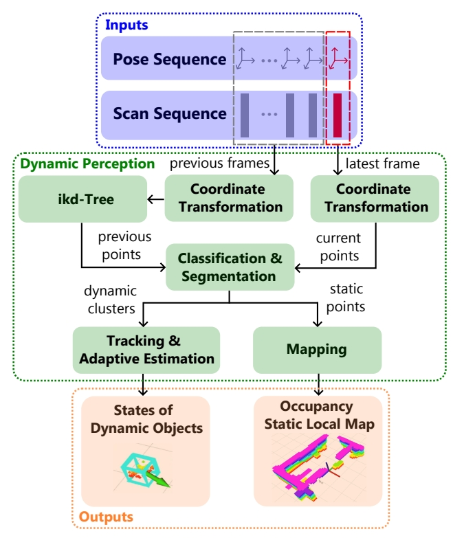
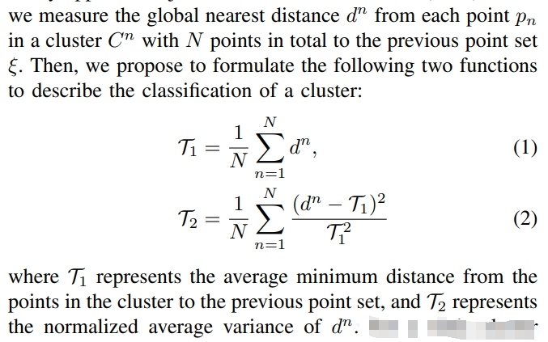

<!-- * 目录
{:toc} -->

* [PDF](https://arxiv.org/pdf/2312.08743)
* [Github源码](https://github.com/arclab-hku/FAPP)
* 本博文复现过程采用的代码及代码注释（如有）：[My github repository](https://github.com/R-C-Group/-Fast-and-Adaptive-Perception-and-Planning)


# 理论解读

采用几何聚类+运动估计结合的点云分割方法，不依赖GPU（仅占用约半个CPU物理核），能区分快速动态与静态目标，实现动态物体跟踪及速度估计。

算法架构如下图所示：

<div align="center">
  
<figcaption>  
</figcaption>
</div>


1. 把点云从传感器局部坐标系B变换到全局坐标系W(因此，需要pose的输入)
2. 建立一个增量 KD 树（I-KD Tree）来维护最近 F 帧的点集合 $\xi$,点集合通过增删操作动态更新
   * $\xi \in {WP_{j}}$, 其中 $j \in [k-F, k-1]$, $k$ 为当前时刻（第$k$帧）
   * 为什么是最近F帧？目的是实现点的“均匀分布”。如果历史点云过密（比如一个静止墙在原地被重复扫描 100 次），则 KD 树查询的距离几乎为 0，会掩盖其他动态物体；如果过稀，则动态检测不稳定。【保存多帧可以让“静态结构”在时间上积累密度，而“动态物体”会因为移动而形成稀疏或拖尾现象。】
   * KD Tree 是一种空间索引结构，用来快速做最近邻搜索（即给定 $p$点，快速在$\xi$中找到最近的点）
   * I-KD Tree增量式 KD 树，当新的帧点云到来时，不是重新建树，而是“增量更新”已有的 KD 树，把新点插入，保留了“历史点云的结构信息”，可以用来判断一个点是不是新出现的、或者物体是否在移动。
3. 采用点云聚类（DBSCAN）区分动态/静态/未知点云.如下面公式所示，分别算出 $T_{1}$ （该簇点到历史点云 $\xi$ 的平均最小距离） 和 $T_{2}$ （衡量离散度的归一化方差）
    * 动态物体：$T_{1} > h_{1}, T_{2} < h_{2}$ ：若一个簇是真正移动的物体，其当前点到历史点云的最近距离 $T_{1}$ 较大，并且由于它自己在每一帧上移动的投影相对一致，所以 $T_{2}$ 小。
    * 静态物体：$T_{1} < h_{1}$ : 若一个簇曾在历史帧中出现且未移动，其点到历史点云的最近距离应在传感器测量误差范围内。
    * 未知物体：$T_{1} < h_{1}, T_{2} < h_{2}$ :若是新出现或被遮挡的静态物体（刚从遮挡区显现或新进入视野），它的点到历史点的距离会不均匀（有些点可能很近，有些点很远），因此 $T_{2}$ 大。

<div align="center">
  
<figcaption>  
</figcaption>
</div>

4. 动态目标跟踪：用离散线性系统与卡尔曼滤波器（KF）估计，如果某簇是新出现的，则新建一个 KF，若某簇能与已有第 i 个 tracker 关联，则把该簇的几何中心与帧差（中心的位移）作为测量向量 $Z_{i}$ 进入 KF 更新。
5. 当有多个检测（D 个障碍物）和多个 tracker（I 个跟踪目标），通过匈牙利算法（Hungarian Algorithm）寻找最优匹配组合。
6. 静态局部地图输出：其实就是把动态点集从当前点去删除。

此外，论文还有自适应估计与预测方面的理论推导，这部分就不展开了，主要是针对目标突然加速或转弯

# 实验复现

# #安装配置

```bash
sudo apt install python3-catkin-tools python3-osrf-pycommon

git clone git@github.com:R-C-Group/-Fast-and-Adaptive-Perception-and-Planning.git
cd FAPP 
catkin build

# source ~/catkin_ws/FAPP/devel/setup.bash
```

安装tmux

```bash
# install tmux
sudo apt install tmux
sudo apt install tmuxp
# kill a session (for example)
tmux kill-session -t fapp
```

运行demo

```bash
tmuxp load quick_start.yaml 
```

运行后则可以加载环境，并且环境中有移动物体/静态物体，通过设置`3D Nav Goal`可以实现导航及规划，同时也实时估算运动物体的速度。

<div align="center">
  
<figcaption>  
</figcaption>
</div>


实时性测试效果如下：5个物体，点云聚类耗时1.2ms，跟踪耗时1.8ms。

<div align="center">
  
<figcaption>  
</figcaption>
</div>

内存消耗情况如下：
* 处理器是11th Gen Intel(R) Core(TM) i7-11800H @ 2.30GHz (2.30 GHz)，机带RAM为32.0 GB
* 【CPU占用情况】
  * rviz (56.0% CPU): 占用了大约半个核心。
  * mapping_node (52.3% CPU): 建图节点。占用半个核心也属于正常范围。
  * fapp_planner_no (11.0% CPU): 路径规划节点。占用较低，运行稳定。
* 【内存占用情况】
  * 系统识别到的总内存约为 16GB。
  * mapping_node	383.8 MiB，fapp_planner	144.6 MiB


<div align="center">
  
<figcaption>  
</figcaption>
</div>


* 通过Antigravity打开项目（选择打开文件）：

```bash
\\wsl$\Ubuntu-20.04\home\kwanwaipang\catkin_ws\FAPP\src
```

* 添加[livox_ros_driver2](https://github.com/Livox-SDK/livox_ros_driver2/tree/master):
* 此前需要安装[SDK](https://github.com/Livox-SDK/Livox-SDK2/blob/master/README.md)

```bash
# 安装SDK
git clone https://github.com/Livox-SDK/Livox-SDK2.git
cd ./Livox-SDK2/
mkdir build
cd build
cmake .. && make -j
sudo make install

# 安装驱动
# ./build.sh ROS1 #这个脚本不仅会编译，还会将 package.xml 和 CMakeLists.txt 重定向/重写为符合 ROS 1 标准的文件。
cd /home/kwanwaipang/catkin_ws/FAPP/src/livox_ros_driver2
# 确保使用的是 ROS1 的包描述文件
cp -f package_ROS1.xml package.xml
cd /home/kwanwaipang/catkin_ws/FAPP/
# 重新初始化并编译（指定参数）
catkin build livox_ros_driver2 -DROS_EDITION=ROS1

# 然后重新执行,编译全部
# 2. 编译整个工作空间，并确保 ROS_EDITION 参数一直有效
catkin config --append-args -DROS_EDITION=ROS1
catkin build
```

## 真机测试

此处选择录制rosbag,注意对应的topic情况如下:

<div align="center">
  
<figcaption>  
</figcaption>
</div>

```bash
source devel/setup.bash
# roslaunch so3_quadrotor_simulator simulator_example.launch 
roslaunch mot_mapping bag_mapping.launch
```


<div align="center">
  
<figcaption>  
</figcaption>
</div>


# 参考资料
* [论文阅读-Fast and Adaptive Perception and Planning for UAVs in Dynamic Cluttered Environments](https://blog.csdn.net/qq_55653355/article/details/154788556)
